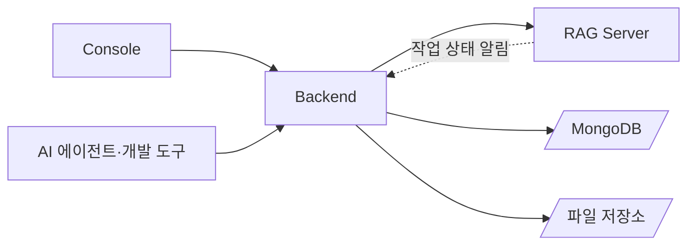
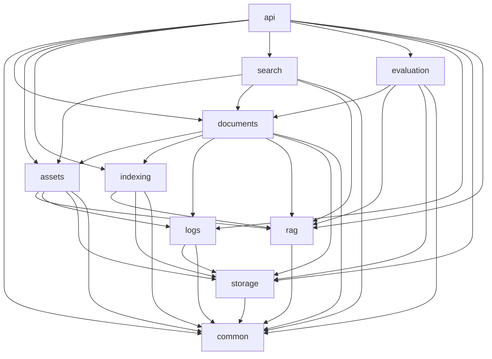
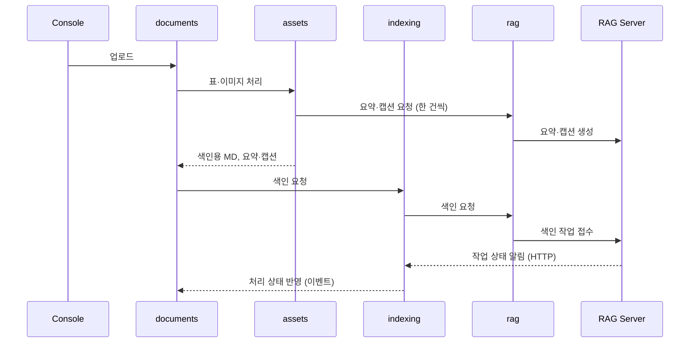
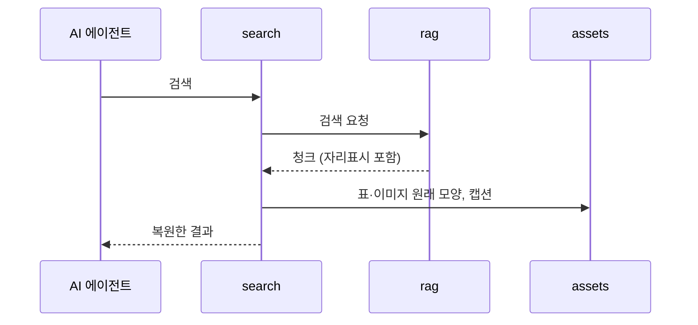

# minerva Backend 아키텍처

Backend는 Console과 AI 에이전트·개발 도구의 요청을 받는 NestJS 서버다. 요구는 이 폴더의 `REQUIREMENTS.md`가 정의하며, 요구사항의 depth-1 모듈 하나가 NestJS 모듈 하나다. 다만 업무와 무관한 기반 기능(로그, 시각·페이지 규약)은 라이브러리(`libs/`)로 둔다. 문서에 속한 데이터(원본, 표·이미지, 요약·캡션, 문서 상태, 골든셋, 평가 기록, 로그)는 Backend가 소유하고, 연산(요약·캡션 생성, 색인, 검색, 평가)은 RAG Server에 맡긴다. RAG Server 호출은 rag 모듈 한 곳에서만 한다. 이 문서의 경로는 `apps/backend/` 기준이다.

## 기술 스택

| 영역 | 선택 | 버전·제약 |
| :--- | :--- | :--- |
| 언어 | TypeScript | |
| 프레임워크 | NestJS | |
| 저장소 | MongoDB (공식 드라이버 `mongodb`) | 문서 데이터, 골든셋, 평가 기록, 로그 |
| 파일 저장소 | 로컬 파일시스템 | 이미지 파일. 스토리지 인터페이스로 감싸 이후 S3 호환 저장소로 바꿀 수 있게 한다 |
| 로깅 | nestjs-pino | |
| 입력 검증 | class-validator DTO + 전역 ValidationPipe | |
| 테스트 | Jest | |
| 패키지 관리 | pnpm workspaces | 루트 lock 파일 하나 |

## 시스템 컨텍스트



- Backend가 제공하는 API는 이 폴더의 `API.md`가 소유한다
- Backend가 호출하는 RAG Server API는 `apps/rag-server/API.md`, 작업 상태 알림은 루트 `INTERFACES.md`의 `IF-2`가 소유한다

## 단위 구성

| 단위 | 종류 | 폴더 | 담당 REQ | 책임 |
| :--- | :--- | :--- | :--- | :--- |
| documents | 모듈 | `src/documents` | `REQ-BE-1` | 문서 업로드·조회·편집·다시 올리기·재색인·삭제, 이름·판 묶기, 교체, 검색 상태·처리 상태 반영(문서 상태를 바꾸는 유일한 모듈), 기동 시 이어서 처리와 주기 작업 |
| assets | 모듈 | `src/assets` | `REQ-BE-2` | 표·이미지 추출, 자리표시와 색인용 MD, 요약·캡션 생성 요청, 이미지 제공, 자리표시 복원 |
| indexing | 모듈 | `src/indexing` | `REQ-BE-3` | 색인 요청, 작업 상태 알림 받기, 상태 맞추기 실행, 이름·판 정보 전달. 알게 된 작업 상태는 documents에 넘기기만 한다 |
| search | 모듈 | `src/search` | `REQ-BE-4` | AI 검색 요청 중계, 결과의 표·이미지 복원 |
| evaluation | 모듈 | `src/evaluation` | `REQ-BE-5` | 골든셋 저장, 평가 요청과 기록, 요약 지표 |
| logs | 모듈 | `src/logs` | `REQ-BE-6` | 문서 기록 남기기·조회·보관 기간 정리 |
| api | 모듈 | `src/api` | `REQ-BE-7` | 공통 요청 처리 규약(전역 ValidationPipe, 전역 예외 필터, 페이지 응답 형식 적용, multipart 한도), 앱 조립과 진입점(`src/main.ts`) |
| common | 모듈 | `src/common` | `REQ-BE-8.1`, `REQ-BE-8.3`, `REQ-BE-8.4`(떠받침) | 설정(ConfigService), 오류 정의, 문서 상태 이름(공유 타입), KST 날짜 범위의 도메인 오류 변환(`parseKstDayRange`) |
| storage | 모듈 | `src/storage` | `REQ-BE-9` | MongoDB 연결, 이미지 파일 저장 인터페이스 |
| rag | 모듈 | `src/rag` | `REQ-BE-10` | RAG Server HTTP 클라이언트 |
| logger | 라이브러리 | `libs/logger` | `REQ-BE-8.2` | 구조화 로그와 금지 데이터 제거, 로거 모듈(`AppLoggerModule`) 전역 등록 |
| utils | 라이브러리 | `libs/utils` | `REQ-BE-8.4`, `REQ-BE-7.1.3`(떠받침) | 시각 직렬화와 KST 날짜 범위, 페이지 규약 정의(목록 DTO와 페이지 응답) |

`REQ-BE-11`은 예정 마일스톤(M-2)이라 단위를 두지 않는다. 각 기능 모듈은 자기 컨트롤러를 가지며, 컨트롤러는 그 모듈의 서비스만 부른다. 라이브러리는 업무와 무관한 기반 기능만 담는다. 업무 규칙이 필요한 변환(날짜 오류를 `InvalidRequestError`로 바꾸기)은 common이 라이브러리를 감싸 제공한다.

## 의존 규칙



- 의존은 documents → assets·indexing 방향이다. documents는 assets·indexing에 필요한 문서 데이터(원본 MD, 버전, 이름·판 정보)를 인자로 넘기며, assets·indexing은 documents를 import하지 않는다
- indexing이 알게 된 작업 상태는 NestJS 이벤트(`EventEmitter`)로 documents에 넘기고(`IF-BE-1`), documents가 상태를 반영하고 logs에 기록한다
- 처리 상태·검색 상태와 교체는 documents만 바꾼다(`REQ-BE-1.9`, `REQ-BE-1.2`). assets와 indexing은 처리 결과를 documents에 돌려주거나 이벤트로 넘기고, 문서 상태를 직접 쓰지 않는다
- 상태 맞추기(`REQ-BE-3.3.1`)는 documents의 주기 작업이 처리 중인 문서 목록을 indexing에 넘겨 실행한다
- 자리표시 복원은 assets가 제공하고, search(`REQ-BE-4.2`)와 documents(`REQ-BE-1.4.5`)가 함께 쓴다
- api는 앱 조립(AppModule)을 위해 모든 모듈을 import한다. 다른 모듈은 api를 import하지 않는다. 목록 엔드포인트의 페이지 규약은 utils 라이브러리가 정의한다(`REQ-BE-7.1.3`)
- 라이브러리(logger·utils)는 모든 `src` 모듈이 쓸 수 있다. 그래서 위 다이어그램에서 생략했다

**금지 의존**

- RAG Server 호출은 rag 모듈을 거친다. 다른 모듈에서 HTTP 클라이언트로 RAG Server를 직접 부르지 않는다
- MongoDB 컬렉션은 소유 모듈만 읽고 쓴다(「데이터·상태 소유」). 다른 모듈의 데이터가 필요하면 소유 모듈의 서비스를 부른다
- Qdrant에 접속하지 않는다
- 라이브러리는 `src`를 import하지 않는다
- 라이브러리끼리 import하지 않는다
- `src`는 라이브러리를 `libs/<이름>/index.ts`로만(상대 경로) import한다. 라이브러리 안의 다른 파일을 직접 import하지 않는다

**호출 방식**

- Console·AI → Backend, Backend → RAG Server, RAG Server → Backend(알림): HTTP
- 모듈 사이: NestJS 의존성 주입으로 서비스를 부른다
- indexing → documents(작업 상태 반영): NestJS 이벤트. 이벤트 형식은 이 폴더의 `INTERFACES.md`가 소유한다

## 폴더 구조와 배치 규칙

```text
apps/backend/
├── libs/                   라이브러리 (업무와 무관한 기반 기능)
│   └── logger/  utils/
├── src/
│   ├── documents/  assets/  indexing/  search/  evaluation/  logs/
│   ├── api/  common/  storage/  rag/
│   └── main.ts
├── test/                   e2e 테스트
├── package.json
├── REQUIREMENTS.md
├── ARCHITECT.md
├── API.md
├── INTERFACES.md
└── AGENTS.md
```

- 모듈과 라이브러리의 명세는 그 폴더의 `MODULE.md`다
- 모듈과 라이브러리 폴더는 같은 규칙으로 나눈다. 폴더 루트에는 `<이름>.module.ts`(NestJS 모듈이 있을 때), `index.ts`(공개 표면), `MODULE.md`만 두고, 나머지는 아래 하위 폴더에 역할별로 둔다

| 하위 폴더 | 두는 것 |
| :--- | :--- |
| `controllers/` | 컨트롤러 (`*.controller.ts`) |
| `services/` | 업무 서비스, MongoDB 접근을 전담하는 `<모듈>-crud.service.ts`, 주기 작업(스케줄러), 주입되는 구현체 |
| `interfaces/` | 인터페이스·타입, DTO (`*.dto.ts`), 주입 토큰·이벤트 이름 같은 상수, 오류 클래스 |
| `helpers/` | 순수 함수 |
| `guards/`, `interceptors/`, `filters/` | 그 역할의 NestJS 구성 요소. 필요한 모듈만 둔다 |

- repository 계층은 두지 않는다. 컬렉션을 소유한 모듈의 `<모듈>-crud.service.ts`(`DocumentsCrudService`, `AssetsCrudService`, `IndexingCrudService`, `EvaluationCrudService`, `LogsCrudService`)가 MongoDB 접근을 맡는다
- 단위 테스트는 대상 파일 옆의 `*.spec.ts`에, Backend 전체를 띄우는 e2e 테스트는 `test/`에 둔다
- 모듈 사이 계약은 이 폴더의 `INTERFACES.md`에, Backend가 제공하는 HTTP API는 이 폴더의 `API.md`에 둔다. 앱 사이 계약은 루트 `INTERFACES.md`가 소유한다
- 제3자 라이선스 고지는 `NOTICE`에 둔다

## 데이터·상태 소유

| 데이터·상태 | 소유 단위 | 저장 위치 | 읽는 단위 | 쓰는 단위 |
| :--- | :--- | :--- | :--- | :--- |
| 문서 (이름, 판, 판에 들어온 시각, 검색 상태, 처리 상태, 삭제됨 표시, 버전 목록, 다시 보낼 RAG Server 요청) | documents | MongoDB `documents` | documents (다른 모듈은 documents 서비스로) | documents |
| 문서 버전 (원본 MD, 색인용 MD, 처리 결과·실패 사유, RAG 작업 ID) | documents | MongoDB `document_versions` | documents (assets·indexing은 documents가 넘긴 값만 쓴다) | documents |
| 표·이미지 (자리표시 ID, 원래 모양, 요약·캡션, 임시 여부) | assets | MongoDB `assets` | assets (search·documents는 assets 서비스로) | assets |
| 이미지 파일 | assets | 파일 저장소 `{저장 위치}/{doc_id}/{version}/{placeholder_id}.{확장자}`. 요약·캡션 변경·재색인으로 만든 버전은 이전 버전의 파일을 가리키기만 하고 복사하지 않는다 | assets | assets |
| 알림 순번 (문서별 마지막 반영 순번) | indexing | MongoDB `rag_event_cursors` | indexing | indexing |
| 골든셋, 평가 기록 | evaluation | MongoDB `golden_sets`, `evaluation_records` | evaluation | evaluation |
| 로그 기록 | logs | MongoDB `logs` (보관 기간 TTL 인덱스) | logs | logs (다른 모듈은 logs 서비스로 남긴다) |

## 횡단 관심사

| 관심사 | 소유 단위 | 규칙 위치 |
| :--- | :--- | :--- |
| 설정 | common | `REQ-BE-8.1`, 이 폴더의 `AGENTS.md` |
| 애플리케이션 로그 | logger(라이브러리) | `REQ-BE-8.2`, 루트 `AGENTS.md` 「보안과 로그」, 이 폴더의 `AGENTS.md` |
| 오류 정의와 HTTP 오류 응답 변환 | common(정의), api(변환) | `REQ-BE-8.3`, 이 폴더의 `API.md` 「공통 규약」 |
| 요청 검증 | api | `REQ-BE-7.1.2` |
| 시각 형식 | utils(라이브러리. 직렬화·KST 날짜 범위), common(날짜 오류의 도메인 오류 변환) | `REQ-BE-8.4` |
| RAG Server 호출, 시간 제한 | rag | `REQ-BE-10` |
| 문서 기록 | logs | `REQ-BE-6` |

## 주요 흐름

### 업로드에서 검색 가능까지



1. **업로드** — documents가 문서와 첫 버전을 만들고 처리 상태를 업로드됨으로 둔다. (`REQ-BE-1.1`)
2. **표·이미지 처리** — assets가 자리표시와 색인용 MD를 만들고 요약·캡션을 받는다. (`REQ-BE-2`)
3. **색인 요청** — indexing이 RAG Server에 색인을 요청한다. (`REQ-BE-3.1`)
4. **상태 반영** — indexing이 알림을 받아 이벤트로 documents에 알리고, documents가 처리 상태·검색 상태와 교체를 반영하고 logs에 기록한다. 교체된 문서는 청크 삭제를 요청한다. (`REQ-BE-3.2`, `REQ-BE-1.9`, `REQ-BE-1.2.5`, `REQ-BE-1.2.8`, `IF-BE-1`)

### AI 검색



## 실행 구조

- **Backend 프로세스** — NestJS 앱 하나. `src`와 `libs`를 함께 빌드하며, 빌드 출력의 진입점은 `dist/src/main.js`다
- **MongoDB** — Backend보다 먼저 떠 있어야 한다 (`REQ-BE-9.1.1`). 로컬 개발에서는 저장소 루트의 `docker-compose.yml`로 띄우고, 데이터는 named volume `mongo-data`에 둔다
- **이미지 파일** — Backend 프로세스가 직접 쓰므로 저장소 루트의 `data/backend/files`에 둔다. 위치는 설정으로 바꿀 수 있다 (`REQ-BE-9.1.2`)
- **RAG Server** — 주소는 설정으로 받는다. 기동 순서에 기대지 않으며, 준비 전 호출은 오류로 다룬다 (`REQ-BE-10.1.2`)
- **주기 작업** — documents의 주기 작업이 상태 맞추기(`REQ-BE-3.3.1`), 삭제·교체된 문서의 청크 삭제 재요청(`REQ-BE-1.8.4`, `REQ-BE-1.2.8`), 이름·판 정보 변경 재요청(`REQ-BE-3.4.2`)을 설정한 주기마다 실행한다. 기동할 때 끝나지 않은 표·이미지 처리를 이어서 하고, 작업 ID가 없는 색인 대기 문서의 색인을 다시 요청한다(`REQ-BE-1.9.9`~`REQ-BE-1.9.11`)

## 설계 결정

- **ARCHITECT.md는 앱 폴더마다 둔다** — 이유: 앱마다 요구사항 문서를 따로 둔다. 버린 대안: 루트에 하나
- **RAG Server 호출은 rag 모듈 한 곳** — 이유: 시간 제한·오류 변환을 한 곳에서 지킨다. 버린 대안: 모듈마다 HTTP 호출. (`REQ-BE-10`)
- **indexing → documents는 이벤트, 나머지 데이터는 인자로** — 이유: documents가 assets·indexing을 부르고 반대로도 부르면 순환이 생긴다. 버린 대안: 서로 주입. (`REQ-BE-3.2`)
- **요약·캡션 변경과 재색인도 새 버전** — 이유: RAG Server는 버전으로 이전 색인을 교체·삭제하므로, 같은 버전을 다시 색인하면 옛 청크와 새 청크를 구분할 수 없다. 버전은 Console에 보이지 않으므로 늘어나도 문제가 없다. 버린 대안: RAG Server가 작업 ID로 청크를 구분. (`REQ-BE-1.6.3`)
- **알림 유실은 주기적 상태 맞추기로 보완** — 이유: RAG Server의 재전송 횟수가 끝나도 상태가 남지 않게 한다. 버린 대안: 알림만 믿기. (`REQ-BE-3.3`)
- **로그 보관은 MongoDB TTL 인덱스** — 이유: 별도 정리 작업 없이 보관 기간을 지킨다. 버린 대안: 주기적 삭제 작업. (`REQ-BE-6.3`)
- **이미지 파일은 스토리지 인터페이스로 감싼다** — 이유: 이후 S3 호환 저장소로 바꿀 때 구현만 바꾼다
