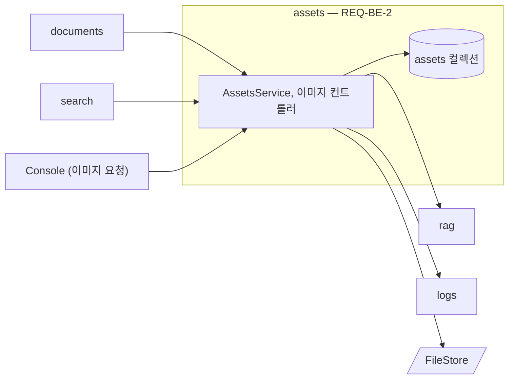

# assets 모듈 명세 (REQ-BE-2)

문서 버전의 원본 MD에서 표·이미지를 찾아 자리표시(루트 `IF-1`)로 바꾼 색인용 MD를 만들고, 표·이미지마다 RAG Server로 요약·캡션을 받아 저장하며, 이미지 파일을 제공하고, 청크 본문의 자리표시를 원래 표·이미지로 복원한다. 문서 상태는 바꾸지 않고 결과만 documents에 돌려준다. 폴더는 `apps/backend/src/assets`다.

## 요약

**핵심 계약**

- 색인용 MD의 모든 자리표시 ID에는 요약·캡션이 있다. 만들지 못한 것은 임시 설명으로 채운다. RAG Server의 색인이 이 보장에 기댄다 (루트 `IF-1`, `REQ-BE-2.3.2`)
- 원본 본문에 자리표시와 같은 모양의 문자열이 있으면 색인용 MD에서 깨뜨려 넣고, 복원할 때 되돌린다. 그래야 RAG Server가 가짜 자리표시를 읽지 않는다 (`REQ-BE-2.2.2`)
- 요약·캡션은 표·이미지마다 만드는 대로 저장한다. 중간에 멈춰도 저장된 것은 다시 만들지 않는다 (`REQ-BE-2.3.6`, `REQ-BE-1.9.9`)
- 문서 상태(처리 상태·검색 상태)를 쓰지 않는다. 진행 여부는 documents가 넘긴 확인 함수로 묻는다 (`ARCHITECT.md` 「의존 규칙」)

**기능 그룹**

| REQ | 기능 그룹 | 책임 |
| :--- | :--- | :--- |
| `REQ-BE-2.1` | 추출 | 버전의 원본 MD에서 표·이미지를 찾아 등록하고 자리표시 ID를 정한다 |
| `REQ-BE-2.2` | 색인용 MD | 표·이미지 자리를 자리표시로 바꾼 색인용 MD를 만든다 |
| `REQ-BE-2.3` | 요약·캡션 생성 | 표·이미지마다 요약·캡션을 받아 저장하고, 못 받으면 임시 설명을 쓴다 |
| `REQ-BE-2.4` | 이미지 제공 | 문서 버전과 자리표시 ID로 이미지 파일을 돌려준다 |
| `REQ-BE-2.5` | 복원 | 청크 본문의 자리표시를 원래 표·이미지로 바꾼다 |

**비범위**

- 처리 상태를 요약·캡션 생성 중·색인 대기로 바꾸는 일과 색인 요청 — documents, indexing (`REQ-BE-1.9`, `REQ-BE-3.1`)
- 문서·버전 레코드와 색인용 MD 보관 — documents (`ARCHITECT.md` 「데이터·상태 소유」)

## 구조

### 예상 배치

```text
src/assets/
└── MODULE.md

src/assets/**/*.spec.ts
test/
```

### 컨텍스트



common 의존은 생략했다.

## 의존성과 공개 표면

### 의존 관계

| 대상 | 관계 | 사용하는 계약 | 계약 소유 | 관련 REQ |
| :--- | :--- | :--- | :--- | :--- |
| rag | DI | `RagClient.summarizeTable`, `captionImage`, `RagUnavailableError`, `RagRequestError` | rag `MODULE.md` | `REQ-BE-2.3` |
| logs | DI | `LogsService.record`(`captioning`) | logs `MODULE.md` | `REQ-BE-6.1.1` |
| storage | DI | `MONGO_DB`(컬렉션 `assets`), `FILE_STORE` | storage `MODULE.md` | `REQ-BE-2`, `REQ-BE-9.1.2` |
| common | DI·import | `PinoLogger`, `AssetNotFoundError`, `InvalidRequestError` | common `MODULE.md` | `REQ-BE-2.4.1` |

**금지 의존** — documents·indexing을 import하지 않는다. 문서 데이터는 documents가 인자로 넘긴다(`ARCHITECT.md` 「의존 규칙」).

### 공개 표면

| 기능 그룹 | 공개 표면 | 상세 계약 | 관련 REQ |
| :--- | :--- | :--- | :--- |
| 추출, 색인용 MD | `AssetsService.prepareVersion`, `UploadedImage`, `PreparedVersion` | 「추출 — REQ-BE-2.1」 | `REQ-BE-2.1`, `REQ-BE-2.2`, `REQ-BE-1.1.3`, `REQ-BE-1.1.4` |
| 요약·캡션 생성 | `AssetsService.generateHints`, `inheritVersion`, `markTemporaryForRegeneration`, `hintsFor` | 「요약·캡션 생성 — REQ-BE-2.3」 | `REQ-BE-2.3`, `REQ-BE-1.6.3`, `REQ-BE-1.7.1` |
| 이미지 제공 | `GET /v1/documents/{doc_id}/versions/{version}/assets/{placeholder_id}`, `AssetsService.imageUrls` | `API.md`, 「이미지 제공 — REQ-BE-2.4」 | `REQ-BE-2.4.1`, `REQ-BE-1.4.3` |
| 복원 | `AssetsService.restore` | 「복원 — REQ-BE-2.5」 | `REQ-BE-2.5` |
| 조회·삭제 | `AssetsService.listViews`, `deleteDocument` | 「조회와 삭제」 | `REQ-BE-1.4.4`, `REQ-BE-1.8.5` |

## 데이터 계약

### 모델별 필드

**표·이미지** (MongoDB `assets`) — 정의: assets, 값 생산: assets (`REQ-BE-2.1`)

| 필드 | 타입 | 필수 | 불변 조건 |
| :--- | :--- | :--- | :--- |
| `docId`, `version` | `string` | 필수 | 이 표·이미지가 속한 문서 버전 |
| `placeholderId` | `string` | 필수 | 버전 안에서 고유. 영문 소문자·숫자(루트 `IF-1`) |
| `kind` | `'table' \| 'image'` | 필수 | |
| `order` | `number` | 필수 | 원본 MD에 나오는 차례 |
| `tableMarkdown` | `string \| null` | 조건부 | `table`이면 원본 표 그대로 |
| `imagePath` | `string \| null` | 조건부 | `image`면 MD에 적힌 경로 그대로 |
| `alt` | `string \| null` | 조건부 | `image`면 대체 텍스트 |
| `fileKey` | `string \| null` | 조건부 | 짝이 있는 이미지면 파일 키(`{docId}/{version}/{placeholderId}.{ext}`). 이어받은 버전은 원래 버전의 키를 그대로 가리킨다 |
| `contentType` | `string \| null` | 조건부 | `fileKey`가 있으면 필수 |
| `description` | `string` | 필수 | 자리표시 설명. 줄바꿈과 `]]`가 없다(루트 `IF-1`) |
| `hint` | `string \| null` | 조건부 | 요약·캡션. `hintStatus`가 `done`이면 필수 |
| `hintStatus` | `'pending' \| 'done'` | 필수 | |
| `isTemporary` | `boolean` | 필수 | `hint`가 임시 설명이면 참 |

### 변환·저장 경계

- **원본 MD → 색인용 MD** (`REQ-BE-2.2`) — 보존: 표·이미지 밖의 모든 글자와 순서. 파생: 표·이미지 자리마다 자리표시 한 줄, 자리표시 모양 문자열은 `[[` 뒤에 U+200B를 넣어 깨뜨린다. 형식: 루트 `IF-1`
- **청크 본문 → 복원 본문** (`REQ-BE-2.5`) — 표 자리표시는 `tableMarkdown`으로, 이미지 자리표시는 ``로(`API.md`의 `SearchResult`), 짝이 없는 이미지는 `{hint}` 문장만으로 바꾼다. `hint` 안의 `[`·`]`는 `\[`·`\]`로 바꿔 넣는다. U+200B로 깨뜨린 `[[`는 되돌린다

## 기능 그룹별 요구사항

```typescript
/** 업로드로 받은 이미지 파일이다. */
export interface UploadedImage {
  fileName: string;
  contentType: string;
  data: Buffer;
}

/** 버전 준비 결과다. */
export interface PreparedVersion {
  indexingMarkdown: string;
  unmatchedImages: string[];
  assetCount: number;
}

/** 요약·캡션 생성 결과다. */
export interface HintRunResult {
  generated: number;
  temporary: number;
  stopped: boolean;
}

/** 표·이미지를 다룬다. */
@Injectable()
export class AssetsService {
  prepareVersion(docId: string, version: string, markdown: string, images: readonly UploadedImage[]): Promise<PreparedVersion>;
  generateHints(docId: string, version: string, ctx: HintContext): Promise<HintRunResult>;
  inheritVersion(docId: string, fromVersion: string, toVersion: string, changedHints: ReadonlyMap<string, string>): Promise<void>;
  markTemporaryForRegeneration(docId: string, version: string): Promise<number>;
  hintsFor(docId: string, version: string): Promise<Array<{ placeholderId: string; text: string }>>;
  listViews(docId: string, version: string): Promise<AssetViewData[]>;
  imageUrls(docId: string, version: string): Promise<Record<string, string | null>>;
  readImage(docId: string, version: string, placeholderId: string): Promise<{ data: Buffer; contentType: string }>;
  restore(docId: string, version: string, text: string): Promise<string>;
  deleteDocument(docId: string): Promise<void>;
}

/** 요약·캡션 생성 중 진행 여부와 기록에 쓰는 문서 정보다. */
export interface HintContext {
  name: string;
  editionLabel: string | null;
  shouldContinue(): Promise<boolean>;
}
```

### 추출 — `REQ-BE-2.1`

**`REQ-BE-2.1.1`** 버전마다 표·이미지 등록

- 처리 계약: `prepareVersion`은 원본 MD를 CommonMark·GFM으로 읽어, GFM 표와 HTML `<table>` 블록을 표로, Markdown 이미지(인라인·참조형)와 HTML ``를 이미지로 등록한다. 이미지 경로의 파일 이름이 `images`의 `fileName`과 같으면 짝으로 보고 파일을 저장한다(`REQ-BE-1.1.3`). 짝이 없으면 `unmatchedImages`에 경로를 담는다(`REQ-BE-1.1.4`)
- 실패: `images`에 같은 `fileName`이 둘 이상이면 짝을 정할 수 없으므로 `InvalidRequestError`를 내고 아무것도 저장하지 않는다
- 충족 기준: 표 둘·이미지 셋(그중 하나는 짝 없음)이 든 MD에서 표·이미지 레코드가 다섯 개, 저장한 파일이 둘, `unmatchedImages`가 하나다

**`REQ-BE-2.1.2`** 코드 블록 안은 제외

- 충족 기준: 펜스·들여쓰기 코드 블록 안의 표·이미지 모양은 등록되지 않고 색인용 MD에 그대로 남는다

**`REQ-BE-2.1.3`** 버전 안 고유 자리표시 ID

- 처리 계약: 표는 `t1`, `t2`…, 이미지는 `i1`, `i2`…처럼 종류 글자와 원본에 나오는 차례로 정한다
- 충족 기준: 한 버전의 모든 `placeholderId`가 서로 다르고 루트 `IF-1`의 형식(영문 소문자·숫자)이다

### 색인용 MD — `REQ-BE-2.2`

**`REQ-BE-2.2.1`** 자리표시로 바꾼 색인용 MD

- 충족 기준: 색인용 MD에서 표·이미지 자리마다 자리표시가 하나씩 있고, 그 밖의 글자는 원본과 같다(`REQ-BE-2.2.2`의 U+200B 제외)

**`REQ-BE-2.2.2`** 자리표시 모양 문자열 깨뜨리기

- 처리 계약: 원본에 `[[minerva:`로 시작하는 문자열이 있으면 `[[` 뒤에 U+200B를 넣는다. 복원(`REQ-BE-2.5`)이 되돌린다
- 충족 기준: 원본에 `[[minerva:table:x | y]]`가 있으면 색인용 MD에서 루트 `IF-1` 형식으로 읽히지 않고, 그 부분을 복원하면 원본 문자열이 된다

**`REQ-BE-2.2.3`** 자리표시 설명

- 처리 계약: 표는 머리 행의 칸을 `, `로 이은 것, 이미지는 대체 텍스트(없으면 파일 이름)로 채우고, 줄바꿈과 `]]`는 공백으로 바꾼다
- 충족 기준: `| 키 | 값 |` 머리 행의 표 설명이 `키, 값`이고, 대체 텍스트가 없는 이미지의 설명이 파일 이름이며, 어떤 설명에도 줄바꿈과 `]]`가 없다

### 요약·캡션 생성 — `REQ-BE-2.3`

**`REQ-BE-2.3.1`** 표·이미지마다 한 건씩 요청

- 처리 계약: `generateHints`는 `hintStatus`가 `pending`인 표·이미지를 `order` 순으로 하나씩 `summarizeTable`·`captionImage`로 요청한다. 다음 것을 요청하기 전에 `ctx.shouldContinue()`를 묻고, 거짓이면 `stopped: true`로 멈춘다(`REQ-BE-1.8.3`, `REQ-BE-1.2.8`)
- 충족 기준: 표·이미지가 셋이면 RAG Server 호출이 세 번 차례로 일어나고, 두 번째 뒤 `shouldContinue`가 거짓이면 세 번째 호출이 없다

**`REQ-BE-2.3.2`** 못 만든 것은 임시 설명

- 처리 계약: 요청이 `RagUnavailableError`나 `RagRequestError`로 실패하면 `description`을 `hint`로, `isTemporary`를 참으로 저장한다
- 충족 기준: 캡션 요청이 실패한 이미지의 `hint`가 자리표시 설명이고 `isTemporary`가 참이다

**`REQ-BE-2.3.3`** 짝이 없는 이미지는 요청하지 않음

- 충족 기준: `fileKey`가 없는 이미지는 RAG Server 호출 없이 대체 텍스트(없으면 파일 이름)를 `hint`로, `isTemporary`를 참으로 저장한다

**`REQ-BE-2.3.4`** 일부 실패해도 계속

- 충족 기준: 셋 중 하나가 실패해도 나머지 둘을 요청하고, `generateHints`가 예외 없이 `temporary: 1`로 끝난다

**`REQ-BE-2.3.5`** 모두 마치면 색인으로

- 처리 계약: `generateHints`가 `stopped: false`로 끝나면 모든 표·이미지의 `hintStatus`가 `done`이다. 색인 요청은 documents가 이어서 한다(`REQ-BE-1.9.3`)
- 충족 기준: `stopped: false` 뒤 `hintsFor`가 모든 자리표시 ID의 문장을 돌려준다

**`REQ-BE-2.3.6`** 만드는 대로 저장, 이어받은 것은 다시 만들지 않음

- 처리 계약: 표·이미지 하나의 결과를 받을 때마다 저장한다. `inheritVersion`은 이전 버전의 레코드를 새 버전으로 복사하되 `changedHints`의 것만 새 값(`isTemporary` 거짓)으로 바꾸고, 모두 `done`으로 둔다. `markTemporaryForRegeneration`은 `isTemporary`가 참이고 `fileKey`가 있거나 표인 것만 `pending`으로 바꾸고 그 수를 돌려준다(`REQ-BE-1.7.1`)
- 충족 기준: 둘째 호출 뒤 멈춘 버전으로 다시 `generateHints`하면 셋째부터만 요청하고, 이어받은 버전은 `changedHints`의 것만 바뀌며, 재색인 표시는 짝 없는 이미지를 빼고 임시 설명만 `pending`으로 만든다

`generateHints`가 끝나면 `captioning` 기록을 남긴다(개수와 임시 설명 수, `REQ-BE-6.1.1`).

### 이미지 제공 — `REQ-BE-2.4`

**`REQ-BE-2.4.1`** 문서 버전과 자리표시 ID로 이미지 반환

- 처리 계약: 그 버전의 레코드에서 `fileKey`를 찾아 `FileStore`에서 읽고 `contentType`과 함께 돌려준다. `imageUrls`는 원본 MD의 이미지 경로마다 이 엔드포인트 주소(짝이 없으면 `null`)를 준다(`REQ-BE-1.4.3`)
- 실패: 레코드나 파일이 없으면 `AssetNotFoundError`
- 충족 기준: 이어받은 버전의 주소로도 원래 파일이 나오고, 없는 자리표시 ID는 `404 ASSET_NOT_FOUND`다

### 복원 — `REQ-BE-2.5`

**`REQ-BE-2.5.1`** 표 자리표시 복원

- 충족 기준: 표 자리표시가 든 본문을 복원하면 그 자리에 그 버전의 원본 표가 있다

**`REQ-BE-2.5.2`** 이미지 자리표시 복원

- 충족 기준: 짝이 있는 이미지는 ``로, 짝이 없는 이미지는 캡션 문장만으로 바뀌며, 캡션의 대괄호가 이미지 문법을 깨지 않는다

**`REQ-BE-2.5.3`** 검색 결과와 청크 조회가 같은 복원

- 처리 계약: search와 documents는 모두 `restore`를 부른다. 복원에 쓰는 버전은 부른 쪽이 넘긴 RAG Server의 결과·청크 버전이다
- 충족 기준: 같은 본문·버전으로 `restore`를 부르면 언제나 같은 결과다

### 조회와 삭제

`listViews`는 `API.md`의 `AssetView`를 만드는 원천(원래 모양, 요약·캡션, 임시 여부)이고(`REQ-BE-1.4.4`), `deleteDocument`는 그 문서의 모든 레코드와 `{docId}/` 아래 파일을 지운다(`REQ-BE-1.8.5`). 두 함수의 충족 기준과 테스트는 documents가 그 REQ로 소유한다.

## 실행 계약

### 예외

| 예외 | 발생 조건 | 코드 | 처리 책임 | 관련 REQ |
| :--- | :--- | :--- | :--- | :--- |
| `AssetNotFoundError` | 이미지 레코드나 파일이 없다 | `ASSET_NOT_FOUND` | 발생: assets. 변환: api | `REQ-BE-2.4.1` |
| `InvalidRequestError` | 업로드에 같은 이름의 이미지가 둘 이상 | `INVALID_REQUEST` | 발생: assets. 전파: documents | `REQ-BE-2.1.1` |

요약·캡션 요청의 실패는 예외로 내보내지 않고 임시 설명으로 바꾼다(`REQ-BE-2.3.2`).

### 로그

| 이벤트 | 발생 시점 | 레벨 | 허용 필드 | 관련 REQ |
| :--- | :--- | :--- | :--- | :--- |
| `assets.prepared` | `prepareVersion` 끝 | info | `docId`, `version`, `tables`, `images`, `unmatched` | `REQ-BE-2.1` |
| `assets.hint_failed` | 요약·캡션 요청 실패 | warning | `docId`, `version`, `placeholderId`, `code` | `REQ-BE-2.3.2` |
| `assets.hints_done` | `generateHints` 끝 | info | `docId`, `version`, `generated`, `temporary`, `stopped` | `REQ-BE-2.3` |

표 Markdown, 대체 텍스트, 요약·캡션은 로그에 넣지 않는다.

## 테스트와 추적성

| REQ ID | 종류 | 검증 초점 | 대체 경계 | 예상 위치 |
| :--- | :--- | :--- | :--- | :--- |
| `REQ-BE-2.1.1` | unit | 표·이미지 종류별 등록, 짝 맞추기와 짝 없음, 같은 이름 이미지 거부 | `MONGO_DB`, `FILE_STORE` (가짜) | `src/assets/**/*.spec.ts` |
| `REQ-BE-2.1.2` | unit | 코드 블록 안 제외 | | `src/assets/**/*.spec.ts` |
| `REQ-BE-2.1.3` | unit | ID 고유성과 형식 | | `src/assets/**/*.spec.ts` |
| `REQ-BE-2.2.1` | unit | 자리표시 치환과 나머지 보존 | | `src/assets/**/*.spec.ts` |
| `REQ-BE-2.2.2` | unit | 자리표시 모양 문자열 깨뜨리기와 복원 왕복 | | `src/assets/**/*.spec.ts` |
| `REQ-BE-2.2.3` | unit | 표·이미지 설명, 줄바꿈·`]]` 제거 | | `src/assets/**/*.spec.ts` |
| `REQ-BE-2.3.1` | unit | 한 건씩 차례로 요청, `shouldContinue` 거짓에서 멈춤 | rag (가짜) | `src/assets/**/*.spec.ts` |
| `REQ-BE-2.3.2` | unit | 실패 시 임시 설명 | rag (가짜, 실패) | `src/assets/**/*.spec.ts` |
| `REQ-BE-2.3.3` | unit | 짝 없는 이미지는 호출 없이 임시 설명 | rag (가짜) | `src/assets/**/*.spec.ts` |
| `REQ-BE-2.3.4` | unit | 일부 실패에도 계속 | rag (가짜, 실패) | `src/assets/**/*.spec.ts` |
| `REQ-BE-2.3.5` | unit | 끝나면 모든 자리표시의 문장 | rag (가짜) | `src/assets/**/*.spec.ts` |
| `REQ-BE-2.3.6` | unit | 이어서 하기, 이어받기, 재색인 표시 | rag (가짜), `MONGO_DB` (가짜) | `src/assets/**/*.spec.ts` |
| `REQ-BE-2.4.1` | e2e | 이미지 응답과 형식, 이어받은 버전 주소, 없는 ID `404` | | `test/` |
| `REQ-BE-2.5.1` | unit | 표 복원 | `MONGO_DB` (가짜) | `src/assets/**/*.spec.ts` |
| `REQ-BE-2.5.2` | unit | 이미지·짝 없는 이미지 복원 | `MONGO_DB` (가짜) | `src/assets/**/*.spec.ts` |
| `REQ-BE-2.5.3` | unit | 같은 입력 같은 결과 | `MONGO_DB` (가짜) | `src/assets/**/*.spec.ts` |
