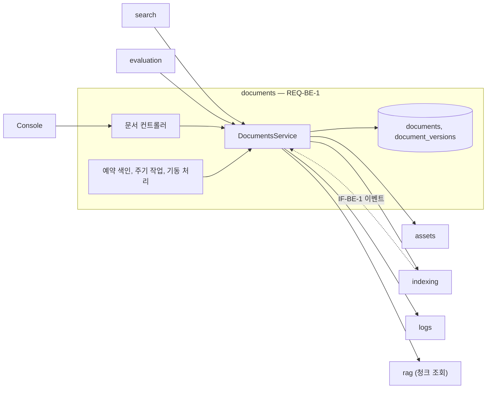
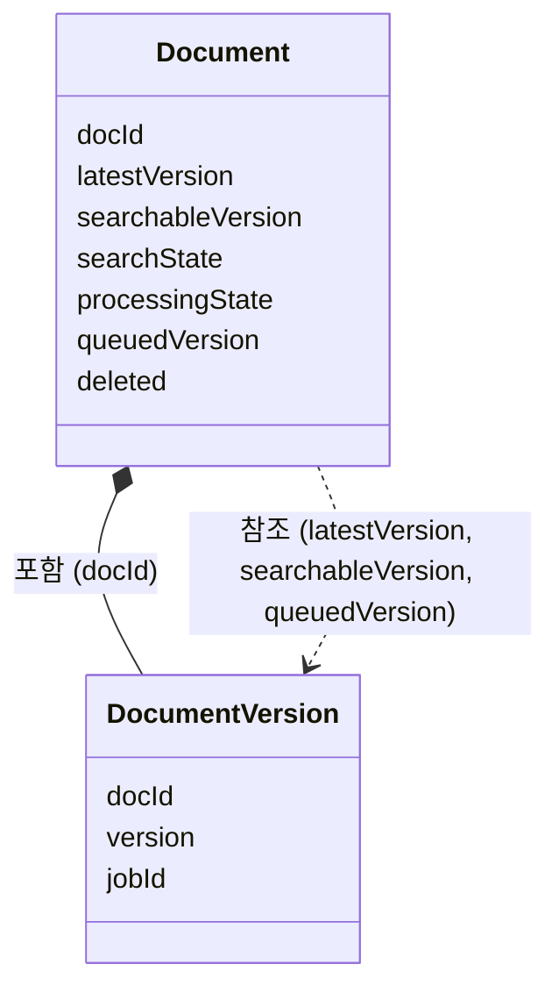
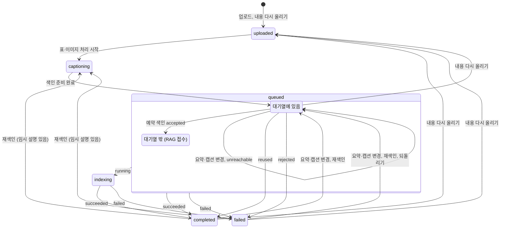

# documents 모듈 명세 (REQ-BE-1)

문서를 올리고, 이름·판으로 묶고, 고치고, 다시 올리고, 재색인하고, 지운다. 처리 상태·검색 상태·색인 대기열과 교체를 바꾸는 유일한 모듈이며, 표·이미지 처리(assets)를 부르고, 색인할 준비가 된 버전을 색인 대기열에 넣어 예약 색인 때 색인 연동(indexing)을 부르고, 그 결과로 상태를 반영한다. 기동 때 끊긴 처리를 잇고, 예약 색인·상태 맞추기·RAG Server 재요청을 정해진 일정과 주기로 돌린다. 폴더는 `apps/backend/src/documents`다.

## 요약

**핵심 계약**

- 처리 상태·검색 상태·색인 대기열·교체·삭제됨 표시는 이 모듈만 쓴다. 상태를 바꾸는 쓰기는 "현재 상태가 X일 때만"을 조건으로 한 번에 갱신해, 검사와 쓰기 사이에 다른 요청이 끼어들지 못하게 한다 (`REQ-BE-1.5.5`, `REQ-BE-1.9`, `ARCHITECT.md` 「의존 규칙」)
- 색인 대기열은 `Document.queuedVersion`이다. 대기열에 넣고 빼는 일은 처리 상태를 바꾸는 갱신과 같은 갱신에서 한다 — 처리 상태만 바뀌고 대기열이 그대로인 문서가 생기지 않는다 (`REQ-BE-1.10.2`, `REQ-BE-1.10.7`, `REQ-BE-1.10.8`)
- RAG Server에 색인을 요청하는 곳은 예약 색인 하나다. 업로드·편집·재색인·실패 되돌리기는 색인 대기열에 넣기까지만 한다 (`REQ-BE-1.10.1`)
- 교체는 남을 문서가 검색 가능일 때만, 같은 판에서 판에 들어온 시각이 더 이른 문서에만 일어난다. 교체됨은 돌아오지 않는다 (`REQ-BE-1.2.3`~`REQ-BE-1.2.6`)
- 교체됨·삭제됨 문서와 마지막 버전이 아닌 작업의 상태로는 아무 상태도 바꾸지 않는다 (`REQ-BE-1.9.6`, `IF-BE-1`)
- 버전은 Console에 보내는 응답의 필드로 나가지 않는다. 이미지 주소의 경로 안에만 들어간다 (`REQ-BE-1.6.4`)

**기능 그룹**

| REQ | 기능 그룹 | 책임 |
| :--- | :--- | :--- |
| `REQ-BE-1.1` | 업로드 | MD·이미지를 검증해 문서와 첫 버전을 만들고 처리를 시작한다 |
| `REQ-BE-1.2` | 이름·판·교체 | 같은 판과 최신판을 정하고, 교체를 반영한다 |
| `REQ-BE-1.3` | 목록 조회 | 문서 목록을 거르고 정렬해 판·단계·실패 사유와 함께 준다 |
| `REQ-BE-1.4` | 문서 조회 | 문서 하나의 정보, 원본, 표·이미지, 검색에 쓰이는 청크를 준다 |
| `REQ-BE-1.5` | 편집 | 이름·판 정보·요약·캡션을 고치고, 처리 중·교체됨 문서의 변경을 거부한다 |
| `REQ-BE-1.6` | 새 버전 | 내용 다시 올리기와 요약·캡션 변경·재색인의 새 버전을 만든다 |
| `REQ-BE-1.7` | 재색인 | 같은 내용의 새 버전을 만들어 예약 색인에서 강제 재색인하게 한다 |
| `REQ-BE-1.8` | 삭제 | 바로 삭제됨으로 표시하고, 뒤에서 처리를 멈추고 청크와 데이터를 지운다 |
| `REQ-BE-1.9` | 상태 반영 | 처리 상태·검색 상태를 정해진 계기에서만 바꾸고, 기동 때 끊긴 처리를 잇는다 |
| `REQ-BE-1.10` | 예약 색인 | 색인 대기열을 관리하고, 설정한 일정마다 대기열의 버전을 RAG Server에 색인 요청한다 |

**비범위**

- 표·이미지 추출, 색인용 MD, 요약·캡션 생성, 복원 — assets
- RAG Server 요청과 알림 받기, 순번 거르기 — indexing
- 기록 문장 — logs

## 구조

### 예상 배치

```text
src/documents/
├── index.ts
├── documents.module.ts
├── controllers/
│   └── documents.controller.ts
├── helpers/
│   ├── document-state.ts
│   ├── document-views.ts
│   └── upload-files.ts
├── interfaces/
│   ├── documents.dto.ts
│   └── documents.types.ts
├── services/
│   ├── documents.service.ts
│   ├── document-lifecycle.service.ts
│   ├── documents.scheduler.ts
│   ├── documents-crud.service.ts
│   ├── document-tasks.ts
│   └── document-clock.ts
└── MODULE.md

src/documents/**/*.spec.ts
test/
```

### 컨텍스트



점선은 NestJS 이벤트다. common·storage 의존은 생략했다.

## 의존성과 공개 표면

### 의존 관계

| 대상 | 관계 | 사용하는 계약 | 계약 소유 | 관련 REQ |
| :--- | :--- | :--- | :--- | :--- |
| assets | DI | `prepareVersion`, `generateHints`, `inheritVersion`, `markTemporaryForRegeneration`, `hintsFor`, `listViews`, `imageUrls`, `restore`, `deleteDocument` | assets `MODULE.md` | `REQ-BE-1.1`, `REQ-BE-1.4`, `REQ-BE-1.6`, `REQ-BE-1.8` |
| indexing | DI, 이벤트 (구독) | `requestIndex`, `reconcile`, `getStages`, `updateMetadata`, `deleteChunks`; `indexing.job-state-changed` | indexing `MODULE.md`, `IF-BE-1` | `REQ-BE-1.9`, `REQ-BE-1.10.1`, `REQ-BE-1.2.8`, `REQ-BE-1.8.4` |
| logs | DI | `LogsService.record` | logs `MODULE.md` | `REQ-BE-6.1.1` |
| rag | DI | `RagClient.getDocumentChunks` | rag `MODULE.md` | `REQ-BE-1.4.5` |
| storage | DI | `MONGO_DB`(컬렉션 `documents`, `document_versions`) | storage `MODULE.md` | `REQ-BE-1` |
| common | DI·import | `ConfigService`, 오류 클래스, `parseKstDayRange`, `kstDayRange`, `toIsoUtc`, 페이지 규약(`PageQueryDto`, `Page<T>`, `toPage()`), `ProcessingState`, `SearchState`, `PinoLogger` (nestjs-pino) | common `MODULE.md` | `REQ-BE-1`, `REQ-BE-8.2.1`, `REQ-BE-8.4.1`, `REQ-BE-7.1.3` |
| `@nestjs/schedule` | import | cron 일정 등록 | `@nestjs/schedule` | `REQ-BE-1.10.1` |

### 공개 표면

| 기능 그룹 | 공개 표면 | 상세 계약 | 관련 REQ |
| :--- | :--- | :--- | :--- |
| 업로드 | `POST /v1/documents` | `API.md` | `REQ-BE-1.1` |
| 이름·판·교체 | `GET /v1/documents/replacement-check` | `API.md` | `REQ-BE-1.2.7` |
| 목록 조회 | `GET /v1/documents`, `GET /v1/document-names` | `API.md` | `REQ-BE-1.3` |
| 문서 조회 | `GET /v1/documents/{doc_id}`, `.../original`, `.../chunks` | `API.md` | `REQ-BE-1.4` |
| 편집 | `PATCH /v1/documents/{doc_id}` | `API.md` | `REQ-BE-1.5` |
| 새 버전 | `POST /v1/documents/{doc_id}/contents` | `API.md` | `REQ-BE-1.6` |
| 재색인 | `POST /v1/documents/{doc_id}/reindex` | `API.md` | `REQ-BE-1.7` |
| 삭제 | `DELETE /v1/documents/{doc_id}` | `API.md` | `REQ-BE-1.8` |
| 상태 반영 | `indexing.job-state-changed` 구독 | `IF-BE-1` | `REQ-BE-1.9` |
| 예약 색인 | `POST /v1/documents/{doc_id}/queue`; `INDEX_SCHEDULE_CRON` 일정의 예약 작업 (lifecycle) | `API.md`, 「예약 색인 — REQ-BE-1.10」 | `REQ-BE-1.10` |
| 다른 모듈용 조회 | `DocumentsService.resolveNames`, `visibleDocIds`, `getRef`, `getEvaluationTarget` | 「다른 모듈용 조회」 | `REQ-BE-4.1.2`, `REQ-BE-4.2.2`, `REQ-BE-5.1.2`, `REQ-BE-5.1.5`, `REQ-BE-5.2.7` |

## 데이터 계약

### 모델 관계



### 모델별 필드

**`Document`** (MongoDB `documents`) — 정의: documents, 값 생산: documents

| 필드 | 타입 | 필수 | 불변 조건 |
| :--- | :--- | :--- | :--- |
| `docId` | `string` | 필수 | 고유. 삭제한 뒤에도 남는다 |
| `name` | `string` | 필수 | 비어 있지 않다 |
| `edition` | `{ label: string; editionDate: string } \| null` | 필수 | 판 표기·판 날짜는 함께 있거나 함께 없다. 날짜는 `YYYY-MM-DD` |
| `editionEnteredAt` | `Date` | 필수 | 그 판에 들어온 시각(`REQ-BE-1.2.4`) |
| `searchState` | `SearchState` | 필수 | `replaced`가 되면 바뀌지 않는다 |
| `processingState` | `ProcessingState` | 필수 | 「상태 반영」과 「예약 색인」의 계기로만 바뀐다 |
| `queuedVersion` | `string \| null` | 필수 | 색인 대기열. 값이 있으면 그 버전이 대기열에 있다. 값이 있는 동안 `processingState`는 `queued`, 값은 `latestVersion`과 같고, 문서는 삭제됨·교체됨이 아니다. 선점을 되돌릴 때는 `latestVersion`과 같은 갱신에서 정한다(「버전 처리」, 「기동 때 선점 되돌리기」) |
| `latestVersion` | `string` | 필수 | 마지막으로 만든 버전. 선점을 되돌릴 때만 직전 버전으로 돌아간다 |
| `searchableVersion` | `string \| null` | 필수 | RAG Server에서 지금 검색되는 버전. 이벤트·색인 결과에서만 바뀐다 |
| `deleted` | `boolean` | 필수 | 참이면 목록·조회·검색에서 빠진다 |
| `pendingRag` | `{ deleteChunks: boolean; metadata: boolean }` | 필수 | 다시 보낼 RAG Server 요청 |
| `purged` | `boolean` | 필수 | 삭제된 문서의 데이터를 다 지웠는가 |
| `uploadedAt`, `updatedAt` | `Date` | 필수 | `updatedAt`은 마지막으로 내용을 다시 올리거나 편집한 시각 |

- `docId`는 `randomUUID()`(소문자 UUID v4)다. `name`과 `edition.label`은 앞뒤 공백을 뗀 값이다. `uploadedAt`·`editionEnteredAt`·`updatedAt`은 프로세스 안에서 단조 증가하는 시계로 쓴다(같은 판 동점이 없다)
- 인덱스: `documents_doc_id` — `{ docId: 1 }` unique, `documents_name` — `{ name: 1 }`, `document_versions_doc_version` — `{ docId: 1, version: 1 }` unique

**`DocumentVersion`** (MongoDB `document_versions`) — 정의: documents, 값 생산: documents

| 필드 | 타입 | 필수 | 불변 조건 |
| :--- | :--- | :--- | :--- |
| `docId`, `version` | `string` | 필수 | 문서 안에서 `version`은 `"1"`부터 1씩 커진다 |
| `origin` | `'upload' \| 'content' \| 'hints' \| 'reindex'` | 필수 | 이 버전을 만든 계기 |
| `fileName` | `string` | 필수 | 원본 MD 파일 이름 |
| `originalMarkdown` | `string` | 필수 | 받은 그대로(`REQ-BE-1.1.7`). `hints`·`reindex` 버전은 이전 버전 값 그대로 |
| `indexingMarkdown` | `string \| null` | 조건부 | 표·이미지 처리를 마치면 값이 있다 |
| `jobId` | `string \| null` | 선택 | RAG Server가 접수한 작업(`REQ-BE-3.1.2`) |
| `requestSeq` | `number` | 필수 | 이 버전을 다시 요청 대상으로 돌린 횟수. 버전을 만들 때 `0`이고, `REQ-BE-1.10.5`의 1단계에서만 1 늘어나며 줄지 않는다. 예약 색인 결과의 버전 기록 조건이다(`REQ-BE-1.9.4`) |
| `result` | `{ chunkCount: number; fallbackUsed: boolean } \| null` | 선택 | |
| `failure` | `{ code: string; message: string; headingPath: string[] \| null; placeholderId: string \| null } \| null` | 선택 | |

응답 형식(`DocumentSummary`, `DocumentDetail`, `ChunkView` 등)은 `API.md`가 소유한다.

## 기능 그룹별 요구사항

### 업로드 — `REQ-BE-1.1`

**`REQ-BE-1.1.1`** MD마다 문서 하나

- 실패: 문서를 만드는 도중 오류가 나면 그 요청에서 만든 문서·버전·표·이미지·파일을 모두 지우고(하나를 지우다 실패해도 나머지는 계속 지운다) 원래 오류를 낸다. 업로드 기록은 모든 문서를 만든 뒤에 남기고, 처리는 모두 만든 뒤에만 시작한다(`REQ-BE-1.1.9`)
- 충족 기준: MD 셋과 이미지들을 한 요청으로 올리면 문서 셋과 각 첫 버전이 생긴다

**`REQ-BE-1.1.2`** 받지 않는 형식이면 요청 전체 거부

- 실패: `UnsupportedFileError`, `message`에 그 파일 이름. 아무 문서도 만들지 않는다. UTF-8로 읽을 수 없는 MD도 같다
- 충족 기준: `.pdf`가 섞인 요청은 `400 UNSUPPORTED_FILE`이고 문서가 하나도 생기지 않는다

**`REQ-BE-1.1.3`** 이미지 경로의 파일 이름으로 짝 맞추기

- 처리 계약: 짝 맞추기는 `AssetsService.prepareVersion`이 한다(assets `MODULE.md`)
- 충족 기준: `./img/a.png`를 참조하는 MD와 `a.png`를 올리면 그 이미지의 주소로 파일이 나온다

**`REQ-BE-1.1.4`** 짝이 없는 이미지 알리기

- 충족 기준: 짝 없는 참조가 있어도 문서가 생기고, 응답의 그 문서에 짝 없는 이미지 이름이 있다

**`REQ-BE-1.1.5`** 이름과 선택적 판 정보

- 충족 기준: 판 정보가 있는 문서와 없는 문서를 함께 올리면 각각 그대로 저장된다

**`REQ-BE-1.1.6`** 이름 없음·판 정보 반쪽이면 요청 전체 거부

- 실패: `InvalidRequestError`. 아무 문서도 만들지 않는다
- 충족 기준: MD 둘 중 하나의 이름이 비었거나 판 표기만 있으면 `400 INVALID_REQUEST`이고 문서가 생기지 않는다

**`REQ-BE-1.1.7`** 원본 MD 보관

- 충족 기준: 올린 MD와 `originalMarkdown`이 바이트까지 같다

**`REQ-BE-1.1.8`** 처음 상태

- 충족 기준: 응답 직후 처리 상태가 `uploaded`, 검색 상태가 `not_searchable`이다

**`REQ-BE-1.1.9`** 바로 표·이미지 처리 시작

- 처리 계약: 응답한 뒤 문서마다 「핵심 흐름」의 처리를 백그라운드로 시작한다. 업로드 기록(`upload`)을 남긴다
- 충족 기준: 응답 뒤 RAG Server 가짜에 요약·캡션 요청이 들어오고, 업로드 기록이 문서마다 하나 생긴다

**`REQ-BE-1.1.10`** 업로드 한도

- 처리 계약: 파일 하나(MD는 `UPLOAD_MAX_MD_BYTES`, 이미지는 `UPLOAD_MAX_IMAGE_BYTES`), 파일 수(`UPLOAD_MAX_FILES`), 요청 전체(`UPLOAD_MAX_TOTAL_BYTES`)를 검사한다. 파일 수와 요청 전체 한도는 api의 multipart 설정이 본문을 끝까지 읽기 전에 막는다(api `MODULE.md`). 업로드 파일은 api의 전역 업로드 인터셉터가 읽어 두므로 컨트롤러는 `@UploadedFiles()`·`@Body()`로 받고 파일 인터셉터를 따로 달지 않는다
- 실패: `PayloadTooLargeError`, `message`에 넘은 파일 이름이나 한도. 아무 문서도 만들지 않는다
- 충족 기준: 한도보다 1바이트 큰 MD가 섞인 요청은 `413`이고 문서가 생기지 않으며, 한도와 같은 크기는 받는다

### 이름·판·교체 — `REQ-BE-1.2`

**`REQ-BE-1.2.1`** 이름이 같으면 판들로 묶임

- 충족 기준: 이름이 같은 문서들이 목록의 판 칸(`sibling_editions`)과 `name` 필터에서 함께 나온다

**`REQ-BE-1.2.2`** 최신판

- 처리 계약: 같은 이름에서 `searchState`가 `searchable`이고 판 정보가 있는 문서 중 `editionDate`가 가장 늦은 문서들이 최신판이다
- 충족 기준: 2022·2025판 중 2025판이 최신판이고, 2025판이 둘이면 둘 다이며, 2025판이 검색 안 됨이면 2022판이 최신판이다

**`REQ-BE-1.2.3`** 같은 판

- 충족 기준: 이름·판 표기가 같은 두 문서, 판 정보 없이 이름이 같은 두 문서는 같은 판이고, 교체됨·삭제됨 문서는 같은 판으로 세지 않는다

**`REQ-BE-1.2.4`** 판에 들어온 시각

- 처리 계약: 만들 때 `editionEnteredAt`을 업로드 시각으로 두고, 이름이나 판 표기를 바꾸면 그 시각으로 바꾼다. 판 날짜만 바꾸면 그대로다
- 충족 기준: 이름 변경 뒤 `editionEnteredAt`이 변경 시각이고, 판 날짜만 바꾸면 그대로다

**`REQ-BE-1.2.5`** 교체 규칙

- 처리 계약: 문서가 검색 가능이 될 때(`REQ-BE-1.9.7`)와 검색 가능인 문서의 이름·판 표기가 바뀔 때, 같은 판의 다른 문서 중 `editionEnteredAt`이 이 문서보다 이른 것을 모두 `replaced`로 바꾸고 각각 `replace` 기록을 남긴다
- 충족 기준: 「핵심 흐름」의 교체 경우(먼저 끝난 쪽이 나중 업로드인 경우, 실패 문서를 같은 판으로 편집한 경우 포함)마다 남는 문서가 마지막에 그 판에 들어온 문서다

**`REQ-BE-1.2.6`** 교체됨은 돌아오지 않음

- 충족 기준: `replaced` 문서에 `succeeded` 이벤트가 와도 검색 상태가 `replaced` 그대로다

**`REQ-BE-1.2.7`** 같은 판이 되는 문서 묻기

- 처리 계약: `replacement-check`는 주어진 이름·판 표기와 같은 판인 문서들을 준다. `exclude_doc_id`는 뺀다
- 충족 기준: 같은 판 문서가 둘이면 둘 다, 없으면 빈 배열이 나온다

**`REQ-BE-1.2.8`** 교체됨이 된 문서 정리

- 처리 계약: 교체됨이 된 문서의 처리 상태가 `uploaded`·`captioning`·`queued`·`indexing`이면 `failed`(코드 `REPLACED`)로 바꾸고, 진행 중인 표·이미지 처리가 다음 단계로 가지 않게 한다. 교체됨으로 바꾸는 갱신에서 `queuedVersion`을 비워 예약 색인이 요청하지 않게 하고(`REQ-BE-1.10.7`), `pendingRag.deleteChunks`를 참으로 두고, 백그라운드로 `indexing.deleteChunks`를 불러 참이면 지운다. 거짓이면 주기 작업이 다시 부른다
- 충족 기준: 색인 중에 교체된 문서가 `failed`(`REPLACED`)가 되고 RAG Server에 삭제 요청이 가며, RAG Server가 닿지 않으면 다음 주기에 다시 간다

### 목록 조회 — `REQ-BE-1.3`

요청·응답 형식은 `API.md`의 `GET /v1/documents`, `GET /v1/document-names`가 소유한다.

**`REQ-BE-1.3.1`** 페이지

- 충족 기준: 페이지 크기 20·50·100으로 나눠 주고 전체 개수가 맞으며, 다른 크기는 `400`이다

**`REQ-BE-1.3.2`** 정렬

- 처리 계약: 이름은 코드 포인트 순, 검색 상태는 `searchable`·`not_searchable`·`replaced` 순, 처리 상태는 `uploaded`·`captioning`·`queued`·`indexing`·`completed`·`failed` 순, 시각 열은 시각 순이다. 같은 값은 수정 시각 최근순, 그다음 `doc_id` 순이다
- 충족 기준: 다섯 열 각각으로 오름·내림차순이 되고, 지정하지 않으면 수정 시각 최근순이다

**`REQ-BE-1.3.3`** 거르기

- 처리 계약: 조건은 모두 함께 만족해야 한다. "최신판만"은 판 정보가 있으면 최신판(`REQ-BE-1.2.2`)만, 판 정보가 없는 문서는 그대로 둔다. 삭제됨 문서는 언제나 뺀다
- 충족 기준: 조건마다 맞는 문서만 나오고, 최신판만이면 2022판이 빠지고 판 정보 없는 문서는 남는다

**`REQ-BE-1.3.4`** 업로드 기간은 KST

- 충족 기준: `uploaded_to=2026-10-04`가 KST 10월 4일 23:59에 올린 문서를 포함한다

**`REQ-BE-1.3.5`** 판 칸

- 처리 계약: 자기 판에 같은 이름의 다른 검색 가능 문서들의 판을 더하고, 판 표기·판 날짜가 같은 판은 하나로 합친다. 판 날짜 늦은 순이고, 같으면 판 표기의 코드 포인트 순이다
- 충족 기준: 문서마다 자기 판과 같은 이름의 검색 가능인 다른 문서들의 판이 판 날짜 늦은 순으로 나오고, 자기 판 정보가 없으면 빈 배열이다

**`REQ-BE-1.3.6`** 색인 중 단계

- 처리 계약: 페이지에 든 `indexing` 문서들의 단계를 `indexing.getStages`로 한 번에 받는다. 받지 못하면 단계 없이(`null`) 목록을 준다
- 충족 기준: 색인 중인 문서에 단계가 붙고, RAG Server가 닿지 않아도 목록이 `200`이며 단계가 `null`이다

**`REQ-BE-1.3.7`** 이름 목록

- 충족 기준: 삭제됨이 아닌 문서의 이름이 중복 없이 가나다순으로, 입력한 글자로 시작하는 것만 최대 `limit`개 나온다

**`REQ-BE-1.3.8`** 실패 사유 설명

- 충족 기준: `failed` 문서에 마지막 버전의 실패 설명이 붙고, 아니면 `null`이다

**`REQ-BE-1.3.9`** 색인 대기열 여부와 다음 예약 색인 시각

- 처리 계약: `queued` 문서에 대기열 여부(`queuedVersion`에 값이 있는가)와, 응답하는 때보다 뒤에 `INDEX_SCHEDULE_CRON` 일정이 처음 오는 시각을 준다. 다른 처리 상태면 둘 다 `null`이다. 필드는 `API.md`의 `DocumentSummary`가 소유한다
- 충족 기준: 대기열에 있는 `queued` 문서는 대기열 여부가 참, RAG Server가 접수한 `queued` 문서는 거짓이고, 둘 다 다음 예약 시각이 일정의 다음 시각(기본 일정이면 다음 KST 00:00)이며, `queued`가 아닌 문서는 둘 다 `null`이다

### 문서 조회 — `REQ-BE-1.4`

**`REQ-BE-1.4.1`** 문서 정보

- 실패: 없거나 삭제된 문서는 `DocumentNotFoundError`
- 충족 기준: 이름, 판, 원본 파일 이름, 업로드·수정 시각, 검색 상태, 처리 상태가 나오고 버전 필드는 없으며, 삭제한 문서는 `404`다

**`REQ-BE-1.4.2`** 처리 상태별 부가 정보

- 충족 기준: 색인 중이면 단계, 완료면 청크 수·대체 분할 여부, 실패면 코드·설명·위치가 나오고, 아니면 각 값이 `null`이다

**`REQ-BE-1.4.3`** 원본 MD와 이미지 주소

- 처리 계약: 마지막 버전의 `originalMarkdown`과 `AssetsService.imageUrls`를 준다
- 충족 기준: 원본 MD가 그대로 나오고 이미지 경로마다 주소(짝 없으면 `null`)가 있다

**`REQ-BE-1.4.4`** 표·이미지

- 처리 계약: 마지막 버전의 `AssetsService.listViews`를 준다
- 충족 기준: 표·이미지마다 원래 모양, 요약·캡션, 임시 여부가 문서 안 순서대로 나온다

**`REQ-BE-1.4.5`** 검색에 쓰이는 청크

- 처리 계약: 검색 상태가 `searchable`이 아니면 빈 배열이다. 맞으면 `RagClient.getDocumentChunks`의 청크를 순서대로, 본문을 그 응답의 `version`으로 `AssetsService.restore`해 준다. 응답의 `version`이 `null`이면 빈 배열이다. RAG Server가 닿지 않거나 오류 응답(`RagRequestError`)이면 `RagUnavailableError`
- 충족 기준: 자리표시가 원래 표·이미지로 바뀐 청크가 문서 순서대로 나오고, 새 버전 처리 중에도 RAG Server가 알려 준 이전 버전의 표·이미지로 복원된다

**`REQ-BE-1.4.6`** 색인 대기열 여부와 다음 예약 색인 시각

- 처리 계약: 문서 조회에 `REQ-BE-1.3.9`와 같은 값을 준다
- 충족 기준: 대기열에 있는 `queued` 문서의 조회에 대기열 여부 참과 다음 예약 시각이 나오고, `completed` 문서는 둘 다 `null`이다

### 편집 — `REQ-BE-1.5`

**`REQ-BE-1.5.1`** 바뀐 것만 보내 고치기

- 처리 계약: 보낸 필드만 바꾸고, 바꾼 필드를 `edit` 기록에 남긴다. `updatedAt`을 갱신한다. 잠금 검사(`REQ-BE-1.5.5`)는 먼저 하고, 실제로 바뀐 값이 없으면(빈 본문, 같은 값) 기록·`updatedAt` 갱신·새 버전 없이 지금 문서를 준다. 새 버전을 쓰는 사이 문서가 삭제되면 쓴 변경은 `edit` 기록에 남기고 응답은 `DocumentNotFoundError`다
- 충족 기준: 이름만 보내면 판 정보와 요약·캡션이 그대로다

**`REQ-BE-1.5.2`** 이름·판 정보만 바뀌면 재색인 없음

- 처리 계약: 새 버전을 만들지 않고 처리 상태를 바꾸지 않는다. 검색되는 버전이 있으면 편집 갱신에서 `pendingRag.metadata`를 참으로 두고, 백그라운드로 `indexing.updateMetadata`를 불러 참이고 그사이 `updatedAt`이 그대로면 지운다. 검색되는 버전이 없으면 보내지 않는다(다음 예약 색인의 요청이 새 값을 싣는다). 대기열은 그대로 둔다
- 충족 기준: 이름만 바꾸면 색인 요청이 없고 이름·판 정보 변경 요청이 가며, 실패하면 다음 주기에 다시 간다

**`REQ-BE-1.5.3`** 편집으로 같은 판이 되면 편집한 문서가 남음

- 충족 기준: 검색 가능인 문서를 같은 판으로 바꾸면 기존 문서가 바로 교체되고, 실패 문서를 같은 판으로 바꾸면 그 문서가 검색 가능이 될 때까지 교체가 없다

**`REQ-BE-1.5.4`** 요약·캡션이 바뀌면 새 버전을 만들고 예약 색인에 맡김

- 처리 계약: `REQ-BE-1.6.3`의 새 버전을 만들고, 그 버전을 색인 대기로 바꾸며 색인 대기열에 넣는다(「버전 처리」, `REQ-BE-1.9.3`, `REQ-BE-1.10.2`). RAG Server에 바로 요청하지 않는다. 이름·판 정보도 함께 바뀌었으면 `REQ-BE-1.5.2`의 변경 요청도 보낸다(예약 색인의 요청은 그때의 이름·판 정보를 싣는다)
- 충족 기준: 요약·캡션 하나를 바꾸면 새 버전이 생기고 응답 때 처리 상태가 `queued`, `queuedVersion`이 새 버전이며 RAG Server에 색인 요청이 가지 않고, 다음 예약 색인의 요청에서 그 자리표시 문장이 새 값이다

**`REQ-BE-1.5.5`** 처리 중 문서의 변경 거부

- 처리 계약: 편집·내용 다시 올리기는 처리 상태가 `completed`·`failed`이거나, `queued`이고 `queuedVersion`이 `latestVersion`인(대기열에 있는) 문서만 받는다. 재색인은 `completed`·`failed` 문서만 받는다. 갱신은 읽은 `processingState`·`latestVersion`·`updatedAt`을 조건으로 하고, 조건이 어긋나면 `DocumentLockedError`다(다른 변경이 먼저 반영된 경우 포함). 마지막 버전 레코드를 아직 쓰지 않은 선점 중의 문서(「버전 처리」)도 `DocumentLockedError`다
- 실패: `DocumentLockedError`
- 충족 기준: `uploaded`·`captioning`·`indexing` 문서와 대기열에 없는 `queued` 문서의 편집·재색인·내용 다시 올리기가 `409 DOCUMENT_LOCKED`이고, 대기열에 있는 `queued` 문서는 편집·내용 다시 올리기를 받고 재색인만 `409`이며, 같은 문서에 두 편집이 동시에 와도 하나만 받아들여진다

**`REQ-BE-1.5.6`** 교체됨 문서의 변경 거부

- 실패: `DocumentLockedError`
- 충족 기준: 교체됨 문서의 편집·재색인·내용 다시 올리기와 색인 대기로 바꾸는 요청이 처리 상태와 관계없이 `409`다

### 새 버전 — `REQ-BE-1.6`

**`REQ-BE-1.6.1`** 내용 다시 올리기

- 처리 계약: MD 정확히 하나와 이미지들을 업로드와 같은 규칙(형식, 짝 맞추기, 한도)으로 받아 `origin: 'content'` 버전을 만들고 `content_upload` 기록을 남긴다
- 실패: 업로드와 같다. MD가 하나가 아니면 `InvalidRequestError`
- 충족 기준: 새 버전이 생기고 원본 MD가 새 내용이며, 받지 않는 형식·한도 초과는 업로드와 같은 오류다

**`REQ-BE-1.6.2`** 다시 올린 버전은 표·이미지 처리부터, 그동안 이전 버전 검색

- 충족 기준: 다시 올린 뒤 요약·캡션 요청부터 다시 가고, 처리 중 검색 상태가 `searchable` 그대로다

**`REQ-BE-1.6.3`** 요약·캡션 변경과 재색인의 새 버전

- 처리 계약: 이전 버전의 원본 MD·색인용 MD를 복사하고, 표·이미지는 `AssetsService.inheritVersion`으로 이어받는다
- 충족 기준: 새 버전의 원본 MD가 이전 버전과 같고, 바꾼 요약·캡션만 새 값이며, 이미지 주소가 원래 파일을 가리킨다

**`REQ-BE-1.6.4`** 버전은 응답 필드로 나가지 않음

- 충족 기준: 문서 API의 모든 응답 본문에 `version` 필드가 없고, 이미지 주소 경로에만 버전이 들어 있다

### 재색인 — `REQ-BE-1.7`

**`REQ-BE-1.7.1`** 같은 내용의 새 버전을 만들어 예약 색인에서 강제 재색인

- 처리 계약: `origin: 'reindex'` 버전을 만들고, `markTemporaryForRegeneration`이 1 이상이면 표·이미지 처리부터 하고, 0이면 바로 색인 대기로 바꾸며 대기열에 넣는다(`REQ-BE-1.9.3`, `REQ-BE-1.10.2`). 이 버전의 색인 요청은 예약 색인이 `force: true`로 보낸다(`REQ-BE-1.10.1`)
- 충족 기준: 임시 설명이 있으면 그것만 다시 요청한 뒤 대기열에 들어가고, 없으면 바로 대기열에 들어가며, 어느 쪽이든 재색인 요청 뒤 RAG Server에 색인 요청이 가지 않고 다음 예약 색인에서 `force: true`로 간다

### 삭제 — `REQ-BE-1.8`

**`REQ-BE-1.8.1`** 바로 삭제됨 표시

- 처리 계약: 조건부 갱신 하나로 `deleted`를 참으로, `pendingRag.deleteChunks`를 참으로, `queuedVersion`을 `null`로(`REQ-BE-1.10.7`) 두고 `delete` 기록(`success`)을 남긴 뒤 응답한다. logs의 `document_deleted` 판정이 이 기록에 기댄다(`REQ-BE-6.1.1`, logs `MODULE.md` 「조회」). 청크 삭제는 응답 뒤 백그라운드로 한다(`REQ-BE-1.8.4`)
- 충족 기준: 삭제 요청이 RAG Server 응답을 기다리지 않고 `204`이며 `deleted`가 참이다

**`REQ-BE-1.8.2`** 목록·조회·검색에서 빠짐

- 충족 기준: 삭제 직후 목록·조회에서 빠지고(`404`), `visibleDocIds`가 그 문서를 빼며, 이름 목록에서도 빠진다(같은 이름의 다른 문서가 없으면)

**`REQ-BE-1.8.3`** 진행 중인 처리 멈춤

- 처리 계약: 표·이미지 처리의 `shouldContinue`와 예약 색인의 요청 직전 검사가 `deleted`를 보고 멈춘다. 삭제 표시가 대기열도 비우므로 예약 색인은 그 문서를 요청하지 않는다
- 충족 기준: 요약·캡션 생성 중에 지우면 남은 요약·캡션 요청이 가지 않고, 대기열에 있던 문서를 지우면 다음 예약 색인에서 색인 요청이 가지 않는다

**`REQ-BE-1.8.4`** RAG Server 청크 삭제와 재요청

- 처리 계약: 삭제 표시와 함께 남긴 `pendingRag.deleteChunks`를 보고 응답 뒤 `indexing.deleteChunks`를 부르고, 참이면 지운다. 거짓이면 `RAG_RETRY_INTERVAL_MS`마다 다시 부른다. 예약 색인의 요청 도중 삭제·교체됐으면 요청이 끝난 뒤 다시 표시하고 부른다. 같은 문서의 삭제 요청이 진행 중일 때 새 삭제 요청이 오면, 진행 중인 요청이 끝난 뒤 표시를 다시 켜고 한 번 더 부른다(앞선 요청의 성공이 새 요청을 지우지 않는다)
- 충족 기준: RAG Server가 닿지 않으면 주기마다 다시 요청하고, 닿으면 멈춘다

**`REQ-BE-1.8.5`** 청크를 지운 뒤 데이터 삭제

- 처리 계약: 청크 삭제가 성공한 뒤에만 `AssetsService.deleteDocument`와 버전 레코드 삭제를 하고 `purged`를 참으로 둔다
- 충족 기준: 청크 삭제가 실패하는 동안 표·이미지가 남아 있고, 성공한 뒤에는 표·이미지·버전이 없다

**`REQ-BE-1.8.6`** 이름·판 표기 남김

- 처리 계약: 삭제한 문서의 `Document` 레코드는 지우지 않고 이름·판을 남긴다(만드는 도중 실패한 업로드의 레코드는 `REQ-BE-1.1.1`대로 지운다). `getRef`가 삭제된 문서의 이름·판을 준다
- 충족 기준: 삭제한 문서의 `getRef`가 이름·판 표기를 주고, 그 문서의 로그 기록에 이름이 남아 있다

### 상태 반영 — `REQ-BE-1.9`

상태 전이 전체는 「핵심 흐름」이 소유한다. 아래는 계기마다 관찰할 조건이다.

**`REQ-BE-1.9.1`** 내용 다시 올리기 → 업로드됨

- 충족 기준: 다시 올리기 직후 처리 상태가 `uploaded`다

**`REQ-BE-1.9.2`** 표·이미지 처리 시작 → 요약·캡션 생성 중

- 충족 기준: 업로드 뒤와 임시 설명이 있는 재색인 뒤 처리 상태가 `captioning`을 거친다

**`REQ-BE-1.9.3`** 색인할 준비가 되면 → 색인 대기

- 처리 계약: 표·이미지 처리를 마친 때(assets의 `generateHints`가 `stopped: false`로 끝남, `REQ-BE-2.3.5`)와 표·이미지 처리 없이 새 버전을 만든 때(요약·캡션 변경, 임시 설명 없는 재색인) 처리 상태를 `queued`로 바꾼다. 같은 갱신에서 대기열에 넣는다(`REQ-BE-1.10.2`)
- 충족 기준: 표·이미지 처리를 마치거나 요약·캡션 변경·임시 설명 없는 재색인으로 새 버전을 만들면 처리 상태가 `queued`이고 `queuedVersion`이 그 버전이며, 그때 RAG Server에 색인 요청이 가지 않는다

**`REQ-BE-1.9.4`** 이미 같은 색인 → 완료, 거부 → 실패, 연결 실패 → 그대로

- 처리 계약: 예약 색인이 받은 결과는 버전 기록, 처리 상태 반영 순서로 쓰며 두 쓰기의 조건이 다르다.
  - 버전 기록 — 결과로 요청한 버전에 쓰는 값(`accepted`·`reused`의 `jobId`, `reused`의 결과, `rejected`의 실패 사유)은 그 버전의 `requestSeq`가 요청 전에 읽은 값(`REQ-BE-1.10.1`) 그대로일 때만 조건부 갱신으로 쓴다. 값이 바뀌었으면 그사이 `REQ-BE-1.10.5`가 그 버전을 다시 요청 대상으로 돌린 것이므로, 이 결과는 버리고 처리 상태와 대기열도 건드리지 않는다. `accepted`의 `jobId`는 이 조건만 보고 아래 처리 상태 반영 조건과 상관없이 남긴다. 그래서 `REQ-BE-3.1.2`는 그대로 성립한다 — 접수한 작업 ID는 `REQ-BE-1.10.5`가 그 버전을 다시 요청 대상으로 돌린 경우가 아니면 언제나 남는다
  - 처리 상태 — 버전 기록을 쓴 뒤, 요청한 버전이 그때도 `latestVersion`이고 처리 상태가 아직 `queued`일 때만 반영한다. 그사이 새 버전이 생겼거나 작업 상태 이벤트(`REQ-BE-1.9.5`)나 삭제·교체가 상태를 바꿨으면 그 상태를 둔다
  - 반영할 때 `accepted`면 처리 상태는 `queued` 그대로다. `reused`면 `completed`로 두고 `searchableVersion`은 그대로 두며, 결과는 `searchableVersion` 버전의 결과를 복사한 값이다. `rejected`면 `failed`이고, 실패 사유의 코드는 RAG Server가 준 코드, 위치는 `null`, 설명은 코드별로 정한다 — `PAYLOAD_TOO_LARGE`는 `색인용 MD가 RAG Server의 크기 한도를 넘어 색인하지 못했습니다`, `INVALID_REQUEST`는 `RAG Server가 색인 요청을 형식 오류로 거부했습니다`. `unreachable`이면 처리 상태도 대기열도 바꾸지 않는다(`REQ-BE-1.10.3`). 대기열에서 빼는 일은 `REQ-BE-1.10.3`이 정한다
- 충족 기준: 네 결과마다 처리 상태와 버전의 `jobId`가 위와 같고, `rejected`의 실패 사유 코드가 RAG Server가 준 코드이며, `unreachable`이면 처리 상태가 `queued`이고 실패 사유가 없으며, 요청한 사이 새 버전이 생겼으면 결과가 처리 상태를 바꾸지 않되 `accepted`의 `jobId`는 요청한 버전에 남는다. 요청한 사이 `requestSeq`가 바뀌었으면 결과가 버전 기록·처리 상태·대기열을 하나도 바꾸지 않는다

**`REQ-BE-1.9.5`** 작업 상태 → 처리 상태

- 처리 계약: 마지막 버전의 이벤트만 반영하며, 바꿀 수 있는 출발 상태는 `indexing`←`queued`, `completed`·`failed`←`queued`·`indexing`이다. 그 밖의 경우(같은 버전의 `completed`·`failed` 뒤에 늦게 온 `queued`·`running`)는 처리 상태를 바꾸지 않는다. 처리 상태를 `queued` 밖으로 바꾸는 갱신은 같은 갱신에서 대기열에서 뺀다(`REQ-BE-1.10.7`). `queued` 이벤트는 대기열에 넣지 않는다(`REQ-BE-1.10.2`의 계기가 아니다). `searchableVersion`은 이벤트 값이 지금 값보다 클 때만 쓴다(이벤트로 지우지 않는다)
- 충족 기준: 마지막 버전의 `queued`·`running`·`succeeded`·`failed` 이벤트가 각각 `queued`·`indexing`·`completed`·`failed`를 만들고, `failed`면 실패 사유가 버전에 남는다

**`REQ-BE-1.9.6`** 반영하지 않는 이벤트

- 처리 계약: 마지막 버전에 `jobId`가 기록돼 있으면 다른 작업의 이벤트는 같은 버전이어도 반영하지 않는다. `jobId`를 쓰기 전에 도착한 이벤트는 반영한다
- 충족 기준: 이전 버전의 이벤트, `superseded`, 교체됨·삭제됨 문서의 이벤트, 버전에 기록된 `jobId`와 다른 작업의 이벤트는 상태와 기록을 바꾸지 않는다

**`REQ-BE-1.9.7`** 검색되는 버전이 생기면 검색 가능

- 처리 계약: 이벤트의 `searchableVersion`을 `Document.searchableVersion`에 쓰고, 값이 있으면 `searchable`로 둔다. `not_searchable`에서 `searchable`로 바뀌면 교체 규칙(`REQ-BE-1.2.5`)을 적용한다
- 충족 기준: 첫 `succeeded` 이벤트로 `searchable`이 되고 같은 판의 이전 문서가 교체된다

**`REQ-BE-1.9.8`** 새 버전 실패에도 검색 가능 유지

- 충족 기준: 검색 가능인 문서의 새 버전이 실패하면 처리 상태는 `failed`, 검색 상태는 `searchable`이다

**`REQ-BE-1.9.9`** 기동 때 표·이미지 처리 잇기

- 충족 기준: `captioning`으로 남은 문서가 있으면 기동 뒤 `hintStatus`가 `pending`인 표·이미지만 요청한다

`REQ-BE-1.9.10`은 폐기됐다(`REQUIREMENTS.md` `REV-4`). 기동할 때 색인을 다시 요청하지 않고, 대기열에 남은 문서는 다음 예약 색인이 요청한다(`REQ-BE-1.10.8`).

**`REQ-BE-1.9.11`** 교체됨·삭제됨은 기동 처리·상태 맞추기·예약 색인에서 뺌

- 충족 기준: 교체됨·삭제됨 문서는 기동 처리, `reconcile`, 예약 색인의 요청 대상에 없다

### 예약 색인 — `REQ-BE-1.10`

예약 작업은 `INDEX_SCHEDULE_CRON` 일정(KST)마다 돈다. 일정 등록과 겹침 방지는 「기동 처리와 주기 작업」과 「런타임·보안」이 소유한다.

**`REQ-BE-1.10.1`** 일정마다 대기열의 버전을 색인 요청

- 처리 계약: 일정마다 `queuedVersion`에 값이 있는 문서(삭제됨·교체됨 제외, `REQ-BE-1.9.11`)를 모아, 문서마다 그 버전의 `hintsFor`·색인용 MD와 그때의 이름·판 정보로 `requestIndex`를 부른다. `force`는 그 버전의 `origin`이 `'reindex'`면 참, 아니면 거짓이다. 요청 직전에 문서를 다시 읽어 아직 그 버전이 대기열에 있을 때만 보내고, 그때 그 버전의 `requestSeq`를 읽어 결과를 쓰는 조건으로 둔다(`REQ-BE-1.9.4`). 이 프로세스에서 선점을 진행 중인 문서(「버전 처리」)는 이번 일정에서 건너뛰고 대기열에 둔다. 결과는 `REQ-BE-1.9.4`와 `REQ-BE-1.10.3`대로 반영한다
- 충족 기준: 일정 시각에 대기열의 문서마다 색인 요청이 한 번씩 가고, 재색인 버전은 `force: true`, 그 밖의 버전은 `force: false`이며, 일정 사이에는 색인 요청이 가지 않는다

**`REQ-BE-1.10.2`** 색인 대기로 바꾸는 갱신과 함께 대기열에 넣기

- 처리 계약: `REQ-BE-1.9.3`과 `REQ-BE-1.10.5`가 처리 상태를 `queued`로 바꾸는 조건부 갱신 하나에서 `queuedVersion`을 `latestVersion`으로 둔다. 둘 중 하나만 쓰는 갱신은 없다
- 충족 기준: 두 계기 뒤 처리 상태가 `queued`이면 `queuedVersion`이 마지막 버전이고, 그 갱신이 조건이 어긋나 실패하면 처리 상태도 `queuedVersion`도 그대로다

**`REQ-BE-1.10.3`** 응답을 받으면 대기열에서 빼고, 연결 실패면 남김

- 처리 계약: `accepted`·`reused`·`rejected`면 `REQ-BE-1.9.4`의 결과를 쓰는 갱신에서 `queuedVersion`을 비운다. 그 버전이 이미 대기열에 없거나(새 버전·삭제·교체·상태 변경), `requestSeq`가 바뀌어 `REQ-BE-1.9.4`가 결과를 버렸으면 대기열은 건드리지 않는다. `unreachable`이면 `queuedVersion`을 그대로 두어 다음 일정에 다시 요청한다
- 충족 기준: 세 응답 뒤에는 대기열에 없고, RAG Server가 닿지 않으면 대기열에 남아 다음 일정에 같은 버전의 요청이 다시 간다

**`REQ-BE-1.10.4`** 대기열 문서의 요약·캡션 변경·내용 다시 올리기는 먼저 대기열에서 뺌

- 처리 계약: 「버전 처리」의 선점 갱신에서 이전 버전을 대기열에서 뺀다(요약·캡션 변경은 같은 갱신에서 새 버전을 넣는다). 새 버전을 만들지 못하면 선점을 되돌리며 처리 상태와 `queuedVersion`을 선점 전 값으로 되돌린다. 새 버전 레코드를 쓰기 전에 프로세스가 멈췄으면 기동 처리가 「기동 때 선점 되돌리기」의 표대로 되돌린다
- 충족 기준: 대기열에 있는 문서의 내용을 다시 올리면 이전 버전이 대기열에서 빠지고, 새 버전을 만드는 도중 실패하면 이전 버전이 대기열에 그대로 있으며, 새 버전 레코드 없이 기동하면 「기동 때 선점 되돌리기」의 표의 네 경우마다 `latestVersion`이 직전 버전이고 처리 상태와 `queuedVersion`이 표와 같다

**`REQ-BE-1.10.5`** 실패 문서를 색인 대기로 바꾸기

- 처리 계약: `POST /v1/documents/{doc_id}/queue`는 처리 상태가 `failed`이고 삭제됨·교체됨이 아닌 문서를, 새 버전을 만들지 않고 아래 순서로 색인 대기로 바꾼다. 먼저 문서를 읽어 이 조건이 아니면 아무것도 바꾸지 않고 아래 「실패」나 `REQ-BE-1.10.6`대로 거부한다. 세 단계의 순서를 바꾸지 않는다
  1. 읽은 마지막 버전 레코드의 `failure`를 기억해 두고, 같은 갱신 하나로 그 버전의 `jobId`를 비우고 `requestSeq`를 1 늘린다. 처리 상태가 아직 `failed`라 어떤 작업 상태 이벤트도 문서를 바꾸지 못하고(`REQ-BE-1.9.5`의 출발 상태에 `failed`가 없다), 새 작업의 이벤트가 지난 작업의 `jobId`에 막히지 않는다. 새 작업의 `jobId`가 기록된 뒤로는 지난 작업의 이벤트를 반영하지 않는다(`REQ-BE-1.9.6`). 늘린 `requestSeq` 때문에, 이 뒤에 늦게 온 지난 요청의 결과는 `jobId`를 다시 쓰지 못하고 버려진다(`REQ-BE-1.9.4`)
  2. 처리 상태가 `failed`이고 `latestVersion`이 읽은 값일 때만, 조건부 갱신 하나로 `queued`로 바꾸고 `queuedVersion`을 `latestVersion`으로 둔다(`REQ-BE-1.10.2`). 조건이 어긋나면 `REQ-BE-1.10.6`이다. 그 뒤 `processing_state` 기록을 남긴다(`REQ-BE-6.1.1`)
  3. 그 버전의 `failure`가 1단계에서 기억한 값과 같을 때만 조건부 갱신으로 비운다. 2단계와 3단계 사이에 예약 색인이 쓴 새 실패 사유(`REQ-BE-1.9.4`의 `rejected`)는 값이 달라 남는다. 이 단계 전에 프로세스가 멈춰도 남은 실패 사유는 보이지 않는다 — 실패 사유는 처리 상태가 실패일 때만 주고(`REQ-BE-1.4.2`), 그 버전의 다음 결과가 덮어쓴다
- 실패: 없거나 삭제된 문서는 `DocumentNotFoundError`
- 충족 기준: 실패 문서에 요청하면 `202`이고 처리 상태가 `queued`, `queuedVersion`이 마지막 버전, 그 버전의 `jobId`·`failure`가 비어 있으며, 다음 예약 색인에서 그 버전의 색인 요청이 간다. `jobId`를 비운 뒤 멈추면 처리 상태는 `failed` 그대로이고, 상태를 바꾼 뒤 멈추면 조회에 실패 사유가 나오지 않는다. 요청 뒤 그 버전의 `requestSeq`가 1 커져 있고, 1단계 뒤에 늦게 온 지난 요청의 `accepted`는 `jobId`를 쓰지 못하며, 2단계와 3단계 사이에 쓰인 다른 실패 사유는 지워지지 않는다

**`REQ-BE-1.10.6`** 실패가 아닌 문서는 색인 대기로 바꾸지 않음

- 처리 계약: `REQ-BE-1.10.5`의 갱신 조건이 어긋나면 `DocumentLockedError`다. 교체됨 문서도 같다(`REQ-BE-1.5.6`)
- 실패: `DocumentLockedError`
- 충족 기준: `completed`·`queued`·`indexing` 문서의 요청이 `409 DOCUMENT_LOCKED`이고 상태와 대기열이 그대로다

**`REQ-BE-1.10.7`** 삭제·교체·상태 이탈이면 대기열에서 뺌

- 처리 계약: 삭제 표시(`REQ-BE-1.8.1`), 교체(`REQ-BE-1.2.8`), 처리 상태를 `queued` 밖으로 바꾸는 갱신(작업 상태 이벤트, 재색인의 요약·캡션 생성 시작, 내용 다시 올리기의 선점)은 같은 갱신에서 `queuedVersion`을 비운다
- 충족 기준: 대기열에 있던 문서를 지우거나 교체하거나 작업 상태 이벤트로 `indexing`이 되면 `queuedVersion`이 `null`이고 다음 예약 색인에서 요청이 가지 않는다

**`REQ-BE-1.10.8`** 대기열은 재시작 뒤에도 남음

- 처리 계약: 대기열은 MongoDB `documents`의 `queuedVersion`이라 프로세스 메모리에 기대지 않는다. 기동 처리는 대기열을 비우거나 바로 요청하지 않는다
- 충족 기준: 대기열에 문서를 둔 채 앱을 다시 띄우면 대기열 여부가 그대로이고, 다음 예약 색인에서 그 문서의 요청이 간다

## 다른 모듈용 조회

```typescript
/** 문서를 다룬다. 다른 모듈은 아래 조회만 쓴다. */
@Injectable()
export class DocumentsService {
  resolveNames(names: readonly string[]): Promise<string[]>;
  visibleDocIds(docIds: readonly string[]): Promise<Set<string>>;
  getRef(docId: string): Promise<DocumentRefData | null>;
  getEvaluationTarget(docId: string): Promise<EvaluationTarget | null>;
}

export interface DocumentRefData {
  docId: string;
  name: string;
  edition: { label: string; editionDate: string } | null;
  deleted: boolean;
}

export interface EvaluationTarget extends DocumentRefData {
  searchState: SearchState;
  searchableIndexingMarkdown: string | null;
}
```

- `resolveNames` — 그 이름들의 삭제됨·교체됨이 아닌 문서 ID (`REQ-BE-4.1.2`)
- `visibleDocIds` — 받은 ID 중 삭제됨·교체됨이 아닌 것 (`REQ-BE-4.2.2`)
- `getRef` — 삭제된 문서도 이름·판을 준다. 없는 ID면 `null` (`REQ-BE-1.8.6`)
- `getEvaluationTarget` — `searchableIndexingMarkdown`은 `searchableVersion` 버전의 색인용 MD (`REQ-BE-5.1.5`)

충족 기준과 테스트는 그 값을 쓰는 REQ의 모듈(search, evaluation)이 소유한다.

## 핵심 흐름

### 처리 상태 전이



- `queued`는 둘로 나뉜다. 대기열에 있음(`queuedVersion` 값 있음)은 예약 색인을 기다리고, 대기열 밖은 RAG Server가 접수한 작업이 시작을 기다린다(`REQ-BE-1.9.5`의 `queued` 이벤트도 이쪽이다). 대기열에 들어가는 계기는 색인 준비 완료(`REQ-BE-1.9.3`)와 실패 되돌리기(`REQ-BE-1.10.5`)뿐이다(`REQ-BE-1.10.2`). 다만 선점을 되돌리면 선점 전의 대기열이 되살아난다(`REQ-BE-1.10.4`, 「기동 때 선점 되돌리기」)
- `completed`·`failed`에서 대기열로 가는 재색인은 임시 설명이 없을 때다
- 대기열에 있음에서 다른 상태로 가는 전이는 모두 같은 갱신에서 대기열에서 뺀다(`REQ-BE-1.10.3`, `REQ-BE-1.10.7`). `unreachable`은 상태도 대기열도 바꾸지 않는다
- 교체됨이 되면 `uploaded`·`captioning`·`queued`·`indexing`에서 `failed`(`REPLACED`)로 간다(`REQ-BE-1.2.8`)

### 버전 처리

1. **표·이미지 처리** — 업로드·내용 다시 올리기는 요청 안에서(응답 전에) `prepareVersion`으로 색인용 MD를 만들어 버전에 쓴다(응답의 `unmatched_images`가 그 결과다. 업로드 이미지는 요청이 끝나면 남지 않는다). 백그라운드 처리는 처리 상태를 `captioning`으로 바꾸고(`REQ-BE-1.9.2`), `generateHints`를 부른다. `shouldContinue`는 문서가 삭제됨·교체됨이 아니고 마지막 버전이 이 버전인지를 본다. `stopped`면 여기서 끝낸다. (`REQ-BE-2`, `REQ-BE-1.8.3`)
2. **색인 대기** — `stopped: false`면 삭제됨·교체됨이 아니고 마지막 버전이 이 버전이며 처리 상태가 `captioning`일 때만, 처리 상태를 `queued`로 바꾸고 `queuedVersion`을 이 버전으로 두는 갱신 하나를 한다(`REQ-BE-1.9.3`, `REQ-BE-1.10.2`). 여기서 RAG Server를 부르지 않는다.
3. **예약 색인** — 일정 시각에 대기열의 버전을 `requestIndex`로 요청하고, 결과를 반영하며 대기열에서 뺀다. 연결 실패면 대기열에 남는다. (`REQ-BE-1.10.1`, `REQ-BE-1.9.4`, `REQ-BE-1.10.3`)
4. **작업 상태** — 이벤트(`IF-BE-1`)로 `REQ-BE-1.9.5`~`REQ-BE-1.9.7`을 반영한다. 처리 상태가 실제로 바뀌면 `processing_state` 기록을 남긴다.

★ 처리 상태를 `queued`로 바꾸는 일과 대기열에 넣는 일을 두 갱신으로 나누지 않는다 — 그 사이 Backend가 멈추면 대기열 밖 `queued`로 갇히고, 기동 처리는 그런 문서를 다시 요청하지 않는다(`REQ-BE-1.9.10` 폐기). 실패 되돌리기도 이 갱신 하나로 바꾸되, 그 앞에 버전의 `jobId`를 비우며 `requestSeq`를 늘리고, 뒤에 기억한 값과 같은 `failure`만 비운다. 이 순서를 바꾸지 않으며, 순서와 이유는 `REQ-BE-1.10.5`가 정한다. 예약 색인의 결과는 요청 전에 읽은 `requestSeq`가 그대로일 때만 버전에 쓰고, 버전 기록을 처리 상태 반영보다 먼저 쓴다 — 실패 되돌리기가 늘린 `requestSeq`가 늦게 온 지난 요청의 결과를 막는다(`REQ-BE-1.9.4`).

내용 다시 올리기·요약·캡션 변경·재색인은 먼저 조건부 갱신 하나로 문서를 선점한다. 선점은 처리 상태가 받을 수 있는 상태이고(`REQ-BE-1.5.5`) `latestVersion`·`updatedAt`이 읽은 값일 때만 `latestVersion`을 새 버전으로 바꾸고, 처리 상태와 대기열을 이렇게 둔다 — 내용 다시 올리기는 `uploaded`와 빈 대기열, 요약·캡션 변경과 재색인은 `queued`와 새 버전의 대기열(`REQ-BE-1.10.2`, `REQ-BE-1.10.4`). 그다음 `prepareVersion` 또는 `inheritVersion`으로 새 버전의 표·이미지를 만들고 버전 레코드를 쓴다. 재색인은 버전 레코드를 쓴 뒤 `markTemporaryForRegeneration`이 1 이상이면 대기열에서 빼며 `captioning`으로 바꾼다. 그 사이 실패하면 선점을 되돌린다 — 처리 상태, `latestVersion`, `queuedVersion`을 선점 전 값으로 둔다(`REQ-BE-1.10.4`). 선점이 끝나고 그 요청이 선점 표시를 풀 때까지 예약 색인은 그 문서를 건너뛴다(`REQ-BE-1.10.1`). 선점한 뒤 새 버전 레코드를 쓰기 전에 프로세스가 멈춘 문서는 기동 처리가 되돌린다(「기동 때 선점 되돌리기」). 선점한 뒤 새 버전 레코드를 쓰기 전까지 문서 조회·원본 조회는 레코드가 있는 직전 버전의 파일 이름·원본·표·이미지로 응답한다. 새 버전을 쓴 뒤(실패해 선점을 되돌린 뒤 포함) 문서를 다시 읽어, 삭제됨이면 `purged`를 거짓으로 되돌리고 청크 삭제를 다시 요청하며(그 사이 지워진 데이터를 다시 지운다), 교체로 실패했고 새 버전에 실패 사유가 없으면 `REPLACED` 사유를 쓴다. 삭제됨·교체됨을 확인하면 선점 전이의 `processing_state` 기록과 처리 시작을 건너뛴다 — 삭제·교체가 남긴 `processing_state` 기록이 마지막이 되게 한다.

#### 기동 때 선점 되돌리기

기동 처리는 처리 중이거나 대기열에 있는데 `latestVersion`의 버전 레코드가 없는 문서(선점한 뒤 새 버전 레코드를 쓰기 전에 멈춘 문서)를 직전 버전으로 되돌린다. 이 프로세스에서 선점을 진행 중인 문서와 교체됨·삭제됨 문서는 뺀다(`REQ-BE-1.9.11`). 조건부 갱신 하나로 `latestVersion`을 직전 버전(레코드가 있는 가장 큰 버전)으로 되돌리고, 처리 상태와 `queuedVersion`은 직전 버전 레코드로 아래와 같이 정한다(`REQ-BE-1.10.4`). `searchableVersion`은 바꾸지 않는다.

| 직전 버전 레코드 | 처리 상태 | `queuedVersion` | 근거 |
| :--- | :--- | :--- | :--- |
| `result`가 있다 | `completed` | `null` | 선점 전에 색인을 마쳤다 |
| `failure`가 있다 | `failed` | `null` | 선점 전에 실패했다 |
| 둘 다 없고 `jobId`가 없다 | `queued` | 직전 버전 | 선점 전에 대기열에 있었다. 대기열에 되돌려 다음 예약 색인이 요청한다(`REQ-BE-1.10.4`, `REQ-BE-1.10.8`) |
| 둘 다 없고 `jobId`가 있다 | `queued` | `null` | RAG Server가 접수한 작업이 있다. 대기열 밖 `queued`라 상태 맞추기가 맞춘다(`REQ-BE-3.3.1`) |

### 교체

1. **계기** — 문서가 `searchable`이 되거나, `searchable`인 문서의 이름·판 표기가 바뀐다. (`REQ-BE-1.2.5`)
2. **대상** — 같은 판(교체됨·삭제됨 제외)에서 `editionEnteredAt`이 이 문서보다 이른 문서들.
3. **반영** — 대상을 `replaced`로 바꾸고, 처리 중이면 `failed`(`REPLACED`)로 두고, 청크 삭제를 요청한다. (`REQ-BE-1.2.8`)

### 기동 처리와 주기 작업

1. **기동** — 기동 처리는 이벤트 구독이 준비된 뒤(`EventEmitterReadinessWatcher.waitUntilReady()`, `onApplicationBootstrap` 이후) 한다. storage 연결 뒤 「기동 때 선점 되돌리기」를 하고, `captioning`·`uploaded` 문서의 표·이미지 처리를 잇고, 대기열에 없는 `queued`·`indexing` 문서로 `reconcile`을 부른다. 대기열에 있는 문서는 색인을 요청하지 않고 다음 예약 색인에 맡긴다. 교체됨·삭제됨은 뺀다. (`REQ-BE-1.9.9`, `REQ-BE-1.9.11`, `REQ-BE-1.10.8`, `REQ-BE-3.3.1`)
2. **예약 색인** — `INDEX_SCHEDULE_CRON` 일정(KST)마다 `REQ-BE-1.10.1`을 실행한다. (`REQ-BE-1.10.1`, `REQ-BE-1.9.11`)
3. **상태 맞추기** — `RECONCILE_INTERVAL_MS`마다 대기열에 없는 `queued`·`indexing` 문서로 `reconcile`. (`REQ-BE-3.3.1`)
4. **재요청** — `RAG_RETRY_INTERVAL_MS`마다 `pendingRag`가 남은 문서의 청크 삭제·이름·판 정보 변경을 다시 부르고, 성공하면 표시를 지운다. 청크 삭제가 성공한 삭제됨 문서는 데이터를 지운다. (`REQ-BE-1.8.4`, `REQ-BE-1.8.5`, `REQ-BE-3.4.2`)

## 실행 계약

### 설정

정의는 common 「설정」이 소유한다. 이 모듈이 읽는 키: `UPLOAD_MAX_MD_BYTES`, `UPLOAD_MAX_IMAGE_BYTES`, `UPLOAD_MAX_FILES`, `UPLOAD_MAX_TOTAL_BYTES`, `RECONCILE_INTERVAL_MS`, `RAG_RETRY_INTERVAL_MS`, `INDEX_SCHEDULE_CRON`(예약 색인 일정과 다음 예약 색인 시각, `REQ-BE-1.10.1`, `REQ-BE-1.3.9`, `REQ-BE-1.4.6`).

### 예외

| 예외 | 발생 조건 | 코드 | 처리 책임 | 관련 REQ |
| :--- | :--- | :--- | :--- | :--- |
| `UnsupportedFileError` | 받지 않는 형식 | `UNSUPPORTED_FILE` | 발생: documents | `REQ-BE-1.1.2` |
| `PayloadTooLargeError` | 업로드 한도 초과 | `PAYLOAD_TOO_LARGE` | 발생: documents | `REQ-BE-1.1.10` |
| `InvalidRequestError` | 이름·판 정보 오류, MD 개수 오류 | `INVALID_REQUEST` | 발생: documents | `REQ-BE-1.1.6`, `REQ-BE-1.6.1` |
| `DocumentNotFoundError` | 없거나 삭제된 문서 | `DOCUMENT_NOT_FOUND` | 발생: documents | `REQ-BE-1.4.1`, `REQ-BE-1.10.5` |
| `DocumentLockedError` | 받을 수 없는 처리 상태의 편집·재색인·내용 다시 올리기, 실패가 아닌 문서를 색인 대기로 바꾸기, 교체됨 문서 변경 | `DOCUMENT_LOCKED` | 발생: documents | `REQ-BE-1.5.5`, `REQ-BE-1.5.6`, `REQ-BE-1.10.6` |
| `RagUnavailableError` | 청크 조회 중 RAG Server 불가 | `RAG_UNAVAILABLE` | 발생: rag. 전파: documents | `REQ-BE-1.4.5` |

변환은 api의 전역 예외 필터가 한다.

### 로그

| 이벤트 | 발생 시점 | 레벨 | 허용 필드 | 관련 REQ |
| :--- | :--- | :--- | :--- | :--- |
| `documents.state_changed` | 처리·검색 상태 변경 | info | `docId`, `version`, `from`, `to`, `searchState` | `REQ-BE-1.9` |
| `documents.replaced` | 교체 | info | `docId`, `replacedBy` | `REQ-BE-1.2.5` |
| `documents.processing_stopped` | 삭제·교체·새 버전·종료·상태 변경으로 처리를 멈춤 | info | `docId`, `version`, `reason`(`deleted`·`replaced`·`superseded`·`shutdown`·`state_changed`) | `REQ-BE-1.8.3` |
| `documents.resume` | 기동 처리 | info | `captioning`, `reconciled`, `recovered`(「기동 때 선점 되돌리기」로 직전 버전으로 되돌린 문서 수) | `REQ-BE-1.9.9` |
| `documents.index_scheduled` | 예약 색인 한 번이 끝남 | info | `requested`(요청한 문서 수), `unreachable`(연결 실패로 대기열에 남긴 문서 수) | `REQ-BE-1.10.1`, `REQ-BE-1.10.3` |
| `documents.task_failed` | 백그라운드 작업 실패 | warning | `task`(`process`·`scheduled_index`·`delete_chunks`·`metadata`·`resume`·`reconcile`·`rag_retry`), `docId`(문서와 무관하면 `null`), `errorName` | `REQ-BE-1.1.9` |
| `documents.event_dropped` | 작업 상태 이벤트를 3번 시도해도 조건이 어긋나 반영하지 못함 | warning | `docId`, `version`, `jobState` | `REQ-BE-1.9.5` |

원본 MD, 색인용 MD, 요약·캡션은 로그에 넣지 않는다.

### 런타임·보안

- **실행 형태** — 표·이미지 처리는 요청에 응답한 뒤 백그라운드로 한다. 색인 요청은 예약 색인에서만 한다. 예약 색인과 주기 작업은 앞 실행이 끝나기 전에 겹쳐 돌지 않는다. 백그라운드 작업은 응답 뒤(다음 이벤트 루프 차례)에 시작하고, 실패는 `documents.task_failed`로 남긴다. 종료할 때는 새 작업을 받지 않고 진행 중인 작업을 기다린 뒤 저장소를 닫는다(멈춘 표·이미지 처리는 다음 기동 처리가 잇는다). ★ 기다리기 전에 청크 삭제·이름·판 정보 변경 요청은 끊는다 — 이 요청은 `RAG_WAIT_TIMEOUT_MS`(기본 10분)까지 기다려 종료를 붙잡는다. 백그라운드 작업이 `indexing.deleteChunks`·`indexing.updateMetadata`에 종료 때 중단되는 `signal`을 넘기며, 끊긴 요청은 실패와 같아 `pendingRag` 표시가 남고 다음 기동 뒤 재요청이 잇는다(`REQ-BE-1.8.4`, `REQ-BE-3.4.2`).
- **동시성** — 상태를 바꾸는 쓰기는 기대하는 현재 상태를 조건으로 한 원자적 갱신이다. 조건이 맞지 않으면 바꾸지 않는다

## 테스트와 추적성

| REQ ID | 종류 | 검증 초점 | 대체 경계 | 예상 위치 |
| :--- | :--- | :--- | :--- | :--- |
| `REQ-BE-1.1.1` | e2e | MD마다 문서와 첫 버전 | RAG Server (가짜) | `test/` |
| `REQ-BE-1.1.2` | e2e | 받지 않는 형식 거부, 문서 없음 | | `test/` |
| `REQ-BE-1.1.3` | e2e | 경로의 파일 이름으로 짝 | RAG Server (가짜) | `test/` |
| `REQ-BE-1.1.4` | e2e | 짝 없는 이미지 알림 | RAG Server (가짜) | `test/` |
| `REQ-BE-1.1.5` | unit | 판 정보 유무 저장 | `MONGO_DB` (가짜) | `src/documents/**/*.spec.ts` |
| `REQ-BE-1.1.6` | e2e | 이름 없음·판 반쪽 거부, 문서 없음 | | `test/` |
| `REQ-BE-1.1.7` | unit | 원본 보존 | `MONGO_DB` (가짜) | `src/documents/**/*.spec.ts` |
| `REQ-BE-1.1.8` | e2e | 처음 상태 | RAG Server (가짜) | `test/` |
| `REQ-BE-1.1.9` | e2e | 백그라운드 처리 시작과 업로드 기록 | RAG Server (가짜) | `test/` |
| `REQ-BE-1.1.10` | e2e | 한도 초과 `413`, 경계 크기 수용 | | `test/` |
| `REQ-BE-1.2.1` | unit | 이름으로 묶임 | `MONGO_DB` (가짜) | `src/documents/**/*.spec.ts` |
| `REQ-BE-1.2.2` | unit | 최신판, 같은 날짜, 검색 안 됨 제외 | `MONGO_DB` (가짜) | `src/documents/**/*.spec.ts` |
| `REQ-BE-1.2.3` | unit | 같은 판 판정, 교체됨·삭제됨 제외 | `MONGO_DB` (가짜) | `src/documents/**/*.spec.ts` |
| `REQ-BE-1.2.4` | unit | 판에 들어온 시각 갱신 조건 | `MONGO_DB` (가짜) | `src/documents/**/*.spec.ts` |
| `REQ-BE-1.2.5` | unit | 교체 경우별 남는 문서와 교체 기록 | `MONGO_DB` (가짜), indexing·logs (가짜) | `src/documents/**/*.spec.ts` |
| `REQ-BE-1.2.6` | unit | 교체됨 고정 | `MONGO_DB` (가짜) | `src/documents/**/*.spec.ts` |
| `REQ-BE-1.2.7` | e2e | 같은 판 문서 목록, 제외 ID | | `test/` |
| `REQ-BE-1.2.8` | unit | 처리 중 교체 시 `REPLACED`, 삭제 요청과 재요청 | indexing (가짜, 실패) | `src/documents/**/*.spec.ts` |
| `REQ-BE-1.3.1` | e2e | 페이지 크기와 전체 개수 | | `test/` |
| `REQ-BE-1.3.2` | e2e | 열별 정렬과 기본값 | | `test/` |
| `REQ-BE-1.3.3` | e2e | 조건별 거르기, 최신판만 | | `test/` |
| `REQ-BE-1.3.4` | e2e | KST 하루 경계 | | `test/` |
| `REQ-BE-1.3.5` | unit | 판 칸 구성과 순서 | `MONGO_DB` (가짜) | `src/documents/**/*.spec.ts` |
| `REQ-BE-1.3.6` | unit | 단계 붙이기, 실패 시 `null` | indexing (가짜, 실패) | `src/documents/**/*.spec.ts` |
| `REQ-BE-1.3.7` | e2e | 이름 목록 중복 없음·접두사·가나다순 | | `test/` |
| `REQ-BE-1.3.8` | unit | 실패 설명 | `MONGO_DB` (가짜) | `src/documents/**/*.spec.ts` |
| `REQ-BE-1.3.9` | unit | 대기열 여부, 일정의 다음 시각, `queued` 밖은 `null` | `MONGO_DB` (가짜), 시계 (가짜) | `src/documents/**/*.spec.ts` |
| `REQ-BE-1.4.1` | e2e | 문서 정보, 버전 필드 없음, 삭제 문서 `404` | | `test/` |
| `REQ-BE-1.4.2` | unit | 처리 상태별 부가 정보 | `MONGO_DB` (가짜) | `src/documents/**/*.spec.ts` |
| `REQ-BE-1.4.3` | e2e | 원본과 이미지 주소 | RAG Server (가짜) | `test/` |
| `REQ-BE-1.4.4` | unit | 표·이미지 목록 | assets (가짜) | `src/documents/**/*.spec.ts` |
| `REQ-BE-1.4.5` | unit | 검색 가능일 때만, RAG 버전으로 복원, RAG 불가 시 오류 | rag·assets (가짜) | `src/documents/**/*.spec.ts` |
| `REQ-BE-1.4.6` | e2e | 문서 조회의 대기열 여부와 다음 예약 시각 | RAG Server (가짜) | `test/` |
| `REQ-BE-1.5.1` | unit | 보낸 필드만 변경과 편집 기록 | `MONGO_DB` (가짜), logs (가짜) | `src/documents/**/*.spec.ts` |
| `REQ-BE-1.5.2` | unit | 재색인 없음, 변경 요청과 재요청 표시 | indexing (가짜) | `src/documents/**/*.spec.ts` |
| `REQ-BE-1.5.3` | unit | 편집으로 같은 판이 될 때 교체 시점 | `MONGO_DB` (가짜), indexing (가짜) | `src/documents/**/*.spec.ts` |
| `REQ-BE-1.5.4` | unit | 새 버전이 대기열에 들어가고 바로 요청하지 않음, 예약 색인 요청의 새 문장 | assets·indexing (가짜) | `src/documents/**/*.spec.ts` |
| `REQ-BE-1.5.5` | e2e | 처리 중·대기열 밖 `queued` 변경 `409`, 대기열 문서의 편집·다시 올리기 수용과 재색인 `409`, 동시 편집 하나만 | RAG Server (가짜) | `test/` |
| `REQ-BE-1.5.6` | unit | 교체됨 변경·색인 대기로 바꾸기 거부 | `MONGO_DB` (가짜) | `src/documents/**/*.spec.ts` |
| `REQ-BE-1.6.1` | e2e | 다시 올리기 규칙과 기록 | RAG Server (가짜) | `test/` |
| `REQ-BE-1.6.2` | unit | 표·이미지 처리부터, 검색 상태 유지 | assets·indexing (가짜) | `src/documents/**/*.spec.ts` |
| `REQ-BE-1.6.3` | unit | 이어받은 새 버전 | assets (가짜) | `src/documents/**/*.spec.ts` |
| `REQ-BE-1.6.4` | e2e | 응답에 버전 필드 없음 | RAG Server (가짜) | `test/` |
| `REQ-BE-1.7.1` | unit | 임시 설명 유무별 경로, 바로 요청하지 않음 | assets·indexing (가짜) | `src/documents/**/*.spec.ts` |
| `REQ-BE-1.8.1` | e2e | 즉시 `204`와 삭제됨 | RAG Server (가짜, 지연) | `test/` |
| `REQ-BE-1.8.2` | unit | 목록·조회·검색·이름 목록에서 빠짐 | `MONGO_DB` (가짜) | `src/documents/**/*.spec.ts` |
| `REQ-BE-1.8.3` | unit | 삭제 뒤 남은 요청 없음 | assets·indexing (가짜) | `src/documents/**/*.spec.ts` |
| `REQ-BE-1.8.4` | unit | 청크 삭제 재요청, 종료 때 요청을 끊고 표시를 남김 | indexing (가짜, 실패) | `src/documents/**/*.spec.ts` |
| `REQ-BE-1.8.5` | unit | 청크 삭제 뒤에만 데이터 삭제 | indexing·assets (가짜) | `src/documents/**/*.spec.ts` |
| `REQ-BE-1.8.6` | unit | 삭제 뒤 이름·판 유지 | `MONGO_DB` (가짜) | `src/documents/**/*.spec.ts` |
| `REQ-BE-1.9.1` | unit | 다시 올리기 → 업로드됨 | `MONGO_DB` (가짜) | `src/documents/**/*.spec.ts` |
| `REQ-BE-1.9.2` | unit | 요약·캡션 생성 중을 거침 | assets (가짜) | `src/documents/**/*.spec.ts` |
| `REQ-BE-1.9.3` | unit | 색인 준비 계기마다 `queued`와 대기열, 그때 요청 없음 | assets·indexing (가짜) | `src/documents/**/*.spec.ts` |
| `REQ-BE-1.9.4` | unit | 결과별 상태와 작업 ID, 거부 코드별 실패 사유, 연결 실패 시 그대로, 마지막 버전이 아니면 상태 미반영이어도 `accepted`의 작업 ID 기록, `requestSeq`가 바뀌었으면 결과를 버림 | indexing (가짜) | `src/documents/**/*.spec.ts` |
| `REQ-BE-1.9.5` | unit | 이벤트별 처리 상태, 실패 사유 | 이벤트 (가짜) | `src/documents/**/*.spec.ts` |
| `REQ-BE-1.9.6` | unit | 반영하지 않는 이벤트 | 이벤트 (가짜) | `src/documents/**/*.spec.ts` |
| `REQ-BE-1.9.7` | unit | 검색 가능 전환과 교체 | 이벤트 (가짜) | `src/documents/**/*.spec.ts` |
| `REQ-BE-1.9.8` | unit | 새 버전 실패에도 검색 가능 | 이벤트 (가짜) | `src/documents/**/*.spec.ts` |
| `REQ-BE-1.9.9` | unit | 기동 때 남은 표·이미지만 | assets (가짜) | `src/documents/**/*.spec.ts` |
| `REQ-BE-1.9.11` | unit | 기동 처리·상태 맞추기·예약 색인에서 교체됨·삭제됨 제외 | indexing (가짜) | `src/documents/**/*.spec.ts` |
| `REQ-BE-1.10.1` | unit | 일정 시각에만 대기열 문서마다 요청, 재색인 버전만 `force`, 선점 중 문서 건너뜀 | indexing (가짜), 일정 (가짜) | `src/documents/**/*.spec.ts` |
| `REQ-BE-1.10.2` | unit | 색인 대기 전환과 대기열 넣기가 한 갱신, 조건이 어긋나면 둘 다 그대로 | `MONGO_DB` (가짜) | `src/documents/**/*.spec.ts` |
| `REQ-BE-1.10.3` | unit | 응답 결과별 대기열에서 빼기, 연결 실패면 남고 다음 일정에 다시 요청, `requestSeq`가 바뀌어 버린 결과는 대기열을 건드리지 않음 | indexing (가짜, 실패) | `src/documents/**/*.spec.ts` |
| `REQ-BE-1.10.4` | unit | 대기열 문서의 편집·다시 올리기가 이전 버전을 빼기, 새 버전 실패 시 대기열 복원, 「기동 때 선점 되돌리기」 표의 네 경우 | assets (가짜, 실패), `MONGO_DB` (가짜) | `src/documents/**/*.spec.ts` |
| `REQ-BE-1.10.5` | unit | 실패 문서를 색인 대기로 바꾸기와 대기열, `jobId` 비우기·`requestSeq` 늘리기 → 상태 갱신 → 같은 값의 `failure`만 비우기 순서, 단계 사이에서 멈춘 경우, 늦게 온 지난 `accepted`가 `jobId`를 못 씀, 2·3단계 사이의 새 실패 사유가 남음 | `MONGO_DB` (가짜, 단계 사이 실패), indexing·logs (가짜) | `src/documents/**/*.spec.ts` |
| `REQ-BE-1.10.6` | e2e | 실패가 아닌 문서 `409`, 상태 그대로 | RAG Server (가짜) | `test/` |
| `REQ-BE-1.10.7` | unit | 삭제·교체·작업 상태 이벤트로 대기열에서 빠짐 | `MONGO_DB` (가짜), 이벤트 (가짜) | `src/documents/**/*.spec.ts` |
| `REQ-BE-1.10.8` | e2e | 앱을 다시 띄워도 대기열이 남고 다음 일정에 요청 | RAG Server (가짜) | `test/` |
