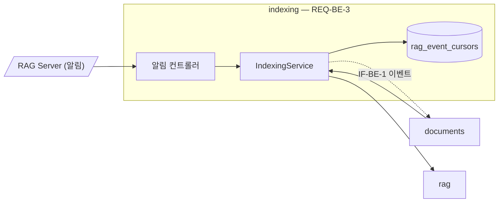

# indexing 모듈 명세 (REQ-BE-3)

RAG Server에 색인·이름·판 정보 변경·청크 삭제를 요청하고, RAG Server의 작업 상태 알림을 받으며, 주기적으로 색인 상태를 조회한다. 알게 된 작업 상태는 이벤트(`IF-BE-1`)로 documents에 넘기기만 하고 문서 상태는 쓰지 않는다. 폴더는 `apps/backend/src/indexing`다.

## 요약

**핵심 계약**

- 알림 토큰이 맞지 않는 알림은 반영하지 않는다. 토큰 검사는 순번 확인·이벤트 발행보다 먼저다 (`REQ-BE-3.2.5`)
- 문서마다 이미 반영한 순번 이하의 알림은 이벤트로 내지 않는다. 순번은 MongoDB에 남겨 Backend가 다시 시작해도 이어진다 (`REQ-BE-3.2.4`, 루트 `IF-2`)
- 이 모듈은 문서 컬렉션에 쓰지 않는다. 결과는 반환값이나 `IF-BE-1` 이벤트로만 documents에 간다 (`IF-BE-1`)

**기능 그룹**

| REQ | 기능 그룹 | 책임 |
| :--- | :--- | :--- |
| `REQ-BE-3.1` | 색인 요청 | 색인용 MD·요약·캡션·이름·판 정보로 색인을 요청하고 결과를 돌려준다 |
| `REQ-BE-3.2` | 상태 알림 받기 | 알림을 검사하고 순번을 거른 뒤 이벤트로 넘긴다 |
| `REQ-BE-3.3` | 상태 맞추기 | 처리 중인 문서의 색인 상태를 조회해 이벤트로 넘긴다 |
| `REQ-BE-3.4` | 이름·판 정보 전달 | 이름·판 정보 변경을 요청하고, 실패를 알려 다시 보낼 수 있게 한다 |

**비범위**

- 이벤트를 받아 처리 상태·검색 상태·교체를 반영하는 일 — documents (`IF-BE-1`, `REQ-BE-1.9`)
- 다시 보낼 요청(청크 삭제, 이름·판 정보 변경)의 보관과 주기 — documents (`ARCHITECT.md` 「데이터·상태 소유」)
- 상태 맞추기의 대상 문서 고르기와 주기 — documents (`ARCHITECT.md` 「의존 규칙」)

## 구조

### 예상 배치

```text
src/indexing/
├── index.ts
├── indexing.module.ts
├── controllers/
│   └── rag-events.controller.ts
├── guards/
│   └── rag-events-token.guard.ts
├── interfaces/
│   ├── indexing.events.ts
│   ├── indexing.types.ts
│   └── rag-event.dto.ts
├── services/
│   ├── indexing.service.ts
│   └── indexing-crud.service.ts
└── MODULE.md

src/indexing/**/*.spec.ts
test/
```

### 컨텍스트



점선은 NestJS 이벤트다. common·storage 의존은 생략했다.

## 의존성과 공개 표면

### 의존 관계

| 대상 | 관계 | 사용하는 계약 | 계약 소유 | 관련 REQ |
| :--- | :--- | :--- | :--- | :--- |
| rag | DI | `submitIndexJob`, `getIndexJob`, `getIndexStates`, `updateMetadata`, `deleteDocument` | rag `MODULE.md` | `REQ-BE-3` |
| documents | NestJS 이벤트 (발행) | `indexing.job-state-changed` | `IF-BE-1` | `REQ-BE-3.2.2`, `REQ-BE-3.3.1` |
| storage | DI | `MONGO_DB`(컬렉션 `rag_event_cursors`) | storage `MODULE.md` | `REQ-BE-3.2.4` |
| common | DI·import | `ConfigService`(`CHUNKING_MODE`, `RAG_EVENTS_TOKEN`), `UnauthorizedError`, `PinoLogger` (nestjs-pino) | common `MODULE.md` | `REQ-BE-3`, `REQ-BE-8.2.1` |

**금지 의존** — documents를 import하지 않는다. 문서 데이터는 documents가 인자로 넘기고, 결과는 반환값과 이벤트로 돌려준다(`ARCHITECT.md` 「의존 규칙」).

### 공개 표면

| 기능 그룹 | 공개 표면 | 상세 계약 | 관련 REQ |
| :--- | :--- | :--- | :--- |
| 색인 요청 | `IndexingService.requestIndex`, `IndexRequestInput`, `IndexRequestOutcome`, `IndexRejectionCode` | 「색인 요청 — REQ-BE-3.1」 | `REQ-BE-3.1` |
| 상태 알림 받기 | `POST /v1/internal/rag-events`, `IndexingService.handleNotification`(알림 컨트롤러 전용) | `API.md`, 루트 `IF-2` | `REQ-BE-3.2` |
| 상태 알림 받기 | `indexing.job-state-changed` 이벤트(`INDEX_JOB_STATE_CHANGED`) | `IF-BE-1` | `REQ-BE-3.2.2` |
| 상태 맞추기 | `IndexingService.reconcile`, `IndexingService.getStages` | 「상태 맞추기 — REQ-BE-3.3」 | `REQ-BE-3.3.1`, `REQ-BE-1.3.6` |
| 이름·판 정보 전달 | `IndexingService.updateMetadata`, `IndexingService.deleteChunks` | 「이름·판 정보 전달 — REQ-BE-3.4」 | `REQ-BE-3.4`, `REQ-BE-1.8.4` |

## 데이터 계약

### 모델별 필드

**알림 순번** (MongoDB `rag_event_cursors`) — 정의: indexing, 값 생산: indexing (`REQ-BE-3.2.4`)

| 필드 | 타입 | 필수 | 불변 조건 |
| :--- | :--- | :--- | :--- |
| `docId` | `string` | 필수 | 고유 |
| `lastSequence` | `number` | 필수 | 반영한 알림 순번의 최댓값. 줄어들지 않는다 |

인덱스: `rag_event_cursors_doc_id` — `{ docId: 1 }`, unique

## 기능 그룹별 요구사항

```typescript
/** 색인 요청에 담을 문서 버전이다. */
export interface IndexRequestInput {
  docId: string;
  version: string;
  indexingMarkdown: string;
  hints: ReadonlyArray<{ placeholderId: string; text: string }>;
  name: string;
  edition: { label: string; editionDate: string } | null;
  force: boolean;
}

/** RAG Server가 색인 요청을 거부한 오류 코드다. */
export type IndexRejectionCode = 'PAYLOAD_TOO_LARGE' | 'INVALID_REQUEST';

/** 색인 요청의 결과다. */
export type IndexRequestOutcome =
  | { kind: 'accepted'; jobId: string }
  | { kind: 'reused'; jobId: string }
  | { kind: 'rejected'; code: IndexRejectionCode }
  | { kind: 'unreachable' };

// RagJobState는 rag 공개 타입이다(rag `MODULE.md`). indexing이 그대로 다시 내보낸다
/** 작업 상태 알림(루트 IF-2)의 값이다. 알림 컨트롤러가 본문을 옮겨 담는다. */
export interface RagEventNotification {
  docId: string;
  jobId: string;
  version: string;
  jobState: RagJobState;
  searchableVersion: string | null;
  sequence: number;
}

/** IF-BE-1 이벤트 이름이다. */
export const INDEX_JOB_STATE_CHANGED = 'indexing.job-state-changed';

/** RAG Server 색인 연동을 맡는다. */
@Injectable()
export class IndexingService {
  requestIndex(input: IndexRequestInput): Promise<IndexRequestOutcome>;
  handleNotification(notification: RagEventNotification): Promise<void>;
  reconcile(docIds: readonly string[]): Promise<void>;
  getStages(docIds: readonly string[]): Promise<ReadonlyMap<string, 'chunking' | 'embedding' | 'storing'>>;
  updateMetadata(
    docId: string,
    name: string,
    edition: IndexRequestInput['edition'],
    signal?: AbortSignal,
  ): Promise<boolean>;
  deleteChunks(docId: string, signal?: AbortSignal): Promise<boolean>;
}
```

### 색인 요청 — `REQ-BE-3.1`

**`REQ-BE-3.1.1`** 색인 요청 내용

- 처리 계약: `requestIndex`는 `IndexRequestInput`을 `POST /v1/index-jobs` 본문(`apps/rag-server/API.md`)으로 옮겨 보낸다. 응답의 `outcome`이 `queued`·`joined`면 `accepted`, `reused`면 `reused`를 돌려준다. RAG Server가 색인 요청을 거부한 `RagRequestError`(`413 PAYLOAD_TOO_LARGE`, `400 INVALID_REQUEST`)면 그 코드로 `rejected`를 돌려준다(`REQ-BE-1.9.4`). 그 밖의 `RagRequestError`와 `RagUnavailableError`면 `unreachable`을 돌려준다. 어느 실패에도 예외를 내지 않는다
  - 연결 실패, 시간 초과, `5xx`, `401`은 모두 `unreachable`이다. documents는 `unreachable`을 "색인을 요청하지 못함"으로 다뤄(`REQ-BE-1.9.4`, `REQ-BE-1.10.3`) 문서를 대기열에 둔 채 다음 일정에 다시 요청한다. 같은 실패가 되풀이되는지는 documents의 `documents.index_scheduled` 로그의 `unreachable` 수로 본다
- 충족 기준: 요청 본문에 색인용 MD, 자리표시마다 문장, 이름, 판 정보, `force`가 들어 있고, 세 응답과 실패가 각각 해당 결과로 바뀐다. `413 PAYLOAD_TOO_LARGE`·`400 INVALID_REQUEST`는 그 코드의 `rejected`, `401`·`500`·시간 초과·연결 실패는 `unreachable`이다

**`REQ-BE-3.1.2`** 접수한 작업 ID

- 처리 계약: `accepted`·`reused`는 RAG Server가 준 `job_id`를 담는다. 그 값을 문서 버전에 쓰는 일은 documents가 한다
- 충족 기준: 결과의 `jobId`가 응답의 `job_id`와 같다

**`REQ-BE-3.1.3`** 설정한 청킹 방식

- 충족 기준: 요청의 `chunking`이 `CHUNKING_MODE` 값이다(기본 `semantic`)

### 상태 알림 받기 — `REQ-BE-3.2`

요청 형식은 루트 `IF-2`, 응답은 `API.md`의 `POST /v1/internal/rag-events`가 소유한다.

**`REQ-BE-3.2.1`** 2xx 응답

- 처리 계약: 토큰이 맞으면 순번으로 걸러진 알림이라도 `204`로 응답한다. 이벤트 처리가 실패해도 응답은 `204`이며, 그 문서는 상태 맞추기가 다시 맞춘다
- 충족 기준: 토큰이 맞는 알림은 새 것이든 오래된 것이든 `204`를 받는다

**`REQ-BE-3.2.2`** 이벤트로 넘기기

- 처리 계약: 새 알림의 `job_state`, `version`, `index_state.searchable_version`으로 `IndexJobStateChangedEvent`(`source: 'notification'`)를 만들어 발행한다. `succeeded`면 `getIndexJob`으로 결과를 채운다. 결과·실패 사유 조회는 순번을 올리기 전에 한다. `succeeded`인데 결과를 받지 못하면 순번을 올리지 않고 이벤트를 내지 않는다(상태 맞추기가 맞춘다). 이벤트는 받는 쪽 처리가 끝날 때까지 기다려 내고(`emitAsync`), 받는 쪽이 실패하면 `indexing.event_dispatch_failed`를 남긴다.
- 충족 기준: `succeeded` 알림 하나에 이벤트 하나가 결과(청크 수, 대체 분할)와 함께 발행된다

**`REQ-BE-3.2.3`** 실패면 실패 사유를 받아 함께 넘김

- 처리 계약: `failed`면 `getIndexJob`으로 실패 사유(코드, 설명, 위치)를 받아 이벤트의 `failure`에 넣는다. 받지 못하면 코드 `RAG_UNREACHABLE`과 일반 설명을 넣는다. `getIndexJob`의 `failure`가 비어 있어도 같다. 일반 설명은 `RAG Server에서 실패 사유를 받지 못했습니다`이고 위치는 `null`이다.
- 충족 기준: `failed` 알림의 이벤트에 RAG Server가 준 코드·설명·위치가 있고, 조회가 실패하면 `RAG_UNREACHABLE`이다

**`REQ-BE-3.2.4`** 오래된 순번 무시

- 처리 계약: 문서의 `lastSequence`보다 큰 순번만 반영하고, 반영할 때 `lastSequence`를 조건부 갱신으로 올린다. 같은 알림이 동시에 두 번 와도 한 번만 반영한다. 갱신은 `lastSequence < sequence` 조건의 `updateOne`, 맞는 문서가 없으면 `insertOne`, `docId` 고유 인덱스 충돌이면 조건부 `updateOne`을 한 번 더 한다. 고유 인덱스 `rag_event_cursors_doc_id`(`{ docId: 1 }`)는 기동 때 만든다. 같은 문서의 알림은 한 프로세스 안에서 순번 확인부터 이벤트 발행까지 차례로 처리하고, 다른 문서는 기다리지 않는다.
- 충족 기준: 순번 3을 반영한 뒤 2·3이 오면 이벤트가 없고, 4가 오면 있으며, 같은 순번 둘이 동시에 와도 이벤트가 하나다

**`REQ-BE-3.2.5`** 알림 토큰 검사

- 처리 계약: `X-Minerva-Token`을 `RAG_EVENTS_TOKEN`과 시간이 일정한 비교로 견준다. 없거나 다르면 `UnauthorizedError`(`401`)를 내고 순번·이벤트에 손대지 않는다. 검사는 라우트 가드에서 하므로 본문 검증보다 먼저다(토큰이 없으면 본문이 잘못돼도 `401`). 비교는 두 값의 SHA-256 다이제스트를 `timingSafeEqual`로 견준다.
- 충족 기준: 토큰이 없거나 틀린 알림이 `401`을 받고 이벤트와 순번 변경이 없다

### 상태 맞추기 — `REQ-BE-3.3`

**`REQ-BE-3.3.1`** 기동 때와 주기마다 색인 상태 맞추기

- 처리 계약: `reconcile`은 받은 문서들의 색인 상태를 `getIndexStates`로 조회해 문서마다 최신 작업의 이벤트(`source: 'reconcile'`)를 발행한다. 색인 상태에는 작업 버전이 없으므로 최신 작업이 있는 문서마다 `getIndexJob`으로 버전을 받고, 최신 작업이 `failed`면 실패 사유를, `succeeded`면 결과를 함께 채운다. 이벤트의 `jobState`·`searchableVersion`은 색인 상태 조회 값이다. 최신 작업이 없거나, `getIndexJob`이 실패했거나, 결과·실패 사유가 비어 있는 문서는 이벤트 없이 넘어간다(다음 주기에 다시 맞춘다). 받은 문서 ID의 중복은 빼고, 빈 목록이면 RAG Server를 부르지 않는다. 대상 문서와 주기는 documents가 정한다(`RECONCILE_INTERVAL_MS`). RAG Server에 닿지 않으면 이벤트 없이 끝난다
- 충족 기준: 처리 중인 문서 둘의 상태가 `succeeded`·`failed`면 결과·실패 사유가 담긴 이벤트가 둘 발행되고, RAG Server가 닿지 않으면 예외 없이 이벤트가 없다

`getStages`는 같은 조회로 `running` 작업의 단계를 문서별로 돌려주며, 실패하면 빈 값을 돌려준다(`REQ-BE-1.3.6`).

### 이름·판 정보 전달 — `REQ-BE-3.4`

**`REQ-BE-3.4.1`** 이름·판 정보 변경 요청

- 충족 기준: `updateMetadata`가 `PUT /v1/documents/{doc_id}/metadata`에 이름과 판 정보(없으면 `null`)를 보내고 성공하면 참을 돌려준다

**`REQ-BE-3.4.2`** 실패하면 다시 요청할 수 있게

- 처리 계약: `updateMetadata`·`deleteChunks`는 RAG Server에 닿지 않거나 오류 응답이면 예외 없이 거짓을 돌려준다. `signal`은 rag에 그대로 넘기며, 중단돼 끊긴 요청도 거짓이다(rag `MODULE.md` `REQ-BE-10.1.3`). 거짓이면 documents가 다시 보낼 요청으로 남기고 `RAG_RETRY_INTERVAL_MS`마다 다시 부른다(documents `MODULE.md` 「주기 작업」)
- 충족 기준: RAG Server가 닿지 않으면 두 함수가 예외 없이 거짓이고, 받은 `signal`이 rag 호출에 그대로 넘어간다

## 실행 계약

### 설정

정의는 common 「설정」이 소유한다. 이 모듈이 읽는 키: `CHUNKING_MODE`, `RAG_EVENTS_TOKEN`.

### 예외

| 예외 | 발생 조건 | 코드 | 처리 책임 | 관련 REQ |
| :--- | :--- | :--- | :--- | :--- |
| `UnauthorizedError` | 알림 토큰이 없거나 다르다 | `UNAUTHORIZED` | 발생: indexing. 변환: api | `REQ-BE-3.2.5` |

RAG Server 호출 실패는 예외로 내보내지 않고 결과 값으로 바꾼다.

### 로그

| 이벤트 | 발생 시점 | 레벨 | 허용 필드 | 관련 REQ |
| :--- | :--- | :--- | :--- | :--- |
| `indexing.event_received` | 알림 받음 | info | `docId`, `jobId`, `jobState`, `sequence`, `applied` | `REQ-BE-3.2` |
| `indexing.event_unauthorized` | 토큰 불일치 | warning | `tokenPresent` | `REQ-BE-3.2.5` |
| `indexing.request_failed` | 색인·변경·삭제 요청, 작업·색인 상태 조회 실패 | warning | `operation`(`requestIndex`·`updateMetadata`·`deleteChunks`·`getIndexJob`·`getIndexStates`), `docId`(여러 문서 조회면 `null`), `code` | `REQ-BE-3.1.1`, `REQ-BE-3.4.2` |
| `indexing.event_dispatch_failed` | 이벤트 받는 쪽 처리 실패 | warning | `docId`, `jobId`, `source`, `errorName` | `REQ-BE-3.2.1` |
| `indexing.reconciled` | `reconcile` 끝 | info | `docs`(중복을 뺀 받은 문서 수), `events`(발행을 시도한 이벤트 수) | `REQ-BE-3.3.1` |

## 테스트와 추적성

| REQ ID | 종류 | 검증 초점 | 대체 경계 | 예상 위치 |
| :--- | :--- | :--- | :--- | :--- |
| `REQ-BE-3.1.1` | unit | 요청 본문, 응답별 결과, 거부(`413`·`400`)는 `rejected`, 그 밖의 실패는 `unreachable` | rag (가짜) | `src/indexing/**/*.spec.ts` |
| `REQ-BE-3.1.2` | unit | 결과의 작업 ID | rag (가짜) | `src/indexing/**/*.spec.ts` |
| `REQ-BE-3.1.3` | unit | 설정한 청킹 방식 | rag (가짜), `ConfigService` | `src/indexing/**/*.spec.ts` |
| `REQ-BE-3.2.1` | e2e | 토큰이 맞으면 오래된 알림도 `204` | RAG Server (가짜 알림) | `test/` |
| `REQ-BE-3.2.2` | unit | 이벤트 발행과 결과 채우기 | rag (가짜), 이벤트 수신자 | `src/indexing/**/*.spec.ts` |
| `REQ-BE-3.2.3` | unit | 실패 사유 채우기, 조회 실패 시 `RAG_UNREACHABLE` | rag (가짜) | `src/indexing/**/*.spec.ts` |
| `REQ-BE-3.2.4` | unit | 순번 거르기, 동시 중복 한 번 | `MONGO_DB` (가짜) | `src/indexing/**/*.spec.ts` |
| `REQ-BE-3.2.5` | e2e | 토큰 없음·틀림 `401`, 이벤트·순번 변경 없음 | RAG Server (가짜 알림) | `test/` |
| `REQ-BE-3.3.1` | unit | 상태별 이벤트, 닿지 않으면 이벤트 없음 | rag (가짜) | `src/indexing/**/*.spec.ts` |
| `REQ-BE-3.4.1` | unit | 변경 요청 본문과 참 | rag (가짜) | `src/indexing/**/*.spec.ts` |
| `REQ-BE-3.4.2` | unit | 실패 시 예외 없이 거짓, `signal` 전달 | rag (가짜, 실패) | `src/indexing/**/*.spec.ts` |
| `REQ-BE-1.3.6` | unit | `getStages`가 색인 중 문서의 단계를 한 번에 주고, 받지 못하면 빈 결과 | rag (가짜) | `src/indexing/**/*.spec.ts` |
| `REQ-BE-1.8.4` | unit | `deleteChunks`의 요청과 참, 실패 시 예외 없이 거짓 | rag (가짜, 실패) | `src/indexing/**/*.spec.ts` |
