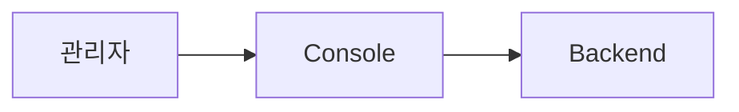
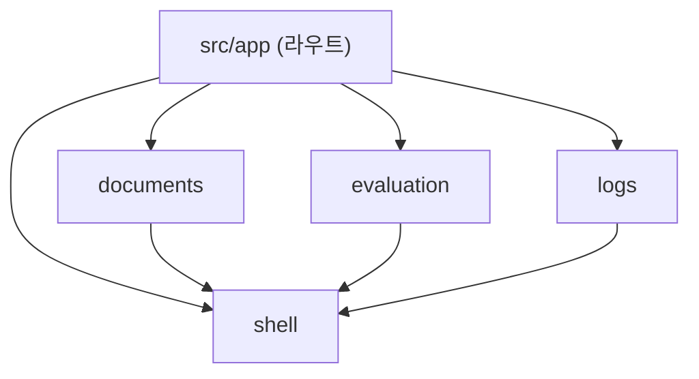
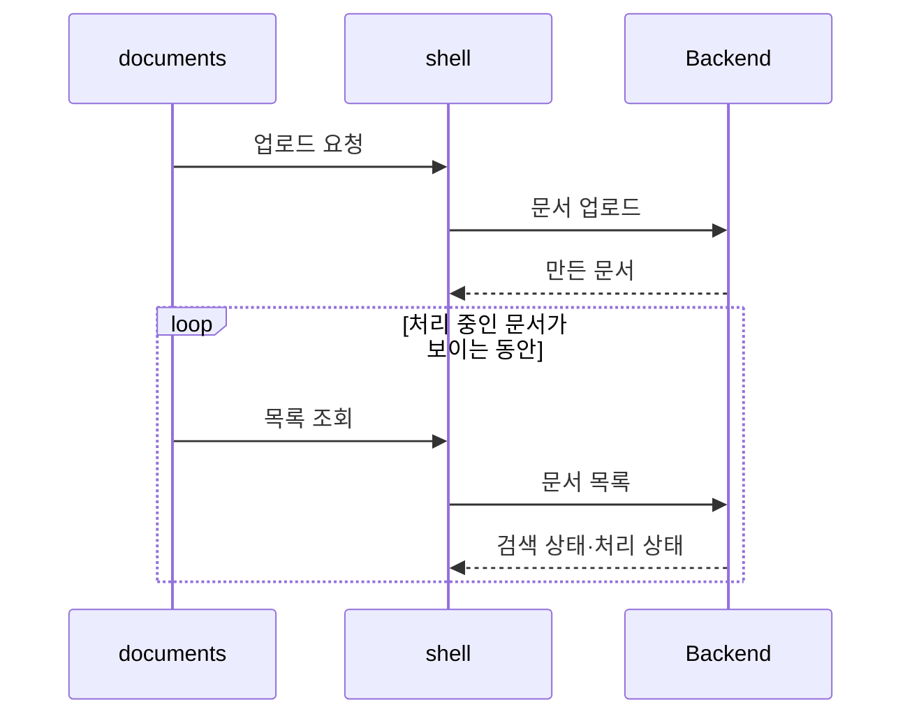

# minerva Console 아키텍처

Console은 관리자가 쓰는 Next.js 웹 앱이다. 요구는 이 폴더의 `REQUIREMENTS.md`가 정의하며, 요구사항의 depth-1 노드 하나가 피처 단위 하나다. Console은 데이터를 저장하지 않고 모든 데이터를 Backend API로 읽고 쓴다. 피처는 서로를 import하지 않고, 공통으로 쓰는 것(Backend 호출, 레이아웃, Markdown 표시, 시각 표시)은 shell 피처 한 곳에 둔다. 이 문서의 경로는 `apps/console/` 기준이다.

## 기술 스택

| 영역 | 선택 | 버전·제약 |
| :--- | :--- | :--- |
| 언어 | TypeScript | |
| 프레임워크 | Next.js | App Router |
| UI 컴포넌트 | MUI | 색·글꼴은 MUI theme |
| 표 | MUI X DataGrid | Community 판(MIT)만. Pro·Premium 패키지는 쓰지 않는다 |
| 배치·간격 | Tailwind CSS | |
| 서버 데이터 | TanStack Query | |
| Markdown 표시 | `react-markdown` 10, `remark-gfm` 4 | |
| 다이어그램 | `mermaid` 11.x | 12는 `elkjs`(EPL-2.0)를 끌어와 쓰지 않는다 |
| 테스트 | Vitest, Testing Library | |
| 패키지 관리 | pnpm workspaces | 루트 lock 파일 하나 |

## 시스템 컨텍스트



- Console이 호출하는 것은 Backend뿐이다. Backend API는 `apps/backend/API.md`가 소유한다

## 단위 구성

| 단위 | 종류 | 폴더 | 담당 REQ | 책임 |
| :--- | :--- | :--- | :--- | :--- |
| documents | 피처 | `src/features/documents` | `REQ-FE-1` | 문서 목록, 업로드, 원본 창, 문서 편집 |
| evaluation | 피처 | `src/features/evaluation` | `REQ-FE-2` | 골든셋 목록, 평가 요약, 골든셋 추가·다시 평가·삭제 |
| logs | 피처 | `src/features/logs` | `REQ-FE-3` | 로그 목록과 필터 |
| shell | 피처 | `src/features/shell` | `REQ-FE-4` | 레이아웃과 메뉴 바, 로딩·오류·알림, 시각 표시, Markdown 표시, Backend 호출 클라이언트 |

`REQ-FE-1.1.6`은 예정 마일스톤(M-2)이라 단위에 넣지 않는다.

## 의존 규칙



**금지 의존**

- 피처끼리 import하지 않는다. 다른 피처의 페이지로 가야 하면 주소(URL)로 이동한다 (예: 로그 목록에서 문서 편집으로, 문서 편집에서 로그 목록으로)
- Backend 호출은 shell의 API 클라이언트를 거친다. 피처 안에서 `fetch`를 직접 부르지 않는다
- Backend 밖의 서비스(RAG Server, MongoDB, Qdrant)를 호출하지 않는다

**호출 방식**

- 브라우저 → Console 서버 → Backend: Console 서버가 `/api/*` 요청을 Backend로 넘긴다(Next.js rewrites). 브라우저는 Console과 같은 주소로만 요청하므로 CORS 설정과 Backend 주소 노출이 필요 없다
- 피처 → shell: import

## 폴더 구조와 배치 규칙

```text
apps/console/
├── src/
│   ├── app/
│   │   ├── documents/              문서 목록 (REQ-FE-1.1)
│   │   │   └── [docId]/            문서 편집 (REQ-FE-1.2)
│   │   ├── evaluation/             골든셋 목록 (REQ-FE-2.1)
│   │   └── logs/                   로그 목록 (REQ-FE-3.1)
│   └── features/
│       ├── documents/
│       ├── evaluation/
│       ├── logs/
│       └── shell/
├── package.json
├── REQUIREMENTS.md
├── ARCHITECT.md
└── AGENTS.md
```

- 라우트(`src/app`)는 피처의 페이지 컴포넌트를 불러와 배치만 한다. 화면 로직은 피처 폴더에 둔다
- 피처의 명세는 그 피처 폴더의 `FEATURE.md`다
- 테스트는 대상 파일 옆의 `__tests__/`에 둔다
- 루트(`/`)로 들어오면 문서 목록으로 보낸다
- 제3자 라이선스 고지는 `NOTICE`에 둔다

## 데이터·상태 소유

Console은 영속 데이터를 갖지 않는다. 모든 문서·골든셋·로그는 Backend가 소유한다.

| 상태 | 소유 단위 | 위치 | 쓰는 곳 |
| :--- | :--- | :--- | :--- |
| 목록의 필터·정렬·페이지 | 각 피처 | 주소(URL) 쿼리 | 그 피처 |
| Backend 응답 캐시 | 각 피처 (조회 키) | TanStack Query 캐시 | 그 피처. 쓰기가 끝나면 관련 조회 키를 무효화한다 |
| 편집 중인 입력 | documents | 컴포넌트 상태 | documents |

## 횡단 관심사

| 관심사 | 소유 단위 | 규칙 위치 |
| :--- | :--- | :--- |
| Backend 호출 | shell (API 클라이언트) | `AGENTS.md`(이 폴더) |
| 로딩·오류·알림 표시 | shell | `REQ-FE-4.1.2` |
| 시각 표시 (KST) | shell | `REQ-FE-4.1.2.5` |
| Markdown·mermaid 표시 | shell | `REQ-FE-4.1.3` |
| 자동 재조회 주기 | shell (설정) | `REQ-FE-1.1.3`, `REQ-FE-2.1.2.14` |
| 화면 문구 한국어 | 모든 피처 | `REQ-FE-4.1.2.4` |

## 주요 흐름

### 업로드와 처리 상태 확인



1. **업로드** — documents가 shell의 API 클라이언트로 파일과 이름·판 정보를 보낸다. (`REQ-FE-1.1.4`)
2. **재조회** — 처리 중인 문서가 보이는 동안 documents가 설정한 주기로 목록을 다시 불러온다. (`REQ-FE-1.1.3`)

## 실행 구조

- **Console 서버** — Next.js 서버 하나. 화면을 내보내고 `/api/*`를 Backend로 넘긴다
- **Backend 주소** — Console 서버 설정(환경 변수)으로 받는다. 브라우저에는 내보내지 않는다

## 설계 결정

- **표는 MUI X DataGrid Community, 필터는 표 밖** — 이유: 무료판은 필터를 한 번에 하나만 걸 수 있어 여러 필터를 동시에 쓰려면 표 밖에 둬야 한다. 버린 대안: DataGrid Pro. (`REQ-FE-1.1.2`)
- **정렬·페이지·필터는 Backend에서 처리** — 이유: 문서·로그가 늘어나도 한 번에 한 페이지만 받는다. 버린 대안: 전체를 받아 브라우저에서 처리. (`REQ-FE-1.1.1`, `REQ-FE-3.1.1`)
- **Markdown·mermaid는 브라우저에서 그리고, mermaid는 필요할 때만 불러온다** — 이유: Backend에 헤드리스 브라우저를 두지 않는다. 버린 대안: Backend의 SVG 사전 렌더링, `rehype-mermaid`. (`REQ-FE-4.1.3`)
- **mermaid 11.x** — 이유: 12의 하위 의존성 `elkjs`가 EPL-2.0이다. 버린 대안: mermaid 12
- **Backend 호출은 Console 서버를 거친다 (rewrites)** — 이유: 같은 주소로만 요청해 CORS와 Backend 주소 노출을 피한다. 버린 대안: 브라우저가 Backend를 직접 호출
- **공통 화면은 shell 피처 하나** — 이유: 요구사항의 `REQ-FE-4`와 맞추고, 피처끼리 import하지 않게 한다. (`REQ-FE-4`)
