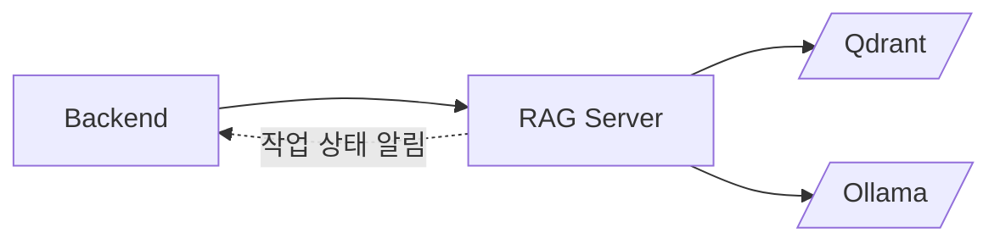
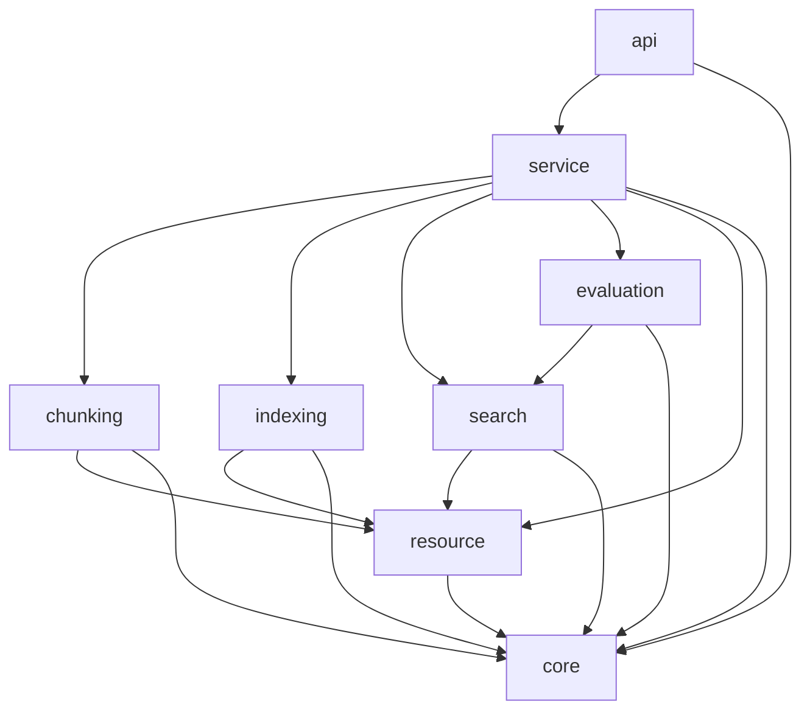
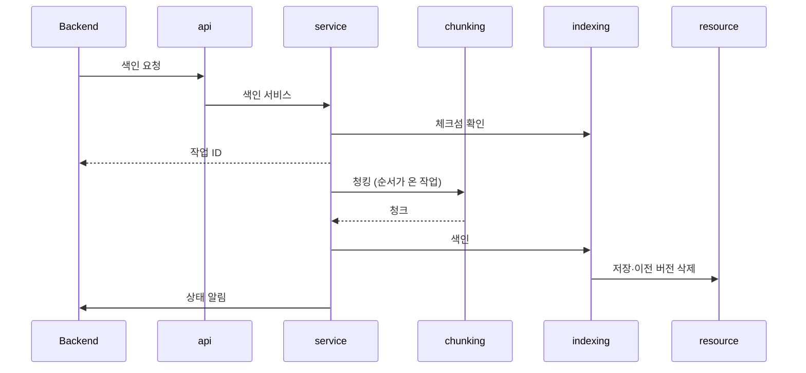
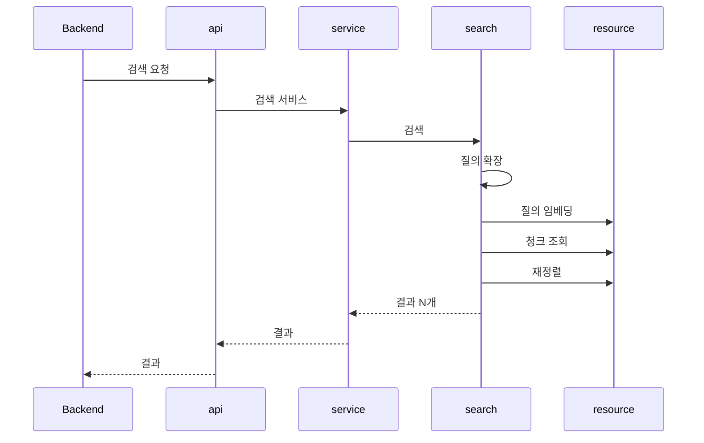

# minerva RAG Server 아키텍처

RAG Server는 Backend의 요청을 받아 요약·캡션 생성, 청킹, 색인, 검색을 하는 minerva의 내부 연산 서비스다. 요구는 이 폴더의 `REQUIREMENTS.md`가 정의하며, 단위는 요구사항의 depth-1 모듈을 맡는다. 한 단위만 쓰는 depth-1은 따로 단위를 두지 않고 그 단위가 함께 맡는다(「설계 결정」). 계층은 api → service → 기능 단위 → resource 순으로 내려가고, 단위를 엮는 일과 앱 기동·종료는 service 한 곳에서만 한다. 문서에 속한 데이터는 Backend가 소유하며, RAG Server는 Backend가 요청에 담아 보낸 데이터만 처리하고 검색 인덱스만 소유한다. 이 문서의 경로는 `apps/rag-server/` 기준이다.

## 기술 스택

| 영역 | 선택 | 버전·제약 |
| :--- | :--- | :--- |
| 언어 | Python | 3.12 |
| 웹 프레임워크 | FastAPI | |
| 패키지 관리 | uv | `pyproject.toml` + `uv.lock` |
| 로깅·테스트 | structlog, pytest | |
| 검색 인덱스 | Qdrant | dense 벡터와 BM25 sparse 벡터 |
| 작업 목록 저장소 | SQLite | 로컬 파일 |
| LLM·VLM 서빙 | Ollama | |
| 임베딩·재정렬 실행 | sentence-transformers | RAG Server 프로세스 안에서 실행 |
| 모델 구성 | `REQUIREMENTS.md` 「제약과 가정」 | |

## 시스템 컨텍스트



- RAG Server를 호출하는 것은 Backend뿐이다
- RAG Server가 Backend로 보내는 것은 작업 상태 알림(`REQ-RAG-7.7`)뿐이다

## 단위 구성

| 단위 | 종류 | 폴더 | 담당 REQ | 책임 |
| :--- | :--- | :--- | :--- | :--- |
| api | 모듈 | `src/minerva_rag/api` | `REQ-RAG-9` | HTTP 라우팅, 요청·응답 형식, HTTP 오류 변환 |
| service | 모듈 | `src/minerva_rag/service` | `REQ-RAG-10`, `REQ-RAG-7`, `REQ-RAG-1` | 서비스마다 처리 순서를 정하고 단위를 엮는다. 앱 기동·종료를 맡는다. 색인 작업의 접수·순서·상태를 관리하고 Backend에 상태를 알린다. 표 요약과 이미지 캡션을 만든다 |
| chunking | 모듈 | `src/minerva_rag/chunking` | `REQ-RAG-2` | 색인용 MD를 청크로 나눈다 |
| indexing | 모듈 | `src/minerva_rag/indexing` | `REQ-RAG-3` | 색인 텍스트를 만들고 버전 교체·판·삭제·중복 방지를 정한다 |
| search | 모듈 | `src/minerva_rag/search` | `REQ-RAG-4`, `REQ-RAG-5` | 질의 확장부터 하이브리드 검색, 재정렬, 결과 구성, 연관 청크 확장, 판 처리까지 검색 한 번을 처리하고, 문서 청크 목록을 돌려준다. 질의 확장에 쓰는 용어집을 읽고 검증한다 |
| evaluation | 모듈 | `src/minerva_rag/evaluation` | `REQ-RAG-6` | 골든셋 한 건으로 검색해 지표를 계산한다. 저장하지 않는다 |
| core | 모듈 | `src/minerva_rag/core` | `REQ-RAG-11` | 설정, 로깅, 오류 정의, 단위 사이 공유 타입(`INTERFACES.md`의 `IF-RAG-1` 청크 타입, 실패 위치, 키워드 벡터 타입), 자리표시(루트 `IF-1`) 읽기 |
| resource | 모듈 | `src/minerva_rag/resource` | `REQ-RAG-12`, `REQ-RAG-13` | LLM·VLM·임베딩·재정렬 모델을 준비하고 호출한다. 색인과 질의가 같이 써야 하는 BM25 키워드 벡터도 만든다. Qdrant에 연결해 컬렉션을 구성하고 청크를 저장·삭제·조회한다 |

`REQ-RAG-8`은 예정 마일스톤(M-2)이라 단위를 두지 않는다.

## 의존 규칙



**금지 의존**

- Qdrant와 LLM·VLM·임베딩·재정렬 모델에는 resource만 접근한다. resource로 청크를 저장·삭제하는 것은 indexing만 하고, search는 조회만 한다
- 단위 조립(의존 주입)과 앱 기동·종료 처리는 service에서만 한다. api는 service가 만든 기동·종료 처리를 FastAPI 수명주기에 연결만 한다. service가 resource에 직접 기대는 것은 조립, 기동·종료(연결, 모델 준비), 상태 확인, 표 요약·이미지 캡션 생성(`REQ-RAG-1`)뿐이다
- 검색 한 번의 처리 순서(`REQ-RAG-10.4.1`)는 search 안에서 지킨다. 검색 서비스와 evaluation은 search를 한 번 부른다
- Backend로 보내는 HTTP 호출은 service의 작업 상태 알림만 한다

**호출 방식**

- Backend ↔ RAG Server: HTTP. 작업 상태 알림은 설정된 Backend 주소로 보낸다
- 단위 사이: import
- evaluation: service의 평가 서비스가 부르고, evaluation은 search를 import해 검색 서비스와 같은 처리로 결과를 만든다

## 폴더 구조와 배치 규칙

```text
apps/rag-server/
├── src/minerva_rag/
│   ├── api/  service/
│   ├── chunking/  indexing/  search/  evaluation/
│   └── core/  resource/
├── tests/
│   ├── unit/
│   └── integration/
├── config/
├── pyproject.toml
├── uv.lock
├── REQUIREMENTS.md
├── ARCHITECT.md
└── AGENTS.md
```

- 단위의 명세는 그 단위 폴더의 `MODULE.md`다
- 단위 폴더 안에 하위 패키지를 두지 않는다. 단위가 depth-1을 여럿 맡으면 depth-1마다 파일을 나누고, 한 파일이 두 depth-1을 담지 않는다
- service 단위는 depth-2 서비스(`REQ-RAG-10.1`~`REQ-RAG-10.7`) 하나를 파일 하나로 둔다: 수명주기, 요약·캡션, 색인, 검색, 문서 삭제, 이름·판 정보, 평가 서비스. 색인 작업 관리(`REQ-RAG-7`)와 요약·캡션 생성(`REQ-RAG-1`)은 서비스 파일들이 쓰는 헬퍼 파일로 둔다
- RAG Server 안 단위 사이 계약은 이 폴더의 `INTERFACES.md`(`IF-RAG-<n>`)에, 앱 사이 계약(자리표시 형식, 작업 상태 알림)은 저장소 루트의 `INTERFACES.md`(`IF-<n>`)에 둔다
- Backend가 호출하는 API의 명세는 이 폴더의 `API.md`에 둔다
- 테스트는 `tests/`에 둔다. `unit/`은 외부 자원 없이 실행되고, `integration/`은 Qdrant·Ollama가 필요하다
- 용어집은 `config/glossary.yaml`에 둔다

## 데이터·상태 소유

| 데이터·상태 | 소유 단위 | 저장 위치 | 읽는 단위 | 쓰는 단위 |
| :--- | :--- | :--- | :--- | :--- |
| 청크·벡터 (판 정보 사본 포함) | indexing | Qdrant (resource 경유) | indexing, search | indexing |
| 작업 목록·작업 상태·문서 색인 상태 | service | SQLite 파일 (「실행 구조」의 로컬 파일) | service | service |
| 용어집 | search | `config/glossary.yaml` | search | 관리자 (파일 편집) |

- 원본 MD, 색인용 MD, 표·이미지, 요약·캡션, 문서 이름·판 정보, 골든셋, 평가 기록은 Backend가 소유한다. RAG Server는 요청에 담겨 온 것만 처리하고 요약·캡션을 저장하지 않는다 (`REQ-RAG-1.1.2`, `REQ-RAG-1.2.2`)

## 횡단 관심사

| 관심사 | 소유 단위 | 규칙 위치 |
| :--- | :--- | :--- |
| 설정 | core | `REQ-RAG-11.1`, `AGENTS.md` |
| 로깅 | core | `REQ-RAG-11.2`, 저장소 루트 `AGENTS.md` 「보안과 로그」, 이 폴더의 `AGENTS.md` |
| 오류 정의 | core | `REQ-RAG-11.3`, `AGENTS.md` |
| HTTP 오류 응답 변환 | api | `REQ-RAG-11.3` |
| 모델 호출 | resource | `REQ-RAG-12`, `REQUIREMENTS.md` 「제약과 가정」 |
| 저장소 접근 | resource | `REQ-RAG-13` |
| 단위 조립, 앱 기동·종료 | service | `REQ-RAG-10.1`, 이 문서 「의존 규칙」 |

## 주요 흐름

### 색인



1. **중복 확인과 접수** — 색인 서비스가 indexing으로 체크섬을 확인하고, 다시 색인해야 할 때만 작업을 접수한다. (`REQ-RAG-10.3.1`, `REQ-RAG-3.5`, `REQ-RAG-7.1`)
2. **청킹** — 순서가 온 작업에서 색인 서비스가 chunking으로 청크를 만든다. (`REQ-RAG-10.3.2`, `REQ-RAG-7.3`, `REQ-RAG-2`)
3. **색인** — 색인 서비스가 청크를 indexing에 넘기고, indexing이 resource로 저장하고 이전 버전을 지운다. (`REQ-RAG-3`)
4. **알림** — service가 작업 상태가 바뀔 때마다 Backend에 알린다. (`REQ-RAG-7.7`)

### 검색



1. **질의 확장** — search가 용어집으로 동의어를 넣는다. (`REQ-RAG-5.2`)
2. **검색** — search가 resource로 dense·키워드 검색을 하고 순위를 합친다. (`REQ-RAG-4.1`)
3. **재정렬과 반환** — search가 resource로 재정렬하고 연관 청크·판 정보를 붙여 돌려준다. (`REQ-RAG-4.2`~`REQ-RAG-4.5`, `REQ-RAG-10.4`)

## 실행 구조

- **RAG Server 프로세스** — FastAPI 앱 하나가 HTTP API와 색인 작업 처리기를 함께 실행한다. 동시에 처리하는 작업 수는 설정값이다 (`REQ-RAG-7.3.1`)
- **기동 순서** — 용어집 읽기, 모델 준비, Qdrant 연결(모델의 임베딩 차원으로), 작업 처리기 시작을 차례로 마친 뒤 요청을 받는다 (`REQ-RAG-10.1.1`, `REQ-RAG-5.1`)
- **Qdrant, Ollama** — RAG Server보다 먼저 떠 있어야 한다. 로컬 개발에서는 저장소 루트의 `docker-compose.yml`로 띄우고, 데이터는 named volume `qdrant-data`(Qdrant)와 `ollama-models`(Ollama 모델)에 둔다
- **로컬 파일** — RAG Server 프로세스가 직접 쓰는 작업 목록 SQLite(`data/rag-server/jobs.sqlite3`)와 임베딩·리랭커 모델 파일(`data/rag-server/models`)은 저장소 루트의 `data/` 아래에 둔다. 위치는 설정으로 바꿀 수 있고, 모델 파일을 이 위치에 미리 받아 두면 기동할 때 내려받지 않는다
- **Backend 알림 주소** — 설정으로 받는다

## 설계 결정

- **ARCHITECT.md는 앱 폴더마다 둔다** — 이유: 앱마다 요구사항 문서를 따로 두고, 앱마다 언어와 구조가 다르다. 버린 대안: 루트에 하나
- **api 아래에 service 계층을 둔다** — 이유: 처리 순서와 단위 조립을 한 곳에 모아, 순서를 바꿀 때 service만 고치게 한다. 버린 대안: api가 단위를 직접 엮는 구조. (`REQ-RAG-10`)
- **한 단위만 쓰는 depth-1은 그 단위 안의 파일로 둔다** — 이유: depth-1마다 단위를 두면 소비자가 하나뿐인 단위와 그 사이 계약이 생겨 구조만 복잡해진다. 색인 작업 관리(`REQ-RAG-7`)와 요약·캡션 생성(`REQ-RAG-1`)은 service만, 용어집(`REQ-RAG-5`)은 search만 쓴다. 버린 대안: depth-1 하나당 단위 하나, 단위 안의 하위 패키지. (`REQ-RAG-1`, `REQ-RAG-5`, `REQ-RAG-7`)
- **평가는 단위로 둔다** — 이유: 검색 결과를 정답 구간과 대조하는 규칙이 Backend의 정답 구간 확인(`REQ-BE-5.1.5`)과 맞물려 한곳에 모아야 하고, 골든셋 평가를 넓힐 때 들어갈 자리다. 버린 대안: service 안의 파일. (`REQ-RAG-6`)
- **Qdrant와 모델 접근은 resource 단위로 분리한다** — 이유: search가 indexing에 기대지 않게 하고, 기능 단위를 Qdrant·모델 없이 단위 테스트할 수 있게 한다. 둘 다 외부 자원 어댑터이고 쓰는 단위가 같아 한 단위로 둔다. 버린 대안: indexing 안에서 Qdrant에 접근, 모델과 Qdrant를 단위 둘로 나누기. (`REQ-RAG-12`, `REQ-RAG-13`)
- **LangChain을 쓰지 않는다** — 이유: 분할·자리표시 검증·재분할을 직접 제어해야 한다. 버린 대안: LangChain 1.x. (`REQ-RAG-2`)
- **작업 목록은 SQLite 파일** — 이유: 프로세스 하나에 동시 처리 수가 작아 인프라를 늘릴 필요가 없다. 버린 대안: Qdrant 컬렉션, Redis. (`REQ-RAG-7.5.1`)
- **작업 처리기는 RAG Server 프로세스 안** — 이유: 처리기를 따로 띄우면 기동·배포 단위가 늘어난다. 버린 대안: 별도 워커 프로세스. (`REQ-RAG-7.3`)
- **패키지 관리는 uv** — 이유: `pyproject.toml`과 lock 파일을 한 도구로 관리한다. 버린 대안: venv + pip + lock 파일
