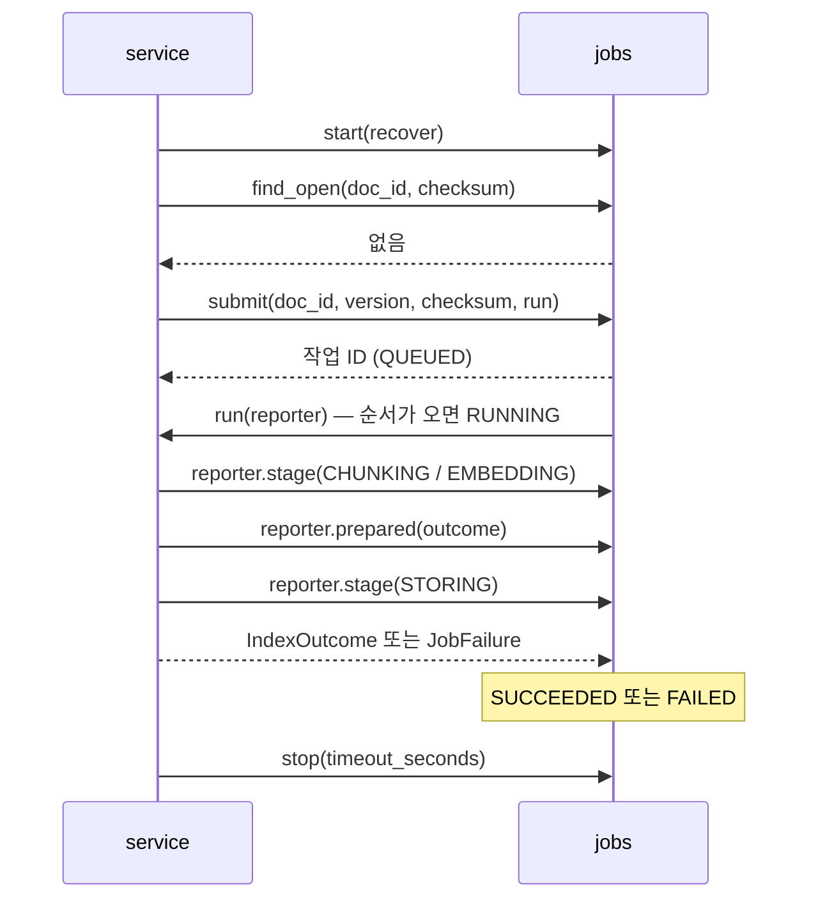

# minerva RAG Server 인터페이스 명세

이 문서는 RAG Server 안에서 둘 이상의 단위가 공유하는 계약을 소유한다. 참여 단위의 `MODULE.md`는 계약을 다시 정의하지 않고 IF ID로 가리키기만 한다. 앱 사이 계약(자리표시 형식, 작업 상태 알림)은 저장소 루트의 `INTERFACES.md`가 소유한다.

## 계약 목록

| ID | 계약 | 참여 단위 | 관련 REQ |
| :--- | :--- | :--- | :--- |
| `IF-RAG-1` | 청크 레코드 | chunking, indexing, store, search | `REQ-RAG-2`, `REQ-RAG-3`, `REQ-RAG-4`, `REQ-RAG-13` |
| `IF-RAG-2` | 색인 작업 실행 | service, jobs | `REQ-RAG-7`, `REQ-RAG-10.1`, `REQ-RAG-10.3`, `REQ-RAG-10.5` |

## IF-RAG-1 청크 레코드

chunking이 만든 청크를 indexing이 색인 정보와 함께 store로 Qdrant에 저장하고, search가 그것을 읽어 결과를 만든다. 네 단위가 같은 필드를 같은 뜻으로 읽어야 자리표시 보존, 버전 교체, 연관 청크 확장, 판 처리가 맞게 동작하므로 한 단위의 명세로는 정할 수 없다.

### 참여 단위

| 단위 | 역할 | 관련 REQ |
| :--- | :--- | :--- |
| chunking | 생산 (`Chunk`) | `REQ-RAG-2` |
| core | 정의 (타입) | `REQ-RAG-11` |
| indexing | 생산 (`ChunkRecord`) | `REQ-RAG-3` |
| store | 저장 | `REQ-RAG-13` |
| search | 소비 | `REQ-RAG-4` |

### 계약 표면

아래 타입은 core 단위에 둔다. chunking, indexing, store, search는 core에서 import한다(`ARCHITECT.md` 「단위 구성」).

```python
from dataclasses import dataclass
from datetime import date
from enum import StrEnum


class ChunkKind(StrEnum):
    TEXT = "text"    # 본문 청크
    ASSET = "asset"  # 표·이미지 청크


@dataclass(frozen=True)
class Chunk:
    """chunking이 만들어 indexing에 넘기는 청크다."""
    chunk_key: str
    kind: ChunkKind
    order: int
    heading_path: tuple[str, ...]
    title: str | None
    summary: str | None
    text: str
    placeholder_ids: tuple[str, ...]
    split_group: str | None
    split_index: int | None
    split_total: int | None


@dataclass(frozen=True)
class ChunkingResult:
    """chunking의 결과다."""
    chunks: tuple[Chunk, ...]
    fallback_used: bool


@dataclass(frozen=True)
class Edition:
    """문서의 판 정보다."""
    label: str
    edition_date: date


@dataclass(frozen=True)
class ChunkRecord:
    """indexing이 store로 저장하고 search가 읽는 청크 레코드다."""
    chunk_id: str
    doc_id: str
    version: str
    job_id: str
    active: bool
    name: str
    edition: Edition | None
    is_latest_edition: bool
    chunk: Chunk
```

`Chunk` 필드:

| 필드 | 타입 | 필수 | 불변 조건 |
| :--- | :--- | :--- | :--- |
| `chunk_key` | `str` | 필수 | 문서 한 버전 안에서 고유하다 |
| `kind` | `ChunkKind` | 필수 | 본문 청크는 `TEXT`, 표·이미지 청크는 `ASSET` |
| `order` | `int` | 필수 | 문서 안 순서. 본문 청크끼리는 문서에 나오는 차례대로 커진다. 분할 조각은 원래 청크의 순서를 그대로 갖고, 표·이미지 청크는 그 표·이미지를 담은 본문 청크의 순서를 갖는다 |
| `heading_path` | `tuple[str, ...]` | 필수 | 청크가 속한 절까지의 헤딩을 위에서부터 차례로 담는다. 분할 조각은 원래 청크와 같다 |
| `title` | `str \| None` | 조건부 | `TEXT`이면 필수, `ASSET`이면 `None`. 분할 조각은 원래 청크와 같다 |
| `summary` | `str \| None` | 조건부 | `TEXT`이면 필수, `ASSET`이면 `None` |
| `text` | `str` | 필수 | 청크 원문. 자리표시는 원형 그대로 들어 있다. `ASSET`이면 그 표·이미지의 자리표시 하나뿐이다 |
| `placeholder_ids` | `tuple[str, ...]` | 필수 | `text`에 든 자리표시 ID를 나오는 차례대로 담는다. `ASSET`이면 정확히 하나다 |
| `split_group` | `str \| None` | 조건부 | 크기 상한으로 나뉜 조각이면 같은 원래 청크의 조각끼리 같은 값, 나뉘지 않았으면 `None` |
| `split_index` | `int \| None` | 조건부 | `split_group`이 있으면 1부터 `split_total`까지의 조각 번호, 없으면 `None` |
| `split_total` | `int \| None` | 조건부 | `split_group`이 있으면 조각 수, 없으면 `None` |

`ChunkRecord` 필드 (`chunk`를 뺀 것):

| 필드 | 타입 | 필수 | 불변 조건 |
| :--- | :--- | :--- | :--- |
| `chunk_id` | `str` | 필수 | 모든 문서·버전에 걸쳐 고유하다 |
| `doc_id` | `str` | 필수 | Backend가 색인 요청에 담아 보낸 값 그대로 |
| `version` | `str` | 필수 | Backend가 색인 요청에 담아 보낸 값 그대로 |
| `job_id` | `str` | 필수 | 이 레코드를 만든 작업의 ID. 한 작업이 만든 레코드는 모두 같은 값이다. 다시 시작할 때 그 작업의 결과가 검색에 쓰이는지 가리는 기준이다(`REQ-RAG-7.5.3`) |
| `active` | `bool` | 필수 | 문서 하나에서 `True`인 레코드는 모두 같은 버전이고, 그 버전이 "현재 검색되는 버전"이다. 버전을 바꾸는 동안(새 레코드를 활성화하고 이전 레코드를 지우기까지)만 두 버전이 함께 `True`일 수 있다 |
| `name` | `str` | 필수 | 문서 이름. 색인 요청이나 이름·판 정보 변경 요청에 담긴 값 그대로. 문서의 모든 레코드가 같은 값을 갖는다 |
| `edition` | `Edition \| None` | 선택 | 판 정보. 판 정보가 없는 문서면 `None`. 문서의 모든 레코드가 같은 값을 갖는다 |
| `is_latest_edition` | `bool` | 필수 | 같은 `name`의 `active` 레코드 중 `edition_date`가 가장 늦은 판의 레코드는 `True`이고, 가장 늦은 날짜의 판이 여럿이면 모두 `True`다. `edition`이 `None`이면 `False` |

Qdrant 벡터:

| 이름 | 만드는 텍스트 | 불변 조건 |
| :--- | :--- | :--- |
| `dense` | 색인 텍스트 (`REQ-RAG-3.1.1`) | 차원이 지금 임베딩 모델의 차원과 같다 |
| `sparse` | 색인 텍스트 | BM25 키워드 벡터 |

색인 텍스트는 레코드에 저장하지 않는다.

### 의무

- **chunking** (생산) — 보장: 색인용 MD의 모든 자리표시가 `TEXT` 청크 전체에서 정확히 한 번, 원형 그대로 나오고 두 청크에 걸쳐 잘리지 않는다(`REQ-RAG-2.2`). 표·이미지마다 `ASSET` 청크를 하나씩 만든다(`REQ-RAG-2.4`). 위 `Chunk` 필드의 불변 조건을 지킨다. 분할 조각 사이에 겹치는 텍스트가 없다(`REQ-RAG-2.5.1.6`). 금지: 자리표시를 다른 텍스트로 바꾸지 않는다.
- **indexing** (생산) — 보장: 색인 텍스트를 만들 때 자리표시 전체를 그 자리표시 ID의 요약·캡션 문장으로 바꾼다(`REQ-RAG-3.1.1`). `chunk.text`는 받은 그대로 저장한다(`REQ-RAG-3.1.2`). `job_id`는 레코드를 만든 작업의 ID로 채운다(`REQ-RAG-7.5.3`). 새 버전의 레코드를 모두 저장한 뒤에만 그 버전을 `active`로 바꾸고, 같은 문서의 이전 버전 레코드를 지운다(`REQ-RAG-3.3`). 새 버전 저장이 실패하면 이전 버전의 `active` 레코드를 바꾸지 않는다(`REQ-RAG-10.3.4`). 판을 색인하거나 지우거나 이름·판 정보를 바꿀 때마다 관련된 이름의 `is_latest_edition`을 다시 맞춘다(`REQ-RAG-3.6.3`, `REQ-RAG-3.6.5`). 금지: 이름·판 정보가 같은 다른 문서의 레코드를 지우지 않는다. 문서 레코드는 그 문서의 버전 교체와 Backend의 문서 삭제 요청으로만 지운다(`REQ-RAG-3.3`, `REQ-RAG-3.4.1`, `REQ-RAG-3.6.6`). 전제: chunking의 보장, 모든 자리표시 ID에 요약·캡션이 있다는 루트 `IF-1`의 Backend 보장.
- **store** (저장) — 보장: 받은 레코드의 필드를 바꾸지 않고 저장하고 그대로 돌려준다. 저장된 `dense` 벡터의 차원이 지금 임베딩 모델과 다르면 저장·조회를 하지 않고 오류를 낸다(`REQ-RAG-13.1.2`). 금지: 레코드의 필드를 스스로 채우거나 바꾸지 않는다.
- **search** (소비) — 보장: `active`가 `True`인 레코드만 결과에 넣는다(`REQ-RAG-3.3.1`, `REQ-RAG-3.3.2`). 결과 본문은 `chunk.text`를 그대로 쓴다(`REQ-RAG-4.3.4`). 연관 청크는 `split_group`·`split_index`와 `order`로 찾는다(`REQ-RAG-4.4`). 판 범위는 `name`·`edition`·`is_latest_edition`으로 거른다(`REQ-RAG-4.5`). 문서 청크 조회는 그 문서의 `active` 레코드를 `order` 순으로 돌려준다(`REQ-RAG-4.7`). 질의 임베딩은 색인에 쓴 것과 같은 임베딩 모델로 만든다. 전제: indexing·store의 보장. 금지: 레코드를 저장하거나 지우지 않는다.

### 오류

| 실패 | 발생 단위 | 전달 형태 | 받는 단위의 처리 | 관련 REQ |
| :--- | :--- | :--- | :--- | :--- |
| 자리표시 보존 검증을 설정한 횟수만큼 실패 | chunking | 대체 분할로 만든 결과와 `fallback_used=True` | indexing은 그대로 색인하고, 작업 결과에 대체 분할 여부를 남긴다(`IF-RAG-2`) | `REQ-RAG-2.3` |
| 벡터 차원 불일치 | store | 예외 | 색인·검색 요청에 오류를 알린다 | `REQ-RAG-13.1.2` |
| Qdrant 연결 실패 | store | 예외 | 색인·검색 요청에 오류를 알린다 | `REQ-RAG-13.1.1` |

### 검증

| 검증할 것 | 담당 단위 | 종류 | 대체 경계 |
| :--- | :--- | :--- | :--- |
| 자리표시 정확히 한 번·잘리지 않음, `Chunk` 필드 불변 조건, 분할 조각 겹침 없음 | chunking | unit | models (분할 LLM) |
| 색인 텍스트 치환, `chunk.text` 보존, `active` 전환 순서, 실패 시 이전 버전 유지, `is_latest_edition` 재계산, 같은 이름·판 다른 문서 레코드 유지 | indexing | unit | store, models |
| 필드 왕복 보존, 차원 불일치 거부 | store | integration | |
| `active` 레코드만 반환, 결과 본문이 `chunk.text`, 연관 청크 찾기 | search | unit | store, models |

## IF-RAG-2 색인 작업 실행

색인 작업은 jobs가 접수·순서·상태를 관리하고, 실제 처리(청킹 → 색인)는 service가 정한 순서를 jobs가 실행한다. jobs는 chunking·indexing·service를 import하지 않으므로(`ARCHITECT.md` 「의존 규칙」), 처리를 넘기는 형태와 단계·실패를 알리는 방법을 두 단위가 같은 뜻으로 써야 작업 상태가 맞게 기록된다.

### 참여 단위

| 단위 | 역할 | 관련 REQ |
| :--- | :--- | :--- |
| service | 조정 (처리 순서 정의, 작업 제출, 기동·종료) | `REQ-RAG-10.1`, `REQ-RAG-10.3`, `REQ-RAG-10.5` |
| jobs | 정의, 실행, 저장 (작업 상태) | `REQ-RAG-7` |

### 계약 표면

아래 타입 중 `JobState`, `JobStage`, `IndexOutcome`, `FailureLocation`, `JobFailure`, `ProgressReporter`, `IndexRunner`, `RecoverFn`은 core 단위에 두고, `JobQueue`는 jobs 단위의 공개 표면이다.

```python
from collections.abc import Awaitable, Callable
from dataclasses import dataclass
from enum import StrEnum
from typing import Protocol


class JobState(StrEnum):
    QUEUED = "queued"          # 색인 대기
    RUNNING = "running"        # 색인 중
    SUCCEEDED = "succeeded"    # 완료
    FAILED = "failed"          # 실패
    SUPERSEDED = "superseded"  # 대체됨


class JobStage(StrEnum):
    CHUNKING = "chunking"    # 분할
    EMBEDDING = "embedding"  # 임베딩
    STORING = "storing"      # 저장


@dataclass(frozen=True)
class IndexOutcome:
    """완료한 작업의 결과다."""
    chunk_count: int
    fallback_used: bool


@dataclass(frozen=True)
class FailureLocation:
    """실패가 생긴 문서 안 위치다."""
    heading_path: tuple[str, ...] | None
    placeholder_id: str | None


class JobFailure(Exception):
    """service가 처리 중 실패를 jobs에 알리는 예외다."""
    def __init__(self, code: str, message: str, location: FailureLocation | None = None) -> None: ...


class ProgressReporter(Protocol):
    """색인 중 단계와 미리 정한 결과를 jobs에 알린다."""
    @property
    def job_id(self) -> str: ...
    def stage(self, stage: JobStage) -> None: ...
    async def prepared(self, outcome: IndexOutcome) -> None: ...


IndexRunner = Callable[[ProgressReporter], Awaitable[IndexOutcome]]
RecoverFn = Callable[[str, str], Awaitable[bool]]  # (doc_id, job_id) → 그 작업의 결과가 검색에 쓰이는가


class JobQueue(Protocol):
    """service가 쓰는 jobs의 작업 실행 표면이다."""
    async def start(self, recover: RecoverFn) -> None: ...
    async def stop(self, timeout_seconds: float) -> None: ...
    async def submit(self, doc_id: str, version: str, checksum: str, run: IndexRunner) -> str: ...
    async def find_open(self, doc_id: str, checksum: str) -> str | None: ...
    async def fail_queued(self, doc_id: str, code: str, message: str) -> None: ...
    async def wait_running(self, doc_id: str) -> None: ...
```

| 필드·인자 | 타입 | 불변 조건 |
| :--- | :--- | :--- |
| `submit`의 반환값 | `str` | 작업 ID. 접수와 동시에 `QUEUED` 상태로 기록된 작업의 ID다 |
| `JobFailure.code` | `str` | 실패 사유 코드 |
| `JobFailure.message` | `str` | 관리자가 읽고 조치할 수 있는 한국어 설명. 스택 트레이스·쿼리·파일 경로를 넣지 않는다 (`REQ-RAG-11.3.2`) |
| `IndexOutcome.chunk_count` | `int` | 저장한 레코드 수 |
| `ProgressReporter.job_id` | `str` | 실행 중인 작업의 ID. 러너는 이 값을 레코드의 `job_id`로 쓴다(`IF-RAG-1`) |
| `prepared`의 `outcome` | `IndexOutcome` | 러너가 돌려줄 결과와 같다. 활성화 전에 기록되며, 다시 시작할 때 완료로 바꾸는 작업의 결과로 쓴다 |

### 의무

- **service** (조정) — 보장: `IndexRunner` 안에서 청킹을 마친 뒤 색인한다(`REQ-RAG-10.3.2`). 청킹·임베딩·저장을 시작하기 전에 각각 `CHUNKING`·`EMBEDDING`·`STORING`을 알린다(`REQ-RAG-7.2.3`). 레코드를 저장·활성화하기 전에 `prepared`로 결과를 알린다(`REQ-RAG-7.5.3`). 청킹이 실패하면 색인하지 않고 `JobFailure`를 낸다(`REQ-RAG-10.3.3`). 실패 위치를 알 수 있으면 `FailureLocation`을 채운다(`REQ-RAG-7.2.5`). 색인 요청을 받으면 `find_open`과 indexing의 체크섬 확인을 거친 뒤에만 `submit`한다(`REQ-RAG-3.5.1`, `REQ-RAG-3.5.3`, `REQ-RAG-10.3.1`). 문서 삭제 요청을 받으면 `fail_queued`(사유: 문서 삭제) → `wait_running` → 청크 삭제 순으로 한다(`REQ-RAG-10.5`). 기동 때 Qdrant 연결 뒤에 indexing의 확인 함수를 넘겨 `start`를, 종료 때 설정한 시간으로 `stop`을 부른다(`REQ-RAG-10.1.1`, `REQ-RAG-10.1.3`, `REQ-RAG-7.5.3`). 전제: jobs의 보장.
- **jobs** (정의, 실행, 저장) — 보장: 상태는 `QUEUED`에서 시작해 `RUNNING`을 거쳐 `SUCCEEDED`·`FAILED`로 끝나거나, 시작 전에 `SUPERSEDED`·`FAILED`로 끝난다(`REQ-RAG-7.2.1`). 동시에 실행하는 `IndexRunner`는 설정한 상한을 넘지 않고 접수 순서를 따른다(`REQ-RAG-7.3.1`, `REQ-RAG-7.3.2`). 같은 문서의 작업은 하나씩 실행한다(`REQ-RAG-7.3.3`). 같은 문서의 새 작업이 접수되면 시작하지 않은 이전 작업을 `SUPERSEDED`로 바꾼다(`REQ-RAG-7.3.4`). `IndexRunner`가 `JobFailure`를 내면 그 코드·설명·위치로 `FAILED`를 기록하고, 다른 예외를 내면 내부 정보를 뺀 일반 사유로 `FAILED`를 기록한다(`REQ-RAG-7.2.4`, `REQ-RAG-11.3.2`). 실패한 작업을 다시 실행하지 않는다(`REQ-RAG-7.4.1`). `start`는 남은 `RUNNING` 작업마다 `recover`를 불러, 참이고 `prepared` 결과가 있으면 `SUCCEEDED`로, 아니면 `FAILED`(사유: 서버 재시작)로 바꾸고, 남은 `QUEUED` 작업은 `FAILED`(사유: 서버 재시작)로 바꾼다(`REQ-RAG-7.5.2`, `REQ-RAG-7.5.3`). `stop`을 받으면 새 접수를 멈추고, 실행 중인 작업을 `timeout_seconds`까지 기다린다(`REQ-RAG-10.1.3`). 상태가 바뀔 때마다 Backend에 알린다(루트 `IF-2`). 금지: chunking·indexing·service를 import하지 않는다. `IndexRunner`의 처리 내용을 바꾸거나 다시 실행하지 않는다.

### 오류

| 실패 | 발생 단위 | 전달 형태 | 받는 단위의 처리 | 관련 REQ |
| :--- | :--- | :--- | :--- | :--- |
| 청킹 실패, 모델·저장소 연결 실패 | service (`IndexRunner`) | `JobFailure` | jobs가 코드·설명·위치로 `FAILED`를 기록한다 | `REQ-RAG-7.2.4`, `REQ-RAG-10.3.3`, `REQ-RAG-12.1.2`, `REQ-RAG-13.1.1` |
| 예상하지 못한 예외 | service (`IndexRunner`) | 그 밖의 예외 | jobs가 일반 사유로 `FAILED`를 기록한다 | `REQ-RAG-11.3.2` |

### 순서와 수명주기



1. **기동** — service가 Qdrant 연결과 모델 준비를 마친 뒤 `start(recover)`를 부르고, 그다음 요청을 받는다. jobs는 남은 작업을 `recover`로 확인해 완료나 실패로 끝맺는다. (`REQ-RAG-10.1.1`, `REQ-RAG-7.5`)
2. **접수** — service가 `find_open`으로 같은 문서·체크섬의 열린 작업을 찾고, 있으면 그 ID를 돌려준다. 없고 다시 색인해야 하면 `submit`한다. (`REQ-RAG-3.5`, `REQ-RAG-10.3.1`)
3. **실행** — 순서가 오면 jobs가 상태를 `RUNNING`으로 바꾸고 `IndexRunner`를 부른다. (`REQ-RAG-7.3`)
4. **종료** — `IndexRunner`의 결과로 jobs가 `SUCCEEDED`나 `FAILED`를 기록한다. (`REQ-RAG-7.2`)
5. **서버 종료** — service가 `stop`을 부르면 jobs가 새 접수를 멈추고 실행 중인 작업을 기다린다. (`REQ-RAG-10.1.3`)

### 검증

| 검증할 것 | 담당 단위 | 종류 | 대체 경계 |
| :--- | :--- | :--- | :--- |
| 상태 전이, 동시 실행 상한, 접수 순서, 문서별 순차 실행, 대체됨, 실패 기록, 재시작 시 `recover` 결과에 따른 완료·실패, `stop` 대기 | jobs | unit | `IndexRunner`·`recover` (가짜), Backend 알림 |
| 청킹 → 색인 순서, 단계 알림, 저장 전 `prepared`, 청킹 실패 시 `JobFailure`, 중복 확인 뒤 제출, 삭제 순서, `start`에 확인 함수 전달 | service | unit | jobs, chunking, indexing |
