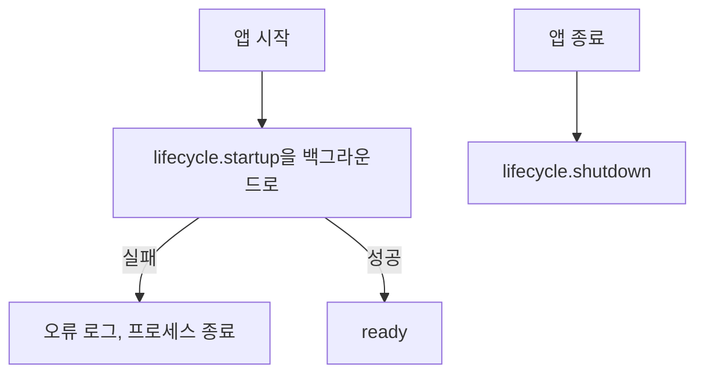

# api 모듈 명세 (REQ-RAG-9)

Backend의 HTTP 요청을 받아 service로 넘기는 진입점이다. `API.md`가 정한 경로·요청·응답·오류 코드를 FastAPI로 구현하고, 모든 예외를 한 곳에서 오류 응답으로 바꾸며, service의 기동·종료를 FastAPI 수명주기에 연결한다. 폴더는 `apps/rag-server/src/minerva_rag/api`다.

## 요약

**핵심 계약**

- 라우터는 service만 부른다. 기능 단위나 resource를 직접 부르지 않는다 (`ARCHITECT.md` 「의존 규칙」)
- 모든 실패 응답은 `API.md` 「공통 규약」의 본문이고, 예외는 전역 처리기 한 곳에서 바꾼다. 응답에 스택 트레이스, 쿼리, 파일 경로, 예외 문자열이 나가지 않는다 (`REQ-RAG-11.3`, `AGENTS.md`)
- 형식이 잘못된 요청은 FastAPI 기본값(422)이 아니라 `400 INVALID_REQUEST`다 (`REQ-RAG-9.1.2`)
- 상태 확인은 준비 전에도, 다른 요청은 준비 뒤에만 처리된다 (`REQ-RAG-10.1.2`)
- 상태 확인을 뺀 모든 요청은 토큰과 크기 한도를 본문을 읽기 전에 검사한다. 검사에 실패하면 service를 부르지 않는다 (`REQ-RAG-9.3.1`, `REQ-RAG-9.1.3`)
- 검사 순서는 토큰(`401`) → 본문 크기의 `Content-Length` 사전 검사(`413`) → 요청 검증(`400`) → `markdown`·`image` 크기(`413`) → service 호출이다. 준비 상태(`503`)는 service가 판단하므로, 준비 전 요청이라도 앞의 검사에 걸리면 그 오류를 받는다 (`REQ-RAG-9.3.1`, `REQ-RAG-9.1.2`, `REQ-RAG-9.1.3`, `REQ-RAG-10.1.2`)

**기능 그룹**

| REQ | 기능 그룹 | 책임 |
| :--- | :--- | :--- |
| `REQ-RAG-9.1` | 요청 처리 | `API.md`의 엔드포인트를 service로 넘기고, 형식이 잘못되거나 크기 한도를 넘는 요청을 거부한다 |
| `REQ-RAG-9.2` | 상태 확인 | Qdrant·Ollama 연결 상태를 돌려준다 |
| `REQ-RAG-9.3` | 인증 | API 토큰이 없거나 다른 요청을 거부한다 |

**비범위**

- 경로, 필드, 상태 코드, 오류 코드의 정의 — `API.md`
- 준비 상태 판단과 처리 순서 — service
- 오류 클래스와 메시지의 정의 — core

## 구조

### 예상 배치

```text
src/minerva_rag/api/
└── MODULE.md

tests/unit/api/
```

앱은 팩토리 `minerva_rag.api:create_app`으로 띄운다(`uvicorn minerva_rag.api:create_app --factory`). 이 import 경로가 실행 명령의 계약이다.

## 의존성과 공개 표면

### 의존 관계

| 대상 | 관계 | 사용하는 계약 | 계약 소유 | 관련 REQ |
| :--- | :--- | :--- | :--- | :--- |
| service | import | `build_services`, `Services`와 각 서비스, 다시 내보낸 타입 | service `MODULE.md` | `REQ-RAG-9.1.1` |
| core | import | `get_settings`, `configure_logging`, `get_logger`, `MinervaError`와 하위 클래스, `Edition` | core `MODULE.md` | `REQ-RAG-9.1.2`, `REQ-RAG-9.1.3`, `REQ-RAG-9.3.1`, `REQ-RAG-11.3` |
| Backend | HTTP (들어옴) | `API.md`의 엔드포인트 | `API.md` | `REQ-RAG-9.1.1` |

**금지 의존** — service와 core 말고는 import하지 않는다. 단위 조립은 service의 `build_services`가 한다(`ARCHITECT.md` 「의존 규칙」).

### 공개 표면

| 기능 그룹 | 공개 표면 | 상세 계약 | 관련 REQ |
| :--- | :--- | :--- | :--- |
| 요청 처리 | `create_app()` | 「요청 처리 — REQ-RAG-9.1」 | `REQ-RAG-9.1` |
| 요청 처리 | `POST /v1/captions/table`, `POST /v1/captions/image` | `API.md` | `REQ-RAG-10.2` |
| 요청 처리 | `POST /v1/index-jobs`, `GET /v1/index-jobs/{job_id}` | `API.md` | `REQ-RAG-10.8`, `REQ-RAG-10.3` |
| 요청 처리 | `DELETE /v1/documents/{doc_id}`, `PUT /v1/documents/{doc_id}/metadata` | `API.md` | `REQ-RAG-10.5`, `REQ-RAG-10.6` |
| 요청 처리 | `GET /v1/documents/{doc_id}/index-state`, `POST /v1/documents/index-states` | `API.md` | `REQ-RAG-10.8.6` |
| 요청 처리 | `GET /v1/documents/{doc_id}/chunks`, `POST /v1/search` | `API.md` | `REQ-RAG-4`, `REQ-RAG-10.4` |
| 요청 처리 | `POST /v1/evaluations` | `API.md` | `REQ-RAG-6`, `REQ-RAG-10.7` |
| 상태 확인 | `GET /v1/health` (토큰 검사 없음) | `API.md` | `REQ-RAG-9.2.1` |

## 기능 그룹별 요구사항

### 요청 처리 — `REQ-RAG-9.1`

```python
def create_app(services: Services | None = None) -> FastAPI:
    """FastAPI 앱을 만든다. services를 주지 않으면 설정으로 조립한다."""
```

- 요청·응답 본문의 필드·타입·`null` 규칙은 `API.md`가 소유한다. 라우터는 요청을 service의 입력 타입으로, service의 결과를 `API.md`의 응답 형식으로 옮기기만 한다
- 요청의 선택 필드에 `null`이 오면 빠뜨린 것과 같게 기본값을 쓴다. 필수이면서 `null`을 허용하는 필드(`PUT /v1/documents/{doc_id}/metadata`의 `edition`)는 키가 있어야 한다
- 엔드포인트와 service 메서드의 대응: 표 요약·이미지 캡션 → `CaptionService`, 색인 요청·작업 조회·문서 색인 상태 → `IndexService`, 문서 삭제 → `DeleteService`, 이름·판 정보 변경 → `MetadataService`, 문서 청크 조회·검색 → `SearchService`, 평가 → `EvaluationService`, 상태 확인 → `LifecycleService.health`
- 색인 요청의 응답 상태는 `outcome`이 `queued`·`joined`면 `202`, `reused`면 `200`이다(`API.md`)

**`REQ-RAG-9.1.1`** Backend가 HTTP로 요청할 수 있는 기능

- 처리 계약: `API.md` 「엔드포인트 목록」의 모든 경로·메서드를 제공한다
- 충족 기준: 목록의 엔드포인트마다 정상 요청이 그 service 메서드를 한 번 부르고 `API.md`의 성공 상태와 본문 형식으로 응답한다

**`REQ-RAG-9.1.2`** 형식이 잘못된 요청 거부

- 처리 계약: 요청 검증 오류(필수 필드 없음, 타입 불일치, `top_n` 1 미만, `POST /v1/documents/index-states`의 `doc_ids` 1~100개 밖, `edition_scope`가 `specific`인데 `edition` 없음, `POST /v1/index-jobs`의 `assets`에 같은 `placeholder_id`가 두 번 이상 있음 등 `API.md`의 제약 위반)와 service의 `InvalidRequestError`를 `400 INVALID_REQUEST`로 바꾼다. 검증에 실패하면 service를 부르지 않는다. `API.md`에 없는 경로·메서드로 온 요청과 본문을 해석할 수 없는 요청(잘못된 JSON, 잘못된 multipart)도 `400 INVALID_REQUEST`다. FastAPI 기본 응답(`{"detail": ...}`, `404`, `405`)을 내보내지 않는다
- 충족 기준: 필수 필드가 빠진 요청이 `400`과 `{"error": {"code": "INVALID_REQUEST", ...}}`로 거부되고 service 호출이 없다

**`REQ-RAG-9.1.3`** 크기 한도를 넘는 요청 거부

- 처리 계약: 색인 요청의 `markdown`이 `RAG_MAX_MARKDOWN_BYTES`를, 이미지 캡션 요청의 `image`가 `RAG_MAX_IMAGE_BYTES`를 넘으면 `PayloadTooLargeError`(`413 PAYLOAD_TOO_LARGE`)로 거부한다. 요청 본문이 이 한도보다 훨씬 크면(`Content-Length` 기준) 본문을 끝까지 읽지 않고 거부한다
- 충족 기준: 한도보다 1바이트 큰 `markdown`·`image`가 `413`으로 거부되고 service 호출이 없으며, 한도와 같은 크기는 처리된다

### 상태 확인 — `REQ-RAG-9.2`

**`REQ-RAG-9.2.1`** Qdrant·Ollama 연결 상태

- 처리 계약: `LifecycleService.health`의 결과를 `ok`·`unavailable`로 옮겨 `200`으로 돌려준다. 준비 전에도 같다
- 충족 기준: Qdrant만 연결되지 않으면 `{"qdrant": "unavailable", "ollama": "ok"}`이고, 준비 전에도 `200`이다

### 인증 — `REQ-RAG-9.3`

**`REQ-RAG-9.3.1`** API 토큰 검사

- 처리 계약: `GET /v1/health`를 뺀 모든 요청의 `X-Minerva-Token` 헤더를 `RAG_API_TOKEN`과 시간이 일정한 비교로 견준다. 없거나 다르면 `UnauthorizedError`(`401 UNAUTHORIZED`)로 거부한다. 토큰 검사는 준비 상태 검사와 요청 검증보다 먼저 한다
- 충족 기준: 토큰이 없거나 틀린 요청이 `401`로 거부되고 service 호출이 없으며, 맞는 토큰이면 처리되고, 상태 확인은 토큰 없이도 `200`이다

## 핵심 흐름



1. **시작** — FastAPI 수명주기 시작에서 `LifecycleService.startup`을 백그라운드로 실행하고 바로 요청을 받기 시작한다. 그래야 준비 중에도 상태 확인이 응답하고 다른 요청은 "준비 중"을 받는다. (`REQ-RAG-10.1.2`)
2. **기동 실패** — `startup`이 예외를 내면 프로세스를 끝낸다. 설정한 모델을 불러오지 못하면 기동하지 않는다는 요구를 여기서 지킨다. 로그를 내보낸 뒤 0이 아닌 종료 코드로 끝낸다. (`REQ-RAG-12.1.1`)
3. **종료** — 수명주기 끝에서 `LifecycleService.shutdown`을 기다린다. (`REQ-RAG-10.1.3`)

## 실행 계약

### 예외

오류 응답 변환은 이 모듈의 전역 처리기가 소유한다. 상태 코드는 `API.md` 「오류 코드」의 값이다.

| 예외 | 발생 조건 | 코드·상태 | 처리 책임 | 관련 REQ |
| :--- | :--- | :--- | :--- | :--- |
| `UnauthorizedError` | API 토큰이 없거나 다르다 | `UNAUTHORIZED` `401` | 발생·변환: api | `REQ-RAG-9.3.1` |
| `PayloadTooLargeError` | 크기 한도를 넘는다 | `PAYLOAD_TOO_LARGE` `413` | 발생·변환: api | `REQ-RAG-9.1.3` |
| 요청 검증 오류 | 본문·경로·질의가 `API.md`의 형식과 다르다 | `INVALID_REQUEST` `400` | 변환: api | `REQ-RAG-9.1.2` |
| `MinervaError` 하위 클래스 | service가 전파 | 그 클래스의 `code`와 `API.md`의 상태 | 변환: api. 본문 `message`는 예외의 `message` | `REQ-RAG-11.3.1` |
| 그 밖의 예외 | 예상하지 못한 오류 | `INTERNAL_ERROR` `500` | 변환: api. 스택은 로그에만 남긴다 | `REQ-RAG-11.3.2` |

### 로그

| 이벤트 | 발생 시점 | 레벨 | 허용 필드 | 관련 REQ |
| :--- | :--- | :--- | :--- | :--- |
| `api.request_invalid` | 요청 검증 실패 | warning | `path`, `fields` (필드 이름만) | `REQ-RAG-9.1.2` |
| `api.unauthorized` | 토큰 검사 실패 | warning | `path`, `token_present` | `REQ-RAG-9.3.1` |
| `api.payload_too_large` | 크기 한도 초과 | warning | `path`, `bytes`, `limit` | `REQ-RAG-9.1.3` |
| `api.unhandled` | 그 밖의 예외 | error | `path`, `error_type`, 스택 | `REQ-RAG-11.3.2` |
| `api.startup_failed` | 기동 실패로 프로세스를 끝낼 때 | error | `error_type` | `REQ-RAG-12.1.1` |

요청 본문(색인용 MD, 질의, 정답 구간, 표 Markdown)과 검증 오류의 입력값은 로그에 넣지 않는다.

### 런타임·보안

- **보안** — 토큰 검사와 크기 한도, 요청 검증은 api가, 자리표시 ID 누락 같은 내용 검증은 service가 한다. 토큰 값은 로그와 오류 응답에 넣지 않는다

## 테스트와 추적성

| REQ ID | 종류 | 검증 초점 | 대체 경계 | 예상 위치 |
| :--- | :--- | :--- | :--- | :--- |
| `REQ-RAG-9.1.1` | unit | 엔드포인트마다 service 호출과 성공 상태·본문 형식, 색인 결과별 `202`·`200` | service (가짜), FastAPI 테스트 클라이언트 | `tests/unit/api/` |
| `REQ-RAG-9.1.2` | unit | 검증 오류와 `InvalidRequestError`가 `400 INVALID_REQUEST`, service 미호출 | service (가짜) | `tests/unit/api/` |
| `REQ-RAG-9.1.2` | unit | `MinervaError`별 상태·코드, 그 밖의 예외는 `500`이고 본문에 예외 문자열 없음 (`REQ-RAG-11.3` 경계) | service (가짜, 예외) | `tests/unit/api/` |
| `REQ-RAG-9.1.3` | unit | 한도 초과 `413`, 한도와 같은 크기 처리, service 미호출 | service (가짜) | `tests/unit/api/` |
| `REQ-RAG-9.2.1` | unit | 연결 상태 표기, 준비 전에도 `200`, 토큰 없이 `200` | service (가짜) | `tests/unit/api/` |
| `REQ-RAG-9.3.1` | unit | 토큰 없음·틀림 `401`, 맞으면 처리, 준비 전에도 토큰 검사가 먼저 | service (가짜) | `tests/unit/api/` |
| `REQ-RAG-10.1.2` | unit | 기동을 백그라운드로 돌려 준비 중에도 상태 확인이 `200` | service (가짜, 기동 대기) | `tests/unit/api/` |
| `REQ-RAG-10.1.3` | unit | 앱 종료 때 `LifecycleService.shutdown`을 기다림 | service (가짜) | `tests/unit/api/` |
| `REQ-RAG-12.1.1` | unit | 기동 실패 시 `api.startup_failed` 로그와 프로세스 종료 | service (가짜, 기동 실패), 프로세스 종료 함수 | `tests/unit/api/` |
