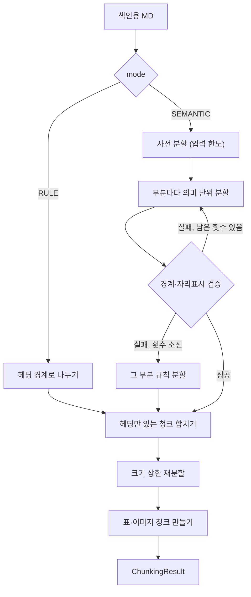

# chunking 모듈 명세 (REQ-RAG-2)

Backend가 보낸 색인용 MD를 검색 단위인 청크(`IF-RAG-1`의 `Chunk`)로 나눈다. 기본은 LLM이 문서 구조와 문맥을 보고 나누는 의미 단위 분할이고, Backend가 지정하면 규칙 분할을 쓴다. LLM이 정한 경계가 경계·자리표시 검증에 실패하면 다시 시도하다 대체 분할로 넘어가며, 크기 상한을 넘는 청크는 다시 나눈다. 폴더는 `apps/rag-server/src/minerva_rag/chunking`다.

## 요약

**핵심 계약**

- 본문 청크의 `text`는 색인용 MD의 연속된 구간을 그대로 옮긴 것이다. 본문 청크를 순서대로 이으면 경계의 공백과 큰 코드 블록을 나눌 때 붙인 펜스 줄(`REQ-RAG-2.5.1.4`)을 빼고 원문과 같다. LLM은 경계·제목·요약만 정하고 본문을 고쳐 쓰지 않는다 (`REQ-RAG-2.1.5`, `REQ-RAG-2.2.1`, 용어 「청크」)
- 모든 자리표시는 본문 청크 전체에서 정확히 한 번, 원형 그대로 나오고 두 청크에 걸쳐 잘리지 않는다. 결과를 돌려주기 전에 검증한다 (`REQ-RAG-2.2`, `IF-RAG-1`)
- 분할 LLM에 입력 한도를 넘는 텍스트를 보내지 않는다 (`REQ-RAG-2.5.2.2`)

**기능 그룹**

| REQ | 기능 그룹 | 책임 |
| :--- | :--- | :--- |
| `REQ-RAG-2.1` | 의미 단위 분할 | 문서를 의미 단위 청크로 나누고 제목·요약·헤딩 경로·순서를 붙인다. 지정되면 규칙 분할로 나눈다 |
| `REQ-RAG-2.2` | 자리표시 보존 | 분할 결과의 자리표시가 빠짐·중복·잘림 없이 원형 그대로인지 검증한다 |
| `REQ-RAG-2.3` | 대체 분할 | 검증 실패 시 다시 시도하고, 끝내 실패하면 규칙 분할로 대신하고 그 사실을 남긴다 |
| `REQ-RAG-2.4` | 표·이미지 청크 | 표·이미지마다 자리표시 하나로 된 청크를 따로 만든다 |
| `REQ-RAG-2.5` | 크기 상한 | 상한을 넘는 청크를 다시 나누고, 분할 LLM 입력 한도를 넘는 문서를 먼저 나누고, 분할 조각을 묶는다 |

**비범위**

- 자리표시를 요약·캡션으로 바꾼 색인 텍스트 — indexing (`REQ-RAG-3.1`)
- 청킹 실패를 작업 실패로 기록하는 일 — service (`REQ-RAG-10.3.3`)

## 구조

### 예상 배치

```text
src/minerva_rag/chunking/
├── chunker.py        # REQ-RAG-2.1·2.2·2.3·2.4 Chunker, ChunkingMode, 나누기·검증·대체 분할·표·이미지 청크
├── structure.py      # REQ-RAG-2.1.3·2.1.5 헤딩·코드 블록 읽기, 헤딩 경로
├── sizing.py         # REQ-RAG-2.5 사전 분할·재분할·분할 조각
├── llm_protocol.py   # REQ-RAG-2.1.1·2.1.2 경계·제목·요약 요청과 응답 해석
└── MODULE.md

tests/unit/chunking/
```

## 의존성과 공개 표면

### 의존 관계

| 대상 | 관계 | 사용하는 계약 | 계약 소유 | 관련 REQ |
| :--- | :--- | :--- | :--- | :--- |
| resource | import | `ModelHub.generate`(`LlmRole.CHUNKING`), `ModelHub.count_tokens` | resource `MODULE.md` | `REQ-RAG-2.1.1`, `REQ-RAG-2.5` |
| core | import | `Chunk`, `ChunkKind`, `ChunkingResult`, `find_placeholders`, `Placeholder`, `ChunkingFailedError`, `FailureLocation`, `Settings`, `get_logger` | `IF-RAG-1`, core `MODULE.md` | `REQ-RAG-2` |

### 공개 표면

| 기능 그룹 | 공개 표면 | 상세 계약 | 관련 REQ |
| :--- | :--- | :--- | :--- |
| 의미 단위 분할 | `Chunker.split`, `ChunkingMode` | 「의미 단위 분할 — REQ-RAG-2.1」 | `REQ-RAG-2` |
| 의미 단위 분할 | `ChunkingResult`, `Chunk` | `IF-RAG-1` | `REQ-RAG-2` |

## 기능 그룹별 요구사항

### 의미 단위 분할 — `REQ-RAG-2.1`

```python
class ChunkingMode(StrEnum):
    SEMANTIC = "semantic"  # 의미 단위 분할
    RULE = "rule"          # 규칙 분할


class Chunker:
    """색인용 MD를 청크로 나눈다."""

    def __init__(self, model_hub: ModelHub, settings: Settings) -> None: ...
    async def split(self, markdown: str, mode: ChunkingMode) -> ChunkingResult: ...
```

`split`이 돌려주는 `ChunkingResult`는 이 문서의 모든 그룹(자리표시 보존, 대체 분할, 표·이미지 청크, 크기 상한)을 거친 최종 결과다. `Chunk` 필드의 불변 조건은 `IF-RAG-1`이 소유한다.

이 문서의 헤딩·코드 블록·본문 줄은 다음 뜻이다. 헤딩 경로, 규칙 분할 경계, 코드 블록 보존, 큰 코드 블록 재분할이 모두 같은 정의를 쓴다.

- **헤딩** — 펜스 코드 블록 밖에서 0~3칸 들여쓰기 뒤 `#` 1~6개와 공백(또는 줄 끝)으로 시작하는 줄(ATX 헤딩). 헤딩 텍스트는 앞의 `#`·공백과 뒤의 닫는 `#` 열·공백을 뗀 것이다. 밑줄(`===`·`---`)로 표시한 Setext 헤딩은 헤딩으로 보지 않는다
- **코드 블록** — 0~3칸 들여쓰기 뒤 ```` ``` ```` 또는 `~~~` 3개 이상으로 여는 펜스 코드 블록. 같은 문자의 같거나 긴 펜스가 닫고, 닫지 않으면 문서 끝까지다
- **본문 줄** — 빈 줄도 헤딩 줄도 아닌 줄(코드 블록 안 줄, 자리표시 줄 포함)

**`REQ-RAG-2.1.1`** 의미 단위로 나누기

- 처리 계약: `mode`가 `SEMANTIC`이면 `LlmRole.CHUNKING`으로 청크 경계를 정한다. 본문 청크의 `text`는 원문 구간 그대로다(「요약」 핵심 계약). `markdown`이 비었거나 공백뿐이면 LLM을 부르지 않고 `chunks`가 빈 결과(`fallback_used=False`)를 돌려준다
- 실패: LLM 응답을 경계로 해석할 수 없으면 다시 시도하지 않고 `ChunkingFailedError`를 낸다. 해석할 수 없는 응답은 정해진 형식이 아니거나, 청크가 하나도 없거나, 원문에 없는 위치를 가리키거나, 제목·요약이 비었거나 공백뿐인 응답이다. 경계는 읽히지만 원문을 빠짐·겹침·순서 바뀜 없이 나누지 못하거나 코드 블록 중간에 있는 응답은 해석 불가가 아니라 경계 검증 실패다(`REQ-RAG-2.3.1`)
- 실패: resource가 `PromptTooLongError`를 내거나, 연결된 뒤 생성이 실패해 `MinervaError`가 아닌 예외를 내면 `ChunkingFailedError`로 바꿔 내고 다시 시도하지 않는다. `ModelUnavailableError`(Ollama 연결 실패)는 그대로 낸다
- 실패 위치: 경계 호출의 실패는 `FailureLocation.heading_path`에 그 부분의 헤딩 경로(부분의 첫 본문 줄이 속한 절, `REQ-RAG-2.1.3`과 같은 규칙)를 담고, `placeholder_id`는 `None`이다
- 충족 기준: LLM이 정한 경계대로 본문 청크가 만들어지고, 본문 청크의 `text`를 순서대로 이으면 경계 공백을 빼고 입력과 같다. 해석할 수 없는 응답이면 `ChunkingFailedError`가 난다

**`REQ-RAG-2.1.2`** 본문 청크의 제목과 요약

- 처리 계약: 모든 본문 청크는 비어 있지 않은 `title`과 `summary`를 갖는다. 의미 단위 분할은 경계와 함께 LLM이 정하고, 규칙 분할·대체 분할로 만든 청크도 청크마다 `LlmRole.CHUNKING`으로 만든다. 분할 조각은 원래 청크의 `title`과 `summary`를 그대로 갖는다
- 처리 계약: 규칙 분할·대체 분할로 만든 청크의 제목·요약은 헤딩만 있는 청크를 합친 뒤, 크기 상한 재분할 전에 청크마다 한 번 요청한다. 요청이 입력 한도를 넘으면 청크 본문의 앞부분만 보낸다(`REQ-RAG-2.5.2.2`)
- 실패: 제목·요약 응답을 해석할 수 없거나 생성이 실패하면(`REQ-RAG-2.1.1`의 생성 실패와 같다) `ChunkingFailedError`를 내고, 위치에 그 청크의 `heading_path`를 담는다. 지시문과 헤딩 경로만으로 입력 한도를 넘어도 `ChunkingFailedError`다
- 충족 기준: 세 방식 모두에서 모든 본문 청크의 `title`·`summary`가 비어 있지 않다

**`REQ-RAG-2.1.3`** 헤딩 경로

- 처리 계약: 헤딩 경로는 LLM이 아니라 원문의 Markdown 헤딩으로 정한다. 청크가 여러 절에 걸치면 청크의 첫 본문 줄이 속한 절의 경로다. 헤딩 앞의 본문은 빈 경로다. 경로는 문서 처음부터 쌓은 헤딩으로 정하며, 수준 k의 헤딩은 수준 k 이상의 헤딩을 빼고 들어가고 건너뛴 수준은 비운다. 본문 줄이 없는 청크(`REQ-RAG-2.1.9`)는 마지막 헤딩까지의 경로다
- 충족 기준: `# A` 아래 `## B` 아래의 본문으로 된 청크의 `heading_path`가 `("A", "B")`이고, `# A` 다음 바로 `### C`가 오면 그 아래 본문의 경로가 `("A", "C")`다

**`REQ-RAG-2.1.4`** 문서 안 순서

- 충족 기준: 본문 청크의 `order`가 문서에 나오는 차례대로 커지고, 분할 조각은 원래 청크의 `order`를 그대로 갖는다

**`REQ-RAG-2.1.5`** 코드 블록 보존

- 처리 계약: 의미 단위 분할과 규칙 분할은 코드 블록 중간에 경계를 두지 않는다. 코드 블록을 나누는 것은 크기 상한의 재분할(`REQ-RAG-2.5.1.4`)뿐이다
- 충족 기준: 코드 블록이 든 문서를 나누면 그 코드 블록이 한 청크의 `text` 안에 원문 그대로 있다

**`REQ-RAG-2.1.6`** 규칙 분할

- 처리 계약: `mode`가 `RULE`이면 LLM으로 경계를 정하지 않고 헤딩 경계로 나눈다
- 충족 기준: `RULE`로 나누면 청크 경계가 모두 헤딩 줄 앞이고, 경계를 정하는 LLM 호출이 없다

**`REQ-RAG-2.1.7`** 헤딩만 있는 청크 합치기

- 처리 계약: 본문 줄이 없는 청크(헤딩 줄과 빈 줄뿐)는 부분 경계와 관계없이 문서 안에서 바로 다음 청크의 앞에 붙인다. 합친 청크의 `title`·`summary`는 받는 청크의 것이다
- 충족 기준: 본문이 있는 문서에서 헤딩 줄만 있고 본문이 없는 청크가 생길 자리에서 그 헤딩이 바로 다음 청크의 `text` 앞에 붙고, 헤딩만 있는 청크는 결과에 없다

**`REQ-RAG-2.1.8`** 문서 끝의 헤딩은 앞 청크에 합치기

- 충족 기준: 문서의 마지막 청크가 헤딩만 있는 청크면 그 헤딩이 바로 앞 청크의 `text` 뒤에 붙고, 헤딩만 있는 청크는 결과에 없다

**`REQ-RAG-2.1.9`** 헤딩뿐인 문서는 청크 하나

- 충족 기준: 본문 줄 없이 헤딩만 있는 문서를 나누면 그 헤딩들로 된 본문 청크 하나가 나오고, 그 `text`가 경계 공백을 빼고 입력과 같다

### 자리표시 보존 — `REQ-RAG-2.2`

자리표시는 core의 `find_placeholders`로 읽는다(루트 `IF-1`).

**`REQ-RAG-2.2.1`** 정확히 한 번, 원형 그대로

- 처리 계약: 입력의 모든 자리표시 `raw`가 본문 청크 전체에서 정확히 한 번 나오는지 검증한다. 실패하면 대체 분할 그룹의 절차로 넘어간다
- 충족 기준: 결과의 본문 청크에서 찾은 자리표시 목록이 입력의 목록과 같은 차례·같은 문자열이다

**`REQ-RAG-2.2.2`** 두 청크에 걸쳐 잘리지 않음

- 충족 기준: 어떤 본문 청크의 `text`에도 자리표시의 일부만 든 조각(`[[minerva:`로 시작해 `]]`로 닫히지 않는 것 등)이 없다

**`REQ-RAG-2.2.3`** 청크별 자리표시 ID 목록

- 충족 기준: 모든 청크의 `placeholder_ids`가 그 청크 `text`에서 찾은 자리표시 ID와 같은 차례로 같다

### 대체 분할 — `REQ-RAG-2.3`

**`REQ-RAG-2.3.1`** 검증 실패 시 다시 시도

- 처리 계약: 의미 단위 분할의 결과가 자리표시 보존 검증(`REQ-RAG-2.2.1`)이나 경계 검증에 실패하면 그 부분(사전 분할로 나눈 부분, 나누지 않았으면 문서 전체)의 의미 단위 분할을 다시 한다. 경계 검증은 경계가 그 부분의 본문 줄을 빠짐·겹침 없이 차례대로 나누는지, 코드 블록 중간(여는 펜스 줄이 아닌 블록 안 줄)에 경계가 없는지 본다. 빈 줄만 빠지는 것은 실패가 아니다
- 충족 기준: 첫 응답이 자리표시를 빠뜨리거나 본문 줄을 빠뜨리고 두 번째 응답이 올바르면, 두 번째 응답대로 나뉘고 `fallback_used`가 `False`다

**`REQ-RAG-2.3.2`** 끝내 실패하면 대체 분할

- 처리 계약: `RAG_CHUNKING_RETRIES`번 다시 시도해도 실패하면 그 부분을 규칙 분할로 나눈다. 대체 분할 결과도 자리표시 보존 불변 조건을 지킨다
- 충족 기준: 설정한 횟수 + 1번 모두 검증에 실패하면 LLM 경계 호출이 그 횟수에서 멈추고, 그 부분의 청크 경계가 헤딩 줄 앞이다

**`REQ-RAG-2.3.3`** 대체 분할 사실 남기기

- 처리 계약: 어느 부분이든 대체 분할을 쓰면 `ChunkingResult.fallback_used`가 `True`다. 작업 결과에 옮기는 일은 service가 한다(service `MODULE.md`의 `IndexOutcome`)
- 충족 기준: 한 부분이라도 대체 분할로 나뉘면 `fallback_used`가 `True`, 아니면 `False`다

### 표·이미지 청크 — `REQ-RAG-2.4`

**`REQ-RAG-2.4.1`** 표·이미지마다 청크 하나

- 충족 기준: 자리표시가 k개인 문서를 나누면 `kind`가 `ASSET`인 청크가 k개이고, 자리표시 ID마다 하나씩이다

**`REQ-RAG-2.4.2`** 본문은 자리표시 하나

- 충족 기준: 모든 `ASSET` 청크의 `text`가 그 자리표시의 `raw`와 같고 `placeholder_ids`가 그 ID 하나다

**`REQ-RAG-2.4.3`** 표·이미지가 속한 절의 헤딩 경로

- 처리 계약: `ASSET` 청크의 `heading_path`는 그 자리표시가 원문에서 속한 절의 헤딩 경로다
- 충족 기준: `## B` 아래에 있는 표의 `ASSET` 청크 `heading_path`가 `B`로 끝난다

**`REQ-RAG-2.4.4`** 담은 본문 청크와 같은 순서

- 충족 기준: 모든 `ASSET` 청크의 `order`가 그 자리표시를 담은 본문 청크(분할 조각이면 그 조각)의 `order`와 같다

### 크기 상한 — `REQ-RAG-2.5`

토큰 수는 `ModelHub.count_tokens`로 센다.

#### 재분할 — `REQ-RAG-2.5.1`

**`REQ-RAG-2.5.1.1`** 하위 헤딩, 문단, 문장 경계 순으로 다시 나누기

- 처리 계약: `text`의 토큰 수가 `RAG_CHUNK_MAX_TOKENS`를 넘는 본문 청크를 하위 헤딩 경계로 나누고, 그래도 넘는 조각은 문단 경계로, 그래도 넘으면 문장 경계로 나눈다. 앞 단계 경계로 상한을 맞출 수 있으면 뒤 단계 경계를 쓰지 않는다. 문장 하나가 상한을 넘으면 그 문장은 한 조각으로 둔다
- 충족 기준: 하위 헤딩이 있는 큰 청크는 하위 헤딩 경계에서만 나뉘고, 하위 헤딩이 없으면 문단 경계에서 나뉘며, 문장 하나보다 긴 조각을 빼면 모든 조각이 상한 이하다

**`REQ-RAG-2.5.1.2`** 조각의 헤딩 경로와 제목 유지

- 충족 기준: 모든 분할 조각의 `heading_path`와 `title`이 원래 청크와 같다

**`REQ-RAG-2.5.1.3`** 몇 번째 조각인지 표시

- 충족 기준: 한 청크에서 나온 조각들의 `split_index`가 1부터 `split_total`까지 하나씩이고, `split_total`이 조각 수다. 나뉘지 않은 청크는 세 분할 필드가 `None`이다

**`REQ-RAG-2.5.1.4`** 큰 코드 블록은 줄 경계에서 나누고 언어 표시 유지

- 처리 계약: 코드 블록 하나가 상한을 넘으면 줄 경계에서 나누고, 조각마다 원래 여는 펜스(언어 표시 포함)와 닫는 펜스를 붙인다. 붙인 펜스 줄을 빼면 조각들의 코드 줄을 이은 것이 원래 코드와 같다
- 충족 기준: ```` ```python ```` 블록이 나뉘면 모든 조각이 ```` ```python ````로 시작해 펜스로 닫히고, 펜스를 뺀 줄을 이으면 원래 코드다

**`REQ-RAG-2.5.1.5`** 재분할은 자리표시를 자르지 않음

- 충족 기준: 자리표시가 든 큰 청크를 나눈 뒤에도 `REQ-RAG-2.2.2`의 조건이 성립한다

**`REQ-RAG-2.5.1.6`** 조각 사이 겹침 없음

- 충족 기준: 한 청크의 조각들의 `text`를 `split_index` 순으로 이으면 경계 공백과 `REQ-RAG-2.5.1.4`의 펜스 줄을 빼고 원래 청크와 같고, 어떤 글자도 두 조각에 함께 들지 않는다

#### 사전 분할 — `REQ-RAG-2.5.2`

**`REQ-RAG-2.5.2.1`** 입력 한도를 넘으면 헤딩 기준으로 먼저 나누기

- 처리 계약: 의미 단위 분할에서 문서와 지시문을 합친 입력이 `RAG_CHUNKING_LLM_MAX_INPUT_TOKENS`를 넘으면 헤딩 경계로 나눠 부분마다 의미 단위 분할을 한다. 헤딩으로 나눈 부분이 아직 넘으면 문단, 문장 경계 순으로 더 나눈다
- 충족 기준: 한도를 넘는 문서에서 LLM 경계 호출이 여러 번 일어나고, 부분 경계가 모두 헤딩 줄 앞이다(헤딩으로 충분할 때)

**`REQ-RAG-2.5.2.2`** 입력 한도를 넘는 텍스트를 보내지 않음

- 처리 계약: 사전 분할이 문장 경계까지 내려가도 지시문과 합쳐 한도를 넘는 단위(문장 하나, 줄 하나, 코드 블록 하나)는 경계 LLM에 보내지 않고 그 단위를 청크 하나로 둔다. 대체 분할이 아니므로 `fallback_used`를 바꾸지 않으며, 크기는 재분할(`REQ-RAG-2.5.1`)이 맞춘다
- 충족 기준: 어떤 문서를 나누든 `LlmRole.CHUNKING`으로 보낸 모든 입력의 토큰 수가 한도 이하다

#### 연관 청크 연결 — `REQ-RAG-2.5.3`

**`REQ-RAG-2.5.3.1`** 분할 조각의 공통 ID

- 처리 계약: 한 청크에서 나온 조각은 같은 `split_group`을 갖고, 다른 청크의 조각과는 다른 값을 갖는다
- 충족 기준: 두 큰 청크를 나누면 조각들이 청크마다 같은 `split_group`을 갖고, 두 값은 다르다

## 핵심 흐름



1. **사전 분할** — 의미 단위 분할의 입력이 한도를 넘으면 먼저 나눈다. (`REQ-RAG-2.5.2`)
2. **나누기와 검증** — 부분마다 나누고 경계와 자리표시를 검증한다. 실패하면 다시 시도하고, 횟수를 다 쓰면 그 부분만 규칙 분할로 대신한다. (`REQ-RAG-2.1`, `REQ-RAG-2.2`, `REQ-RAG-2.3`)
3. **합치기** — 헤딩만 있는 청크를 다음 청크(문서 끝이면 앞 청크)에 합친다. 재분할 전에 해야 합친 결과도 상한 검사를 받는다. 규칙·대체 분할 청크의 제목·요약은 합친 뒤 만든다. (`REQ-RAG-2.1.7`~`REQ-RAG-2.1.9`, `REQ-RAG-2.1.2`)
4. **재분할** — 상한을 넘는 본문 청크를 나눈다. (`REQ-RAG-2.5.1`)
5. **표·이미지 청크** — 재분할 뒤에 만든다. 그래야 `order`가 자리표시를 담은 조각의 순서를 따른다. (`REQ-RAG-2.4.4`)

## 실행 계약

### 설정

정의는 core 「설정」이 소유한다. 이 모듈이 읽는 키: `RAG_CHUNK_MAX_TOKENS`, `RAG_CHUNKING_LLM_MAX_INPUT_TOKENS`, `RAG_CHUNKING_RETRIES`.

### 예외

| 예외 | 발생 조건 | 코드·상태 | 처리 책임 | 관련 REQ |
| :--- | :--- | :--- | :--- | :--- |
| `ChunkingFailedError` | LLM의 경계·제목·요약 응답을 해석할 수 없거나, 생성이 실패하거나(`PromptTooLongError` 포함) | 작업 실패 사유 `CHUNKING_FAILED` | 발생: chunking. 변환: service | `REQ-RAG-2.1.1`, `REQ-RAG-2.1.2` |
| `ModelUnavailableError` | Ollama 연결 실패 | 작업 실패 사유 `MODEL_UNAVAILABLE` | 발생: resource. 전파: chunking | `REQ-RAG-12.1.2` |

### 로그

| 이벤트 | 발생 시점 | 레벨 | 허용 필드 | 관련 REQ |
| :--- | :--- | :--- | :--- | :--- |
| `chunking.validation_failed` | 경계·자리표시 검증 실패 | warning | `part`, `attempt`, `reason`(`boundary`·`placeholder`), `missing`, `duplicated` (개수) | `REQ-RAG-2.3.1` |
| `chunking.fallback` | 대체 분할로 넘어갈 때 | warning | `part`, `attempts` | `REQ-RAG-2.3.2` |
| `chunking.done` | `split` 끝 | info | `text_chunks`, `asset_chunks`, `split_groups`, `fallback_used`, `parts` | `REQ-RAG-2.1.1` |

헤딩 텍스트와 청크 본문, 제목·요약은 로그에 넣지 않는다. 자리표시 ID 대신 개수를 남긴다.

### 실패 모드

- **LLM이 본문을 고쳐 씀** (`REQ-RAG-2.1.5`) — 증상: 청크 본문이 원문과 달라 평가의 적중 판정이 틀어지고 검색 결과가 원문과 다르다. 탐지: 본문 청크를 이은 것과 원문 비교. 방어: LLM에게서는 경계·제목·요약만 받고 본문은 원문에서 잘라 쓴다

## 테스트와 추적성

LLM 응답은 mock으로 대체하고, 실행마다 달라지는 값은 성질만 본다(`AGENTS.md`).

| REQ ID | 종류 | 검증 초점 | 대체 경계 | 예상 위치 |
| :--- | :--- | :--- | :--- | :--- |
| `REQ-RAG-2.1.1` | unit | LLM 경계대로 나뉨, 원문 보존, 빈 문서, 해석 불가 응답·생성 실패·`PromptTooLongError` 시 `ChunkingFailedError`와 위치, `ModelUnavailableError` 전파 | resource (mock) | `tests/unit/chunking/` |
| `REQ-RAG-2.1.2` | unit | 세 방식 모두 제목·요약 있음, 조각은 원래 값 유지, 해석 불가 시 실패 | resource (mock) | `tests/unit/chunking/` |
| `REQ-RAG-2.1.3` | unit | 헤딩 경로, 여러 절에 걸친 청크, 헤딩 앞 본문, 건너뛴 수준, 코드 블록 안 `#` 줄은 헤딩 아님 | resource (mock) | `tests/unit/chunking/` |
| `REQ-RAG-2.1.4` | unit | 본문 청크 순서 증가, 조각은 같은 순서 | resource (mock) | `tests/unit/chunking/` |
| `REQ-RAG-2.1.5` | unit | 코드 블록 중간 경계 없음, 원문 그대로 | resource (mock) | `tests/unit/chunking/` |
| `REQ-RAG-2.1.6` | unit | 규칙 분할 경계가 헤딩 앞, 경계 LLM 호출 없음 | resource (mock) | `tests/unit/chunking/` |
| `REQ-RAG-2.1.7` | unit | 헤딩만 있는 청크가 다음 청크에 합쳐짐 | resource (mock) | `tests/unit/chunking/` |
| `REQ-RAG-2.1.8` | unit | 문서 끝의 헤딩만 있는 청크가 앞 청크에 합쳐짐 | resource (mock) | `tests/unit/chunking/` |
| `REQ-RAG-2.1.9` | unit | 헤딩뿐인 문서가 청크 하나 | resource (mock) | `tests/unit/chunking/` |
| `REQ-RAG-2.2.1` | unit | 자리표시 목록이 입력과 같음 | resource (mock) | `tests/unit/chunking/` |
| `REQ-RAG-2.2.2` | unit | 자리표시 일부만 든 청크 없음 | resource (mock) | `tests/unit/chunking/` |
| `REQ-RAG-2.2.3` | unit | `placeholder_ids`가 본문과 일치 | resource (mock) | `tests/unit/chunking/` |
| `REQ-RAG-2.3.1` | unit | 자리표시·경계(본문 줄 빠짐·겹침·코드 블록 중간) 검증 실패 뒤 다시 시도해 성공 | resource (mock) | `tests/unit/chunking/` |
| `REQ-RAG-2.3.2` | unit | 횟수 소진 시 호출 중단과 규칙 분할 | resource (mock) | `tests/unit/chunking/` |
| `REQ-RAG-2.3.3` | unit | `fallback_used` 참·거짓 | resource (mock) | `tests/unit/chunking/` |
| `REQ-RAG-2.4.1` | unit | 자리표시마다 `ASSET` 청크 하나 | resource (mock) | `tests/unit/chunking/` |
| `REQ-RAG-2.4.2` | unit | `ASSET` 본문이 자리표시 하나 | resource (mock) | `tests/unit/chunking/` |
| `REQ-RAG-2.4.3` | unit | `ASSET` 헤딩 경로 | resource (mock) | `tests/unit/chunking/` |
| `REQ-RAG-2.4.4` | unit | `ASSET` 순서가 담은 조각의 순서 | resource (mock) | `tests/unit/chunking/` |
| `REQ-RAG-2.5.1.1` | unit | 경계 단계 순서, 상한 이하, 긴 문장 하나 | resource (mock, 토큰 수 고정) | `tests/unit/chunking/` |
| `REQ-RAG-2.5.1.2` | unit | 조각의 헤딩 경로·제목 유지 | resource (mock) | `tests/unit/chunking/` |
| `REQ-RAG-2.5.1.3` | unit | 조각 번호·조각 수, 나뉘지 않은 청크는 `None` | resource (mock) | `tests/unit/chunking/` |
| `REQ-RAG-2.5.1.4` | unit | 큰 코드 블록의 줄 경계 분할과 펜스·언어 표시 | resource (mock) | `tests/unit/chunking/` |
| `REQ-RAG-2.5.1.5` | unit | 재분할 뒤 자리표시 잘림 없음 | resource (mock) | `tests/unit/chunking/` |
| `REQ-RAG-2.5.1.6` | unit | 조각 이음이 원래 청크와 같고 겹침 없음 | resource (mock) | `tests/unit/chunking/` |
| `REQ-RAG-2.5.2.1` | unit | 한도 초과 문서의 헤딩 기준 사전 분할 | resource (mock) | `tests/unit/chunking/` |
| `REQ-RAG-2.5.2.2` | unit | 모든 분할 LLM 입력이 한도 이하, 한도를 넘는 단일 단위는 LLM 없이 청크 하나 | resource (mock) | `tests/unit/chunking/` |
| `REQ-RAG-2.5.3.1` | unit | 조각끼리 같은 `split_group`, 청크끼리 다름 | resource (mock) | `tests/unit/chunking/` |
