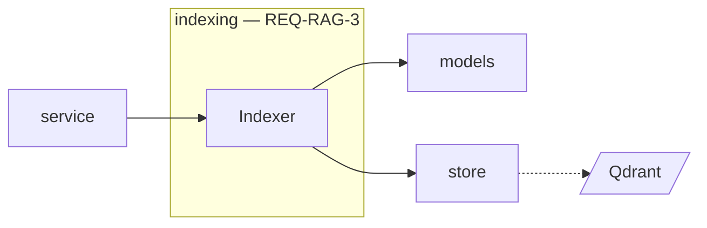
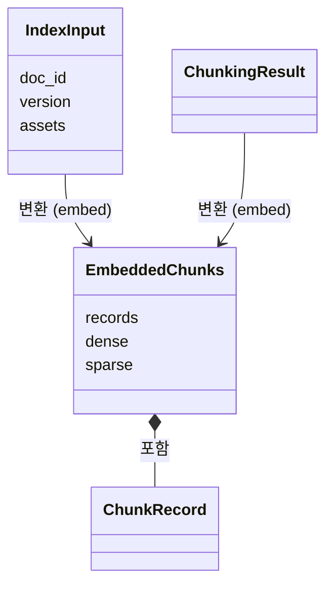
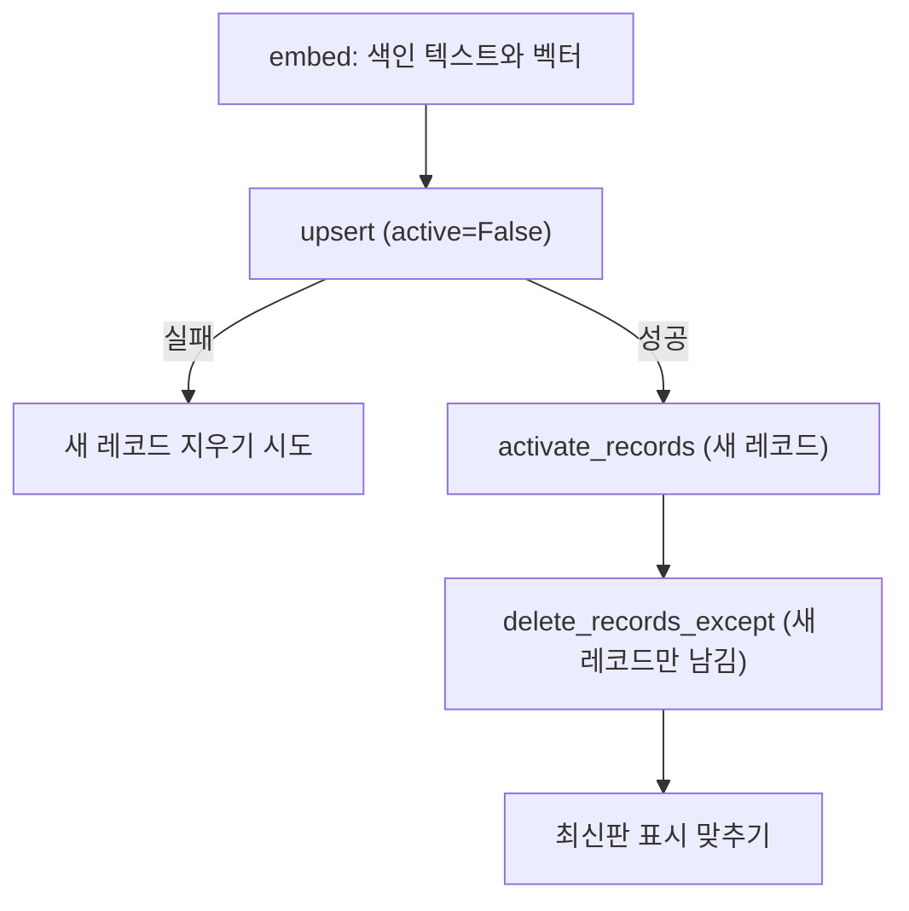

# indexing 모듈 명세 (REQ-RAG-3)

chunking이 만든 청크를 검색할 수 있게 저장하고, 버전·판·삭제·중복 방지를 정한다. 자리표시를 요약·캡션으로 바꾼 색인 텍스트로 dense·키워드 벡터를 만들어 `ChunkRecord`(`IF-RAG-1`)와 함께 store로 저장하며, Qdrant의 청크를 바꾸는 유일한 단위다. 폴더는 `apps/rag-server/src/minerva_rag/indexing`다.

## 요약

**핵심 계약**

- 저장하는 청크 원문(`chunk.text`)은 자리표시를 그대로 두고, 벡터만 색인 텍스트로 만든다. 색인 텍스트는 저장하지 않는다 (`REQ-RAG-3.1`, `IF-RAG-1`)
- 새 버전 레코드는 모두 저장한 뒤에만 활성화하고, 그다음에 이전 레코드를 지운다. 저장이 실패하면 이전 버전은 그대로 검색된다 (`REQ-RAG-3.3`, `REQ-RAG-10.3.4`)
- 다른 문서의 레코드는 그 문서가 삭제를 요청받았을 때만 지운다. 이름·판이 같아도 지우지 않는다 (`REQ-RAG-3.6.6`)
- 최신판 표시는 레코드를 바꾸는 모든 쓰기(활성화, 삭제, 이름·판 변경) 뒤에 관련 이름마다 다시 맞춘다 (`REQ-RAG-3.6.3`)

**기능 그룹**

| REQ | 기능 그룹 | 책임 |
| :--- | :--- | :--- |
| `REQ-RAG-3.1` | 색인 텍스트 | 자리표시를 요약·캡션 문장으로 바꾼 색인 텍스트를 만들고, 원문은 그대로 둔다 |
| `REQ-RAG-3.2` | 벡터·키워드 색인 | 색인 텍스트로 dense·키워드 벡터를 만든다 |
| `REQ-RAG-3.3` | 버전 교체 | 새 버전을 다 저장한 뒤 활성화하고 이전 버전을 지운다 |
| `REQ-RAG-3.4` | 문서 삭제 | 문서의 모든 버전 레코드를 지운다 |
| `REQ-RAG-3.5` | 중복 색인 방지 | 체크섬을 만들고, 합류·재사용·새 접수 중 무엇을 할지 정한다 |
| `REQ-RAG-3.6` | 이름·판 정보 | 레코드의 이름·판 정보를 남기고 바꾸며, 최신판 표시를 맞춘다 |

**비범위**

- 같은 판 문서 중 무엇을 남길지 — Backend (`REQ-RAG-3.6.6`, `REQ-BE-1.2.5`)
- 체크섬 비교에 쓸 열린 작업과 현재 색인의 작업 정보 — jobs가 갖고, service가 가져와 넘긴다
- 색인 중인 작업을 기다린 뒤 삭제·이름 변경을 하는 순서 — service (`REQ-RAG-10.5`, `REQ-RAG-10.6`)
- `assets`에 자리표시 ID가 빠진 요청을 거절하는 일 — service

## 구조

### 예상 배치

```text
src/minerva_rag/indexing/
└── MODULE.md

tests/unit/indexing/
tests/integration/indexing/
```

### 컨텍스트



실선은 import 호출, 점선은 프로세스 밖 자원이다. core 의존은 생략했다.

## 의존성과 공개 표면

### 의존 관계

| 대상 | 관계 | 사용하는 계약 | 계약 소유 | 관련 REQ |
| :--- | :--- | :--- | :--- | :--- |
| models | import | `embed_documents`, `encode_sparse_documents`, `embedding_model_name` | models `MODULE.md` | `REQ-RAG-3.2`, `REQ-RAG-3.5.2` |
| store | import | 쓰기 메서드, `active_records`, `active_editions` | store `MODULE.md` | `REQ-RAG-3.3`, `REQ-RAG-3.4`, `REQ-RAG-3.6` |
| core | import | `Chunk`, `ChunkingResult`, `ChunkRecord`, `Edition`, `SparseVector`, `find_placeholders`, `Settings`, `get_logger` | `IF-RAG-1`, core `MODULE.md` | `REQ-RAG-3` |

**금지 의존** — chunking·jobs·service를 import하지 않는다. 청킹 방식은 문자열 값으로 받는다(`ARCHITECT.md` 「의존 규칙」).

### 공개 표면

| 기능 그룹 | 공개 표면 | 상세 계약 | 관련 REQ |
| :--- | :--- | :--- | :--- |
| 벡터·키워드 색인 | `Indexer.embed`, `IndexInput`, `EmbeddedChunks` | 「벡터·키워드 색인 — REQ-RAG-3.2」 | `REQ-RAG-3.1`, `REQ-RAG-3.2` |
| 버전 교체 | `Indexer.write` | 「버전 교체 — REQ-RAG-3.3」 | `REQ-RAG-3.3`, `REQ-RAG-10.3.4` |
| 문서 삭제 | `Indexer.delete_document` | 「문서 삭제 — REQ-RAG-3.4」 | `REQ-RAG-3.4` |
| 중복 색인 방지 | `Indexer.checksum`, `decide_index`, `IndexDecision` | 「중복 색인 방지 — REQ-RAG-3.5」 | `REQ-RAG-3.5` |
| 이름·판 정보 | `Indexer.update_metadata` | 「이름·판 정보 — REQ-RAG-3.6」 | `REQ-RAG-3.6` |
| 기동 복구 | `Indexer.recover` | 「기동 복구」 | `REQ-RAG-7.5.3` |

## 데이터 계약

`ChunkRecord`와 `Chunk`는 `IF-RAG-1`이 소유한다.

### 모델 관계



### 모델별 필드

**`IndexInput`** — 정의: indexing, 값 생산: service (색인 요청에서)

| 필드 | 타입 | 필수 | 불변 조건 |
| :--- | :--- | :--- | :--- |
| `doc_id` | `str` | 필수 | 요청 값 그대로 |
| `version` | `str` | 필수 | 요청 값 그대로 |
| `job_id` | `str` | 필수 | 이 색인을 실행하는 작업의 ID(`ProgressReporter.job_id`) |
| `markdown` | `str` | 필수 | 색인용 MD |
| `assets` | `Mapping[str, str]` | 필수 | 자리표시 ID → 요약·캡션 문장. `markdown`의 모든 자리표시 ID를 키로 갖는다 |
| `name` | `str` | 필수 | 문서 이름 |
| `edition` | `Edition \| None` | 선택 | 판 정보가 없으면 `None` |
| `chunking_mode` | `str` | 필수 | chunking의 `ChunkingMode` 값 |

**`EmbeddedChunks`** — 정의: indexing, 값 생산: indexing

| 필드 | 타입 | 필수 | 불변 조건 |
| :--- | :--- | :--- | :--- |
| `doc_id`, `version`, `name` | `str` | 필수 | `IndexInput`과 같다 |
| `records` | `tuple[ChunkRecord, ...]` | 필수 | 청크마다 하나. 모두 `active=False`, `is_latest_edition=False`, 새로 만든 `chunk_id`, `job_id`는 `IndexInput.job_id` |
| `dense` | `tuple[tuple[float, ...], ...]` | 필수 | `records`와 같은 길이·순서 |
| `sparse` | `tuple[SparseVector, ...]` | 필수 | `records`와 같은 길이·순서 |

**`IndexDecision`** — 정의: indexing, 값 생산: indexing (`REQ-RAG-3.5`)

| 필드 | 타입 | 필수 | 불변 조건 |
| :--- | :--- | :--- | :--- |
| `kind` | `Literal["join", "reuse", "submit"]` | 필수 | API의 `joined`·`reused`·`queued`에 대응한다 |
| `job_id` | `str \| None` | 조건부 | `join`이면 열린 작업, `reuse`면 현재 색인을 만든 작업의 ID. `submit`이면 `None` |

## 기능 그룹별 요구사항

```python
class Indexer:
    """청크를 색인하고 버전·판·삭제를 관리한다."""

    def __init__(self, models: ModelHub, store: ChunkStore, settings: Settings) -> None: ...
    def checksum(self, markdown: str, assets: Mapping[str, str], chunking_mode: str) -> str: ...
    async def embed(self, inp: IndexInput, result: ChunkingResult) -> EmbeddedChunks: ...
    async def write(self, embedded: EmbeddedChunks) -> int: ...
    async def delete_document(self, doc_id: str) -> None: ...
    async def update_metadata(self, doc_id: str, name: str, edition: Edition | None) -> None: ...
    async def recover(self, doc_id: str, job_id: str) -> bool: ...


def decide_index(
    checksum: str,
    *,
    open_job_id: str | None,
    current_job_id: str | None,
    current_checksum: str | None,
    force: bool,
) -> IndexDecision: ...
```

store·models의 예외(`StoreUnavailableError`, `VectorDimensionMismatchError`, `ModelUnavailableError`)는 그대로 낸다.

### 색인 텍스트 — `REQ-RAG-3.1`

**`REQ-RAG-3.1.1`** 자리표시를 요약·캡션으로 바꾼 색인 텍스트

- 입력·선행 조건: `IndexInput.assets`가 모든 자리표시 ID를 갖는다(루트 `IF-1`의 Backend 보장, service가 확인)
- 처리 계약: 청크의 색인 텍스트는 `text`의 자리표시 `raw` 전체를 그 ID의 요약·캡션 문장으로 바꾼 것이다. `ASSET` 청크의 색인 텍스트는 그 요약·캡션 문장이다
- 충족 기준: `embed`가 models에 넘긴 텍스트에 자리표시가 없고 그 자리에 요약·캡션 문장이 있다

**`REQ-RAG-3.1.2`** 저장 원문은 자리표시 유지

- 충족 기준: `EmbeddedChunks.records`의 `chunk.text`가 입력 `Chunk.text`와 같다

### 벡터·키워드 색인 — `REQ-RAG-3.2`

**`REQ-RAG-3.2.1`** dense 벡터

- 처리 계약: 청크마다 색인 텍스트로 `embed_documents`를 불러 dense 벡터를 만든다
- 충족 기준: `dense`의 개수가 청크 수와 같고, 각 벡터가 그 청크의 색인 텍스트로 만든 것이다

**`REQ-RAG-3.2.2`** 키워드 색인

- 처리 계약: 청크마다 색인 텍스트로 `encode_sparse_documents`를 불러 키워드 벡터를 만든다
- 충족 기준: `sparse`의 개수가 청크 수와 같고, 각 벡터가 그 청크의 색인 텍스트로 만든 것이다

### 버전 교체 — `REQ-RAG-3.3`

**`REQ-RAG-3.3.1`** 끝나기 전에는 새 버전이 검색되지 않음

- 처리 계약: `write`는 `records`를 `active=False`로 모두 저장한 뒤에 활성화한다(「핵심 흐름」)
- 충족 기준: `upsert`가 끝나기 전과 끝난 직후 `activate_records`가 불리기 전에는 새 레코드가 active가 아니다

**`REQ-RAG-3.3.2`** 끝나기 전까지 이전 버전이 검색됨

- 처리 계약: 이전 레코드는 새 레코드를 활성화한 뒤에만 지운다
- 충족 기준: `write`가 `activate_records` 전에 실패하면 이전 레코드가 active로 남는다

**`REQ-RAG-3.3.3`** 끝나면 이전 버전 삭제

- 충족 기준: `write`가 끝나면 그 문서에 남은 레코드가 새 레코드뿐이고, `write`의 반환값이 새 레코드 수다

### 문서 삭제 — `REQ-RAG-3.4`

**`REQ-RAG-3.4.1`** 모든 버전 삭제

- 처리 계약: 그 문서의 이름을 active 레코드에서 읽어 둔 뒤 모든 버전 레코드를 지우고, 그 이름의 최신판 표시를 다시 맞춘다
- 충족 기준: 두 버전 레코드(active와 남은 inactive)가 있는 문서를 지우면 그 문서의 레코드가 하나도 남지 않는다

**`REQ-RAG-3.4.2`** 삭제 뒤 검색에 나오지 않음

- 충족 기준: 삭제한 문서로 `active_records`가 빈 목록을 돌려주고, 같은 이름의 다른 판이 최신판이 된다

**`REQ-RAG-3.4.3`** 청크가 없는 문서 삭제

- 충족 기준: 레코드가 없는 문서를 지우면 오류 없이 끝나고 store에 쓰기가 일어나지 않는다

### 중복 색인 방지 — `REQ-RAG-3.5`

**`REQ-RAG-3.5.1`** 현재 색인과 같으면 다시 색인하지 않음

- 처리 계약: `decide_index`는 열린 작업이 없고, `force`가 아니고, `checksum == current_checksum`이면 `reuse`와 `current_job_id`를 돌려준다
- 충족 기준: 위 조건에서 `kind`가 `reuse`이고 `job_id`가 현재 색인을 만든 작업이다

**`REQ-RAG-3.5.2`** 체크섬 재료

- 처리 계약: `checksum`은 `markdown`, `assets`(키 순서와 무관), `chunking_mode`, `RAG_CHUNK_MAX_TOKENS`, `embedding_model_name`으로 만든다. 같은 재료면 같은 값, 하나라도 다르면 다른 값이다
- 충족 기준: 같은 재료는 같은 값이고, `assets`의 순서만 바꾸면 같은 값이며, 다섯 재료 중 하나만 바꿔도 값이 달라진다

**`REQ-RAG-3.5.3`** 같은 체크섬의 열린 작업에 합류

- 처리 계약: `open_job_id`(같은 문서·같은 체크섬으로 색인 대기·색인 중인 작업)가 있으면 `force`와 관계없이 `join`과 그 ID를 돌려준다
- 충족 기준: `open_job_id`가 있으면 `kind`가 `join`이고 `job_id`가 그 값이다

**`REQ-RAG-3.5.4`** 다시 색인하지 않았다는 표시

- 처리 계약: `reuse`는 다시 색인하지 않았다는 표시이며, service가 API의 `outcome: reused`로 옮긴다
- 충족 기준: `reuse` 결정이면 `job_id`가 있고 새 작업을 만들 근거(`submit`)와 구분된다

**`REQ-RAG-3.5.5`** 강제 재색인

- 충족 기준: `force`가 참이고 열린 작업이 없으면 체크섬이 현재 색인과 같아도 `kind`가 `submit`이다

### 이름·판 정보 — `REQ-RAG-3.6`

**`REQ-RAG-3.6.1`** 이름·판 정보를 모든 청크에 남김

- 충족 기준: `embed`가 만든 모든 레코드의 `name`·`edition`이 `IndexInput`과 같다

**`REQ-RAG-3.6.2`** 다른 판은 별개 문서

- 처리 계약: `write`·`delete_document`는 `doc_id`가 다른 레코드를 지우지 않는다
- 충족 기준: 이름이 같고 판이 다른 두 문서 중 하나를 색인하거나 지워도 다른 문서의 레코드가 그대로다

**`REQ-RAG-3.6.3`** 최신판 표시

- 처리 계약: 활성화·삭제·이름·판 변경 뒤에 관련 이름마다 `active_editions`를 읽어, 판 정보가 있는 문서 중 `edition_date`가 가장 늦은 문서들을 `set_latest_editions`로 표시한다. 판 정보가 없는 문서는 최신판이 아니다. 한 이름의 재계산은 한 번에 하나씩 한다
- 충족 기준: 2022·2025판이 있으면 2025판만, 2025판이 둘이면 둘 다 `is_latest_edition`이 참이고, 2025판을 지우면 2022판이 참이 된다

**`REQ-RAG-3.6.4`** 판 정보가 없는 문서도 색인

- 충족 기준: `edition`이 `None`인 입력도 색인되고 레코드의 `edition`이 `None`, `is_latest_edition`이 거짓이다

**`REQ-RAG-3.6.5`** 다시 색인하지 않고 이름·판 정보 변경

- 처리 계약: `update_metadata`는 그 문서의 모든 레코드의 `name`·`edition`을 바꾸고, 바뀌기 전과 후 이름의 최신판 표시를 다시 맞춘다. 벡터는 만들지 않는다
- 충족 기준: 이름을 바꾸면 모든 레코드의 `name`이 새 값이고 models 호출이 없으며, 옛 이름과 새 이름의 최신판 표시가 각각 맞다

**`REQ-RAG-3.6.6`** 같은 이름·판의 다른 문서를 지우지 않음

- 충족 기준: 이름·판 정보가 같은 다른 문서가 있는 상태에서 색인하거나 그 이름·판으로 바꿔도 다른 문서의 레코드가 그대로다

**`REQ-RAG-3.6.7`** 청크가 없는 문서의 이름·판 정보 변경

- 충족 기준: 레코드가 없는 문서의 `update_metadata`가 오류 없이 끝난다

### 기동 복구

이 그룹은 jobs가 `REQ-RAG-7.5.3`을 지키게 하는 확인 함수(`IF-RAG-2`의 `RecoverFn`)다. service가 `JobQueue.start`에 넘긴다.

- 처리 계약: `recover(doc_id, job_id)`는 `job_records`로 그 작업의 레코드를 읽는다. active 레코드가 있으면 「핵심 흐름」의 4·5를 마저 하고(그 작업의 레코드 말고는 지우고 최신판 표시를 맞춘다) 참을 돌려준다. active 레코드가 없으면 남은 레코드를 지우고 거짓을 돌려준다. 여러 번 불러도 결과가 같다
- 충족 기준: 활성화 뒤 이전 레코드를 지우기 전 상태에서 부르면 참이고 이전 레코드가 지워지며, 저장만 하고 활성화하지 않은 상태에서 부르면 거짓이고 그 레코드가 지워진다. 레코드가 없으면 거짓이다

## 핵심 흐름



1. **벡터 만들기** — `embed`가 청크마다 색인 텍스트를 만들고 벡터를 만든다. (`REQ-RAG-3.1`, `REQ-RAG-3.2`) service는 이 단계 전에 `EMBEDDING`을 알린다.
2. **저장** — `write`가 새 레코드를 `active=False`로 저장한다. 실패하면 새 레코드를 지우려 시도하고 원래 예외를 낸다. 지우기마저 실패해도 그 레코드는 active가 아니라 검색되지 않고, 다시 시작할 때 `recover`가, 그 전이면 다음 버전 교체나 문서 삭제가 지운다. (`REQ-RAG-3.3.1`, `REQ-RAG-10.3.4`)
3. **활성화** — 새 레코드를 active로 바꾼다. (`REQ-RAG-3.3`)
4. **이전 레코드 삭제** — 그 문서에서 새 레코드 말고는 모두 지운다. (`REQ-RAG-3.3.3`)
5. **최신판 표시** — 이전 레코드의 이름과 새 이름의 최신판 표시를 맞춘다. (`REQ-RAG-3.6.3`)

3을 4보다 먼저 해야 문서가 검색되지 않는 순간이 없다. 그 대가로 3과 4 사이에는 이전·새 레코드가 함께 active다(store `MODULE.md` 「실패 모드」). 3 뒤에 프로세스가 멈추면 다시 시작할 때 `recover`가 4·5를 마저 한다.

## 실행 계약

### 설정

정의는 core 「설정」이 소유한다. 이 모듈이 읽는 키: `RAG_CHUNK_MAX_TOKENS`(체크섬 재료).

### 로그

| 이벤트 | 발생 시점 | 레벨 | 허용 필드 | 관련 REQ |
| :--- | :--- | :--- | :--- | :--- |
| `indexing.write` | `write` 끝 | info | `doc_id`, `version`, `chunks`, `removed` | `REQ-RAG-3.3` |
| `indexing.write_failed` | 저장 실패 | warning | `doc_id`, `version`, `cleanup_ok` | `REQ-RAG-10.3.4` |
| `indexing.delete` | `delete_document` 끝 | info | `doc_id`, `had_records` | `REQ-RAG-3.4` |
| `indexing.metadata` | `update_metadata` 끝 | info | `doc_id`, `name_changed`, `edition_changed` | `REQ-RAG-3.6.5` |

색인 텍스트와 요약·캡션 문장은 로그에 넣지 않는다.

### 런타임·보안

- **동시성** — 같은 이름의 최신판 재계산은 한 번에 하나씩 한다. 작업 동시 처리 수(`RAG_JOB_CONCURRENCY`)가 1보다 커도 표시가 어긋나지 않게 한다 (`REQ-RAG-3.6.3`)

### 실패 모드

- **최신판 표시 재계산 실패** (`REQ-RAG-3.6.3`) — 증상: 활성화는 됐는데 Qdrant 오류로 재계산이 끝나지 않으면 `is_latest_edition`이 옛 값으로 남아 "최신판만" 검색이 틀어진다. 탐지: `StoreUnavailableError`가 `write`에서 난다. 방어: 예외를 그대로 내 작업이 실패로 기록되게 하고, 같은 이름의 다음 쓰기에서 재계산이 다시 맞춘다

## 테스트와 추적성

| REQ ID | 종류 | 검증 초점 | 대체 경계 | 예상 위치 |
| :--- | :--- | :--- | :--- | :--- |
| `REQ-RAG-3.1.1` | unit | 색인 텍스트의 자리표시 치환, `ASSET` 청크는 요약·캡션 문장 | models (mock) | `tests/unit/indexing/` |
| `REQ-RAG-3.1.2` | unit | 레코드 원문 보존 | models (mock) | `tests/unit/indexing/` |
| `REQ-RAG-3.2.1` | unit | 청크마다 dense 벡터, 색인 텍스트로 생성 | models (mock) | `tests/unit/indexing/` |
| `REQ-RAG-3.2.2` | unit | 청크마다 키워드 벡터, 색인 텍스트로 생성 | models (mock) | `tests/unit/indexing/` |
| `REQ-RAG-3.3.1` | unit | 저장 → 활성화 순서 | store (가짜) | `tests/unit/indexing/` |
| `REQ-RAG-3.3.2` | unit | 활성화 전 실패 시 이전 레코드 active 유지, 새 레코드 정리 시도 | store (가짜, 실패 주입) | `tests/unit/indexing/` |
| `REQ-RAG-3.3.3` | unit | 끝난 뒤 새 레코드만 남음, 반환값 | store (가짜) | `tests/unit/indexing/` |
| `REQ-RAG-3.3.3` | integration | 실제 Qdrant에서 버전 교체 뒤 active 레코드가 새 버전뿐 | | `tests/integration/indexing/` |
| `REQ-RAG-3.4.1` | unit | 모든 버전 삭제와 최신판 재계산 | store (가짜) | `tests/unit/indexing/` |
| `REQ-RAG-3.4.2` | unit | 삭제 뒤 active 레코드 없음, 다른 판이 최신판 | store (가짜) | `tests/unit/indexing/` |
| `REQ-RAG-3.4.3` | unit | 레코드 없는 문서 삭제가 쓰기 없이 끝남 | store (가짜) | `tests/unit/indexing/` |
| `REQ-RAG-3.5.1` | unit | 현재 체크섬과 같으면 `reuse` | | `tests/unit/indexing/` |
| `REQ-RAG-3.5.2` | unit | 체크섬 재료별 변화, `assets` 순서 무관 | models (mock, 모델 이름) | `tests/unit/indexing/` |
| `REQ-RAG-3.5.3` | unit | 열린 작업이 있으면 `join` (`force`여도) | | `tests/unit/indexing/` |
| `REQ-RAG-3.5.4` | unit | `reuse`에 현재 작업 ID | | `tests/unit/indexing/` |
| `REQ-RAG-3.5.5` | unit | `force`면 같은 체크섬도 `submit` | | `tests/unit/indexing/` |
| `REQ-RAG-3.6.1` | unit | 모든 레코드의 이름·판 정보 | models (mock) | `tests/unit/indexing/` |
| `REQ-RAG-3.6.2` | unit | 다른 판 문서 레코드 유지 | store (가짜) | `tests/unit/indexing/` |
| `REQ-RAG-3.6.3` | unit | 최신판 계산, 같은 날짜 여럿, 삭제 뒤 이동, 같은 이름 재계산 직렬화 | store (가짜) | `tests/unit/indexing/` |
| `REQ-RAG-3.6.4` | unit | 판 정보 없는 문서 색인과 최신판 아님 | models (mock), store (가짜) | `tests/unit/indexing/` |
| `REQ-RAG-3.6.5` | unit | 이름·판 변경, 모델 호출 없음, 옛·새 이름 재계산 | store (가짜) | `tests/unit/indexing/` |
| `REQ-RAG-3.6.6` | unit | 같은 이름·판 다른 문서 레코드 유지 | store (가짜) | `tests/unit/indexing/` |
| `REQ-RAG-3.6.7` | unit | 레코드 없는 문서 이름 변경이 오류 없음 | store (가짜) | `tests/unit/indexing/` |
| `REQ-RAG-7.5.3` | unit | `recover`의 참·거짓과 남은 정리, 여러 번 불러도 같음 (기동 복구) | store (가짜) | `tests/unit/indexing/` |
