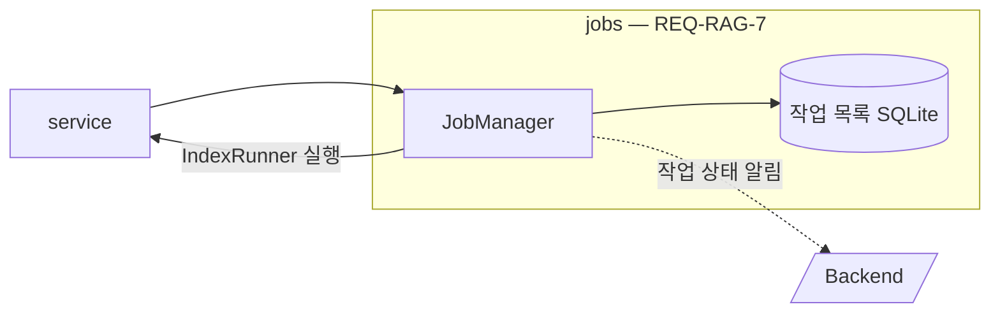
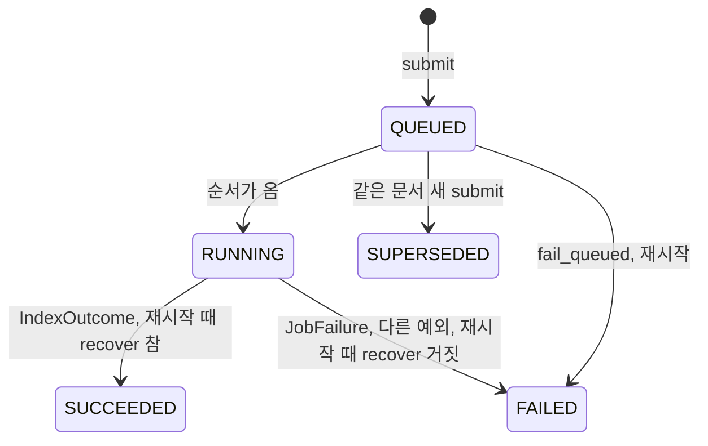

# jobs 모듈 명세 (REQ-RAG-7)

색인 요청을 작업으로 접수해 비동기로 실행하고, 작업 상태와 문서 색인 상태를 SQLite 파일에 보관하며, 상태가 바뀔 때마다 Backend에 알린다. 실제 처리(청킹 → 색인)는 service가 넘긴 `IndexRunner`를 실행할 뿐 내용을 모른다(`IF-RAG-2`). 폴더는 `apps/rag-server/src/minerva_rag/jobs`다.

## 요약

**핵심 계약**

- 작업 상태는 `IF-RAG-2`의 전이만 따른다. 실패한 작업은 다시 실행하지 않으며, 새 요청이 새 작업을 만든다 (`REQ-RAG-7.2.1`, `REQ-RAG-7.4`)
- 알림 순번은 문서마다 SQLite에 저장해 서버가 다시 시작해도 줄지 않는다. 순번이 다시 1부터 시작하면 Backend가 새 알림을 오래된 것으로 버린다 (`REQ-RAG-7.7.4`, 루트 `IF-2`)
- 문서의 "현재 검색되는 버전"은 그 문서에서 가장 최근에 완료한 작업의 버전이고, 문서가 삭제되면 비운다. 실패한 작업은 이 값을 바꾸지 않는다. 새 버전을 활성화한 뒤 완료를 기록하기 전에 멈춰도, 다시 시작할 때 `recover`로 확인해 완료로 기록하므로 Qdrant와 어긋나지 않는다 (`REQ-RAG-7.6.1`, `REQ-RAG-7.5.3`)
- jobs는 chunking·indexing·service를 import하지 않는다 (`IF-RAG-2`)

**기능 그룹**

| REQ | 기능 그룹 | 책임 |
| :--- | :--- | :--- |
| `REQ-RAG-7.1` | 작업 접수 | 작업을 색인 대기로 기록하고 ID를 곧바로 돌려준다 |
| `REQ-RAG-7.2` | 작업 상태 | 작업의 상태·단계·실패 사유·결과를 기록하고 조회하게 한다 |
| `REQ-RAG-7.3` | 처리 순서 | 동시 실행 상한, 접수 순서, 문서별 순차 실행, 대체됨을 지킨다 |
| `REQ-RAG-7.4` | 실패와 재색인 | 실패한 작업을 다시 실행하지 않고, 새 요청은 새 작업으로 받는다 |
| `REQ-RAG-7.5` | 중단과 복구 | 다시 시작해도 작업을 조회하게 하고, 끝나지 않은 작업을 결과가 검색에 쓰이는지에 따라 완료나 실패로 끝맺는다 |
| `REQ-RAG-7.6` | 문서 색인 상태 | 문서마다 현재 검색되는 버전과 최신 작업 상태를 돌려준다 |
| `REQ-RAG-7.7` | 상태 알림 | 상태가 바뀔 때마다 순번을 붙여 Backend에 알리고, 실패하면 다시 보낸다 |

**비범위**

- 체크섬 비교와 합류·재사용 판단 — indexing의 `decide_index`, service가 부른다
- 처리 중 오류를 `JobFailure`로 바꾸는 일 — service (`IF-RAG-2`)

## 구조

### 예상 배치

```text
src/minerva_rag/jobs/
└── MODULE.md

data/rag-server/jobs.sqlite3     # 작업 목록 (위치는 RAG_JOBS_DB_PATH)

tests/unit/jobs/
```

### 컨텍스트



`IndexRunner` 실행은 service가 넘긴 콜백을 부르는 것이며 import가 아니다. 점선은 프로세스 밖 HTTP다.

## 의존성과 공개 표면

### 의존 관계

| 대상 | 관계 | 사용하는 계약 | 계약 소유 | 관련 REQ |
| :--- | :--- | :--- | :--- | :--- |
| service | 콜백 (`IndexRunner`) | `JobQueue`, `IndexRunner`, `ProgressReporter`, `JobFailure` | `IF-RAG-2` | `REQ-RAG-7.3` |
| Backend | HTTP `POST` | 작업 상태 알림 | 루트 `IF-2` | `REQ-RAG-7.7` |
| SQLite 파일 | 파일 | 「데이터 계약」 | 이 문서 | `REQ-RAG-7.5.1` |
| core | import | `JobState`, `JobStage`, `IndexOutcome`, `FailureLocation`, `JobFailure`, `JobFailureCode`, `JobNotFoundError`, `ShuttingDownError`, `Settings`, `get_logger` | `IF-RAG-2`, core `MODULE.md` | `REQ-RAG-7` |

**금지 의존** — chunking·indexing·service를 import하지 않는다(`IF-RAG-2`). Backend에는 작업 상태 알림만 보낸다(`ARCHITECT.md` 「의존 규칙」).

### 공개 표면

| 기능 그룹 | 공개 표면 | 상세 계약 | 관련 REQ |
| :--- | :--- | :--- | :--- |
| 작업 접수 | `JobManager.submit`, `find_open`, `start`, `stop` | `IF-RAG-2`의 `JobQueue` | `REQ-RAG-7.1`, `REQ-RAG-7.5`, `REQ-RAG-10.1` |
| 처리 순서 | `JobManager.fail_queued`, `wait_running` | `IF-RAG-2`의 `JobQueue` | `REQ-RAG-7.3`, `REQ-RAG-10.5` |
| 작업 상태 | `JobManager.get_job`, `JobView`, `JobFailureInfo` | 「작업 상태 — REQ-RAG-7.2」 | `REQ-RAG-7.2` |
| 문서 색인 상태 | `JobManager.index_state`, `index_states`, `current_index`, `forget_document`, `IndexStateView`, `CurrentIndex` | 「문서 색인 상태 — REQ-RAG-7.6」 | `REQ-RAG-7.6` |
| 상태 알림 | Backend로 보내는 HTTP `POST` | 루트 `IF-2` | `REQ-RAG-7.7` |

## 데이터 계약

### 모델별 필드

**작업 레코드** (SQLite) — 정의: jobs, 값 생산: jobs (`REQ-RAG-7.2`, `REQ-RAG-7.5.1`)

| 필드 | 타입 | 필수 | 불변 조건 |
| :--- | :--- | :--- | :--- |
| `job_id` | 문자열 | 필수 | 모든 작업에 걸쳐 고유 |
| `doc_id`, `version`, `checksum` | 문자열 | 필수 | 접수 때 받은 값 그대로 |
| `accepted_order` | 정수 | 필수 | 접수할 때마다 1씩 커진다. 접수 순서의 기준 |
| `state` | `JobState` 값 | 필수 | `IF-RAG-2`의 전이만 따른다 |
| `stage` | `JobStage` 값 | 조건부 | `RUNNING`일 때만 값이 있다 |
| `failure_code`, `failure_message` | 문자열 | 조건부 | `FAILED`일 때만 값이 있다 |
| `failure_heading_path`, `failure_placeholder_id` | 문자열 | 선택 | `FAILED`이고 위치를 알 때만 |
| `chunk_count`, `fallback_used` | 정수, 불리언 | 조건부 | `SUCCEEDED`일 때만 값이 있다 |
| `prepared_chunk_count`, `prepared_fallback_used` | 정수, 불리언 | 선택 | `ProgressReporter.prepared`로 받은 결과. `RUNNING` 중에만 쓰고, 다시 시작할 때 완료로 바꾸는 작업의 결과가 된다 |

**문서 레코드** (SQLite) — 정의: jobs, 값 생산: jobs (`REQ-RAG-7.6`, `REQ-RAG-7.7.4`)

| 필드 | 타입 | 필수 | 불변 조건 |
| :--- | :--- | :--- | :--- |
| `doc_id` | 문자열 | 필수 | |
| `searchable_job_id` | 문자열 | 선택 | 그 문서에서 가장 최근에 `SUCCEEDED`가 된 작업. `forget_document` 뒤에는 비어 있다 |
| `last_sequence` | 정수 | 필수 | 그 문서에 마지막으로 붙인 알림 순번. 줄어들지 않는다 |

**`JobView`** — `job_id`, `doc_id`, `version`, `state`, `stage`, `failure: JobFailureInfo | None`, `result: IndexOutcome | None`. 값은 작업 레코드 그대로다. API의 `IndexJob`으로 옮긴다.

**`JobFailureInfo`** — `code`, `message`, `location: FailureLocation | None`.

**`IndexStateView`** — `doc_id`, `searchable_version`(`searchable_job_id` 작업의 버전, 없으면 `None`), `latest_job_id`·`latest_job_state`(그 문서에서 `accepted_order`가 가장 큰 작업, 없으면 `None`), `latest_job_stage`(최신 작업이 `RUNNING`일 때만). API의 `IndexState`로 옮긴다.

**`CurrentIndex`** — `job_id`, `version`, `checksum`. `searchable_job_id` 작업의 값이다.

### 변환·저장 경계

- **작업 상태 변경 → 알림 본문** (루트 `IF-2`) — 상태를 바꾸는 같은 트랜잭션에서 `last_sequence`를 1 올려 그 알림의 `sequence`로 쓴다. `index_state`는 그 트랜잭션이 끝난 시점의 `IndexStateView`다. 실패 시: 트랜잭션 전체를 되돌리고 알림을 보내지 않는다

## 기능 그룹별 요구사항

```python
@dataclass(frozen=True)
class JobFailureInfo:
    """실패한 작업의 사유다."""
    code: str
    message: str
    location: FailureLocation | None


@dataclass(frozen=True)
class JobView:
    """작업 하나의 상태다."""
    job_id: str
    doc_id: str
    version: str
    state: JobState
    stage: JobStage | None
    failure: JobFailureInfo | None
    result: IndexOutcome | None


@dataclass(frozen=True)
class IndexStateView:
    """문서 하나의 색인 상태다."""
    doc_id: str
    searchable_version: str | None
    latest_job_id: str | None
    latest_job_state: JobState | None
    latest_job_stage: JobStage | None


@dataclass(frozen=True)
class CurrentIndex:
    """지금 검색되는 색인을 만든 작업이다."""
    job_id: str
    version: str
    checksum: str


class JobManager:  # JobQueue(IF-RAG-2)를 구현한다
    """작업을 접수·실행·기록하고 Backend에 알린다."""

    def __init__(self, settings: Settings) -> None: ...
    async def get_job(self, job_id: str) -> JobView: ...
    async def index_state(self, doc_id: str) -> IndexStateView: ...
    async def index_states(self, doc_ids: Sequence[str]) -> list[IndexStateView]: ...
    async def current_index(self, doc_id: str) -> CurrentIndex | None: ...
    async def forget_document(self, doc_id: str) -> None: ...
```

`start`, `stop`, `submit`, `find_open`, `fail_queued`, `wait_running`의 시그니처와 의무는 `IF-RAG-2`가 소유한다. 아래 충족 기준은 그 의무를 이 모듈 쪽에서 관찰하는 조건이다.

### 작업 접수 — `REQ-RAG-7.1`

**`REQ-RAG-7.1.1`** 처리를 기다리지 않고 작업 ID 반환

- 처리 계약: `submit`은 작업 레코드를 쓰고 `IndexRunner`를 실행 대기열에 넣은 뒤 바로 돌아온다. `stop`이 불린 뒤의 `submit`은 `ShuttingDownError`를 낸다
- 충족 기준: 끝나지 않는 `IndexRunner`를 넘겨도 `submit`이 작업 ID를 돌려주고, `stop` 뒤에는 `ShuttingDownError`가 난다

**`REQ-RAG-7.1.2`** 색인 대기로 시작

- 충족 기준: `submit` 직후 `get_job`의 `state`가 `QUEUED`다

### 작업 상태 — `REQ-RAG-7.2`

**`REQ-RAG-7.2.1`** 다섯 가지 상태

- 처리 계약: 상태는 `QUEUED → RUNNING → SUCCEEDED·FAILED` 또는 `QUEUED → SUPERSEDED·FAILED`로만 바뀐다. 끝난 상태(`SUCCEEDED`, `FAILED`, `SUPERSEDED`)에서 다른 상태로 바뀌지 않는다
- 충족 기준: 어떤 순서로 이벤트가 와도 기록된 전이가 위 경로 밖으로 나가지 않는다

**`REQ-RAG-7.2.2`** 작업 ID로 조회

- 실패: 없는 ID면 `JobNotFoundError`를 낸다
- 충족 기준: 접수한 작업을 ID로 조회하면 `JobView`가 나오고, 없는 ID는 `JobNotFoundError`다

**`REQ-RAG-7.2.3`** 색인 중 단계

- 처리 계약: `ProgressReporter.stage`로 받은 단계를 `RUNNING` 작업의 `stage`로 기록한다. `RUNNING`이 아닌 작업의 `stage`는 `None`이다
- 충족 기준: `IndexRunner`가 `EMBEDDING`을 알린 직후 `get_job`의 `stage`가 `EMBEDDING`이고, 끝난 뒤에는 `None`이다

**`REQ-RAG-7.2.4`** 실패 사유 코드와 한국어 설명

- 처리 계약: `IndexRunner`가 `JobFailure`를 내면 그 `code`·`message`를 기록하고, 다른 예외를 내면 `JobFailureCode.INTERNAL_ERROR`와 내부 정보 없는 한국어 설명을 기록한다
- 충족 기준: `JobFailure`의 코드·설명이 그대로 조회되고, 다른 예외는 `INTERNAL_ERROR`와 그 예외 문자열이 들지 않은 설명으로 조회된다

**`REQ-RAG-7.2.5`** 실패 위치

- 충족 기준: `JobFailure`에 `FailureLocation`이 있으면 `failure.location`이 같은 값이고, 없으면 `None`이다

**`REQ-RAG-7.2.6`** 완료 결과

- 충족 기준: `IndexRunner`가 `IndexOutcome`을 돌려주면 `state`가 `SUCCEEDED`이고 `result`의 청크 수·대체 분할 여부와 `doc_id`·`version`이 조회된다

### 처리 순서 — `REQ-RAG-7.3`

**`REQ-RAG-7.3.1`** 동시 실행 상한

- 충족 기준: 상한이 2일 때 끝나지 않는 작업 세 개를 다른 문서로 접수하면 `RUNNING`이 두 개를 넘지 않는다

**`REQ-RAG-7.3.2`** 접수 순서대로 대기

- 처리 계약: 실행할 수 있는 작업 중 `accepted_order`가 가장 작은 것부터 실행한다
- 충족 기준: 상한 1에서 A·B·C 문서 작업을 차례로 접수하면 A·B·C 순으로 `RUNNING`이 된다

**`REQ-RAG-7.3.3`** 같은 문서는 하나씩

- 처리 계약: 같은 문서의 작업이 `RUNNING`이면 그 문서의 다음 작업은 상한에 여유가 있어도 기다린다
- 충족 기준: 상한 2에서 같은 문서 작업이 실행 중일 때 접수한 그 문서의 작업이 앞 작업이 끝난 뒤에 `RUNNING`이 된다

**`REQ-RAG-7.3.4`** 시작하지 않은 이전 작업은 대체됨

- 충족 기준: 같은 문서의 `QUEUED` 작업이 있을 때 새로 `submit`하면 이전 작업이 `SUPERSEDED`가 되고 그 `IndexRunner`는 불리지 않는다. `RUNNING` 작업은 바뀌지 않는다

### 실패와 재색인 — `REQ-RAG-7.4`

**`REQ-RAG-7.4.1`** 다시 시도하지 않음

- 충족 기준: 실패한 `IndexRunner`가 다시 불리지 않는다

**`REQ-RAG-7.4.2`** 새 요청 전까지 실패로 남음

- 충족 기준: 실패한 작업의 상태가 그 문서의 새 `submit` 전후로 `FAILED` 그대로다

**`REQ-RAG-7.4.3`** 같은 체크섬이어도 새 작업

- 처리 계약: `find_open`은 `QUEUED`·`RUNNING` 작업만 찾는다
- 충족 기준: 실패한 작업과 같은 문서·같은 체크섬으로 `find_open`하면 `None`이고, `submit`하면 새 작업 ID가 나온다

### 중단과 복구 — `REQ-RAG-7.5`

**`REQ-RAG-7.5.1`** 다시 시작한 뒤에도 조회

- 충족 기준: 같은 `RAG_JOBS_DB_PATH`로 `JobManager`를 새로 만들고 `start`하면 이전 작업이 같은 상태·결과로 조회된다

**`REQ-RAG-7.5.2`** 끝나지 않은 작업은 실패

- 처리 계약: `start(recover)`는 남은 `QUEUED` 작업을, 그리고 `REQ-RAG-7.5.3`에 들지 않는 `RUNNING` 작업을 `FAILED`(`JobFailureCode.SERVER_RESTARTED`)로 바꾸고, 바뀐 작업마다 알린다. 이 처리를 마친 뒤에 새 작업을 실행한다
- 충족 기준: 남은 `QUEUED` 작업과, `recover`가 거짓인 `RUNNING` 작업이 `SERVER_RESTARTED`로 실패하고 작업마다 알림이 나간다

**`REQ-RAG-7.5.3`** 결과가 이미 검색에 쓰이면 완료

- 처리 계약: `start`는 남은 `RUNNING` 작업마다 `recover(doc_id, job_id)`를 부른다. 참이고 `prepared` 결과가 있으면 그 결과로 `SUCCEEDED`를 기록하고 `searchable_job_id`를 그 작업으로 바꾼 뒤 알린다. 남은 정리(이전 레코드 삭제, 최신판 표시)는 `recover`가 한다(indexing `MODULE.md` 「기동 복구」)
- 충족 기준: `prepared` 결과가 있는 `RUNNING` 작업에 `recover`가 참이면 `SUCCEEDED`와 그 결과로 조회되고 `searchable_version`이 그 버전이며 `succeeded` 알림이 나간다. `recover`가 거짓이면 `SERVER_RESTARTED` 실패다

### 문서 색인 상태 — `REQ-RAG-7.6`

**`REQ-RAG-7.6.1`** 검색되는 버전과 최신 작업 상태

- 처리 계약: `searchable_version`은 가장 최근에 완료한 작업의 버전이며, 그 뒤 작업이 실패해도 바뀌지 않는다. `forget_document` 뒤에는 `None`이다
- 충족 기준: v1 완료 뒤 v2가 실패하면 `searchable_version`이 v1이고 최신 작업 상태가 `FAILED`이며, `forget_document` 뒤에는 `searchable_version`이 `None`이다

**`REQ-RAG-7.6.2`** 문서 ID로 조회

- 충족 기준: `index_state`가 검색되는 버전, 최신 작업 ID·상태를 돌려주고, 최신 작업이 `RUNNING`이면 단계도 돌려준다. 작업이 없던 문서는 모든 값이 `None`이다

**`REQ-RAG-7.6.3`** 여러 문서 한 번에 조회

- 충족 기준: `index_states`가 받은 `doc_ids`와 같은 순서·같은 개수로 돌려준다

### 상태 알림 — `REQ-RAG-7.7`

알림 본문과 받는 쪽 의무는 루트 `IF-2`가 소유한다. 보낼 주소는 `RAG_BACKEND_EVENTS_URL`이다.

**`REQ-RAG-7.7.1`** 상태가 바뀔 때마다 알림

- 처리 계약: 접수(`QUEUED`)를 포함해 상태가 바뀔 때마다 알림 하나를 보낸다. 알림 전송은 작업 실행을 막지 않는다
- 충족 기준: 접수부터 완료까지 `queued`·`running`·`succeeded` 알림 세 개가 그 순번 순으로 나가고, 각 본문의 `index_state`가 그 시점 값이다

**`REQ-RAG-7.7.2`** 단계 변경은 알리지 않음

- 충족 기준: `IndexRunner`가 단계를 세 번 알려도 알림 수가 늘지 않는다

**`REQ-RAG-7.7.3`** 실패하면 다시 보냄

- 처리 계약: 2xx가 아니거나 연결에 실패하면 1초에서 시작해 두 배씩 늘어나는 간격으로 `RAG_NOTIFY_RETRIES`번까지 다시 보낸다. 다 실패하면 그 알림을 버리고 경고 로그를 남긴다
- 충족 기준: 수신자가 계속 500을 주면 첫 전송 뒤 5번 더 보내고 멈추며, 간격이 1·2·4·8·16초다(시계 대체). 세 번째에 2xx를 주면 거기서 멈춘다

**`REQ-RAG-7.7.4`** 문서별 순번

- 처리 계약: 순번은 문서마다 1부터 시작해 알림마다 1씩 커지고, 다시 보낼 때는 바뀌지 않으며, 서버를 다시 시작해도 이어진다
- 충족 기준: 한 문서의 알림 순번이 1, 2, 3으로 커지고, 재전송 본문의 순번이 원래와 같으며, 다시 시작한 뒤 첫 알림이 마지막 순번 + 1이다

**`REQ-RAG-7.7.5`** 알림 토큰

- 처리 계약: 모든 알림(재전송 포함)의 `X-Minerva-Token` 헤더에 `RAG_BACKEND_EVENTS_TOKEN`을 담는다(루트 `IF-2`). Backend가 `401`로 응답해도 다른 실패와 같이 다시 보낸다
- 충족 기준: 가짜 수신자가 받은 모든 알림의 헤더 값이 설정한 토큰과 같다

## 핵심 흐름



1. **접수** — 같은 문서의 `QUEUED` 작업을 `SUPERSEDED`로 바꾼 뒤 새 작업을 `QUEUED`로 기록한다. 두 변경을 한 트랜잭션에서 하고, 각각 알린다. (`REQ-RAG-7.1`, `REQ-RAG-7.3.4`)
2. **실행** — 상한과 문서별 순차 조건을 만족하는 가장 먼저 접수된 작업을 `RUNNING`으로 바꾸고 `IndexRunner`를 부른다. (`REQ-RAG-7.3`)
3. **종료** — `IndexOutcome`이면 `SUCCEEDED`로 기록하고 그 문서의 `searchable_job_id`를 이 작업으로 바꾼다. 예외면 `FAILED`로 기록하며 `searchable_job_id`는 그대로 둔다. (`REQ-RAG-7.2`, `REQ-RAG-7.6.1`)
4. **정지** — `stop`은 새 접수를 막고 `RUNNING` 작업을 `timeout_seconds`까지 기다린 뒤 실행을 취소한다. 취소한 작업은 다음 `start`에서 `recover`로 확인해 완료나 실패로, 남은 `QUEUED` 작업은 실패로 바뀐다. (`REQ-RAG-10.1.3`, `REQ-RAG-7.5`)

## 실행 계약

### 설정

정의는 core 「설정」이 소유한다. 이 모듈이 읽는 키: `RAG_JOBS_DB_PATH`, `RAG_JOB_CONCURRENCY`, `RAG_NOTIFY_RETRIES`, `RAG_BACKEND_EVENTS_URL`, `RAG_BACKEND_EVENTS_TOKEN`.

### 예외

| 예외 | 발생 조건 | 코드·상태 | 처리 책임 | 관련 REQ |
| :--- | :--- | :--- | :--- | :--- |
| `JobNotFoundError` | 없는 작업 ID로 조회 | `JOB_NOT_FOUND` | 발생: jobs. 변환: api | `REQ-RAG-7.2.2` |
| `ShuttingDownError` | `stop` 뒤 `submit` | `SHUTTING_DOWN` | 발생: jobs. 변환: api | `REQ-RAG-10.1.3` |

### 로그

| 이벤트 | 발생 시점 | 레벨 | 허용 필드 | 관련 REQ |
| :--- | :--- | :--- | :--- | :--- |
| `jobs.state` | 상태 변경 | info | `job_id`, `doc_id`, `version`, `state`, `failure_code` | `REQ-RAG-7.2` |
| `jobs.notify_failed` | 재전송을 모두 실패해 알림을 버릴 때 | warning | `job_id`, `doc_id`, `sequence`, `attempts` | `REQ-RAG-7.7.3` |
| `jobs.restart_resolved` | `start`에서 끝나지 않은 작업을 끝맺을 때 | warning | `failed`, `recovered` (개수) | `REQ-RAG-7.5.2`, `REQ-RAG-7.5.3` |

### 런타임·보안

- **실행 형태** — 작업 실행과 알림 전송은 이벤트 루프 위의 백그라운드 작업이다. SQLite 접근은 이벤트 루프를 막지 않는다(`AGENTS.md`)
- **영속화·복구** — 상태 변경과 순번 증가는 한 트랜잭션으로 커밋한 뒤에 알린다. 다시 보내지 못한 알림은 저장하지 않으며, Backend의 상태 맞추기가 메운다(`REQ-BE-3.3.1`)

## 테스트와 추적성

| REQ ID | 종류 | 검증 초점 | 대체 경계 | 예상 위치 |
| :--- | :--- | :--- | :--- | :--- |
| `REQ-RAG-7.1.1` | unit | 즉시 반환, `stop` 뒤 `ShuttingDownError` | `IndexRunner` (가짜), Backend (가짜 HTTP) | `tests/unit/jobs/` |
| `REQ-RAG-7.1.2` | unit | 접수 직후 `QUEUED` | `IndexRunner` (가짜), Backend (가짜 HTTP) | `tests/unit/jobs/` |
| `REQ-RAG-7.2.1` | unit | 허용된 전이만, 끝난 상태 고정 | `IndexRunner` (가짜), Backend (가짜 HTTP) | `tests/unit/jobs/` |
| `REQ-RAG-7.2.2` | unit | ID 조회, 없는 ID는 `JobNotFoundError` | 임시 SQLite | `tests/unit/jobs/` |
| `REQ-RAG-7.2.3` | unit | 단계 기록과 끝난 뒤 `None` | `IndexRunner` (가짜) | `tests/unit/jobs/` |
| `REQ-RAG-7.2.4` | unit | `JobFailure` 코드·설명, 다른 예외는 `INTERNAL_ERROR`와 내부 정보 없음 | `IndexRunner` (가짜) | `tests/unit/jobs/` |
| `REQ-RAG-7.2.5` | unit | 실패 위치 유무 | `IndexRunner` (가짜) | `tests/unit/jobs/` |
| `REQ-RAG-7.2.6` | unit | 완료 결과 | `IndexRunner` (가짜) | `tests/unit/jobs/` |
| `REQ-RAG-7.3.1` | unit | 동시 실행 상한 | `IndexRunner` (가짜, 대기) | `tests/unit/jobs/` |
| `REQ-RAG-7.3.2` | unit | 접수 순서 실행 | `IndexRunner` (가짜, 대기) | `tests/unit/jobs/` |
| `REQ-RAG-7.3.3` | unit | 같은 문서 순차 실행 | `IndexRunner` (가짜, 대기) | `tests/unit/jobs/` |
| `REQ-RAG-7.3.4` | unit | `QUEUED` 대체됨, `RUNNING` 유지, 대체된 러너 미실행 | `IndexRunner` (가짜, 대기) | `tests/unit/jobs/` |
| `REQ-RAG-7.4.1` | unit | 실패 러너 재실행 없음 | `IndexRunner` (가짜, 실패) | `tests/unit/jobs/` |
| `REQ-RAG-7.4.2` | unit | 새 접수 뒤에도 실패 유지 | `IndexRunner` (가짜, 실패) | `tests/unit/jobs/` |
| `REQ-RAG-7.4.3` | unit | 실패 작업은 열린 작업이 아님, 새 작업 생성 | `IndexRunner` (가짜, 실패) | `tests/unit/jobs/` |
| `REQ-RAG-7.5.1` | unit | 새 인스턴스에서 조회 | 임시 SQLite | `tests/unit/jobs/` |
| `REQ-RAG-7.5.2` | unit | 재시작 시 `QUEUED`와 `recover` 거짓 작업의 `SERVER_RESTARTED` 실패와 알림, 끝맺은 뒤 새 작업 실행 | 임시 SQLite, `recover` (가짜), Backend (가짜 HTTP) | `tests/unit/jobs/` |
| `REQ-RAG-7.5.3` | unit | `recover` 참이면 `prepared` 결과로 완료, 검색 버전 갱신, 알림 | 임시 SQLite, `recover` (가짜), Backend (가짜 HTTP) | `tests/unit/jobs/` |
| `REQ-RAG-7.6.1` | unit | 실패해도 검색 버전 유지, `forget_document` 뒤 `None` | `IndexRunner` (가짜) | `tests/unit/jobs/` |
| `REQ-RAG-7.6.2` | unit | 문서 색인 상태 필드, 작업 없는 문서 | `IndexRunner` (가짜) | `tests/unit/jobs/` |
| `REQ-RAG-7.6.3` | unit | 여러 문서 순서·개수 | `IndexRunner` (가짜) | `tests/unit/jobs/` |
| `REQ-RAG-7.7.1` | unit | 상태 변경마다 알림, 본문의 `index_state` | Backend (가짜 HTTP) | `tests/unit/jobs/` |
| `REQ-RAG-7.7.2` | unit | 단계 변경 미알림 | Backend (가짜 HTTP) | `tests/unit/jobs/` |
| `REQ-RAG-7.7.3` | unit | 재전송 횟수·간격, 성공 시 중단, 포기 시 경고 | Backend (가짜 HTTP), 시계 | `tests/unit/jobs/` |
| `REQ-RAG-7.7.4` | unit | 순번 증가, 재전송 시 유지, 재시작 뒤 이어짐 | Backend (가짜 HTTP), 임시 SQLite | `tests/unit/jobs/` |
| `REQ-RAG-7.7.5` | unit | 모든 알림·재전송의 토큰 헤더 | Backend (가짜 HTTP) | `tests/unit/jobs/` |
