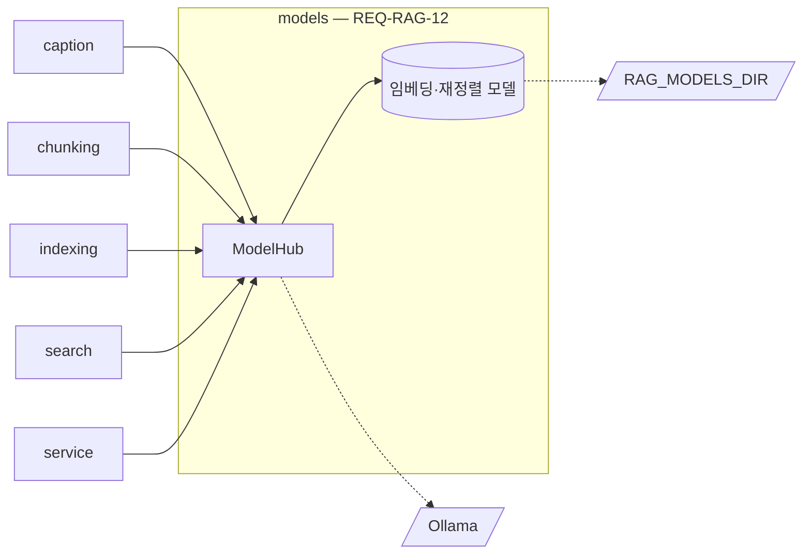

# models 모듈 명세 (REQ-RAG-12)

RAG Server가 쓰는 모델을 준비하고 호출하는 유일한 통로다. Ollama의 LLM·VLM(청킹, 표 요약, 이미지 캡션)과 프로세스 안의 sentence-transformers 모델(임베딩, 재정렬)을 감싸고, 색인과 질의가 같은 방식으로 만들어야 하는 dense·키워드 벡터를 한 곳에서 만든다. 폴더는 `apps/rag-server/src/minerva_rag/models`다.

## 요약

**핵심 계약**

- 문서와 질의의 dense 벡터는 같은 임베딩 모델로, 키워드 벡터는 같은 토큰화로 만든다. 한쪽만 바뀌면 오류 없이 검색 결과가 틀어진다 (`REQ-RAG-3.2`, `REQ-RAG-4.1.1`)
- 설정한 모델을 하나라도 불러오지 못하면 기동하지 않는다 (`REQ-RAG-12.1.1`)
- 생성 요청은 Ollama의 기본 컨텍스트에 맡기지 않는다. 요청마다 `RAG_LLM_CONTEXT_TOKENS`를 지정하고, 넘치는 입력은 보내지 않고 오류를 낸다. Ollama는 컨텍스트를 넘는 입력을 오류 없이 잘라 쓰기 때문이다 (`REQ-RAG-2.5.2.2`)
- 생각 모드를 끄고 생성한다. 생각 과정이 응답에 섞이면 부른 단위의 응답 해석이 깨진다 (`REQ-RAG-2.1.1`, `REQ-RAG-1.1.1`)
- 외부에서 호스팅하는 모델 API를 부르지 않는다. LLM·VLM은 설정한 Ollama, 임베딩·재정렬은 프로세스 안에서만 실행한다 (`AGENTS.md`)

**기능 그룹**

| REQ | 기능 그룹 | 책임 |
| :--- | :--- | :--- |
| `REQ-RAG-12.1` | 모델 준비와 호출 | 기동 때 모델을 준비하고, 생성·임베딩·키워드 벡터·재정렬·토큰 세기를 제공한다 |

**비범위**

- 모델에 보낼 프롬프트와 응답 해석 — 그 모델을 쓰는 단위(caption, chunking)
- 재정렬 실패 시 합친 순위로 돌려주는 폴백 — search (`REQ-RAG-4.2.2`)
- 작업 실패 사유로 바꾸는 일 — service

## 구조

### 예상 배치

```text
src/minerva_rag/models/
└── MODULE.md

tests/unit/models/
tests/integration/models/
```

### 컨텍스트



실선은 import·프로세스 안 호출, 점선은 프로세스 밖 자원이다. core 의존은 생략했다.

## 의존성과 공개 표면

### 의존 관계

| 대상 | 관계 | 사용하는 계약 | 계약 소유 | 관련 REQ |
| :--- | :--- | :--- | :--- | :--- |
| core | import | `Settings`, `get_logger`, `ModelLoadError`, `ModelUnavailableError`, `PromptTooLongError`, `SparseVector` | core `MODULE.md` | `REQ-RAG-12.1` |
| Ollama | HTTP | 생성, 모델 목록 | Ollama | `REQ-RAG-12.1.1`, `REQ-RAG-12.1.2` |
| sentence-transformers | import | 임베딩·재정렬 모델 실행 | sentence-transformers | `REQ-RAG-12.1.1` |
| 모델 파일 위치 | 파일 읽기 | `RAG_MODELS_DIR` | core 「설정」 | `REQ-RAG-12.1.1` |

**금지 의존** — 다른 단위가 Ollama·sentence-transformers를 직접 부르지 않는다(`ARCHITECT.md` 「의존 규칙」). 외부 호스팅 모델 API를 부르지 않는다(`AGENTS.md`).

### 공개 표면

| 기능 그룹 | 공개 표면 | 상세 계약 | 관련 REQ |
| :--- | :--- | :--- | :--- |
| 모델 준비와 호출 | `ModelHub.prepare`, `ModelHub.close` | 「모델 준비와 호출 — REQ-RAG-12.1」 | `REQ-RAG-12.1.1` |
| 모델 준비와 호출 | `ModelHub.generate`, `LlmRole` | 같은 절 | `REQ-RAG-12.1.2` |
| 모델 준비와 호출 | `ModelHub.embed_documents`, `embed_query`, `encode_sparse_documents`, `encode_sparse_query`, `rerank`, `count_tokens`, `embedding_dimension`, `embedding_model_name` | 같은 절 | `REQ-RAG-12.1` |
| 모델 준비와 호출 | `ModelHub.ollama_available` | 같은 절 | `REQ-RAG-9.2.1` |

## 기능 그룹별 요구사항

### 모델 준비와 호출 — `REQ-RAG-12.1`

```python
class LlmRole(StrEnum):
    CHUNKING = "chunking"            # RAG_CHUNKING_LLM
    TABLE_SUMMARY = "table_summary"  # RAG_TABLE_LLM
    IMAGE_CAPTION = "image_caption"  # RAG_CAPTION_VLM


class ModelHub:
    """모델을 준비하고 호출한다."""

    def __init__(self, settings: Settings) -> None: ...
    async def prepare(self) -> None: ...
    async def close(self) -> None: ...

    async def generate(
        self,
        role: LlmRole,
        prompt: str,
        *,
        image: bytes | None = None,
        json_schema: Mapping[str, Any] | None = None,
    ) -> str: ...

    async def embed_documents(self, texts: Sequence[str]) -> list[list[float]]: ...
    async def embed_query(self, text: str) -> list[float]: ...
    async def encode_sparse_documents(self, texts: Sequence[str]) -> list[SparseVector]: ...
    async def encode_sparse_query(self, text: str) -> SparseVector: ...
    async def rerank(self, query: str, passages: Sequence[str]) -> list[float]: ...
    def count_tokens(self, text: str) -> int: ...

    @property
    def embedding_dimension(self) -> int: ...
    @property
    def embedding_model_name(self) -> str: ...

    async def ollama_available(self) -> bool: ...
```

- `generate`는 `role`에 대응하는 설정의 모델로 생성한다. `image`는 `IMAGE_CAPTION`에서만 쓴다. `json_schema`를 주면 그 스키마에 맞는 JSON 문자열을 요청한다
- `generate`는 모든 요청에 컨텍스트 크기 `RAG_LLM_CONTEXT_TOKENS`를 지정한다. `prompt`의 토큰 수가 `RAG_LLM_CONTEXT_TOKENS - RAG_LLM_OUTPUT_RESERVE_TOKENS`를 넘으면 Ollama에 보내지 않고 `PromptTooLongError`를 낸다. 이미지의 토큰은 세지 않는다
- `generate`는 생각 모드를 끄고 요청한다. 그래도 응답 앞에 생각 블록(`<think>…</think>`)이 오면 지우고 나머지만 돌려준다
- `embed_documents`·`rerank`의 반환 목록은 입력과 같은 길이·같은 순서다. `rerank`는 점수가 클수록 관련이 높다
- `count_tokens`는 임베딩 모델의 토크나이저로 센다(core 「설정」)
- 키워드 벡터의 토큰화는 「키워드 토큰화」를 따르며, `encode_sparse_documents`와 `encode_sparse_query`가 같은 토큰화를 쓴다
- 임베딩·재정렬·키워드 벡터 계산은 이벤트 루프를 막지 않는다(`AGENTS.md`)

**키워드 토큰화** (`REQ-RAG-3.2.2`, `REQ-RAG-4.1.1`)

형태소 분석(`REQ-RAG-3.7`, `REQ-RAG-4.6`)은 M-3이므로, M-1의 키워드 벡터는 아래 토큰화로 만든다. 문서와 질의가 같은 토큰화를 써야 키워드 검색이 맞는다.

- 처리 계약: 텍스트를 NFKC로 정규화하고 영문을 소문자로 바꾼 뒤, 공백과 구두점으로 나눈 단어를 토큰으로 쓴다. 한글이 든 단어는 그 단어의 한글 연속 구간에서 이웃한 두 글자 조각도 토큰으로 더한다. 문서 벡터의 값은 토큰 빈도, 질의 벡터의 값은 1이며, 역문서빈도 보정은 store의 IDF 보정이 한다(store `MODULE.md` 「변환·저장 경계」)
- 충족 기준: "인증서를"과 "인증서는"이 "인증"·"증서" 조각을 함께 갖고, "Certificate"와 "certificate"가 같은 토큰이며, 같은 텍스트를 문서·질의로 인코딩하면 같은 인덱스 집합이 나온다

**`REQ-RAG-12.1.1`** 모델을 불러오지 못하면 기동하지 않음

- 처리 계약: `prepare`는 `RAG_EMBEDDING_MODEL`·`RAG_RERANKER_MODEL`을 `RAG_MODELS_DIR`에서 불러오고(없으면 그 위치로 내려받는다), Ollama에 `RAG_CHUNKING_LLM`·`RAG_TABLE_LLM`·`RAG_CAPTION_VLM`이 있는지 확인한다. Ollama 모델은 내려받지 않는다
- 실패: 하나라도 불러오거나 확인하지 못하면 `ModelLoadError`를 낸다. 메시지에는 어느 모델인지를 담는다. Ollama에 연결할 수 없는 것도 여기에 든다
- 충족 기준: 설정한 Ollama 모델이 없거나, 임베딩·재정렬 모델을 불러오지 못하거나, Ollama에 연결할 수 없으면 `prepare`가 `ModelLoadError`를 내고, 모두 있으면 정상으로 끝난 뒤 `embedding_dimension`이 양수다

**`REQ-RAG-12.1.2`** 모델 서버 연결 실패 알림

- 처리 계약: `prepare`가 끝난 뒤 `generate`가 Ollama에 연결할 수 없으면 `ModelUnavailableError`를 낸다. 연결은 됐지만 생성이 실패한 경우는 그 오류를 그대로 내며, 해석은 부른 단위가 한다
- 충족 기준: Ollama가 연결을 거부하면 `generate`가 `ModelUnavailableError`를 내고, `ollama_available()`이 `False`다

## 실행 계약

### 설정

정의는 core 「설정」이 소유한다. 이 모듈이 읽는 키: `RAG_OLLAMA_URL`, `RAG_LLM_CONTEXT_TOKENS`, `RAG_LLM_OUTPUT_RESERVE_TOKENS`, `RAG_MODELS_DIR`, `RAG_CHUNKING_LLM`, `RAG_TABLE_LLM`, `RAG_CAPTION_VLM`, `RAG_EMBEDDING_MODEL`, `RAG_RERANKER_MODEL`.

### 예외

| 예외 | 발생 조건 | 코드·상태 | 처리 책임 | 관련 REQ |
| :--- | :--- | :--- | :--- | :--- |
| `ModelLoadError` | `prepare`에서 모델을 불러오거나 확인하지 못했다 | core 「예외」 | 발생: models. 처리: service | `REQ-RAG-12.1.1` |
| `ModelUnavailableError` | 기동 뒤 Ollama에 연결할 수 없다 | `MODEL_UNAVAILABLE` | 발생: models. 전파: 부른 단위 | `REQ-RAG-12.1.2` |
| `PromptTooLongError` | 프롬프트가 컨텍스트에서 출력 몫을 뺀 크기를 넘는다 | core 「예외」 | 발생: models. 처리: 부른 단위 | `REQ-RAG-2.5.2.2` |

### 로그

| 이벤트 | 발생 시점 | 레벨 | 허용 필드 | 관련 REQ |
| :--- | :--- | :--- | :--- | :--- |
| `models.prepare_failed` | `prepare` 실패 | error | `model`, `reason` | `REQ-RAG-12.1.1` |
| `models.generate` | `generate` 끝 | info | `role`, `model`, `prompt_chars`, `elapsed_ms` | `REQ-RAG-12.1.2` |
| `models.unavailable` | Ollama 연결 실패 | warning | `role`, `model` | `REQ-RAG-12.1.2` |

프롬프트와 생성 결과는 문서 본문을 담으므로 로그에 넣지 않는다.

### 실패 모드

- **임베딩 모델 교체** (`REQ-RAG-3.2.1`) — 증상: 설정의 임베딩 모델을 바꾸면 기존 벡터와 새 질의 벡터의 공간이 달라 검색이 틀어진다. 탐지: 차원이 다르면 store가 거부한다(`REQ-RAG-13.1.2`). 같은 차원의 다른 모델은 체크섬이 달라지므로(`REQ-RAG-3.5.2`) 강제 재색인으로 바로잡는다. 방어: `embedding_model_name`을 체크섬에 넣는다(indexing)

## 테스트와 추적성

| REQ ID | 종류 | 검증 초점 | 대체 경계 | 예상 위치 |
| :--- | :--- | :--- | :--- | :--- |
| `REQ-RAG-12.1.1` | unit | Ollama 모델 없음·연결 불가·로컬 모델 로드 실패 시 `ModelLoadError`, 정상 시 차원 양수 | Ollama (가짜 HTTP), sentence-transformers 로더 | `tests/unit/models/` |
| `REQ-RAG-12.1.1` | integration | 실제 Ollama·모델 파일로 `prepare` 성공 | | `tests/integration/models/` |
| `REQ-RAG-12.1.2` | unit | 연결 거부 시 `ModelUnavailableError`, `ollama_available()` 거짓 | Ollama (가짜 HTTP) | `tests/unit/models/` |
| `REQ-RAG-2.5.2.2` | unit | 모든 생성 요청에 컨텍스트 크기 지정, 넘치는 프롬프트는 보내지 않고 `PromptTooLongError` (컨텍스트) | Ollama (가짜 HTTP) | `tests/unit/models/` |
| `REQ-RAG-2.1.1` | unit | 생각 모드 끔 요청, 응답의 생각 블록 제거 (생각 모드) | Ollama (가짜 HTTP) | `tests/unit/models/` |
| `REQ-RAG-4.1.1` | unit | 키워드 토큰화의 정규화·2글자 조각, 문서·질의 인코딩 일치 (키워드 토큰화) | | `tests/unit/models/` |
