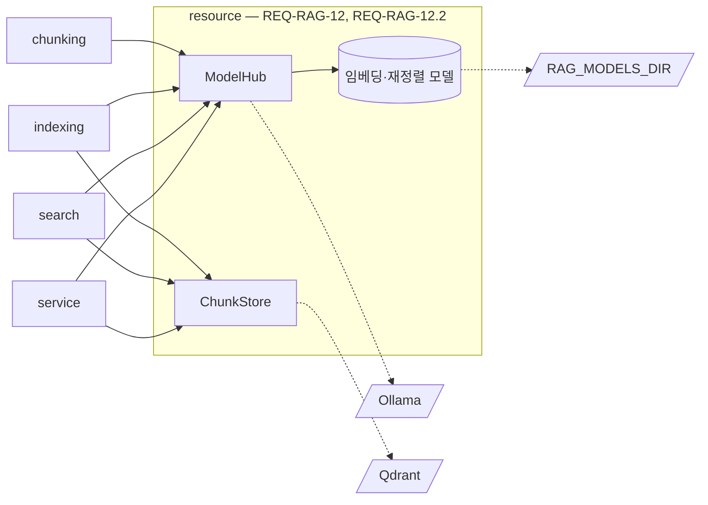

# resource 모듈 명세 (REQ-RAG-12)

RAG Server가 쓰는 외부 자원 — 모델과 Qdrant — 에 닿는 유일한 통로다. Ollama의 LLM·VLM(청킹, 표 요약, 이미지 캡션)과 프로세스 안의 sentence-transformers 모델(임베딩, 재정렬)을 감싸고, 색인과 질의가 같은 방식으로 만들어야 하는 dense·키워드 벡터를 한 곳에서 만든다. 또 Qdrant에 연결해 청크 레코드(`IF-RAG-1`의 `ChunkRecord`)와 dense·키워드 벡터를 저장·삭제·조회한다. 레코드의 필드를 스스로 채우거나 바꾸지 않고 받은 그대로 저장하며, 저장된 벡터 차원이 지금 임베딩 모델과 다르면 저장도 조회도 하지 않는다. 폴더는 `apps/rag-server/src/minerva_rag/resource`다.

## 요약

**핵심 계약**

- 문서와 질의의 dense 벡터는 같은 임베딩 모델로, 키워드 벡터는 같은 토큰화로 만든다. 한쪽만 바뀌면 오류 없이 검색 결과가 틀어진다 (`REQ-RAG-3.2`, `REQ-RAG-4.1.1`)
- 설정한 모델을 하나라도 불러오지 못하면 기동하지 않는다 (`REQ-RAG-12.1.1`)
- 생성 요청은 Ollama의 기본 컨텍스트에 맡기지 않는다. 요청마다 `RAG_LLM_CONTEXT_TOKENS`를 지정하고, 넘치는 입력은 보내지 않고 오류를 낸다. Ollama는 컨텍스트를 넘는 입력을 오류 없이 잘라 쓰기 때문이다 (`REQ-RAG-2.5.2.2`)
- 생각 모드를 끄고 생성한다. 생각 과정이 응답에 섞이면 부른 단위의 응답 해석이 깨진다 (`REQ-RAG-2.1.1`, `REQ-RAG-10.2.2.1`)
- 외부에서 호스팅하는 모델 API를 부르지 않는다. LLM·VLM은 설정한 Ollama, 임베딩·재정렬은 프로세스 안에서만 실행한다 (`AGENTS.md`)
- 레코드는 받은 그대로 저장하고 그대로 돌려준다. 버전 전환, 최신판 표시 같은 판단은 하지 않고 indexing이 지시한 대로만 바꾼다 (`IF-RAG-1`)
- 조회 메서드는 `active`가 `True`인 레코드만 돌려준다(기동 복구용 `job_records`만 예외). search가 이전 버전·색인 중인 버전을 보지 않게 하는 경계다 (`REQ-RAG-3.3.1`, `REQ-RAG-3.3.2`)
- 차원이 맞지 않으면 모든 저장·조회가 오류를 낸다. 틀린 공간의 벡터로 조용히 검색하지 않는다 (`REQ-RAG-12.2.2`)

**기능 그룹**

| REQ | 기능 그룹 | 책임 |
| :--- | :--- | :--- |
| `REQ-RAG-12.1` | 모델 준비와 호출 | 기동 때 모델을 준비하고, 생성·임베딩·키워드 벡터·재정렬·토큰 세기를 제공한다 |
| `REQ-RAG-12.2` | 저장소 연결 | Qdrant에 연결해 컬렉션을 맞추고, 청크 레코드를 저장·삭제·조회한다 |

**비범위**

- 모델에 보낼 프롬프트와 응답 해석 — 그 모델을 쓰는 단위(service의 표 요약·이미지 캡션, chunking)
- 재정렬 실패 시 합친 순위로 돌려주는 폴백 — search (`REQ-RAG-4.2.2`)
- 작업 실패 사유로 바꾸는 일 — service
- 어떤 레코드를 언제 저장·활성화·삭제할지 — indexing
- 검색 범위(판, 문서 ID)를 무엇으로 할지, 점수 합치기 — search

## 구조

### 예상 배치

기능(`REQ-RAG-12.1` 모델 준비와 호출, `REQ-RAG-12.2` 저장소 연결)마다 파일을 나눈다. 한 파일이 모델 연동과 저장소를 함께 담지 않는다.

```text
src/minerva_rag/resource/
├── model_hub.py      # REQ-RAG-12 모델 연동
├── chunk_store.py    # REQ-RAG-12.2 저장소
└── MODULE.md

tests/unit/resource/
tests/integration/resource/
```

### 컨텍스트



실선은 import·프로세스 안 호출, 점선은 프로세스 밖 자원이다. core 의존은 생략했다.

## 의존성과 공개 표면

### 의존 관계

| 대상 | 관계 | 사용하는 계약 | 계약 소유 | 관련 REQ |
| :--- | :--- | :--- | :--- | :--- |
| core | import | `Settings`, `get_logger`, `ModelLoadError`, `ModelUnavailableError`, `PromptTooLongError`, `SparseVector` | core `MODULE.md` | `REQ-RAG-12.1` |
| core | import | `ChunkRecord`, `Chunk`, `Edition`, `SparseVector`, `Settings`, `get_logger`, `StoreUnavailableError`, `VectorDimensionMismatchError` | `IF-RAG-1`, core `MODULE.md` | `REQ-RAG-12.2` |
| Ollama | HTTP | 생성, 모델 목록 | Ollama | `REQ-RAG-12.1.1`, `REQ-RAG-12.1.2` |
| sentence-transformers | import | 임베딩·재정렬 모델 실행 | sentence-transformers | `REQ-RAG-12.1.1` |
| 모델 파일 위치 | 파일 읽기 | `RAG_MODELS_DIR` | core 「설정」 | `REQ-RAG-12.1.1` |
| Qdrant | HTTP (qdrant-client) | 컬렉션·포인트 API | Qdrant | `REQ-RAG-12.2` |

**금지 의존** — Qdrant와 Ollama·sentence-transformers에는 resource만 접근한다. `ChunkStore`의 저장·삭제 메서드는 indexing만 부르고, search는 조회 메서드만 부른다. service는 조립, 기동·종료, 상태 확인, 표 요약·이미지 캡션 생성에만 resource를 쓴다(`ARCHITECT.md` 「의존 규칙」). 외부 호스팅 모델 API를 부르지 않는다(`AGENTS.md`).

### 공개 표면

| 기능 그룹 | 공개 표면 | 상세 계약 | 관련 REQ |
| :--- | :--- | :--- | :--- |
| 모델 준비와 호출 | `ModelHub.prepare`, `ModelHub.close` | 「모델 준비와 호출 — REQ-RAG-12.1」 | `REQ-RAG-12.1.1` |
| 모델 준비와 호출 | `ModelHub.generate`, `LlmRole` | 같은 절 | `REQ-RAG-12.1.2` |
| 모델 준비와 호출 | `ModelHub.embed_documents`, `embed_query`, `encode_sparse_documents`, `encode_sparse_query`, `rerank`, `count_tokens`, `embedding_dimension`, `embedding_model_name` | 같은 절 | `REQ-RAG-12.1` |
| 모델 준비와 호출 | `ModelHub.ollama_available` | 같은 절 | `REQ-RAG-9.2.1` |
| 저장소 연결 | `ChunkStore.connect`, `close`, `ping` | 「저장소 연결 — REQ-RAG-12.2」 | `REQ-RAG-12.2.1`, `REQ-RAG-12.2.2` |
| 저장소 연결 (쓰기) | `ChunkStore.upsert`, `activate_records`, `delete_records_except`, `delete_records`, `delete_document`, `set_document_metadata`, `set_latest_editions` | 같은 절 | `REQ-RAG-12.2` |
| 저장소 연결 (조회) | `ChunkStore.search_dense`, `search_sparse`, `active_records`, `active_editions`, `job_records`, `ChunkFilter`, `ScoredRecord` | 같은 절 | `REQ-RAG-12.2` |

## 데이터 계약

레코드 필드와 벡터 이름은 `IF-RAG-1`이 소유한다. 이 모듈은 조회 조건과 점수 붙은 결과만 정의한다.

### 모델별 필드

**`ChunkFilter`** — 정의: resource, 값 생산: search (`REQ-RAG-4.1.3`, `REQ-RAG-4.5`)

| 필드 | 타입 | 필수 | 불변 조건 |
| :--- | :--- | :--- | :--- |
| `doc_ids` | `tuple[str, ...] \| None` | 선택 | `None`이면 문서 제한 없음 |
| `edition_name` | `str \| None` | 선택 | `edition_label`과 함께 있거나 함께 없다 |
| `edition_label` | `str \| None` | 선택 | 있으면 `name == edition_name`이고 `edition.label == edition_label`인 레코드만 |
| `latest_or_unversioned` | `bool` | 필수 | `True`면 `is_latest_edition`이 `True`이거나 `edition`이 `None`인 레코드만 |

**`ScoredRecord`** — 정의: resource, 값 생산: resource

| 필드 | 타입 | 필수 | 불변 조건 |
| :--- | :--- | :--- | :--- |
| `record` | `ChunkRecord` | 필수 | 저장한 것과 필드가 같다 |
| `score` | `float` | 필수 | 그 조회 안에서 클수록 질의와 가깝다 |

### 변환·저장 경계

- **저장** (`ChunkRecord` + 벡터 → Qdrant 포인트) — 보존: `ChunkRecord`와 `Chunk`의 모든 필드. 파생: 포인트 ID는 `chunk_id`. 제외: 색인 텍스트(`IF-RAG-1`). 형식: dense 벡터 이름 `dense`(코사인 거리), 키워드 벡터 이름 `sparse`(IDF 보정)
- **조회** (Qdrant 포인트 → `ChunkRecord`) — 보존: 저장한 필드 전부. `edition_date`는 `date`로 되돌린다

## 기능 그룹별 요구사항

### 모델 준비와 호출 — `REQ-RAG-12.1`

```python
class LlmRole(StrEnum):
    CHUNKING = "chunking"            # RAG_CHUNKING_LLM
    TABLE_SUMMARY = "table_summary"  # RAG_TABLE_LLM
    IMAGE_CAPTION = "image_caption"  # RAG_CAPTION_VLM


class ModelHub:
    """모델을 준비하고 호출한다."""

    def __init__(self, settings: Settings) -> None: ...
    async def prepare(self) -> None: ...
    async def close(self) -> None: ...

    async def generate(
        self,
        role: LlmRole,
        prompt: str,
        *,
        image: bytes | None = None,
        json_schema: Mapping[str, Any] | None = None,
    ) -> str: ...

    async def embed_documents(self, texts: Sequence[str]) -> list[list[float]]: ...
    async def embed_query(self, text: str) -> list[float]: ...
    async def encode_sparse_documents(self, texts: Sequence[str]) -> list[SparseVector]: ...
    async def encode_sparse_query(self, text: str) -> SparseVector: ...
    async def rerank(self, query: str, passages: Sequence[str]) -> list[float]: ...
    def count_tokens(self, text: str) -> int: ...

    @property
    def embedding_dimension(self) -> int: ...
    @property
    def embedding_model_name(self) -> str: ...

    async def ollama_available(self) -> bool: ...
```

- `generate`는 `role`에 대응하는 설정의 모델로 생성한다. `image`는 `IMAGE_CAPTION`에서만 쓴다. `json_schema`를 주면 그 스키마에 맞는 JSON 문자열을 요청한다
- `generate`는 모든 요청에 컨텍스트 크기 `RAG_LLM_CONTEXT_TOKENS`를 지정한다. `prompt`의 토큰 수가 `RAG_LLM_CONTEXT_TOKENS - RAG_LLM_OUTPUT_RESERVE_TOKENS`를 넘으면 Ollama에 보내지 않고 `PromptTooLongError`를 낸다. 이미지의 토큰은 세지 않는다
- `generate`는 생각 모드를 끄고 요청한다. 그래도 응답 앞에 생각 블록(`<think>…</think>`)이 오면 지우고 나머지만 돌려준다
- `embed_documents`·`rerank`의 반환 목록은 입력과 같은 길이·같은 순서다. `rerank`는 점수가 클수록 관련이 높다
- `count_tokens`는 임베딩 모델의 토크나이저로 센다(core 「설정」)
- 키워드 벡터의 토큰화는 「키워드 토큰화」를 따르며, `encode_sparse_documents`와 `encode_sparse_query`가 같은 토큰화를 쓴다
- 임베딩·재정렬·키워드 벡터 계산은 이벤트 루프를 막지 않는다(`AGENTS.md`)

**키워드 토큰화** (`REQ-RAG-3.2.2`, `REQ-RAG-4.1.1`)

형태소 분석(`REQ-RAG-3.7`, `REQ-RAG-4.6`)은 M-3이므로, M-1의 키워드 벡터는 아래 토큰화로 만든다. 문서와 질의가 같은 토큰화를 써야 키워드 검색이 맞는다.

- 처리 계약: 텍스트를 NFKC로 정규화하고 영문을 소문자로 바꾼 뒤, 공백과 구두점으로 나눈 단어를 토큰으로 쓴다. 한글이 든 단어는 그 단어의 한글 연속 구간에서 이웃한 두 글자 조각도 토큰으로 더한다. 문서 벡터의 값은 토큰 빈도, 질의 벡터의 값은 1이며, 역문서빈도 보정은 저장할 때의 `sparse` 벡터 IDF 보정이 한다(「변환·저장 경계」)
- 충족 기준: "인증서를"과 "인증서는"이 "인증"·"증서" 조각을 함께 갖고, "Certificate"와 "certificate"가 같은 토큰이며, 같은 텍스트를 문서·질의로 인코딩하면 같은 인덱스 집합이 나온다

**`REQ-RAG-12.1.1`** 모델을 불러오지 못하면 기동하지 않음

- 처리 계약: `prepare`는 `RAG_EMBEDDING_MODEL`·`RAG_RERANKER_MODEL`을 `RAG_MODELS_DIR`에서 불러오고(없으면 그 위치로 내려받는다), Ollama에 `RAG_CHUNKING_LLM`·`RAG_TABLE_LLM`·`RAG_CAPTION_VLM`이 있는지 확인한다. Ollama 모델은 내려받지 않는다
- 실패: 하나라도 불러오거나 확인하지 못하면 `ModelLoadError`를 낸다. 메시지에는 어느 모델인지를 담는다. Ollama에 연결할 수 없는 것도 여기에 든다
- 충족 기준: 설정한 Ollama 모델이 없거나, 임베딩·재정렬 모델을 불러오지 못하거나, Ollama에 연결할 수 없으면 `prepare`가 `ModelLoadError`를 내고, 모두 있으면 정상으로 끝난 뒤 `embedding_dimension`이 양수다

**`REQ-RAG-12.1.2`** 모델 서버 연결 실패 알림

- 처리 계약: `prepare`가 끝난 뒤 `generate`가 Ollama에 연결할 수 없으면 `ModelUnavailableError`를 낸다. 연결은 됐지만 생성이 실패한 경우는 그 오류를 그대로 내며, 해석은 부른 단위가 한다
- 충족 기준: Ollama가 연결을 거부하면 `generate`가 `ModelUnavailableError`를 내고, `ollama_available()`이 `False`다

### 저장소 연결 — `REQ-RAG-12.2`

```python
@dataclass(frozen=True)
class ChunkFilter:
    """조회 범위다. 모든 조회는 active 레코드 안에서만 한다."""
    doc_ids: tuple[str, ...] | None = None
    edition_name: str | None = None
    edition_label: str | None = None
    latest_or_unversioned: bool = False


@dataclass(frozen=True)
class ScoredRecord:
    """점수가 붙은 조회 결과다."""
    record: ChunkRecord
    score: float


class ChunkStore:
    """Qdrant의 청크 컬렉션을 다룬다."""

    def __init__(self, settings: Settings) -> None: ...
    async def connect(self, dense_dimension: int) -> None: ...
    async def close(self) -> None: ...
    async def ping(self) -> bool: ...

    # 쓰기 — indexing만 부른다
    async def upsert(
        self,
        records: Sequence[ChunkRecord],
        dense: Sequence[Sequence[float]],
        sparse: Sequence[SparseVector],
    ) -> None: ...
    async def activate_records(self, doc_id: str, chunk_ids: Collection[str]) -> None: ...
    async def delete_records_except(self, doc_id: str, chunk_ids: Collection[str]) -> None: ...
    async def delete_records(self, chunk_ids: Collection[str]) -> None: ...
    async def delete_document(self, doc_id: str) -> None: ...
    async def set_document_metadata(self, doc_id: str, name: str, edition: Edition | None) -> None: ...
    async def set_latest_editions(self, name: str, latest_doc_ids: frozenset[str]) -> None: ...

    # 조회 — active 레코드만
    async def search_dense(self, vector: Sequence[float], flt: ChunkFilter, limit: int) -> list[ScoredRecord]: ...
    async def search_sparse(self, vector: SparseVector, flt: ChunkFilter, limit: int) -> list[ScoredRecord]: ...
    async def active_records(self, doc_id: str) -> list[ChunkRecord]: ...
    async def active_editions(self, name: str) -> dict[str, Edition | None]: ...

    # 조회 — active 여부와 관계없이, indexing의 기동 복구만 쓴다
    async def job_records(self, doc_id: str, job_id: str) -> list[ChunkRecord]: ...
```

- `upsert`의 세 인자는 같은 길이·같은 순서다. 저장한 레코드의 `active`는 받은 값 그대로다
- `activate_records`는 그 문서에서 `chunk_ids`에 든 레코드를 `active=True`로 바꾼다. `delete_records_except`는 그 문서에서 `chunk_ids`에 들지 않은 레코드를 모두 지운다. `delete_records`는 `chunk_ids`의 레코드만 지운다. 버전 문자열이 아니라 레코드 ID로 다루므로, 같은 버전을 다시 색인해도 이전 레코드와 섞이지 않는다
- `delete_document`·`set_document_metadata`는 그 문서의 모든 버전 레코드에 적용한다. 레코드가 없으면 아무 일 없이 끝난다
- `set_latest_editions`는 `name`이 같은 active 레코드 중 `doc_id`가 `latest_doc_ids`에 든 것은 `is_latest_edition=True`, 나머지는 `False`로 바꾼다
- `active_records`는 그 문서의 active 레코드를 돌려주며 순서는 보장하지 않는다. `active_editions`는 `name`이 같은 active 레코드의 문서마다 판 정보를 돌려준다
- `search_dense`·`search_sparse`는 점수 내림차순으로 최대 `limit`개를 돌려준다
- `job_records`는 그 문서에서 `job_id`가 같은 레코드를 active 여부와 관계없이 돌려준다. 이 메서드만 active가 아닌 레코드를 돌려준다

**`REQ-RAG-12.2.1`** Qdrant 연결 실패 알림

- 처리 계약: `connect` 뒤 모든 쓰기·조회 메서드는 Qdrant에 연결할 수 없으면 `StoreUnavailableError`를 낸다. `ping`은 오류를 내지 않고 연결 여부를 돌려준다
- 실패: `connect` 자체가 Qdrant에 연결하지 못하면 `StoreUnavailableError`를 내고, service가 기동을 멈춘다(service `MODULE.md` 「수명주기 서비스 — `REQ-RAG-10.1`」)
- 충족 기준: Qdrant가 연결을 거부하면 쓰기·조회 메서드가 모두 `StoreUnavailableError`를 내고 `ping()`이 `False`다

**`REQ-RAG-12.2.2`** 벡터 차원 불일치 거부

- 처리 계약: `connect`는 컬렉션이 없으면 `dense_dimension` 차원으로 만든다. 있으면 저장된 `dense` 차원을 비교하고, 다르면 기동은 막지 않되 그 뒤 모든 쓰기·조회 메서드가 `VectorDimensionMismatchError`를 낸다. `ping`과 `close`는 영향을 받지 않는다
- 충족 기준: 다른 차원으로 만든 컬렉션에 `connect`한 뒤 `upsert`·`search_dense`·`active_records`가 `VectorDimensionMismatchError`를 내고, 같은 차원이면 정상 동작한다

## 실행 계약

### 설정

정의는 core 「설정」이 소유한다. 이 모듈이 읽는 키: `RAG_OLLAMA_URL`, `RAG_LLM_CONTEXT_TOKENS`, `RAG_LLM_OUTPUT_RESERVE_TOKENS`, `RAG_MODELS_DIR`, `RAG_CHUNKING_LLM`, `RAG_TABLE_LLM`, `RAG_CAPTION_VLM`, `RAG_EMBEDDING_MODEL`, `RAG_RERANKER_MODEL`(이상 `REQ-RAG-12.1`), `RAG_QDRANT_URL`(`REQ-RAG-12.2`).

### 예외

| 예외 | 발생 조건 | 코드·상태 | 처리 책임 | 관련 REQ |
| :--- | :--- | :--- | :--- | :--- |
| `ModelLoadError` | `prepare`에서 모델을 불러오거나 확인하지 못했다 | core 「예외」 | 발생: resource. 처리: service | `REQ-RAG-12.1.1` |
| `ModelUnavailableError` | 기동 뒤 Ollama에 연결할 수 없다 | `MODEL_UNAVAILABLE` | 발생: resource. 전파: 부른 단위 | `REQ-RAG-12.1.2` |
| `PromptTooLongError` | 프롬프트가 컨텍스트에서 출력 몫을 뺀 크기를 넘는다 | core 「예외」 | 발생: resource. 처리: 부른 단위 | `REQ-RAG-2.5.2.2` |
| `StoreUnavailableError` | Qdrant에 연결할 수 없다 | `STORE_UNAVAILABLE` | 발생: resource. 전파: indexing·search를 거쳐 service | `REQ-RAG-12.2.1` |
| `VectorDimensionMismatchError` | 저장된 차원이 `connect`에 준 차원과 다르다 | `VECTOR_DIMENSION_MISMATCH` | 발생: resource. 전파: indexing·search를 거쳐 service | `REQ-RAG-12.2.2` |

### 로그

| 이벤트 | 발생 시점 | 레벨 | 허용 필드 | 관련 REQ |
| :--- | :--- | :--- | :--- | :--- |
| `resource.prepare_failed` | `prepare` 실패 | error | `model`, `reason` | `REQ-RAG-12.1.1` |
| `resource.generate` | `generate` 끝 | info | `role`, `model`, `prompt_chars`, `elapsed_ms` | `REQ-RAG-12.1.2` |
| `resource.model_unavailable` | Ollama 연결 실패 | warning | `role`, `model` | `REQ-RAG-12.1.2` |
| `resource.dimension_mismatch` | `connect`에서 차원이 다를 때 | error | `stored_dimension`, `model_dimension` | `REQ-RAG-12.2.2` |
| `resource.store_unavailable` | Qdrant 연결 실패 | warning | `operation` | `REQ-RAG-12.2.1` |
| `resource.upsert` | 저장 끝 | info | `doc_id`, `version`, `chunks` | `REQ-RAG-12.2` |

프롬프트와 생성 결과는 문서 본문을 담으므로 로그에 넣지 않는다. 청크 본문(`text`)과 제목·요약은 레코드 안에 있으므로, 레코드를 통째로 로그에 넘기지 않는다.

### 런타임·보안

- **실행 형태** — 모든 Qdrant 호출은 `async`다(`AGENTS.md`)
- **영속화·복원** — 데이터는 Qdrant가 보관한다. 컬렉션 구성은 `connect`가 맞추며, 기존 컬렉션의 데이터를 지우거나 다시 만들지 않는다

### 실패 모드

- **임베딩 모델 교체** (`REQ-RAG-3.2.1`) — 증상: 설정의 임베딩 모델을 바꾸면 기존 벡터와 새 질의 벡터의 공간이 달라 검색이 틀어진다. 탐지: 차원이 다르면 `ChunkStore`가 거부한다(`REQ-RAG-12.2.2`). 같은 차원의 다른 모델은 체크섬이 달라지므로(`REQ-RAG-3.5.2`) 강제 재색인으로 바로잡는다. 방어: `embedding_model_name`을 체크섬에 넣는다(indexing)
- **여러 호출에 걸친 쓰기** (`REQ-RAG-3.3`) — 증상: `activate_records`와 `delete_records_except` 사이에 조회하면 한 문서의 이전 레코드와 새 레코드가 함께 나올 수 있다. 탐지: 결과에 같은 `doc_id`의 이전·새 레코드가 섞인다. 방어: 두 호출을 indexing이 연달아 부른다. 순서의 소유자는 indexing이다(indexing `MODULE.md` 「핵심 흐름」)

## 테스트와 추적성

| REQ ID | 종류 | 검증 초점 | 대체 경계 | 예상 위치 |
| :--- | :--- | :--- | :--- | :--- |
| `REQ-RAG-12.1.1` | unit | Ollama 모델 없음·연결 불가·로컬 모델 로드 실패 시 `ModelLoadError`, 정상 시 차원 양수 | Ollama (가짜 HTTP), sentence-transformers 로더 | `tests/unit/resource/` |
| `REQ-RAG-12.1.1` | integration | 실제 Ollama·모델 파일로 `prepare` 성공 | | `tests/integration/resource/` |
| `REQ-RAG-12.1.2` | unit | 연결 거부 시 `ModelUnavailableError`, `ollama_available()` 거짓 | Ollama (가짜 HTTP) | `tests/unit/resource/` |
| `REQ-RAG-2.5.2.2` | unit | 모든 생성 요청에 컨텍스트 크기 지정, 넘치는 프롬프트는 보내지 않고 `PromptTooLongError` (컨텍스트) | Ollama (가짜 HTTP) | `tests/unit/resource/` |
| `REQ-RAG-2.1.1` | unit | 생각 모드 끔 요청, 응답의 생각 블록 제거 (생각 모드) | Ollama (가짜 HTTP) | `tests/unit/resource/` |
| `REQ-RAG-4.1.1` | unit | 키워드 토큰화의 정규화·2글자 조각, 문서·질의 인코딩 일치 (키워드 토큰화) | | `tests/unit/resource/` |
| `REQ-RAG-12.2.1` | unit | 연결 거부 시 모든 쓰기·조회가 `StoreUnavailableError`, `ping` 거짓, `connect` 실패 | Qdrant 클라이언트 (가짜) | `tests/unit/resource/` |
| `REQ-RAG-12.2.2` | integration | 차원이 다른 기존 컬렉션에서 쓰기·조회 거부, 같은 차원이면 정상 | | `tests/integration/resource/` |
| `REQ-RAG-3.3.1` | integration | 레코드 필드 왕복 보존, active 레코드만 조회, `ChunkFilter` 조건별 범위 (`IF-RAG-1` 검증) | | `tests/integration/resource/` |
