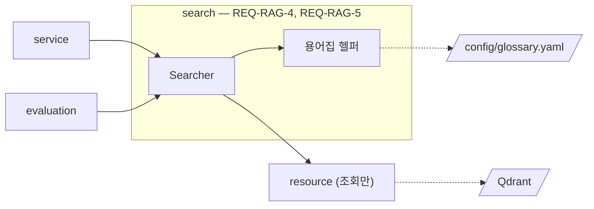
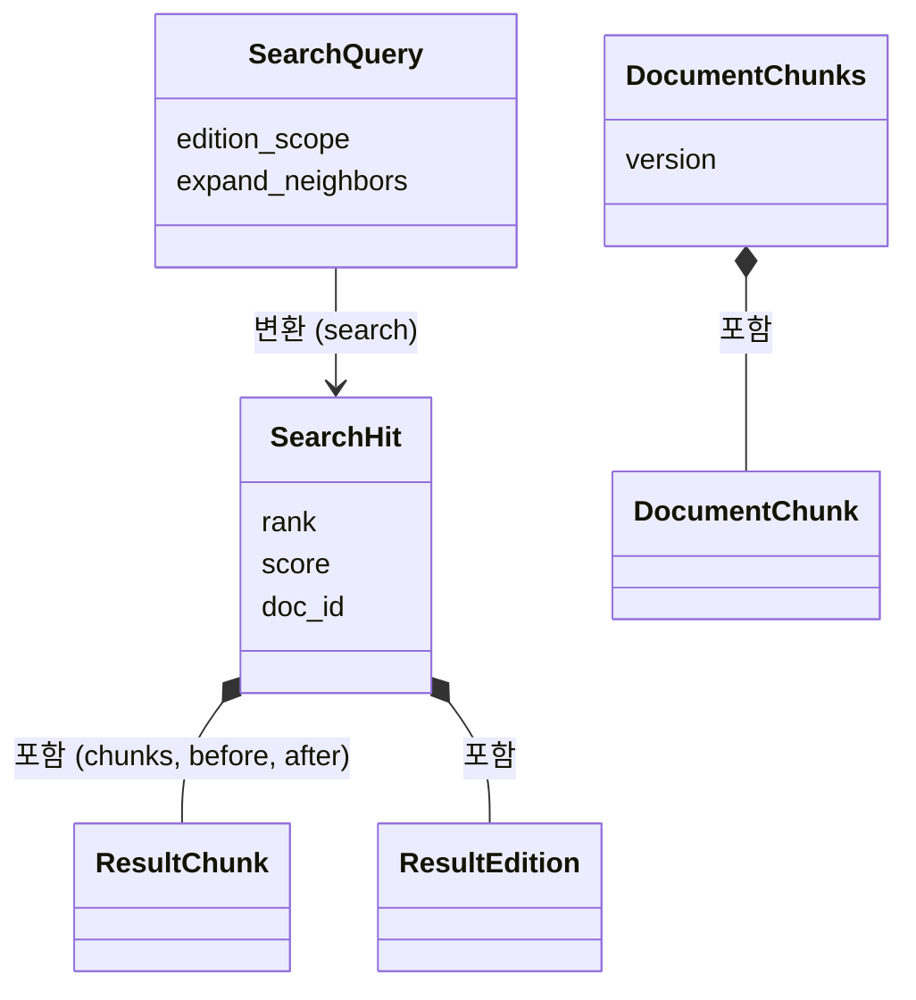
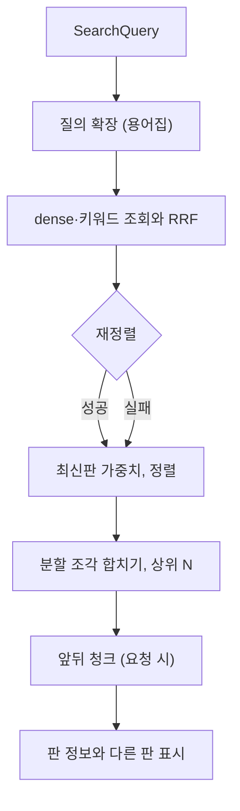

# search 모듈 명세 (REQ-RAG-4, REQ-RAG-5)

질의를 받아 질의 확장, 하이브리드 검색, 재정렬, 연관 청크 확장, 판 처리까지 검색 한 번을 처리하고 결과 N개를 돌려준다. 문서 하나의 지금 검색되는 청크 목록도 돌려준다. 질의 확장에 쓰는 용어집 파일을 읽고 검증하며, 용어집이 바뀌어도 문서를 다시 색인하지 않는다. 저장소는 조회만 하며 답변 문장은 만들지 않는다. 폴더는 `apps/rag-server/src/minerva_rag/search`이고, 용어집 파일은 `config/glossary.yaml`이다.

## 요약

**핵심 계약**

- active 레코드만 결과에 넣고, 결과 본문은 색인 텍스트가 아니라 자리표시가 든 `chunk.text` 그대로다 (`REQ-RAG-3.3`, `REQ-RAG-4.3.4`, `IF-RAG-1`)
- 질의 벡터는 색인과 같은 임베딩 모델·같은 키워드 토큰화로 만든다(resource) (`IF-RAG-1`)
- 재정렬이 실패해도 검색은 실패하지 않고 합친 순위로 돌려준다 (`REQ-RAG-4.2.2`)
- 처리 순서는 질의 확장 → 하이브리드 검색 → 재정렬 → 연관 청크 확장이다. 검색 서비스와 evaluation은 `search`를 한 번 불러 이 순서를 그대로 얻는다 (`REQ-RAG-10.4.1`, `ARCHITECT.md` 「의존 규칙」)
- 동의어 하나는 대표어 하나에만 속한다. 두 묶음에 같은 말이 있는 용어집 파일은 받아들이지 않는다 (`REQ-RAG-5.1.2`)
- 용어집 파일이 바뀌면 다시 시작하지 않고 다음 확장부터 새 내용을 쓴다. 바뀐 파일이 잘못됐으면 직전의 올바른 용어집을 계속 쓴다 (`REQ-RAG-5.1.3`)
- 용어집은 질의만 바꾼다. 색인 텍스트와 저장된 청크에는 손대지 않는다 (`REQ-RAG-5.2.2`)

**기능 그룹**

| REQ | 기능 그룹 | 책임 |
| :--- | :--- | :--- |
| `REQ-RAG-4.1` | 하이브리드 검색 | dense·키워드 검색을 함께 하고 순위를 합친다 |
| `REQ-RAG-4.2` | 재정렬 | 합친 후보를 재정렬 모델 점수로 다시 정렬하고, 실패하면 합친 순위를 쓴다 |
| `REQ-RAG-4.3` | 결과 반환 | 상위 N개를 정해진 필드로 돌려준다 |
| `REQ-RAG-4.4` | 연관 청크 확장 | 분할 조각을 한 결과로 합치고, 요청하면 앞뒤 청크를 넣는다 |
| `REQ-RAG-4.5` | 판 처리 | 판 범위로 거르고, 결과에 판 정보·다른 판 표시·최신판 가중치를 붙인다 |
| `REQ-RAG-4.7` | 문서 청크 조회 | 문서 하나의 지금 검색되는 청크를 문서 안 순서대로 돌려준다 |
| `REQ-RAG-5.1` | 용어 등록 | 용어집 파일의 형식을 정하고, 읽고 검증하고, 바뀌면 다시 읽는다 |
| `REQ-RAG-5.2` | 질의 확장 | 질의에 든 말의 묶음 전체를 돌려준다 |

**비범위**

- 결과의 자리표시를 원래 표·이미지로 되돌리는 일 — Backend (`REQ-BE-2.5`)
- 평가 지표 계산 — evaluation (`REQ-RAG-6`)

## 구조

### 예상 배치

```text
src/minerva_rag/search/
├── MODULE.md
└── glossary.py             # 용어집 헬퍼 (REQ-RAG-5). 검색(REQ-RAG-4) 코드와 한 파일에 두지 않는다 (ARCHITECT.md 「폴더 구조와 배치 규칙」)

config/glossary.yaml        # 관리자가 고치는 용어집 (위치는 RAG_GLOSSARY_PATH)

tests/unit/search/
tests/integration/search/
```

### 컨텍스트



실선은 import 호출, 점선은 프로세스 밖 자원이다. core 의존은 생략했다.

## 의존성과 공개 표면

### 의존 관계

| 대상 | 관계 | 사용하는 계약 | 계약 소유 | 관련 REQ |
| :--- | :--- | :--- | :--- | :--- |
| resource | import | `ModelHub`의 `embed_query`, `encode_sparse_query`, `rerank`, `count_tokens`. `ChunkStore`의 `search_dense`, `search_sparse`, `active_records`, `ChunkFilter`, `ScoredRecord` | resource `MODULE.md` | `REQ-RAG-4.1`, `REQ-RAG-4.2`, `REQ-RAG-4.4`, `REQ-RAG-4.7` |
| core | import | `ChunkRecord`, `ChunkKind`, `Edition`, `GlossaryError`, `Settings`, `get_logger` | `IF-RAG-1`, core `MODULE.md` | `REQ-RAG-4`, `REQ-RAG-5.1` |
| 용어집 파일 | 파일 읽기 | 「데이터 계약」의 형식 | 이 문서 | `REQ-RAG-5.1` |

**금지 의존** — resource의 저장·삭제 메서드를 부르지 않는다(`ARCHITECT.md` 「의존 규칙」).

### 공개 표면

| 기능 그룹 | 공개 표면 | 상세 계약 | 관련 REQ |
| :--- | :--- | :--- | :--- |
| 결과 반환 | `Searcher.search`, `SearchQuery`, `SearchHit`, `ResultChunk`, `ResultEdition` | 「결과 반환 — REQ-RAG-4.3」 | `REQ-RAG-4.1`~`REQ-RAG-4.5`, `REQ-RAG-5.2` |
| 판 처리 | `EditionScope`, `EditionRef` | 「판 처리 — REQ-RAG-4.5」 | `REQ-RAG-4.5` |
| 문서 청크 조회 | `Searcher.document_chunks`, `DocumentChunks`, `DocumentChunk` | 「문서 청크 조회 — REQ-RAG-4.7」 | `REQ-RAG-4.7` |
| 용어 등록 | `Searcher.load_glossary` | 「용어 등록 — REQ-RAG-5.1」 | `REQ-RAG-5.1` |
| 용어 등록 | `config/glossary.yaml` | 「데이터 계약」 | `REQ-RAG-5.1.1` |

HTTP 응답 형식(`SearchResult`, `DocumentChunk`)은 `API.md`가 소유하며, 위 타입은 api가 그 형식으로 옮기는 원천이다.

용어집 헬퍼의 `Glossary`·`Expansion`은 search 밖에서 import하지 않는다. 「용어 등록」·「질의 확장」을 임시 용어집 파일로 따로 검증하는 단위 테스트 경계로만 쓴다.

## 데이터 계약

### 모델 관계



### 모델별 필드

**`SearchQuery`** — 정의: search, 값 생산: service·evaluation

| 필드 | 타입 | 필수 | 불변 조건 |
| :--- | :--- | :--- | :--- |
| `query` | `str` | 필수 | |
| `top_n` | `int \| None` | 선택 | 1 이상. `None`이면 `RAG_SEARCH_DEFAULT_TOP_N` |
| `doc_ids` | `tuple[str, ...] \| None` | 선택 | `None`이면 문서 제한 없음 |
| `edition_scope` | `EditionScope` | 필수 | 기본 `ALL` |
| `edition` | `EditionRef \| None` | 조건부 | `edition_scope`가 `SPECIFIC`이면 필수, 아니면 쓰지 않는다 |
| `expand_neighbors` | `bool` | 필수 | 기본 `False` |

**`SearchHit`** — 정의: search, 값 생산: search (`REQ-RAG-4.3.3`)

| 필드 | 타입 | 필수 | 불변 조건 |
| :--- | :--- | :--- | :--- |
| `rank` | `int` | 필수 | 1부터 빈틈 없이 |
| `score` | `float` | 필수 | 재정렬 점수(실패 시 합친 점수)에 최신판 가중치를 더한 값. `rank`가 작을수록 크거나 같다 |
| `doc_id`, `version` | `str` | 필수 | 그 결과 청크 레코드의 값 |
| `heading_path` | `tuple[str, ...]` | 필수 | `chunks` 첫 청크의 헤딩 경로 |
| `name` | `str` | 필수 | 문서 이름 |
| `edition` | `ResultEdition \| None` | 선택 | 판 정보가 없는 문서면 `None` |
| `other_editions_in_results` | `bool` | 필수 | 판 정보가 없는 문서면 `False` |
| `chunks` | `tuple[ResultChunk, ...]` | 필수 | 나뉜 청크면 같은 `split_group`의 조각 전부를 `split_index` 순으로 |
| `before`, `after` | `tuple[ResultChunk, ...]` | 필수 | 원문 순서대로. `expand_neighbors`가 거짓이면 빈 값 |

**`ResultChunk`** — `chunk_id`, `kind`, `text`, `placeholder_ids`, `split_index`, `split_total`. 값은 레코드의 같은 이름 필드 그대로다.

**`ResultEdition`** — `label`, `edition_date`, `is_latest`. `is_latest`는 레코드의 `is_latest_edition`이다.

**`DocumentChunks`** — 정의: search, 값 생산: search (`REQ-RAG-4.7`)

| 필드 | 타입 | 필수 | 불변 조건 |
| :--- | :--- | :--- | :--- |
| `doc_id` | `str` | 필수 | |
| `version` | `str \| None` | 선택 | 지금 검색되는 버전. 없으면 `None` |
| `name` | `str \| None` | 선택 | `version`이 있으면 필수 |
| `edition` | `Edition \| None` | 선택 | |
| `chunks` | `tuple[DocumentChunk, ...]` | 필수 | `version`이 없으면 빈 값 |

**`DocumentChunk`** — `chunk_id`, `order`, `kind`, `heading_path`, `title`, `summary`, `text`, `placeholder_ids`, `split_index`, `split_total`. 값은 레코드의 같은 이름 필드 그대로다.

**용어집 파일** — 정의: search, 값 생산: 관리자 (`REQ-RAG-5.1.1`)

```yaml
terms:
  - canonical: 인증서
    synonyms: [certificate, cert, 인증 문서]
  - canonical: 폐기 목록
    synonyms: [CRL, certificate revocation list]
```

| 필드 | 타입 | 필수 | 불변 조건 |
| :--- | :--- | :--- | :--- |
| `terms` | 목록 | 필수 | 비어 있어도 된다 |
| `terms[].canonical` | 문자열 | 필수 | 비어 있지 않다 |
| `terms[].synonyms` | 문자열 목록 | 필수 | 비어 있어도 된다. 한글·영문을 섞어 쓸 수 있다 |

- 대표어와 동의어를 통틀어 같은 말은 파일 전체에서 한 번만 나온다. 영문은 대소문자를 가리지 않고 같은 말로 본다 (`REQ-RAG-5.1.2`)
- 파일이 없으면 빈 용어집이다

**`Expansion`** — 정의: search 용어집 헬퍼, 값 생산: 용어집 헬퍼 (`REQ-RAG-5.2.1`)

| 필드 | 타입 | 필수 | 불변 조건 |
| :--- | :--- | :--- | :--- |
| `matched` | `tuple[str, ...]` | 필수 | 질의에서 찾은 용어집의 말 |
| `terms` | `tuple[str, ...]` | 필수 | 찾은 말이 속한 묶음들의 대표어와 동의어 전부. 질의에 이미 있는 말은 뺀다 |

## 기능 그룹별 요구사항

```python
class EditionScope(StrEnum):
    ALL = "all"
    LATEST = "latest"
    SPECIFIC = "specific"


@dataclass(frozen=True)
class EditionRef:
    """이름과 판 표기로 가리킨 판이다."""
    name: str
    label: str


class Searcher:
    """검색 한 번과 문서 청크 조회를 처리한다."""

    def __init__(self, model_hub: ModelHub, chunk_store: ChunkStore, settings: Settings) -> None: ...
    def load_glossary(self) -> None: ...
    async def search(self, q: SearchQuery) -> tuple[SearchHit, ...]: ...
    async def document_chunks(self, doc_id: str) -> DocumentChunks: ...
```

resource의 `StoreUnavailableError`·`VectorDimensionMismatchError`는 그대로 낸다.

### 하이브리드 검색 — `REQ-RAG-4.1`

**`REQ-RAG-4.1.1`** dense와 키워드 검색을 함께

- 처리 계약: 확장한 질의(「핵심 흐름」 1)로 `embed_query`·`encode_sparse_query`를 만들어 `search_dense`·`search_sparse`를 모두 부른다
- 충족 기준: 검색 한 번에 두 조회가 모두 불리고, 키워드 검색에만 나온 청크도 결과 후보에 든다

**`REQ-RAG-4.1.2`** 하나의 순위로 합치기

- 처리 계약: 두 결과의 순위를 RRF로 합친다(`REQUIREMENTS.md` 「제약과 가정」). 두 검색에 모두 나온 청크는 하나로 센다
- 충족 기준: 두 검색에 모두 상위로 나온 청크가 한쪽에만 나온 청크보다 앞서고, 같은 청크가 두 번 나오지 않는다

**`REQ-RAG-4.1.3`** 문서 ID 범위

- 충족 기준: `doc_ids`를 주면 두 조회의 `ChunkFilter.doc_ids`가 그 값이고, 결과의 `doc_id`가 모두 그 안에 있다

**`REQ-RAG-4.1.4`** 표·이미지 청크도 검색 대상

- 충족 기준: `ASSET` 레코드만 질의와 맞는 경우 그 청크가 결과에 나온다

### 재정렬 — `REQ-RAG-4.2`

**`REQ-RAG-4.2.1`** 재정렬 모델 점수로 다시 정렬

- 처리 계약: 합친 후보의 원문으로 `rerank`를 불러, 그 점수 내림차순으로 다시 정렬한다
- 충족 기준: 재정렬 점수가 합친 순위와 다르면 결과가 재정렬 점수 순이다

**`REQ-RAG-4.2.2`** 재정렬 실패 시 합친 순위

- 처리 계약: `rerank`가 어떤 예외를 내도 검색을 실패시키지 않고 합친 순위와 점수를 쓴다
- 충족 기준: `rerank`가 예외를 내면 결과가 합친 순위 순이고 `score`가 합친 점수이며, 경고 로그가 남는다

### 결과 반환 — `REQ-RAG-4.3`

**`REQ-RAG-4.3.1`** 요청한 N개

- 처리 계약: 분할 조각을 합친 뒤(`REQ-RAG-4.4.2`) 상위 `top_n`개를 돌려준다. 후보가 적으면 있는 만큼 돌려준다
- 충족 기준: 후보가 충분하면 결과가 정확히 N개이고, 같은 청크의 조각이 여럿 검색돼도 결과 하나로 센다

**`REQ-RAG-4.3.2`** N 기본값

- 충족 기준: `top_n`이 `None`이면 결과가 최대 `RAG_SEARCH_DEFAULT_TOP_N`개다

**`REQ-RAG-4.3.3`** 결과 필드

- 충족 기준: 모든 결과가 `SearchHit`의 필드를 불변 조건대로 갖는다(청크 본문, 문서 ID, 버전, 헤딩 경로, 자리표시 ID 목록, 점수)

**`REQ-RAG-4.3.4`** 결과 본문은 청크 원문

- 충족 기준: 자리표시가 든 청크가 검색되면 `ResultChunk.text`에 자리표시가 원형 그대로 있다

**`REQ-RAG-4.3.5`** 답변 문장을 만들지 않음

- 처리 계약: search는 `LlmRole`의 어떤 생성도 부르지 않는다
- 충족 기준: 검색 한 번에 `ModelHub.generate` 호출이 없고, 결과의 텍스트가 모두 레코드 원문이다

### 연관 청크 확장 — `REQ-RAG-4.4`

**`REQ-RAG-4.4.1`** 분할 조각 전부를 원문 순서로

- 처리 계약: 검색된 청크에 `split_group`이 있으면 같은 문서·같은 `split_group`의 active 조각을 모두 가져와 `split_index` 순으로 `chunks`에 넣는다
- 충족 기준: 3개로 나뉜 청크의 2번 조각만 검색돼도 결과의 `chunks`가 1·2·3번 조각이다

**`REQ-RAG-4.4.2`** 여러 조각이 검색되면 결과 하나

- 충족 기준: 같은 청크의 조각 두 개가 검색되면 결과에 그 청크가 한 번만 나온다

**`REQ-RAG-4.4.3`** 합친 결과의 순위와 점수

- 충족 기준: 합친 결과의 `score`가 검색된 조각 점수 중 가장 높은 값(최신판 가중치 포함)이고, 순위도 그 점수로 정해진다

**`REQ-RAG-4.4.4`** 앞뒤 청크

- 처리 계약: `expand_neighbors`가 참이면 결과마다 같은 문서의 앞뒤 본문 청크를 `before`·`after`에 원문 순서대로 넣는다. 앞뒤는 그 문서의 본문 청크를 (`order`, `split_index`) 순으로 늘어놓은 차례로 정한다. 표·이미지 청크는 앞뒤 청크로 넣지 않으며, `ASSET` 결과는 그것을 담은 본문 청크부터 앞 청크로 센다. 결과의 `chunks`에 이미 든 청크는 넣지 않는다
- 충족 기준: 3·4·5번째 본문 청크 중 4번이 검색되면 `before`가 3번, `after`가 5번이고, `expand_neighbors`가 거짓이면 둘 다 비어 있다

**`REQ-RAG-4.4.5`** 크기 상한 안에서 가까운 것부터

- 처리 계약: 앞뒤 청크를 거리 1의 앞, 거리 1의 뒤, 거리 2의 앞 순으로 하나씩 넣되, 넣은 청크의 토큰 수 합이 `RAG_NEIGHBOR_MAX_TOKENS`를 넘게 되면 거기서 멈춘다. 넣은 청크는 결과에서 빈틈 없이 이어진다
- 충족 기준: 상한이 앞뒤 한 청크씩만 허용하면 거리 1의 앞·뒤만 들어가고, 거리 1의 앞 청크 하나가 상한보다 크면 아무것도 넣지 않는다

### 판 처리 — `REQ-RAG-4.5`

**`REQ-RAG-4.5.1`** 결과의 문서 이름과 판 정보

- 충족 기준: 판 정보가 있는 문서의 결과는 `edition`에 판 표기·판 날짜·최신판 여부가 있고, 없는 문서의 결과는 `edition`이 `None`이며, 모든 결과에 `name`이 있다

**`REQ-RAG-4.5.2`** 같은 이름의 다른 판 결과 표시

- 처리 계약: 최종 결과 N개 안에 `name`이 같고 판 표기가 다른(둘 다 판 정보가 있는) 결과가 있으면 그 결과들의 `other_editions_in_results`가 참이다
- 충족 기준: 2022판과 2025판 결과가 함께 나오면 둘 다 참이고, 한 판만 나오거나 판 정보가 없는 결과는 거짓이다

**`REQ-RAG-4.5.3`** 판 지정 검색

- 처리 계약: `SPECIFIC`이면 두 조회의 `ChunkFilter`에 `edition_name`·`edition_label`을 `edition`의 값으로 준다
- 충족 기준: 지정한 판의 청크만 결과에 나온다

**`REQ-RAG-4.5.4`** 최신판만 검색

- 처리 계약: `LATEST`면 `ChunkFilter.latest_or_unversioned`를 참으로 준다
- 충족 기준: 2022·2025판이 있는 이름에서 2025판 청크만 나온다

**`REQ-RAG-4.5.5`** 최신판 가중치

- 처리 계약: `is_latest_edition`이 참인 레코드의 점수에 `RAG_LATEST_EDITION_WEIGHT`를 더한 뒤 최종 순위를 정한다
- 충족 기준: 가중치가 0이면 순위가 가중치 없을 때와 같고, 양수이면 최신판 결과의 점수가 그만큼 크다

**`REQ-RAG-4.5.6`** 판 정보 없는 문서의 검색 범위

- 충족 기준: 판 정보가 없는 문서의 청크가 `ALL`·`LATEST`에서는 나오고 `SPECIFIC`에서는 나오지 않는다

### 문서 청크 조회 — `REQ-RAG-4.7`

**`REQ-RAG-4.7.1`** 지금 검색되는 버전과 청크를 문서 순서로

- 처리 계약: `active_records(doc_id)`로 가져와, (`order`, 본문 조각을 `split_index` 순으로 먼저, 표·이미지 청크는 그 자리표시가 본문에 나오는 차례로 뒤에) 순서로 늘어놓는다. `version`은 그 레코드들의 버전이다
- 충족 기준: 순서가 뒤섞여 저장된 레코드가 위 순서로 나오고, `version`이 active 레코드의 버전이다

**`REQ-RAG-4.7.2`** 청크 필드

- 충족 기준: 모든 `DocumentChunk`가 순서, 종류, 헤딩 경로, 제목, 요약, 자리표시가 든 본문, 분할 조각 번호와 조각 수를 레코드 값 그대로 갖는다

**`REQ-RAG-4.7.3`** 검색되는 버전이 없으면 빈 목록

- 충족 기준: active 레코드가 없는 문서면 `version`이 `None`이고 `chunks`가 비어 있다

### 용어 등록 — `REQ-RAG-5.1`

```python
class Glossary:
    """용어집을 읽고 질의를 확장한다."""

    def __init__(self, settings: Settings) -> None: ...
    def load(self) -> None: ...
```

`Searcher.load_glossary`는 `RAG_GLOSSARY_PATH`의 용어집을 처음 읽는다. 그 뒤 다시 읽기는 `REQ-RAG-5.1.3`대로 검색의 질의 확장 때 일어난다.

**`REQ-RAG-5.1.1`** 대표어와 동의어 묶음 등록

- 처리 계약: 「데이터 계약」의 형식대로 묶음마다 대표어 하나와 동의어 여러 개를 읽는다
- 실패: 형식에 맞지 않으면 `Glossary.load`가 `GlossaryError`를 내고, `Searcher.load_glossary`는 그것을 그대로 낸다. 기동 때 읽기가 실패하면 service가 기동을 멈춘다(service `MODULE.md`)
- 충족 기준: 예시 파일을 읽은 뒤 `인증서`, `certificate`, `cert`, `인증 문서`가 한 묶음으로 확장되고, 필수 필드가 없는 파일은 `GlossaryError`를 낸다

**`REQ-RAG-5.1.2`** 동의어는 대표어 하나에만 속함

- 실패: 같은 말이 두 묶음에 나오면 `GlossaryError`를 내며, 메시지에 그 말을 담는다
- 충족 기준: 두 묶음에 같은 동의어(대소문자만 다른 영문 포함)가 있으면 `GlossaryError`가 난다

**`REQ-RAG-5.1.3`** 다시 시작하지 않고 반영

- 처리 계약: `expand`를 부를 때 파일이 마지막으로 읽은 뒤 바뀌었으면 다시 읽는다. 다시 읽기가 `GlossaryError`로 실패하면 직전 용어집을 계속 쓰고 경고 로그를 남긴다
- 충족 기준: 파일을 고친 뒤 다음 `expand`가 새 묶음으로 확장하고, 잘못된 내용으로 고치면 직전 묶음으로 확장하며 경고 로그가 남는다

### 질의 확장 — `REQ-RAG-5.2`

```python
@dataclass(frozen=True)
class Expansion:
    """질의에서 찾은 말과 넣을 말이다."""
    matched: tuple[str, ...]
    terms: tuple[str, ...]


class Glossary:
    def expand(self, query: str) -> Expansion: ...
```

**`REQ-RAG-5.2.1`** 묶음의 대표어와 동의어까지 확장

- 처리 계약: 질의에 대표어나 동의어가 나오면 그 묶음의 대표어와 동의어 전부를 `terms`에 담는다. 영문은 대소문자를 가리지 않는다. 용어집의 말이 없으면 `matched`와 `terms`가 비어 있다
- 충족 기준: 동의어 하나가 든 질의가 그 묶음의 대표어와 다른 동의어로 확장되고, 용어집의 말이 없는 질의는 빈 확장이 된다

**`REQ-RAG-5.2.2`** 용어집 변경 시 재색인 없음

- 처리 계약: 용어집 헬퍼는 resource·indexing에 기대지 않으며, 용어집 변경은 질의 확장 결과만 바꾼다
- 충족 기준: 용어집을 고친 뒤에도 저장소에 쓰기가 일어나지 않고, 다음 검색의 확장 결과만 달라진다

## 핵심 흐름



1. **질의 확장** — `Glossary.expand`의 말을 질의에 더한다. 용어집 파일이 바뀌었으면 이때 다시 읽는다. 용어집의 말이 없으면 질의 그대로다. (`REQ-RAG-5.1.3`, `REQ-RAG-5.2.1`)
2. **하이브리드 검색** — 판 범위·문서 ID로 만든 `ChunkFilter`로 두 조회를 하고 RRF로 합친다. (`REQ-RAG-4.1`, `REQ-RAG-4.5.3`, `REQ-RAG-4.5.4`)
3. **재정렬** — 합친 후보를 재정렬하고, 실패하면 합친 순위를 쓴다. 그다음 최신판 가중치를 더해 정렬한다. (`REQ-RAG-4.2`, `REQ-RAG-4.5.5`)
4. **분할 조각 합치기와 N개** — 같은 `split_group`을 결과 하나로 합치고 상위 N개를 고른다. 합친 뒤에 N개를 골라야 결과 개수가 맞다. (`REQ-RAG-4.4.1`~`REQ-RAG-4.4.3`, `REQ-RAG-4.3.1`)
5. **앞뒤 청크** — 요청하면 결과마다 앞뒤 청크를 넣는다. (`REQ-RAG-4.4.4`, `REQ-RAG-4.4.5`)
6. **판 정보** — 최종 N개를 보고 다른 판 표시를 정한다. N개를 고른 뒤에 해야 표시가 응답과 맞다. (`REQ-RAG-4.5.1`, `REQ-RAG-4.5.2`)

결과가 0건이면 빈 값을 돌려주며, 오류가 아니다(`REQ-RAG-10.4.2`).

## 실행 계약

### 설정

정의는 core 「설정」이 소유한다. 이 모듈이 읽는 키: `RAG_SEARCH_DEFAULT_TOP_N`, `RAG_NEIGHBOR_MAX_TOKENS`, `RAG_LATEST_EDITION_WEIGHT`, `RAG_GLOSSARY_PATH`.

### 로그

| 이벤트 | 발생 시점 | 레벨 | 허용 필드 | 관련 REQ |
| :--- | :--- | :--- | :--- | :--- |
| `search.rerank_failed` | 재정렬 실패로 합친 순위를 쓸 때 | warning | `candidates`, `error_type` | `REQ-RAG-4.2.2` |
| `search.done` | `search` 끝 | info | `query_chars`, `expanded_terms`, `candidates`, `results`, `reranked`, `elapsed_ms` | `REQ-RAG-4.3` |
| `search.glossary_loaded` | 용어집 읽기 성공 | info | `groups`, `terms` (개수) | `REQ-RAG-5.1.3` |
| `search.glossary_reload_failed` | 다시 읽기 실패로 직전 용어집을 계속 쓸 때 | warning | `reason` | `REQ-RAG-5.1.3` |

질의 원문과 확장한 말, 결과 본문은 로그에 넣지 않는다. 글자 수와 개수만 남긴다.

### 실패 모드

- **재정렬 열화** (`REQ-RAG-4.2.2`) — 증상: 재정렬이 계속 실패하면 오류 없이 결과 품질이 떨어진다. 탐지: `search.rerank_failed` 경고 로그, `search.done`의 `reranked=false`. 방어: 결과는 합친 순위로 돌려주고 경고를 남긴다
- **잘못 고친 용어집** (`REQ-RAG-5.1.3`) — 증상: 관리자가 고친 내용이 반영되지 않는다. 탐지: `search.glossary_reload_failed` 경고 로그. 방어: 직전의 올바른 용어집을 계속 써서 검색이 멈추지 않게 한다

## 테스트와 추적성

`resource (가짜)`는 저장소 조회를 가짜로, 모델 호출을 mock으로 바꾼 것이다. `Searcher`를 쓰는 테스트는 `RAG_GLOSSARY_PATH`를 임시 용어집 파일로 둔다.

| REQ ID | 종류 | 검증 초점 | 대체 경계 | 예상 위치 |
| :--- | :--- | :--- | :--- | :--- |
| `REQ-RAG-4.1.1` | unit | 두 조회 모두 호출, 키워드 전용 후보 포함, 확장한 질의 사용 | resource (가짜), 임시 용어집 파일 | `tests/unit/search/` |
| `REQ-RAG-4.1.2` | unit | RRF 순위, 중복 없음 | resource (가짜) | `tests/unit/search/` |
| `REQ-RAG-4.1.3` | unit | 문서 ID 필터 | resource (가짜) | `tests/unit/search/` |
| `REQ-RAG-4.1.4` | unit | `ASSET` 청크 결과 포함 | resource (가짜) | `tests/unit/search/` |
| `REQ-RAG-4.2.1` | unit | 재정렬 점수 순 | resource (가짜) | `tests/unit/search/` |
| `REQ-RAG-4.2.2` | unit | 재정렬 예외 시 합친 순위·점수와 경고 로그 | resource (가짜, 재정렬 예외) | `tests/unit/search/` |
| `REQ-RAG-4.3.1` | unit | N개, 조각 합친 뒤 개수, 후보 부족 | resource (가짜) | `tests/unit/search/` |
| `REQ-RAG-4.3.2` | unit | 기본 N | resource (가짜) | `tests/unit/search/` |
| `REQ-RAG-4.3.3` | unit | 결과 필드와 불변 조건 | resource (가짜) | `tests/unit/search/` |
| `REQ-RAG-4.3.4` | unit | 결과 본문의 자리표시 원형 | resource (가짜) | `tests/unit/search/` |
| `REQ-RAG-4.3.5` | unit | 생성 호출 없음 | resource (가짜) | `tests/unit/search/` |
| `REQ-RAG-4.4.1` | unit | 조각 전부를 순서대로 | resource (가짜) | `tests/unit/search/` |
| `REQ-RAG-4.4.2` | unit | 여러 조각이 결과 하나 | resource (가짜) | `tests/unit/search/` |
| `REQ-RAG-4.4.3` | unit | 합친 결과 점수가 최고 조각 점수 | resource (가짜) | `tests/unit/search/` |
| `REQ-RAG-4.4.4` | unit | 앞뒤 청크, `ASSET` 결과의 앞 청크, 표·이미지 제외, 거짓이면 빈 값 | resource (가짜) | `tests/unit/search/` |
| `REQ-RAG-4.4.5` | unit | 가까운 것부터, 상한에서 멈춤, 큰 첫 청크 | resource (가짜, 토큰 수 고정) | `tests/unit/search/` |
| `REQ-RAG-4.5.1` | unit | 결과의 이름·판 정보, 판 정보 없음 | resource (가짜) | `tests/unit/search/` |
| `REQ-RAG-4.5.2` | unit | 다른 판 표시 참·거짓 | resource (가짜) | `tests/unit/search/` |
| `REQ-RAG-4.5.3` | unit | 판 지정 필터 | resource (가짜) | `tests/unit/search/` |
| `REQ-RAG-4.5.3` | integration | 실제 Qdrant에서 판 지정·최신판·판 정보 없음 범위 | | `tests/integration/search/` |
| `REQ-RAG-4.5.4` | unit | 최신판 필터 | resource (가짜) | `tests/unit/search/` |
| `REQ-RAG-4.5.5` | unit | 가중치 0과 양수 | resource (가짜) | `tests/unit/search/` |
| `REQ-RAG-4.5.6` | unit | 판 정보 없는 문서의 범위별 포함 | resource (가짜) | `tests/unit/search/` |
| `REQ-RAG-4.7.1` | unit | 문서 순서 정렬과 버전 | resource (가짜) | `tests/unit/search/` |
| `REQ-RAG-4.7.2` | unit | 청크 필드 | resource (가짜) | `tests/unit/search/` |
| `REQ-RAG-4.7.3` | unit | 검색되는 버전 없음 | resource (가짜) | `tests/unit/search/` |
| `REQ-RAG-5.1.1` | unit | 묶음 읽기, 형식 오류 시 `GlossaryError`(`Searcher.load_glossary` 포함), 파일 없음은 빈 용어집 | 임시 용어집 파일 | `tests/unit/search/` |
| `REQ-RAG-5.1.2` | unit | 두 묶음의 같은 말(대소문자 차이 포함) 거부 | 임시 용어집 파일 | `tests/unit/search/` |
| `REQ-RAG-5.1.3` | unit | 파일 변경 후 다음 확장에 반영, 잘못된 변경 시 직전 유지와 경고 | 임시 용어집 파일 | `tests/unit/search/` |
| `REQ-RAG-5.2.1` | unit | 동의어·대표어로 묶음 전체 확장, 대소문자 무시, 없는 말은 빈 확장 | 임시 용어집 파일 | `tests/unit/search/` |
| `REQ-RAG-5.2.2` | unit | 용어집 변경 시 저장소 쓰기 없음 | 임시 용어집 파일, resource (가짜) | `tests/unit/search/` |
