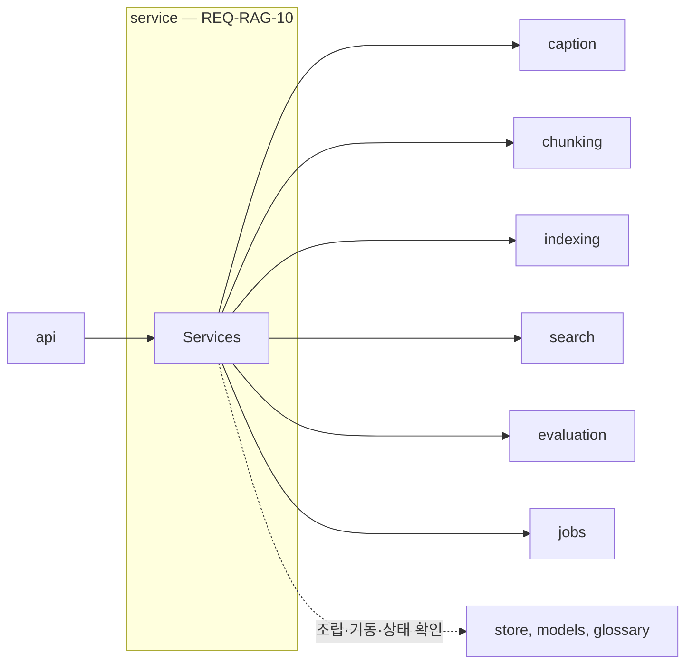
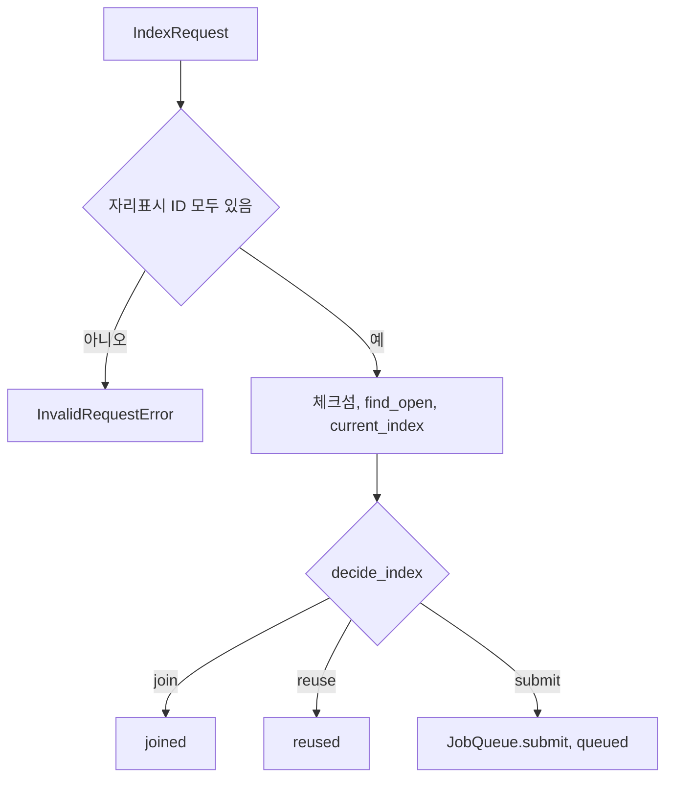

# service 모듈 명세 (REQ-RAG-10)

api 아래에서 요청마다 처리 순서를 정하고 기능 단위를 엮는 계층이다. 단위를 조립(의존 주입)하고 앱 기동·종료를 맡는 유일한 곳이며, 서비스 하나가 파일 하나다. 폴더는 `apps/rag-server/src/minerva_rag/service`다.

## 요약

**핵심 계약**

- 준비(용어집 읽기, 모델 준비, Qdrant 연결, 작업 처리기 시작)가 끝나기 전에는 상태 확인 말고 모든 서비스 메서드가 `ServerNotReadyError`를 낸다 (`REQ-RAG-10.1.1`, `REQ-RAG-10.1.2`)
- 색인 작업 안에서는 청킹을 마친 뒤에만 색인하고, 청킹이 실패하면 색인하지 않는다 (`REQ-RAG-10.3.2`, `REQ-RAG-10.3.3`, `IF-RAG-2`)
- 문서 삭제는 시작하지 않은 작업 실패 → 색인 중인 작업 기다림 → 청크 삭제 → 문서 색인 상태 비우기 순서다. 순서가 바뀌면 삭제한 문서가 다시 검색된다 (`REQ-RAG-10.5`, `IF-RAG-2`)
- 단위 조립은 이 모듈에서만 한다. 기능 단위는 서로를 만들지 않고 생성자로 받는다 (`ARCHITECT.md` 「의존 규칙」)

**기능 그룹**

| REQ | 기능 그룹 | 책임 |
| :--- | :--- | :--- |
| `REQ-RAG-10.1` | 수명주기 서비스 | 단위를 조립하고, 기동·준비 상태·종료·상태 확인을 맡는다 |
| `REQ-RAG-10.2` | 요약·캡션 서비스 | 요약·캡션 요청을 작업 없이 바로 처리한다 |
| `REQ-RAG-10.3` | 색인 서비스 | 색인 요청을 검증하고 중복을 확인한 뒤 작업으로 접수하며, 작업의 처리 순서를 정한다. 작업·문서 색인 상태 조회도 받는다 |
| `REQ-RAG-10.4` | 검색 서비스 | 검색과 문서 청크 조회를 search에 넘긴다 |
| `REQ-RAG-10.5` | 문서 삭제 서비스 | 작업과 청크를 정해진 순서로 정리한다 |
| `REQ-RAG-10.6` | 이름·판 정보 서비스 | 색인 중인 작업이 끝난 뒤 이름·판 정보를 바꾼다 |
| `REQ-RAG-10.7` | 평가 서비스 | 평가 요청을 작업 없이 바로 처리한다 |

**비범위**

- HTTP 요청·응답 형식과 오류의 HTTP 변환 — api
- 검색 한 번의 처리 순서 — search 안에서 지킨다(`ARCHITECT.md` 「의존 규칙」). 검색 서비스는 search를 한 번 부를 뿐이다
- 합류·재사용·새 접수 판단 — indexing의 `decide_index`

## 구조

### 예상 배치

`ARCHITECT.md` 「폴더 구조와 배치 규칙」에 따라 서비스 하나가 파일 하나다. 단위 조립은 수명주기 서비스 파일이 맡는다.

```text
src/minerva_rag/service/
├── lifecycle_service.py     # REQ-RAG-10.1 수명주기, 조립
├── caption_service.py       # REQ-RAG-10.2 요약·캡션
├── index_service.py         # REQ-RAG-10.3 색인
├── search_service.py        # REQ-RAG-10.4 검색
├── delete_service.py        # REQ-RAG-10.5 문서 삭제
├── metadata_service.py      # REQ-RAG-10.6 이름·판 정보
├── evaluation_service.py    # REQ-RAG-10.7 평가
└── MODULE.md

tests/unit/service/
```

### 컨텍스트



점선은 조립·기동·종료·상태 확인에만 쓰는 의존이다(`ARCHITECT.md` 「의존 규칙」). core 의존은 생략했다.

## 의존성과 공개 표면

### 의존 관계

| 대상 | 관계 | 사용하는 계약 | 계약 소유 | 관련 REQ |
| :--- | :--- | :--- | :--- | :--- |
| jobs | import | `JobQueue`, `IndexRunner`, `ProgressReporter`, `JobFailure`; `get_job`, `index_state(s)`, `current_index`, `forget_document` | `IF-RAG-2`, jobs `MODULE.md` | `REQ-RAG-10.1`, `REQ-RAG-10.3`, `REQ-RAG-10.5`, `REQ-RAG-10.6` |
| chunking | import | `Chunker.split`, `ChunkingMode` | chunking `MODULE.md` | `REQ-RAG-10.3.2` |
| indexing | import | `Indexer`, `decide_index`, `IndexInput` | indexing `MODULE.md` | `REQ-RAG-10.3`, `REQ-RAG-10.5`, `REQ-RAG-10.6` |
| search | import | `Searcher.search`, `Searcher.document_chunks` | search `MODULE.md` | `REQ-RAG-10.4` |
| evaluation | import | `Evaluator.evaluate` | evaluation `MODULE.md` | `REQ-RAG-10.7` |
| caption | import | `Captioner` | caption `MODULE.md` | `REQ-RAG-10.2` |
| models, store, glossary | import (조립·기동·상태 확인만) | `ModelHub.prepare`·`close`·`ollama_available`, `ChunkStore.connect`·`close`·`ping`, `Glossary.load` | 각 `MODULE.md` | `REQ-RAG-10.1` |
| core | import | `Settings`, `get_settings`, `get_logger`, 오류 클래스, `JobFailureCode`, `find_placeholders`, `Edition` | core `MODULE.md` | `REQ-RAG-10` |

**금지 의존** — api를 import하지 않는다. store·models·glossary는 조립·기동·종료·상태 확인 말고 직접 부르지 않는다(`ARCHITECT.md` 「의존 규칙」).

### 공개 표면

| 기능 그룹 | 공개 표면 | 상세 계약 | 관련 REQ |
| :--- | :--- | :--- | :--- |
| 수명주기 서비스 | `build_services()`, `Services`, `LifecycleService`, `Health` | 「수명주기 서비스 — REQ-RAG-10.1」 | `REQ-RAG-10.1`, `REQ-RAG-9.2.1` |
| 요약·캡션 서비스 | `CaptionService` | 「요약·캡션 서비스 — REQ-RAG-10.2」 | `REQ-RAG-10.2` |
| 색인 서비스 | `IndexService`, `IndexRequest`, `IndexAccepted` | 「색인 서비스 — REQ-RAG-10.3」 | `REQ-RAG-10.3`, `REQ-RAG-7.2.2`, `REQ-RAG-7.6` |
| 검색 서비스 | `SearchService` | 「검색 서비스 — REQ-RAG-10.4」 | `REQ-RAG-10.4`, `REQ-RAG-4.7` |
| 문서 삭제 서비스 | `DeleteService` | 「문서 삭제 서비스 — REQ-RAG-10.5」 | `REQ-RAG-10.5` |
| 이름·판 정보 서비스 | `MetadataService` | 「이름·판 정보 서비스 — REQ-RAG-10.6」 | `REQ-RAG-10.6` |
| 평가 서비스 | `EvaluationService` | 「평가 서비스 — REQ-RAG-10.7」 | `REQ-RAG-10.7` |
| 다시 내보내는 타입 | `ChunkingMode`, `SearchQuery`, `SearchHit`, `EditionScope`, `EditionRef`, `DocumentChunks`, `EvaluationCase`, `EvaluationResult`, `JobView`, `IndexStateView` | 각 단위 `MODULE.md` | `REQ-RAG-9.1.1` |

api는 service와 core만 import할 수 있으므로(`ARCHITECT.md` 「의존 규칙」), api가 요청·응답을 만드는 데 쓰는 기능 단위의 타입을 `minerva_rag.service`에서 다시 내보낸다. 정의는 원래 단위가 소유한다.

## 데이터 계약

### 모델별 필드

**`IndexRequest`** — 정의: service, 값 생산: api (`POST /v1/index-jobs`)

| 필드 | 타입 | 필수 | 불변 조건 |
| :--- | :--- | :--- | :--- |
| `doc_id`, `version`, `markdown`, `name` | `str` | 필수 | 요청 값 그대로 |
| `assets` | `Mapping[str, str]` | 필수 | 자리표시 ID → 요약·캡션 문장 |
| `edition` | `Edition \| None` | 선택 | |
| `chunking` | `ChunkingMode` | 필수 | 기본 `SEMANTIC` |
| `force` | `bool` | 필수 | 기본 `False` |

**`IndexAccepted`** — 정의: service, 값 생산: service. `outcome`(`"queued"`·`"joined"`·`"reused"`), `job_id`, `doc_id`, `version`. API의 `IndexJobAccepted`로 옮긴다.

**`Health`** — 정의: service, 값 생산: service. `qdrant: bool`, `ollama: bool`. API의 `ok`·`unavailable`로 옮긴다.

### 변환·저장 경계

- **색인 요청 → 작업** (`IndexRequest` → `IndexInput`·`IndexRunner`) — 보존: `doc_id`, `version`, `markdown`, `assets`, `name`, `edition`. 파생: 체크섬(indexing), `chunking_mode`는 `ChunkingMode` 값. 실패 시: 검증 실패면 작업을 만들지 않는다

## 기능 그룹별 요구사항

모든 서비스 메서드는 진입할 때 `service.{서비스}.{동작}` 로그 이벤트를 남긴다. 도메인 예외(`MinervaError`)는 warning으로 남기고 그대로 전파하며, 그 밖의 예외는 스택과 함께 남긴다(`AGENTS.md`).

### 수명주기 서비스 — `REQ-RAG-10.1`

```python
@dataclass(frozen=True)
class Services:
    """조립한 서비스 묶음이다."""
    lifecycle: LifecycleService
    caption: CaptionService
    index: IndexService
    search: SearchService
    delete: DeleteService
    metadata: MetadataService
    evaluation: EvaluationService


def build_services(settings: Settings) -> Services:
    """설정으로 모든 단위를 만들어 엮는다. 연결이나 모델 준비는 하지 않는다."""


@dataclass(frozen=True)
class Health:
    """외부 자원 연결 상태다."""
    qdrant: bool
    ollama: bool


class LifecycleService:
    """기동·종료와 준비 상태를 맡는다."""

    @property
    def ready(self) -> bool: ...
    async def startup(self) -> None: ...
    async def shutdown(self) -> None: ...
    async def health(self) -> Health: ...
```

**`REQ-RAG-10.1.1`** 준비를 마친 뒤 요청 받기

- 처리 계약: `startup`은 용어집 읽기 → 모델 준비 → Qdrant 연결(임베딩 차원으로) → 작업 처리기 시작(`JobQueue.start(Indexer.recover)`) 순으로 하고, 모두 끝난 뒤에만 `ready`를 참으로 바꾼다. 차원 불일치는 기동을 막지 않는다(store `MODULE.md`)
- 실패: `GlossaryError`, `ModelLoadError`, Qdrant 연결의 `StoreUnavailableError` 중 하나라도 나면 이유를 error 로그로 남기고 그 예외를 낸다. `ready`는 거짓으로 남고, 프로세스를 끝내는 일은 api가 한다(`REQ-RAG-12.1.1`)
- 충족 기준: 단계 순서가 위와 같고, 마지막 단계 전에는 `ready`가 거짓이며, 한 단계가 실패하면 뒤 단계가 불리지 않고 예외가 난다

**`REQ-RAG-10.1.2`** 준비 전 요청은 "준비 중"

- 처리 계약: `ready`가 거짓이면 `health`를 뺀 모든 서비스 메서드가 아무 단위도 부르지 않고 `ServerNotReadyError`를 낸다
- 충족 기준: `startup` 전에 각 서비스 메서드를 부르면 `ServerNotReadyError`가 나고, `health`는 결과를 돌려준다

**`REQ-RAG-10.1.3`** 종료 때 작업 기다리기

- 처리 계약: `shutdown`은 `JobQueue.stop(RAG_SHUTDOWN_TIMEOUT_SECONDS)`을 부른 뒤 store·models를 닫는다
- 충족 기준: `shutdown`이 설정한 시간으로 `stop`을 부르고, 그다음 색인 요청은 `ShuttingDownError`를 낸다

`health`는 `ChunkStore.ping`과 `ModelHub.ollama_available`의 결과를 돌려주며 오류를 내지 않는다(`REQ-RAG-9.2.1`, api `MODULE.md`).

### 요약·캡션 서비스 — `REQ-RAG-10.2`

```python
class CaptionService:
    async def summarize_table(self, table_markdown: str) -> str: ...
    async def caption_image(self, image: bytes) -> str: ...
```

**`REQ-RAG-10.2.1`** 작업 없이 응답으로

- 처리 계약: `Captioner`를 불러 결과를 그대로 돌려준다. jobs를 부르지 않는다
- 충족 기준: 두 메서드가 `Captioner`의 결과를 돌려주고, jobs 호출이 없다

### 색인 서비스 — `REQ-RAG-10.3`

```python
class IndexService:
    async def submit(self, req: IndexRequest) -> IndexAccepted: ...
    async def get_job(self, job_id: str) -> JobView: ...
    async def index_state(self, doc_id: str) -> IndexStateView: ...
    async def index_states(self, doc_ids: Sequence[str]) -> list[IndexStateView]: ...
```

`get_job`·`index_state`·`index_states`는 jobs의 같은 이름 메서드를 그대로 부른다(`REQ-RAG-7.2.2`, `REQ-RAG-7.6.2`, `REQ-RAG-7.6.3`).

**`REQ-RAG-10.3.1`** 체크섬을 먼저 확인하고 필요할 때만 접수

- 입력·선행 조건: `markdown`의 모든 자리표시 ID가 `assets`의 키에 있어야 한다
- 처리 계약: 체크섬을 만들고, `find_open`과 `current_index`로 얻은 값으로 `decide_index`를 부른다. `submit`이면 `IndexRunner`를 만들어 `JobQueue.submit`하고 `queued`를, `join`이면 `joined`를, `reuse`면 `reused`를 돌려준다. `joined`·`reused`에서는 작업을 만들지 않는다
- 실패: 자리표시 ID가 `assets`에 없으면 `InvalidRequestError`를 내고, 메시지에 빠진 ID 개수를 담는다
- 충족 기준: 세 결정마다 해당 `outcome`과 작업 ID가 나오고 `JobQueue.submit`은 `submit` 결정에서만 불리며, 자리표시 ID가 빠지면 `InvalidRequestError`가 나고 아무 작업도 만들지 않는다

**`REQ-RAG-10.3.2`** 청킹을 마친 뒤 색인

- 처리 계약: `IndexRunner`는 `CHUNKING` 알림 → `Chunker.split` → `EMBEDDING` 알림 → `Indexer.embed`(`job_id`는 `ProgressReporter.job_id`) → `prepared(IndexOutcome)` → `STORING` 알림 → `Indexer.write` 순으로 하고, 같은 `IndexOutcome(chunk_count, fallback_used)`를 돌려준다. `chunk_count`는 만든 레코드 수, `fallback_used`는 청킹 결과의 값이다(`REQ-RAG-2.3.3`). `prepared`를 `write`보다 먼저 불러야 활성화 뒤에 멈춰도 다시 시작할 때 완료로 기록할 수 있다(`REQ-RAG-7.5.3`)
- 충족 기준: 러너를 실행하면 단계 알림, `prepared`, 호출이 위 순서로 일어나고, `prepared`에 넘긴 결과와 돌려준 결과가 같으며, 레코드의 `job_id`가 `ProgressReporter.job_id`다

**`REQ-RAG-10.3.3`** 청킹이 실패하면 색인하지 않음

- 처리 계약: 러너 안의 오류를 「예외」 표의 작업 실패 사유로 바꿔 `JobFailure`로 낸다. `ChunkingFailedError`의 위치는 `FailureLocation`으로 옮긴다
- 충족 기준: `split`이 `ChunkingFailedError`를 내면 `embed`·`write`가 불리지 않고 `JobFailure`(`CHUNKING_FAILED`, 위치 포함)가 난다

**`REQ-RAG-10.3.4`** 새 버전 색인 실패 시 이전 버전 유지

- 처리 계약: `embed`·`write`가 실패하면 `JobFailure`로 끝내며, 이전 버전 보존은 indexing의 보장이다(indexing `MODULE.md` 「핵심 흐름」)
- 충족 기준: `write`가 `StoreUnavailableError`를 내면 `JobFailure`(`STORE_UNAVAILABLE`)가 나고, 이전 버전 레코드를 지우는 호출이 없다

### 검색 서비스 — `REQ-RAG-10.4`

```python
class SearchService:
    async def search(self, q: SearchQuery) -> tuple[SearchHit, ...]: ...
    async def document_chunks(self, doc_id: str) -> DocumentChunks: ...
```

**`REQ-RAG-10.4.1`** 질의 확장, 하이브리드 검색, 재정렬, 연관 청크 확장 순

- 처리 계약: `Searcher.search`를 한 번 부른다. 처리 순서는 search가 보장한다(search `MODULE.md` 「핵심 흐름」)
- 충족 기준: 검색 한 번에 `Searcher.search`가 정확히 한 번 불리고, 결과를 바꾸지 않고 돌려준다

**`REQ-RAG-10.4.2`** 0건은 빈 결과

- 충족 기준: `Searcher.search`가 빈 값을 돌려주면 오류 없이 빈 값을 돌려준다

### 문서 삭제 서비스 — `REQ-RAG-10.5`

```python
class DeleteService:
    async def delete(self, doc_id: str) -> None: ...
```

**`REQ-RAG-10.5.1`** 시작하지 않은 작업은 실패(문서 삭제)

- 처리 계약: `fail_queued(doc_id, DOCUMENT_DELETED, ...)`를 맨 먼저 부른다
- 충족 기준: `delete`가 다른 어떤 호출보다 먼저 `fail_queued`를 `DOCUMENT_DELETED`로 부른다

**`REQ-RAG-10.5.2`** 색인 중인 작업이 끝난 뒤 삭제

- 처리 계약: `wait_running` → `Indexer.delete_document` → `forget_document` 순으로 부른다
- 충족 기준: `wait_running`이 끝나기 전에는 `delete_document`가 불리지 않고, `forget_document`는 `delete_document` 뒤에 불린다

### 이름·판 정보 서비스 — `REQ-RAG-10.6`

```python
class MetadataService:
    async def update(self, doc_id: str, name: str, edition: Edition | None) -> None: ...
```

**`REQ-RAG-10.6.1`** 색인 중인 작업이 끝난 뒤 변경

- 처리 계약: `wait_running` → `Indexer.update_metadata` 순으로 부른다
- 충족 기준: `wait_running`이 끝나기 전에는 `update_metadata`가 불리지 않는다

### 평가 서비스 — `REQ-RAG-10.7`

```python
class EvaluationService:
    async def evaluate(self, case: EvaluationCase) -> EvaluationResult: ...
```

**`REQ-RAG-10.7.1`** 작업 없이 응답으로

- 충족 기준: `Evaluator.evaluate`의 결과를 그대로 돌려주고, jobs 호출이 없다

## 핵심 흐름

### 색인 요청



1. **검증** — 자리표시 ID가 `assets`에 모두 있는지 본다. (`REQ-RAG-10.3.1`)
2. **중복 확인** — 체크섬과 jobs의 열린 작업·현재 색인으로 결정한다. 결정 규칙은 indexing이 소유한다. (`REQ-RAG-3.5`)
3. **접수** — `submit` 결정일 때만 작업을 만든다. (`REQ-RAG-7.1`)

### 문서 삭제

1. **시작하지 않은 작업 실패** — `fail_queued`. (`REQ-RAG-10.5.1`)
2. **색인 중인 작업 기다림** — `wait_running`. (`REQ-RAG-10.5.2`)
3. **청크 삭제** — `Indexer.delete_document`. (`REQ-RAG-3.4.1`)
4. **문서 색인 상태 비우기** — `forget_document`. (`REQ-RAG-7.6.1`)

1을 2보다 먼저 해야 기다리는 동안 남은 작업이 시작되지 않는다. 3을 2보다 먼저 하면 색인 중이던 작업이 끝나며 삭제한 문서를 다시 저장한다.

## 실행 계약

### 설정

정의는 core 「설정」이 소유한다. 이 모듈이 읽는 키: `RAG_SHUTDOWN_TIMEOUT_SECONDS`. 나머지 키는 조립할 때 `Settings`를 각 단위에 넘긴다.

### 예외

이 모듈은 러너 안의 오류를 작업 실패 사유로 바꾼다. 메시지는 관리자가 읽고 조치할 수 있는 한국어이며 내부 정보를 담지 않는다(`REQ-RAG-11.3.2`).

| 러너 안의 예외 | 작업 실패 사유 (`JobFailureCode`) | 관련 REQ |
| :--- | :--- | :--- |
| `ChunkingFailedError` | `CHUNKING_FAILED` (위치 포함) | `REQ-RAG-10.3.3` |
| `ModelUnavailableError` | `MODEL_UNAVAILABLE` | `REQ-RAG-12.1.2` |
| `StoreUnavailableError` | `STORE_UNAVAILABLE` | `REQ-RAG-13.1.1` |
| `VectorDimensionMismatchError` | `VECTOR_DIMENSION_MISMATCH` | `REQ-RAG-13.1.2` |
| 그 밖의 예외 | 바꾸지 않고 그대로 낸다. jobs가 `INTERNAL_ERROR`로 기록한다 | `REQ-RAG-7.2.4` |

러너 밖에서 나는 예외(`ServerNotReadyError`, `InvalidRequestError`, 기능 단위의 예외)는 그대로 api로 전파한다.

### 로그

| 이벤트 | 발생 시점 | 레벨 | 허용 필드 | 관련 REQ |
| :--- | :--- | :--- | :--- | :--- |
| `service.lifecycle.startup_failed` | 기동 단계 실패 | error | `step`, `error_type` | `REQ-RAG-10.1.1` |
| `service.lifecycle.ready` | 준비 끝 | info | `elapsed_ms` | `REQ-RAG-10.1.1` |
| `service.index.submit` | 색인 요청 진입 | info | `doc_id`, `version`, `markdown_chars`, `assets`, `force` | `REQ-RAG-10.3.1` |
| `service.index.decided` | 결정 직후 | info | `doc_id`, `outcome`, `job_id` | `REQ-RAG-10.3.1` |
| `service.delete.delete` | 삭제 요청 진입 | info | `doc_id` | `REQ-RAG-10.5` |

그 밖의 서비스 메서드도 진입 이벤트를 남기며, 질의 원문·문서 본문 대신 글자 수만 남긴다.

## 테스트와 추적성

| REQ ID | 종류 | 검증 초점 | 대체 경계 | 예상 위치 |
| :--- | :--- | :--- | :--- | :--- |
| `REQ-RAG-10.1.1` | unit | 기동 단계 순서, `start`에 `Indexer.recover` 전달, 준비 전 `ready` 거짓, 단계 실패 시 중단과 예외 | glossary, models, store, jobs, indexing (가짜) | `tests/unit/service/` |
| `REQ-RAG-10.1.2` | unit | 준비 전 서비스 메서드가 `ServerNotReadyError`, `health`는 동작 | 모든 기능 단위 (가짜) | `tests/unit/service/` |
| `REQ-RAG-10.1.3` | unit | 설정한 시간으로 `stop`, 그 뒤 색인 요청 거절 | jobs (가짜) | `tests/unit/service/` |
| `REQ-RAG-10.2.1` | unit | 결과 전달, jobs 미호출 | caption, jobs (가짜) | `tests/unit/service/` |
| `REQ-RAG-10.3.1` | unit | 결정별 결과와 접수 여부, 자리표시 ID 누락 거절 | indexing, jobs (가짜) | `tests/unit/service/` |
| `REQ-RAG-10.3.2` | unit | 러너의 단계 알림·`prepared`·호출 순서, 결과 값, 레코드의 `job_id` | chunking, indexing, `ProgressReporter` (가짜) | `tests/unit/service/` |
| `REQ-RAG-10.3.3` | unit | 청킹 실패 시 색인 미호출과 `CHUNKING_FAILED`·위치 | chunking, indexing (가짜) | `tests/unit/service/` |
| `REQ-RAG-10.3.4` | unit | 저장 실패 시 사유 코드, 이전 버전 삭제 미호출 | chunking, indexing (가짜) | `tests/unit/service/` |
| `REQ-RAG-10.4.1` | unit | `Searcher.search` 한 번 | search (가짜) | `tests/unit/service/` |
| `REQ-RAG-10.4.2` | unit | 빈 결과 정상 반환 | search (가짜) | `tests/unit/service/` |
| `REQ-RAG-10.5.1` | unit | `fail_queued`가 맨 먼저, `DOCUMENT_DELETED` | jobs, indexing (가짜) | `tests/unit/service/` |
| `REQ-RAG-10.5.2` | unit | 기다림 → 삭제 → 상태 비우기 순서 | jobs, indexing (가짜) | `tests/unit/service/` |
| `REQ-RAG-10.6.1` | unit | 기다림 뒤 이름·판 변경 | jobs, indexing (가짜) | `tests/unit/service/` |
| `REQ-RAG-10.7.1` | unit | 결과 전달, jobs 미호출 | evaluation, jobs (가짜) | `tests/unit/service/` |
