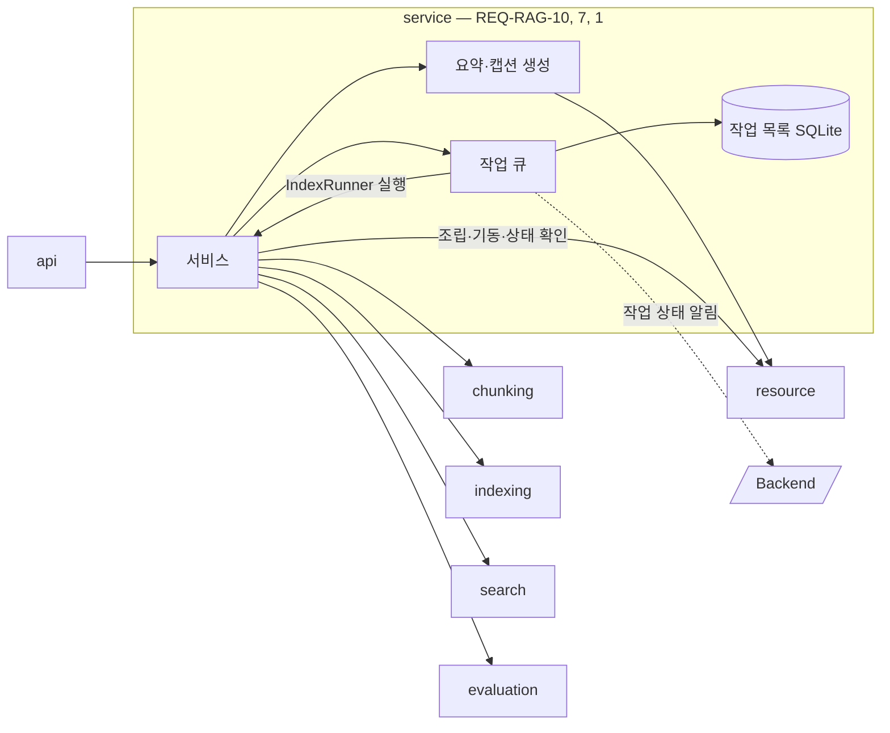
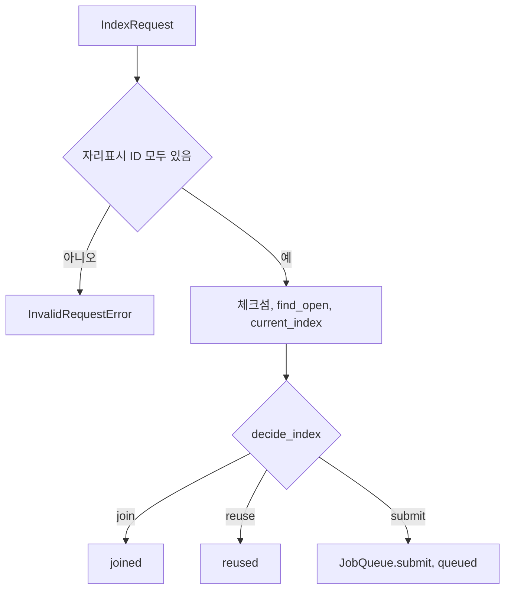
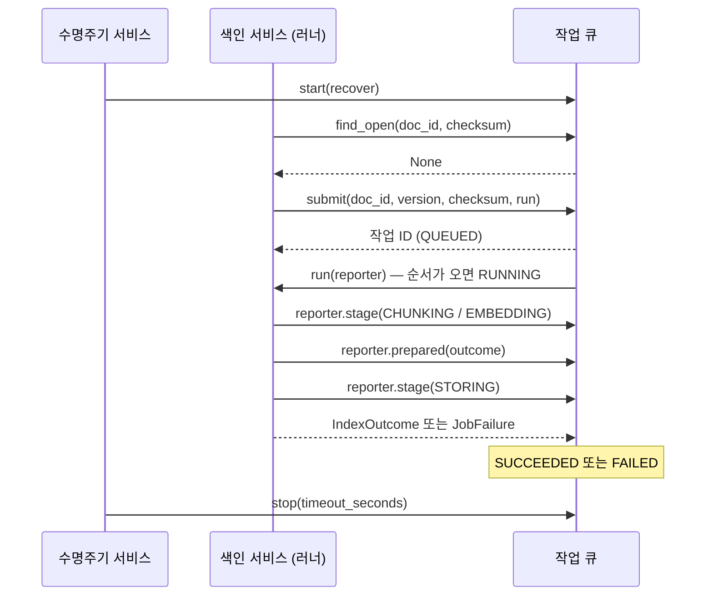
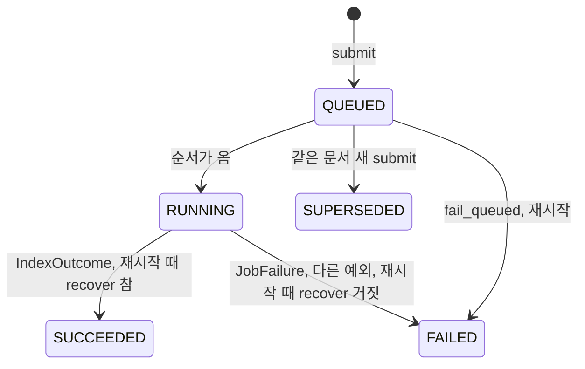

# service 모듈 명세 (REQ-RAG-10, REQ-RAG-7, REQ-RAG-1)

api 아래에서 요청마다 처리 순서를 정하고 기능 단위를 엮는 계층이다. 단위를 조립(의존 주입)하고 앱 기동·종료를 맡는 유일한 곳이며, 서비스 하나가 파일 하나다. 서비스 파일들이 쓰는 헬퍼로 색인 작업 관리(`REQ-RAG-7`)와 요약·캡션 생성(`REQ-RAG-1`)도 맡는다. 작업 관리 헬퍼는 색인 요청을 작업으로 접수해 비동기로 실행하고, 작업 상태와 문서 색인 상태를 SQLite 파일에 보관하며, 상태가 바뀔 때마다 Backend에 알린다. 요약·캡션 생성 헬퍼는 Backend가 보낸 표(Markdown)의 요약과 이미지의 캡션을 resource로 만들어 돌려주며, 결과를 저장하지 않는다. 폴더는 `apps/rag-server/src/minerva_rag/service`다.

## 요약

**핵심 계약**

- 준비(용어집 읽기, 모델 준비, Qdrant 연결, 작업 처리기 시작)가 끝나기 전에는 상태 확인 말고 모든 서비스 메서드가 `ServerNotReadyError`를 낸다 (`REQ-RAG-10.1.1`, `REQ-RAG-10.1.2`)
- 색인 작업 안에서는 청킹을 마친 뒤에만 색인하고, 청킹이 실패하면 색인하지 않는다 (`REQ-RAG-10.3.2`, `REQ-RAG-10.3.3`)
- 문서 삭제는 시작하지 않은 작업 실패 → 색인 중인 작업 기다림 → 청크 삭제 → 문서 색인 상태 비우기 순서다. 순서가 바뀌면 삭제한 문서가 다시 검색된다 (`REQ-RAG-10.5`)
- 단위 조립은 이 모듈에서만 한다. 기능 단위는 서로를 만들지 않고 생성자로 받는다 (`ARCHITECT.md` 「의존 규칙」)
- 작업 상태는 `REQ-RAG-7.2.1`의 전이만 따른다. 실패한 작업은 다시 실행하지 않으며, 새 요청이 새 작업을 만든다 (`REQ-RAG-7.2.1`, `REQ-RAG-7.4`)
- 알림 순번은 문서마다 SQLite에 저장해 서버가 다시 시작해도 줄지 않는다. 순번이 다시 1부터 시작하면 Backend가 새 알림을 오래된 것으로 버린다 (`REQ-RAG-7.7.4`, 루트 `IF-2`)
- 문서의 "현재 검색되는 버전"은 그 문서에서 가장 최근에 완료한 작업의 버전이고, 문서가 삭제되면 비운다. 실패한 작업은 이 값을 바꾸지 않는다. 새 버전을 활성화한 뒤 완료를 기록하기 전에 멈춰도, 다시 시작할 때 `recover`로 확인해 완료로 기록하므로 Qdrant와 어긋나지 않는다 (`REQ-RAG-7.6.1`, `REQ-RAG-7.5.3`)
- 만든 요약·캡션을 저장하지 않고, 만들지 못하면 빈 문자열을 돌려주지 않고 실패를 낸다. Backend가 실패를 보고 임시 설명으로 채운다 (`REQ-RAG-1.1.2`, `REQ-RAG-1.1.3`, `REQ-RAG-1.2.2`, `REQ-RAG-1.2.3`)

**기능 그룹**

| REQ | 기능 그룹 | 책임 |
| :--- | :--- | :--- |
| `REQ-RAG-10.1` | 수명주기 서비스 | 단위를 조립하고, 기동·준비 상태·종료·상태 확인을 맡는다 |
| `REQ-RAG-10.2` | 요약·캡션 서비스 | 요약·캡션 요청을 작업 없이 바로 처리한다 |
| `REQ-RAG-10.3` | 색인 서비스 | 색인 요청을 검증하고 중복을 확인한 뒤 작업으로 접수하며, 작업의 처리 순서를 정한다. 작업·문서 색인 상태 조회도 받는다 |
| `REQ-RAG-10.4` | 검색 서비스 | 검색과 문서 청크 조회를 search에 넘긴다 |
| `REQ-RAG-10.5` | 문서 삭제 서비스 | 작업과 청크를 정해진 순서로 정리한다 |
| `REQ-RAG-10.6` | 이름·판 정보 서비스 | 색인 중인 작업이 끝난 뒤 이름·판 정보를 바꾼다 |
| `REQ-RAG-10.7` | 평가 서비스 | 평가 요청을 작업 없이 바로 처리한다 |
| `REQ-RAG-7.1` | 작업 접수 | 작업을 색인 대기로 기록하고 ID를 곧바로 돌려준다 |
| `REQ-RAG-7.2` | 작업 상태 | 작업의 상태·단계·실패 사유·결과를 기록하고 조회하게 한다 |
| `REQ-RAG-7.3` | 처리 순서 | 동시 실행 상한, 접수 순서, 문서별 순차 실행, 대체됨을 지킨다 |
| `REQ-RAG-7.4` | 실패와 재색인 | 실패한 작업을 다시 실행하지 않고, 새 요청은 새 작업으로 받는다 |
| `REQ-RAG-7.5` | 중단과 복구 | 다시 시작해도 작업을 조회하게 하고, 끝나지 않은 작업을 결과가 검색에 쓰이는지에 따라 완료나 실패로 끝맺는다 |
| `REQ-RAG-7.6` | 문서 색인 상태 | 문서마다 현재 검색되는 버전과 최신 작업 상태를 돌려준다 |
| `REQ-RAG-7.7` | 상태 알림 | 상태가 바뀔 때마다 순번을 붙여 Backend에 알리고, 실패하면 다시 보낸다 |
| `REQ-RAG-1.1` | 표 요약 | 표 하나의 내용을 요약한 문장을 만든다 |
| `REQ-RAG-1.2` | 이미지 캡션 | 이미지 하나를 설명하는 캡션을 만든다 |

**비범위**

- HTTP 요청·응답 형식과 오류의 HTTP 변환 — api
- 검색 한 번의 처리 순서 — search 안에서 지킨다(`ARCHITECT.md` 「의존 규칙」). 검색 서비스는 search를 한 번 부를 뿐이다
- 체크섬 비교와 합류·재사용·새 접수 판단 — indexing의 `decide_index`
- 요약·캡션 실패 시 임시 설명으로 채우는 일 — Backend (`REQ-BE-2.3.2`)

## 구조

### 예상 배치

`ARCHITECT.md` 「폴더 구조와 배치 규칙」에 따라 서비스 하나가 파일 하나이고, 작업 관리와 요약·캡션 생성은 서비스 파일들이 쓰는 헬퍼 파일이다. 한 파일이 두 depth-1을 담지 않는다. 단위 조립은 수명주기 서비스 파일이 맡는다.

```text
src/minerva_rag/service/
├── lifecycle_service.py     # REQ-RAG-10.1 수명주기, 조립
├── caption_service.py       # REQ-RAG-10.2 요약·캡션
├── index_service.py         # REQ-RAG-10.3 색인
├── search_service.py        # REQ-RAG-10.4 검색
├── delete_service.py        # REQ-RAG-10.5 문서 삭제
├── metadata_service.py      # REQ-RAG-10.6 이름·판 정보
├── evaluation_service.py    # REQ-RAG-10.7 평가
├── jobs.py                  # REQ-RAG-7 작업 관리 (헬퍼)
├── captioner.py             # REQ-RAG-1 요약·캡션 생성 (헬퍼)
└── MODULE.md

data/rag-server/jobs.sqlite3     # 작업 목록 (위치는 RAG_JOBS_DB_PATH)

tests/unit/service/
```

### 컨텍스트



`IndexRunner` 실행은 색인 서비스가 넘긴 콜백을 부르는 것이며 import가 아니다. 점선은 프로세스 밖 HTTP다. core 의존은 생략했다.

## 의존성과 공개 표면

### 의존 관계

| 대상 | 관계 | 사용하는 계약 | 계약 소유 | 관련 REQ |
| :--- | :--- | :--- | :--- | :--- |
| chunking | import | `Chunker.split`, `ChunkingMode` | chunking `MODULE.md` | `REQ-RAG-10.3.2` |
| indexing | import | `Indexer`, `decide_index`, `IndexInput` | indexing `MODULE.md` | `REQ-RAG-10.3`, `REQ-RAG-10.5`, `REQ-RAG-10.6`, `REQ-RAG-7.5.3` |
| search | import | `Searcher.search`, `Searcher.document_chunks`, `Searcher.load_glossary` | search `MODULE.md` | `REQ-RAG-10.4`, `REQ-RAG-10.1.1` |
| evaluation | import | `Evaluator.evaluate` | evaluation `MODULE.md` | `REQ-RAG-10.7` |
| resource | import (조립·기동·종료·상태 확인, 요약·캡션 생성만) | `ModelHub.prepare`·`close`·`ollama_available`·`embedding_dimension`·`generate`, `LlmRole`, `ChunkStore.connect`·`close`·`ping` | resource `MODULE.md` | `REQ-RAG-10.1`, `REQ-RAG-1.1.1`, `REQ-RAG-1.2.1` |
| Backend | HTTP `POST` | 작업 상태 알림 | 루트 `IF-2` | `REQ-RAG-7.7` |
| SQLite 파일 | 파일 | 「데이터 계약」 | 이 문서 | `REQ-RAG-7.5.1` |
| core | import | `Settings`, `get_settings`, `get_logger`, 오류 클래스, `JobFailureCode`, `FailureLocation`, `find_placeholders`, `Edition` | core `MODULE.md` | `REQ-RAG-10`, `REQ-RAG-7`, `REQ-RAG-1` |

**금지 의존** — api를 import하지 않는다. resource는 조립·기동·종료·상태 확인과 요약·캡션 생성 말고 직접 부르지 않는다. Backend에는 작업 상태 알림만 보낸다(`ARCHITECT.md` 「의존 규칙」).

### 공개 표면

| 기능 그룹 | 공개 표면 | 상세 계약 | 관련 REQ |
| :--- | :--- | :--- | :--- |
| 수명주기 서비스 | `build_services()`, `Services`, `LifecycleService`, `Health` | 「수명주기 서비스 — REQ-RAG-10.1」 | `REQ-RAG-10.1`, `REQ-RAG-9.2.1` |
| 요약·캡션 서비스 | `CaptionService` | 「요약·캡션 서비스 — REQ-RAG-10.2」 | `REQ-RAG-10.2`, `REQ-RAG-1` |
| 색인 서비스 | `IndexService`, `IndexRequest`, `IndexAccepted` | 「색인 서비스 — REQ-RAG-10.3」 | `REQ-RAG-10.3`, `REQ-RAG-7.2.2`, `REQ-RAG-7.6` |
| 작업 상태, 문서 색인 상태 | `JobView`, `JobFailureInfo`, `IndexStateView`, `JobState`, `JobStage`, `IndexOutcome` | 「데이터 계약」, 「작업 관리 헬퍼 — REQ-RAG-7」 | `REQ-RAG-7.2`, `REQ-RAG-7.6` |
| 검색 서비스 | `SearchService` | 「검색 서비스 — REQ-RAG-10.4」 | `REQ-RAG-10.4`, `REQ-RAG-4.7` |
| 문서 삭제 서비스 | `DeleteService` | 「문서 삭제 서비스 — REQ-RAG-10.5」 | `REQ-RAG-10.5` |
| 이름·판 정보 서비스 | `MetadataService` | 「이름·판 정보 서비스 — REQ-RAG-10.6」 | `REQ-RAG-10.6` |
| 평가 서비스 | `EvaluationService` | 「평가 서비스 — REQ-RAG-10.7」 | `REQ-RAG-10.7` |
| 다시 내보내는 타입 | `ChunkingMode`, `SearchQuery`, `SearchHit`, `EditionScope`, `EditionRef`, `DocumentChunks`, `EvaluationCase`, `EvaluationResult` | 각 단위 `MODULE.md` | `REQ-RAG-9.1.1` |

api는 service와 core만 import할 수 있으므로(`ARCHITECT.md` 「의존 규칙」), api가 요청·응답을 만드는 데 쓰는 기능 단위의 타입을 `minerva_rag.service`에서 다시 내보낸다. 정의는 원래 단위가 소유한다. 작업 큐(`JobManager`)와 `Captioner`는 서비스 파일들이 쓰는 헬퍼라 모듈 밖으로 내보내지 않으며, 시그니처는 헬퍼를 따로 검증하는 테스트를 위해 「기능 그룹별 요구사항」에 둔다.

## 데이터 계약

### 모델별 필드

**`IndexRequest`** — 정의: service, 값 생산: api (`POST /v1/index-jobs`)

| 필드 | 타입 | 필수 | 불변 조건 |
| :--- | :--- | :--- | :--- |
| `doc_id`, `version`, `markdown`, `name` | `str` | 필수 | 요청 값 그대로 |
| `assets` | `Mapping[str, str]` | 필수 | 자리표시 ID → 요약·캡션 문장 |
| `edition` | `Edition \| None` | 선택 | |
| `chunking` | `ChunkingMode` | 필수 | 기본 `SEMANTIC` |
| `force` | `bool` | 필수 | 기본 `False` |

**`IndexAccepted`** — 정의: service, 값 생산: service. `outcome`(`"queued"`·`"joined"`·`"reused"`), `job_id`, `doc_id`, `version`. API의 `IndexJobAccepted`로 옮긴다.

**`Health`** — 정의: service, 값 생산: service. `qdrant: bool`, `ollama: bool`. API의 `ok`·`unavailable`로 옮긴다.

**작업 레코드** (SQLite) — 정의: service, 값 생산: 작업 큐 (`REQ-RAG-7.2`, `REQ-RAG-7.5.1`)

| 필드 | 타입 | 필수 | 불변 조건 |
| :--- | :--- | :--- | :--- |
| `job_id` | 문자열 | 필수 | 모든 작업에 걸쳐 고유 |
| `doc_id`, `version`, `checksum` | 문자열 | 필수 | 접수 때 받은 값 그대로 |
| `accepted_order` | 정수 | 필수 | 접수할 때마다 1씩 커진다. 접수 순서의 기준 |
| `state` | `JobState` 값 | 필수 | `REQ-RAG-7.2.1`의 전이만 따른다 |
| `stage` | `JobStage` 값 | 조건부 | `RUNNING`일 때만 값이 있다 |
| `failure_code`, `failure_message` | 문자열 | 조건부 | `FAILED`일 때만 값이 있다 |
| `failure_heading_path`, `failure_placeholder_id` | 문자열 | 선택 | `FAILED`이고 위치를 알 때만 |
| `chunk_count`, `fallback_used` | 정수, 불리언 | 조건부 | `SUCCEEDED`일 때만 값이 있다 |
| `prepared_chunk_count`, `prepared_fallback_used` | 정수, 불리언 | 선택 | `ProgressReporter.prepared`로 받은 결과. `RUNNING` 중에만 쓰고, 다시 시작할 때 완료로 바꾸는 작업의 결과가 된다 |

**문서 레코드** (SQLite) — 정의: service, 값 생산: 작업 큐 (`REQ-RAG-7.6`, `REQ-RAG-7.7.4`)

| 필드 | 타입 | 필수 | 불변 조건 |
| :--- | :--- | :--- | :--- |
| `doc_id` | 문자열 | 필수 | |
| `searchable_job_id` | 문자열 | 선택 | 그 문서에서 가장 최근에 `SUCCEEDED`가 된 작업. `forget_document` 뒤에는 비어 있다 |
| `last_sequence` | 정수 | 필수 | 그 문서에 마지막으로 붙인 알림 순번. 줄어들지 않는다 |

**`JobView`** — `job_id`, `doc_id`, `version`, `state`, `stage`, `failure: JobFailureInfo | None`, `result: IndexOutcome | None`. 값은 작업 레코드 그대로다. API의 `IndexJob`으로 옮긴다.

**`JobFailureInfo`** — `code`, `message`, `location: FailureLocation | None`.

**`IndexStateView`** — `doc_id`, `searchable_version`(`searchable_job_id` 작업의 버전, 없으면 `None`), `latest_job_id`·`latest_job_state`(그 문서에서 `accepted_order`가 가장 큰 작업, 없으면 `None`), `latest_job_stage`(최신 작업이 `RUNNING`일 때만). API의 `IndexState`로 옮긴다.

**`CurrentIndex`** — `job_id`, `version`, `checksum`. `searchable_job_id` 작업의 값이다.

### 변환·저장 경계

- **색인 요청 → 작업** (`IndexRequest` → `IndexInput`·`IndexRunner`) — 보존: `doc_id`, `version`, `markdown`, `assets`, `name`, `edition`. 파생: 체크섬(indexing), `chunking_mode`는 `ChunkingMode` 값. 실패 시: 검증 실패면 작업을 만들지 않는다
- **작업 상태 변경 → 알림 본문** (루트 `IF-2`) — 상태를 바꾸는 같은 트랜잭션에서 `last_sequence`를 1 올려 그 알림의 `sequence`로 쓴다. `index_state`는 그 트랜잭션이 끝난 시점의 `IndexStateView`다. 실패 시: 트랜잭션 전체를 되돌리고 알림을 보내지 않는다

## 기능 그룹별 요구사항

모든 서비스 메서드는 진입할 때 `service.{서비스}.{동작}` 로그 이벤트를 남긴다. 도메인 예외(`MinervaError`)는 warning으로 남기고 그대로 전파하며, 그 밖의 예외는 스택과 함께 남긴다(`AGENTS.md`).

### 수명주기 서비스 — `REQ-RAG-10.1`

```python
@dataclass(frozen=True)
class Services:
    """조립한 서비스 묶음이다."""
    lifecycle: LifecycleService
    caption: CaptionService
    index: IndexService
    search: SearchService
    delete: DeleteService
    metadata: MetadataService
    evaluation: EvaluationService


def build_services(settings: Settings) -> Services:
    """설정으로 모든 단위를 만들어 엮는다. 연결이나 모델 준비는 하지 않는다."""


@dataclass(frozen=True)
class Health:
    """외부 자원 연결 상태다."""
    qdrant: bool
    ollama: bool


class LifecycleService:
    """기동·종료와 준비 상태를 맡는다."""

    @property
    def ready(self) -> bool: ...
    async def startup(self) -> None: ...
    async def shutdown(self) -> None: ...
    async def health(self) -> Health: ...
```

**`REQ-RAG-10.1.1`** 준비를 마친 뒤 요청 받기

- 처리 계약: `startup`은 용어집 읽기(`Searcher.load_glossary`) → 모델 준비 → Qdrant 연결(임베딩 차원으로) → 작업 처리기 시작(`JobQueue.start(Indexer.recover)`) 순으로 하고, 모두 끝난 뒤에만 `ready`를 참으로 바꾼다. 차원 불일치는 기동을 막지 않는다(resource `MODULE.md`)
- 실패: `GlossaryError`, `ModelLoadError`, Qdrant 연결의 `StoreUnavailableError` 중 하나라도 나면 이유를 error 로그로 남기고 그 예외를 낸다. `ready`는 거짓으로 남고, 프로세스를 끝내는 일은 api가 한다(`REQ-RAG-12.1.1`)
- 충족 기준: 단계 순서가 위와 같고, 작업 처리기 시작 때 남은 `RUNNING` 작업에 `Indexer.recover`가 불리며, 마지막 단계 전에는 `ready`가 거짓이고, 한 단계가 실패하면 뒤 단계가 불리지 않고 예외가 난다

**`REQ-RAG-10.1.2`** 준비 전 요청은 "준비 중"

- 처리 계약: `ready`가 거짓이면 `health`를 뺀 모든 서비스 메서드가 아무 단위도 부르지 않고 `ServerNotReadyError`를 낸다
- 충족 기준: `startup` 전에 각 서비스 메서드를 부르면 `ServerNotReadyError`가 나고, `health`는 결과를 돌려준다

**`REQ-RAG-10.1.3`** 종료 때 작업 기다리기

- 처리 계약: `shutdown`은 `JobQueue.stop(RAG_SHUTDOWN_TIMEOUT_SECONDS)`을 부른 뒤 resource의 연결과 모델을 닫는다. `stop(timeout_seconds)`는 새 접수를 막고 `RUNNING` 작업을 `timeout_seconds`까지 기다린다. 그 안에 끝난 작업은 결과를 기록하고, 끝나지 않은 작업은 실행을 취소해 `RUNNING`으로 남긴다. 남긴 작업은 다음 `start`가 끝맺는다(`REQ-RAG-7.5.2`, `REQ-RAG-7.5.3`)
- 충족 기준: `shutdown`이 설정한 시간으로 `stop`을 부르고, 그다음 색인 요청은 `ShuttingDownError`를 낸다. `stop`은 `RUNNING` 작업을 `timeout_seconds`까지 기다려, 그 안에 끝난 작업은 그 결과(`SUCCEEDED`·`FAILED`)로 기록하고, 끝나지 않은 작업은 취소해 `RUNNING`으로 남기며 그 작업은 다음 `start`에서 끝맺어진다

`health`는 `ChunkStore.ping`과 `ModelHub.ollama_available`의 결과를 돌려주며 오류를 내지 않는다(`REQ-RAG-9.2.1`, api `MODULE.md`).

### 요약·캡션 서비스 — `REQ-RAG-10.2`

```python
class CaptionService:
    async def summarize_table(self, table_markdown: str) -> str: ...
    async def caption_image(self, image: bytes) -> str: ...
```

**`REQ-RAG-10.2.1`** 작업 없이 응답으로

- 처리 계약: `Captioner`를 불러 결과를 그대로 돌려준다. 작업 큐를 부르지 않는다
- 충족 기준: 두 메서드가 `Captioner`의 결과를 돌려주고, 작업 목록에 작업이 생기지 않으며 알림이 나가지 않는다

### 색인 서비스 — `REQ-RAG-10.3`

```python
class IndexService:
    async def submit(self, req: IndexRequest) -> IndexAccepted: ...
    async def get_job(self, job_id: str) -> JobView: ...
    async def index_state(self, doc_id: str) -> IndexStateView: ...
    async def index_states(self, doc_ids: Sequence[str]) -> list[IndexStateView]: ...
```

`get_job`·`index_state`·`index_states`는 작업 큐의 같은 이름 메서드를 그대로 부른다(`REQ-RAG-7.2.2`, `REQ-RAG-7.6.2`, `REQ-RAG-7.6.3`).

**`REQ-RAG-10.3.1`** 체크섬을 먼저 확인하고 필요할 때만 접수

- 입력·선행 조건: `markdown`의 모든 자리표시 ID가 `assets`의 키에 있어야 한다
- 처리 계약: 체크섬을 만들고, `find_open`과 `current_index`로 얻은 값으로 `decide_index`를 부른다. `submit`이면 `IndexRunner`를 만들어 `JobQueue.submit`하고 `queued`를, `join`이면 `joined`를, `reuse`면 `reused`를 돌려준다. `joined`·`reused`에서는 작업을 만들지 않는다
- 실패: 자리표시 ID가 `assets`에 없으면 `InvalidRequestError`를 내고, 메시지에 빠진 ID 개수를 담는다
- 충족 기준: 세 결정마다 해당 `outcome`과 작업 ID가 나오고 새 작업은 `submit` 결정에서만 생기며, 자리표시 ID가 빠지면 `InvalidRequestError`가 나고 아무 작업도 만들지 않는다

**`REQ-RAG-10.3.2`** 청킹을 마친 뒤 색인

- 처리 계약: `IndexRunner`는 `CHUNKING` 알림 → `Chunker.split` → `EMBEDDING` 알림 → `Indexer.embed`(`job_id`는 `ProgressReporter.job_id`) → `prepared(IndexOutcome)` → `STORING` 알림 → `Indexer.write` 순으로 하고, 같은 `IndexOutcome(chunk_count, fallback_used)`를 돌려준다. `chunk_count`는 만든 레코드 수, `fallback_used`는 청킹 결과의 값이다(`REQ-RAG-2.3.3`). `prepared`를 `write`보다 먼저 불러야 활성화 뒤에 멈춰도 다시 시작할 때 완료로 기록할 수 있다(`REQ-RAG-7.5.3`)
- 충족 기준: 러너를 실행하면 단계 알림, `prepared`, 호출이 위 순서로 일어나고, `prepared`에 넘긴 결과와 돌려준 결과가 같으며, 레코드의 `job_id`가 `ProgressReporter.job_id`다

**`REQ-RAG-10.3.3`** 청킹이 실패하면 색인하지 않음

- 처리 계약: 러너 안의 오류를 「예외」 표의 작업 실패 사유로 바꿔 `JobFailure`로 낸다. `ChunkingFailedError`의 위치는 `FailureLocation`으로 옮긴다
- 충족 기준: `split`이 `ChunkingFailedError`를 내면 `embed`·`write`가 불리지 않고 `JobFailure`(`CHUNKING_FAILED`, 위치 포함)가 난다

**`REQ-RAG-10.3.4`** 새 버전 색인 실패 시 이전 버전 유지

- 처리 계약: `embed`·`write`가 실패하면 `JobFailure`로 끝내며, 이전 버전 보존은 indexing의 보장이다(indexing `MODULE.md` 「핵심 흐름」)
- 충족 기준: `write`가 `StoreUnavailableError`를 내면 `JobFailure`(`STORE_UNAVAILABLE`)가 나고, 이전 버전 레코드를 지우는 호출이 없다

### 검색 서비스 — `REQ-RAG-10.4`

```python
class SearchService:
    async def search(self, q: SearchQuery) -> tuple[SearchHit, ...]: ...
    async def document_chunks(self, doc_id: str) -> DocumentChunks: ...
```

**`REQ-RAG-10.4.1`** 질의 확장, 하이브리드 검색, 재정렬, 연관 청크 확장 순

- 처리 계약: `Searcher.search`를 한 번 부른다. 처리 순서는 search가 보장한다(search `MODULE.md` 「핵심 흐름」)
- 충족 기준: 검색 한 번에 `Searcher.search`가 정확히 한 번 불리고, 결과를 바꾸지 않고 돌려준다

**`REQ-RAG-10.4.2`** 0건은 빈 결과

- 충족 기준: `Searcher.search`가 빈 값을 돌려주면 오류 없이 빈 값을 돌려준다

### 문서 삭제 서비스 — `REQ-RAG-10.5`

```python
class DeleteService:
    async def delete(self, doc_id: str) -> None: ...
```

**`REQ-RAG-10.5.1`** 시작하지 않은 작업은 실패(문서 삭제)

- 처리 계약: `delete`는 `fail_queued(doc_id, DOCUMENT_DELETED, ...)`를 맨 먼저 부른다. `fail_queued(doc_id, code, message)`는 그 문서의 `QUEUED` 작업만 받은 사유 코드·설명으로 `FAILED`가 되게 하고, 그 작업의 `IndexRunner`는 부르지 않으며, 바뀐 작업마다 알린다(`REQ-RAG-7.7.1`)
- 충족 기준: `delete`가 다른 어떤 호출보다 먼저 `fail_queued`를 `DOCUMENT_DELETED`로 부른다. `fail_queued`는 그 문서의 `QUEUED` 작업만 받은 코드·설명의 `FAILED`로 바꾸고 그 러너를 부르지 않으며, `RUNNING` 작업과 다른 문서의 작업은 바꾸지 않고, 바뀐 작업마다 알림을 하나씩 보낸다

**`REQ-RAG-10.5.2`** 색인 중인 작업이 끝난 뒤 삭제

- 처리 계약: `wait_running` → `Indexer.delete_document` → `forget_document` 순으로 부른다. `wait_running(doc_id)`는 그 문서의 `RUNNING` 작업이 끝난 뒤 돌아오고, 없으면 바로 돌아온다
- 충족 기준: `wait_running`이 끝나기 전에는 `delete_document`가 불리지 않고, `forget_document`는 `delete_document` 뒤에 불린다. `wait_running`은 그 문서의 `RUNNING` 작업이 끝난 뒤 돌아오고, 없으면 바로 돌아온다

### 이름·판 정보 서비스 — `REQ-RAG-10.6`

```python
class MetadataService:
    async def update(self, doc_id: str, name: str, edition: Edition | None) -> None: ...
```

**`REQ-RAG-10.6.1`** 색인 중인 작업이 끝난 뒤 변경

- 처리 계약: `wait_running` → `Indexer.update_metadata` 순으로 부른다
- 충족 기준: `wait_running`이 끝나기 전에는 `update_metadata`가 불리지 않는다

### 평가 서비스 — `REQ-RAG-10.7`

```python
class EvaluationService:
    async def evaluate(self, case: EvaluationCase) -> EvaluationResult: ...
```

**`REQ-RAG-10.7.1`** 작업 없이 응답으로

- 충족 기준: `Evaluator.evaluate`의 결과를 그대로 돌려주고, 작업 목록에 작업이 생기지 않으며 알림이 나가지 않는다

### 작업 관리 헬퍼 — `REQ-RAG-7`

작업 큐는 접수·순서·상태를 관리하고, 실제 처리(청킹 → 색인)는 색인 서비스가 만든 `IndexRunner`를 실행할 뿐 내용을 모른다. 그래서 작업 큐는 가짜 `IndexRunner`로, 러너는 가짜 `ProgressReporter`로 따로 검증한다. 아래 타입과 `JobQueue`는 이 모듈 안의 계약이며, 단계·실패를 알리는 방법을 러너와 작업 큐가 같은 뜻으로 써야 작업 상태가 맞게 기록된다.

```python
IndexRunner = Callable[[ProgressReporter], Awaitable[IndexOutcome]]
RecoverFn = Callable[[str, str], Awaitable[bool]]  # (doc_id, job_id) → 그 작업의 결과가 검색에 쓰이는가


class JobState(StrEnum):
    QUEUED = "queued"          # 색인 대기
    RUNNING = "running"        # 색인 중
    SUCCEEDED = "succeeded"    # 완료
    FAILED = "failed"          # 실패
    SUPERSEDED = "superseded"  # 대체됨


class JobStage(StrEnum):
    CHUNKING = "chunking"    # 분할
    EMBEDDING = "embedding"  # 임베딩
    STORING = "storing"      # 저장


@dataclass(frozen=True)
class IndexOutcome:
    """완료한 작업의 결과다."""
    chunk_count: int
    fallback_used: bool


class JobFailure(Exception):
    """러너가 처리 중 실패를 작업 큐에 알리는 예외다."""
    def __init__(self, code: str, message: str, location: FailureLocation | None = None) -> None: ...


class ProgressReporter(Protocol):
    """색인 중 단계와 미리 정한 결과를 작업 큐에 알린다."""
    @property
    def job_id(self) -> str: ...
    def stage(self, stage: JobStage) -> None: ...
    async def prepared(self, outcome: IndexOutcome) -> None: ...


class JobQueue(Protocol):
    """서비스 파일들이 쓰는 작업 큐의 실행 표면이다."""
    async def start(self, recover: RecoverFn) -> None: ...
    async def stop(self, timeout_seconds: float) -> None: ...
    async def submit(self, doc_id: str, version: str, checksum: str, run: IndexRunner) -> str: ...
    async def find_open(self, doc_id: str, checksum: str) -> str | None: ...
    async def fail_queued(self, doc_id: str, code: str, message: str) -> None: ...
    async def wait_running(self, doc_id: str) -> None: ...


@dataclass(frozen=True)
class JobFailureInfo:
    """실패한 작업의 사유다."""
    code: str
    message: str
    location: FailureLocation | None


@dataclass(frozen=True)
class JobView:
    """작업 하나의 상태다."""
    job_id: str
    doc_id: str
    version: str
    state: JobState
    stage: JobStage | None
    failure: JobFailureInfo | None
    result: IndexOutcome | None


@dataclass(frozen=True)
class IndexStateView:
    """문서 하나의 색인 상태다."""
    doc_id: str
    searchable_version: str | None
    latest_job_id: str | None
    latest_job_state: JobState | None
    latest_job_stage: JobStage | None


@dataclass(frozen=True)
class CurrentIndex:
    """지금 검색되는 색인을 만든 작업이다."""
    job_id: str
    version: str
    checksum: str


class JobManager:  # JobQueue를 구현한다
    """작업을 접수·실행·기록하고 Backend에 알린다."""

    def __init__(self, settings: Settings) -> None: ...
    async def get_job(self, job_id: str) -> JobView: ...
    async def index_state(self, doc_id: str) -> IndexStateView: ...
    async def index_states(self, doc_ids: Sequence[str]) -> list[IndexStateView]: ...
    async def current_index(self, doc_id: str) -> CurrentIndex | None: ...
    async def forget_document(self, doc_id: str) -> None: ...
```

| 필드·인자 | 타입 | 불변 조건 |
| :--- | :--- | :--- |
| `submit`의 반환값 | `str` | 작업 ID. 접수와 동시에 `QUEUED` 상태로 기록된 작업의 ID다 |
| `JobFailure.code` | `str` | 실패 사유 코드(`JobFailureCode` 값) |
| `JobFailure.message` | `str` | 관리자가 읽고 조치할 수 있는 한국어 설명. 스택 트레이스·쿼리·파일 경로를 넣지 않는다 (`REQ-RAG-11.3.2`) |
| `IndexOutcome.chunk_count` | `int` | 저장한 레코드 수 |
| `ProgressReporter.job_id` | `str` | 실행 중인 작업의 ID. 러너는 이 값을 레코드의 `job_id`로 쓴다(`IF-RAG-1`) |
| `prepared`의 `outcome` | `IndexOutcome` | 러너가 돌려줄 결과와 같다. 활성화 전에 기록되며, 다시 시작할 때 완료로 바꾸는 작업의 결과로 쓴다 |

- **러너를 만드는 색인 서비스** — 보장: 청킹을 마친 뒤 색인하고, 단계마다 시작 전에 알리며, 저장·활성화 전에 `prepared`로 결과를 알린다(`REQ-RAG-10.3.2`, `REQ-RAG-7.2.3`, `REQ-RAG-7.5.3`). 청킹이 실패하면 색인하지 않고 `JobFailure`를 내며, 실패 위치를 알 수 있으면 `FailureLocation`을 채운다(`REQ-RAG-10.3.3`, `REQ-RAG-7.2.5`). `find_open`과 indexing의 체크섬 확인을 거친 뒤에만 `submit`한다(`REQ-RAG-3.5.1`, `REQ-RAG-3.5.3`, `REQ-RAG-10.3.1`)
- **작업 큐** — 보장: `REQ-RAG-7.1`~`REQ-RAG-7.7`의 처리 계약. 금지: chunking·indexing과 서비스 파일을 import하지 않는다. `IndexRunner`의 처리 내용을 바꾸거나 다시 실행하지 않는다

`start`, `stop`, `submit`, `find_open`, `fail_queued`, `wait_running`은 `JobManager`가 구현한다. `stop`·`fail_queued`·`wait_running`의 처리 계약은 그것을 쓰는 서비스의 REQ(`REQ-RAG-10.1.3`, `REQ-RAG-10.5.1`, `REQ-RAG-10.5.2`)에 있다.

### 작업 접수 — `REQ-RAG-7.1`

**`REQ-RAG-7.1.1`** 처리를 기다리지 않고 작업 ID 반환

- 처리 계약: `submit`은 작업 레코드를 쓰고 `IndexRunner`를 실행 대기열에 넣은 뒤 바로 돌아온다. `stop`이 불린 뒤의 `submit`은 `ShuttingDownError`를 낸다
- 충족 기준: 끝나지 않는 `IndexRunner`를 넘겨도 `submit`이 작업 ID를 돌려주고, `stop` 뒤에는 `ShuttingDownError`가 난다

**`REQ-RAG-7.1.2`** 색인 대기로 시작

- 충족 기준: `submit` 직후 `get_job`의 `state`가 `QUEUED`다

### 작업 상태 — `REQ-RAG-7.2`

**`REQ-RAG-7.2.1`** 다섯 가지 상태

- 처리 계약: 상태는 `QUEUED → RUNNING → SUCCEEDED·FAILED` 또는 `QUEUED → SUPERSEDED·FAILED`로만 바뀐다. 끝난 상태(`SUCCEEDED`, `FAILED`, `SUPERSEDED`)에서 다른 상태로 바뀌지 않는다
- 충족 기준: 어떤 순서로 이벤트가 와도 기록된 전이가 위 경로 밖으로 나가지 않는다

**`REQ-RAG-7.2.2`** 작업 ID로 조회

- 실패: 없는 ID면 `JobNotFoundError`를 낸다
- 충족 기준: 접수한 작업을 ID로 조회하면 `JobView`가 나오고, 없는 ID는 `JobNotFoundError`다

**`REQ-RAG-7.2.3`** 색인 중 단계

- 처리 계약: `ProgressReporter.stage`로 받은 단계를 `RUNNING` 작업의 `stage`로 기록한다. `RUNNING`이 아닌 작업의 `stage`는 `None`이다
- 충족 기준: `IndexRunner`가 `EMBEDDING`을 알린 직후 `get_job`의 `stage`가 `EMBEDDING`이고, 끝난 뒤에는 `None`이다

**`REQ-RAG-7.2.4`** 실패 사유 코드와 한국어 설명

- 처리 계약: `IndexRunner`가 `JobFailure`를 내면 그 `code`·`message`를 기록하고, 다른 예외를 내면 `JobFailureCode.INTERNAL_ERROR`와 내부 정보 없는 한국어 설명을 기록한다
- 충족 기준: `JobFailure`의 코드·설명이 그대로 조회되고, 다른 예외는 `INTERNAL_ERROR`와 그 예외 문자열이 들지 않은 설명으로 조회된다

**`REQ-RAG-7.2.5`** 실패 위치

- 충족 기준: `JobFailure`에 `FailureLocation`이 있으면 `failure.location`이 같은 값이고, 없으면 `None`이다

**`REQ-RAG-7.2.6`** 완료 결과

- 충족 기준: `IndexRunner`가 `IndexOutcome`을 돌려주면 `state`가 `SUCCEEDED`이고 `result`의 청크 수·대체 분할 여부와 `doc_id`·`version`이 조회된다

### 처리 순서 — `REQ-RAG-7.3`

**`REQ-RAG-7.3.1`** 동시 실행 상한

- 충족 기준: 상한이 2일 때 끝나지 않는 작업 세 개를 다른 문서로 접수하면 `RUNNING`이 두 개를 넘지 않는다

**`REQ-RAG-7.3.2`** 접수 순서대로 대기

- 처리 계약: 실행할 수 있는 작업 중 `accepted_order`가 가장 작은 것부터 실행한다
- 충족 기준: 상한 1에서 A·B·C 문서 작업을 차례로 접수하면 A·B·C 순으로 `RUNNING`이 된다

**`REQ-RAG-7.3.3`** 같은 문서는 하나씩

- 처리 계약: 같은 문서의 작업이 `RUNNING`이면 그 문서의 다음 작업은 상한에 여유가 있어도 기다린다
- 충족 기준: 상한 2에서 같은 문서 작업이 실행 중일 때 접수한 그 문서의 작업이 앞 작업이 끝난 뒤에 `RUNNING`이 된다

**`REQ-RAG-7.3.4`** 시작하지 않은 이전 작업은 대체됨

- 충족 기준: 같은 문서의 `QUEUED` 작업이 있을 때 새로 `submit`하면 이전 작업이 `SUPERSEDED`가 되고 그 `IndexRunner`는 불리지 않는다. `RUNNING` 작업은 바뀌지 않는다

### 실패와 재색인 — `REQ-RAG-7.4`

**`REQ-RAG-7.4.1`** 다시 시도하지 않음

- 충족 기준: 실패한 `IndexRunner`가 다시 불리지 않는다

**`REQ-RAG-7.4.2`** 새 요청 전까지 실패로 남음

- 충족 기준: 실패한 작업의 상태가 그 문서의 새 `submit` 전후로 `FAILED` 그대로다

**`REQ-RAG-7.4.3`** 같은 체크섬이어도 새 작업

- 처리 계약: `find_open`은 `QUEUED`·`RUNNING` 작업만 찾는다
- 충족 기준: 실패한 작업과 같은 문서·같은 체크섬으로 `find_open`하면 `None`이고, `submit`하면 새 작업 ID가 나온다

### 중단과 복구 — `REQ-RAG-7.5`

**`REQ-RAG-7.5.1`** 다시 시작한 뒤에도 조회

- 충족 기준: 같은 `RAG_JOBS_DB_PATH`로 `JobManager`를 새로 만들고 `start`하면 이전 작업이 같은 상태·결과로 조회된다

**`REQ-RAG-7.5.2`** 끝나지 않은 작업은 실패

- 처리 계약: `start(recover)`는 남은 `QUEUED` 작업을, 그리고 `REQ-RAG-7.5.3`에 들지 않는 `RUNNING` 작업을 `FAILED`(`JobFailureCode.SERVER_RESTARTED`)로 바꾸고, 바뀐 작업마다 알린다. 이 처리를 마친 뒤에 새 작업을 실행한다
- 충족 기준: 남은 `QUEUED` 작업과, `recover`가 거짓이거나 `recover`가 참이어도 `prepared` 결과가 없는 `RUNNING` 작업이 `SERVER_RESTARTED`로 실패하고 작업마다 알림이 나간다

**`REQ-RAG-7.5.3`** 결과가 이미 검색에 쓰이면 완료

- 처리 계약: `start`는 남은 `RUNNING` 작업마다 `recover(doc_id, job_id)`를 부른다. 참이고 `prepared` 결과가 있으면 그 결과로 `SUCCEEDED`를 기록하고 `searchable_job_id`를 그 작업으로 바꾼 뒤 알린다. 남은 정리(이전 레코드 삭제, 최신판 표시)는 `recover`가 한다(indexing `MODULE.md` 「기동 복구」)
- 충족 기준: 남은 `RUNNING` 작업마다 `recover`가 그 작업의 `(doc_id, job_id)`로 불린다. `prepared` 결과가 있는 `RUNNING` 작업에 `recover`가 참이면 `SUCCEEDED`와 그 결과로 조회되고 `searchable_version`이 그 버전이며 `succeeded` 알림이 나간다. `recover`가 거짓이면 `SERVER_RESTARTED` 실패다

### 문서 색인 상태 — `REQ-RAG-7.6`

**`REQ-RAG-7.6.1`** 검색되는 버전과 최신 작업 상태

- 처리 계약: `searchable_version`은 가장 최근에 완료한 작업의 버전이며, 그 뒤 작업이 실패해도 바뀌지 않는다. `forget_document` 뒤에는 `None`이다
- 충족 기준: v1 완료 뒤 v2가 실패하면 `searchable_version`이 v1이고 최신 작업 상태가 `FAILED`이며, `forget_document` 뒤에는 `searchable_version`이 `None`이다

**`REQ-RAG-7.6.2`** 문서 ID로 조회

- 충족 기준: `index_state`가 검색되는 버전, 최신 작업 ID·상태를 돌려주고, 최신 작업이 `RUNNING`이면 단계도 돌려준다. 작업이 없던 문서는 모든 값이 `None`이다

**`REQ-RAG-7.6.3`** 여러 문서 한 번에 조회

- 충족 기준: `index_states`가 받은 `doc_ids`와 같은 순서·같은 개수로 돌려준다

### 상태 알림 — `REQ-RAG-7.7`

알림 본문과 받는 쪽 의무는 루트 `IF-2`가 소유한다. 보낼 주소는 `RAG_BACKEND_EVENTS_URL`이다.

**`REQ-RAG-7.7.1`** 상태가 바뀔 때마다 알림

- 처리 계약: 접수(`QUEUED`)를 포함해 상태가 바뀔 때마다 알림 하나를 보낸다. 알림 전송은 작업 실행을 막지 않는다
- 충족 기준: 접수부터 완료까지 `queued`·`running`·`succeeded` 알림 세 개가 그 순번 순으로 나가고, 각 본문의 `index_state`가 그 시점 값이다. `superseded`·`failed`로 바뀔 때도 알림이 하나씩 나가며, 수신자가 응답을 늦게 줘도 작업 실행이 기다리지 않는다

**`REQ-RAG-7.7.2`** 단계 변경은 알리지 않음

- 충족 기준: `IndexRunner`가 단계를 세 번 알려도 알림 수가 늘지 않는다

**`REQ-RAG-7.7.3`** 실패하면 다시 보냄

- 처리 계약: 2xx가 아니거나 연결에 실패하면 1초에서 시작해 두 배씩 늘어나는 간격으로 `RAG_NOTIFY_RETRIES`번까지 다시 보낸다. 다 실패하면 그 알림을 버리고 경고 로그를 남긴다
- 충족 기준: 수신자가 계속 500을 주면 첫 전송 뒤 5번 더 보내고 멈추며, 간격이 1·2·4·8·16초다(시계 대체). 세 번째에 2xx를 주면 거기서 멈춘다

**`REQ-RAG-7.7.4`** 문서별 순번

- 처리 계약: 순번은 문서마다 1부터 시작해 알림마다 1씩 커지고, 다시 보낼 때는 바뀌지 않으며, 서버를 다시 시작해도 이어진다
- 충족 기준: 한 문서의 알림 순번이 1, 2, 3으로 커지고, 재전송 본문의 순번이 원래와 같으며, 다시 시작한 뒤 첫 알림이 마지막 순번 + 1이다. 상태 변경 트랜잭션이 실패하면 상태와 순번이 그대로이고 알림이 나가지 않는다

**`REQ-RAG-7.7.5`** 알림 토큰

- 처리 계약: 모든 알림(재전송 포함)의 `X-Minerva-Token` 헤더에 `RAG_BACKEND_EVENTS_TOKEN`을 담는다(루트 `IF-2`). Backend가 `401`로 응답해도 다른 실패와 같이 다시 보낸다
- 충족 기준: 가짜 수신자가 받은 모든 알림의 헤더 값이 설정한 토큰과 같고, `401` 응답에도 다시 보낸다

### 요약·캡션 생성 헬퍼 — `REQ-RAG-1`

```python
class Captioner:
    """표 요약과 이미지 캡션을 만든다."""

    def __init__(self, model_hub: ModelHub) -> None: ...
    async def summarize_table(self, table_markdown: str) -> str: ...
    async def caption_image(self, image: bytes) -> str: ...
```

두 메서드 모두 앞뒤 공백을 뺀 한 문단의 한국어 문장을 돌려준다. `Captioner`는 resource의 Qdrant 저장소(`ChunkStore`), 작업 큐, 파일 시스템에 기대지 않는다.

### 표 요약 — `REQ-RAG-1.1`

**`REQ-RAG-1.1.1`** 표 요약 생성

- 처리 계약: `LlmRole.TABLE_SUMMARY`로 생성하며, 반환값은 비어 있지 않다
- 충족 기준: 모델이 문장을 돌려주면 그 문장이 앞뒤 공백 없이 반환된다

**`REQ-RAG-1.1.2`** 표 요약 비저장

- 충족 기준: `summarize_table`을 부른 뒤 Qdrant 저장소·작업 목록 SQLite와 파일 시스템에 쓰기가 일어나지 않는다

**`REQ-RAG-1.1.3`** 표 요약 실패 알림

- 실패: 모델이 빈 응답을 주거나 생성이 실패하면, 또는 표가 커서 resource가 `PromptTooLongError`를 내면 `CaptionFailedError`를 낸다. 표를 잘라 요약하지 않는다. Ollama에 연결할 수 없으면 resource의 `ModelUnavailableError`를 그대로 낸다
- 충족 기준: 모델 응답이 비었거나 생성 오류가 나거나 `PromptTooLongError`가 나면 `CaptionFailedError`가, 연결 거부면 `ModelUnavailableError`가 난다

### 이미지 캡션 — `REQ-RAG-1.2`

**`REQ-RAG-1.2.1`** 이미지 캡션 생성

- 처리 계약: `LlmRole.IMAGE_CAPTION`으로 `image`를 넘겨 생성하며, 반환값은 비어 있지 않다
- 충족 기준: 모델이 문장을 돌려주면 그 문장이 앞뒤 공백 없이 반환되고, 모델 호출에 받은 이미지 바이트가 그대로 넘어간다

**`REQ-RAG-1.2.2`** 캡션 비저장

- 충족 기준: `caption_image`를 부른 뒤 Qdrant 저장소·작업 목록 SQLite와 파일 시스템에 쓰기가 일어나지 않는다

**`REQ-RAG-1.2.3`** 캡션 실패 알림

- 실패: 모델이 빈 응답을 주거나 생성이 실패하면(이미지를 읽지 못한 경우 포함) `CaptionFailedError`를 낸다. Ollama에 연결할 수 없으면 `ModelUnavailableError`를 그대로 낸다
- 충족 기준: 모델 응답이 비었거나 생성 오류가 나면 `CaptionFailedError`가, 연결 거부면 `ModelUnavailableError`가 난다

## 핵심 흐름

### 색인 요청



1. **검증** — 자리표시 ID가 `assets`에 모두 있는지 본다. (`REQ-RAG-10.3.1`)
2. **중복 확인** — 체크섬과 작업 큐의 열린 작업·현재 색인으로 결정한다. 결정 규칙은 indexing이 소유한다. (`REQ-RAG-3.5`)
3. **접수** — `submit` 결정일 때만 작업을 만든다. (`REQ-RAG-7.1`)

### 색인 작업 실행





1. **기동** — 수명주기 서비스가 `REQ-RAG-10.1.1`의 순서대로 용어집 읽기, 모델 준비, Qdrant 연결을 마친 뒤 `start(recover)`를 부르고, 그다음 요청을 받는다. 작업 큐는 남은 작업을 `recover`로 확인해 완료나 실패로 끝맺은 뒤에 새 작업을 실행한다. (`REQ-RAG-10.1.1`, `REQ-RAG-7.5`)
2. **접수** — 색인 서비스가 `find_open`과 체크섬 확인을 거쳐 `submit`한다. 작업 큐는 같은 문서의 `QUEUED` 작업을 `SUPERSEDED`로 바꾼 뒤 새 작업을 `QUEUED`로 기록한다. 두 변경을 한 트랜잭션에서 하고, 각각 알린다. (`REQ-RAG-3.5`, `REQ-RAG-10.3.1`, `REQ-RAG-7.1`, `REQ-RAG-7.3.4`)
3. **실행** — 상한과 문서별 순차 조건을 만족하는 가장 먼저 접수된 작업을 `RUNNING`으로 바꾸고 `IndexRunner`를 부른다. (`REQ-RAG-7.3`)
4. **종료** — `IndexOutcome`이면 `SUCCEEDED`로 기록하고 그 문서의 `searchable_job_id`를 이 작업으로 바꾼다. 예외면 `FAILED`로 기록하며 `searchable_job_id`는 그대로 둔다. (`REQ-RAG-7.2`, `REQ-RAG-7.6.1`)
5. **서버 종료** — 수명주기 서비스가 `stop`을 부르면 작업 큐가 새 접수를 멈추고 실행 중인 작업을 기다린다. 끝나지 않은 작업과 남은 `QUEUED` 작업은 다음 기동의 1단계가 끝맺는다. (`REQ-RAG-10.1.3`, `REQ-RAG-7.5`)

### 문서 삭제

1. **시작하지 않은 작업 실패** — `fail_queued`. (`REQ-RAG-10.5.1`)
2. **색인 중인 작업 기다림** — `wait_running`. (`REQ-RAG-10.5.2`)
3. **청크 삭제** — `Indexer.delete_document`. (`REQ-RAG-3.4.1`)
4. **문서 색인 상태 비우기** — `forget_document`. (`REQ-RAG-7.6.1`)

1을 2보다 먼저 해야 기다리는 동안 남은 작업이 시작되지 않는다. 3을 2보다 먼저 하면 색인 중이던 작업이 끝나며 삭제한 문서를 다시 저장한다.

## 실행 계약

### 설정

정의는 core 「설정」이 소유한다. 이 모듈이 읽는 키: `RAG_SHUTDOWN_TIMEOUT_SECONDS`, `RAG_JOBS_DB_PATH`, `RAG_JOB_CONCURRENCY`, `RAG_NOTIFY_RETRIES`, `RAG_BACKEND_EVENTS_URL`, `RAG_BACKEND_EVENTS_TOKEN`. 나머지 키는 조립할 때 `Settings`를 각 단위에 넘긴다.

### 예외

| 예외 | 발생 조건 | 코드·상태 | 처리 책임 | 관련 REQ |
| :--- | :--- | :--- | :--- | :--- |
| `JobNotFoundError` | 없는 작업 ID로 조회 | `JOB_NOT_FOUND` | 발생: 작업 큐. 변환: api | `REQ-RAG-7.2.2` |
| `ShuttingDownError` | `stop` 뒤 `submit` | `SHUTTING_DOWN` | 발생: 작업 큐. 변환: api | `REQ-RAG-10.1.3` |
| `CaptionFailedError` | 빈 응답, 생성 오류, `PromptTooLongError` | `CAPTION_FAILED` | 발생: `Captioner`. 변환: api | `REQ-RAG-1.1.3`, `REQ-RAG-1.2.3` |
| `ModelUnavailableError` | Ollama 연결 실패 | `MODEL_UNAVAILABLE` | 발생: resource. 전파: `Captioner` | `REQ-RAG-12.1.2` |

러너 안의 오류는 작업 실패 사유로 바꾼다. 메시지는 관리자가 읽고 조치할 수 있는 한국어이며 내부 정보를 담지 않는다(`REQ-RAG-11.3.2`).

| 러너 안의 예외 | 작업 실패 사유 (`JobFailureCode`) | 관련 REQ |
| :--- | :--- | :--- |
| `ChunkingFailedError` | `CHUNKING_FAILED` (위치 포함) | `REQ-RAG-10.3.3` |
| `ModelUnavailableError` | `MODEL_UNAVAILABLE` | `REQ-RAG-12.1.2` |
| `StoreUnavailableError` | `STORE_UNAVAILABLE` | `REQ-RAG-13.1.1` |
| `VectorDimensionMismatchError` | `VECTOR_DIMENSION_MISMATCH` | `REQ-RAG-13.1.2` |
| 그 밖의 예외 | 바꾸지 않고 그대로 낸다. 작업 큐가 `INTERNAL_ERROR`로 기록한다 | `REQ-RAG-7.2.4` |

러너 밖에서 나는 예외(`ServerNotReadyError`, `InvalidRequestError`, 기능 단위의 예외)는 그대로 api로 전파한다.

### 로그

| 이벤트 | 발생 시점 | 레벨 | 허용 필드 | 관련 REQ |
| :--- | :--- | :--- | :--- | :--- |
| `service.lifecycle.startup_failed` | 기동 단계 실패 | error | `step`, `error_type` | `REQ-RAG-10.1.1` |
| `service.lifecycle.ready` | 준비 끝 | info | `elapsed_ms` | `REQ-RAG-10.1.1` |
| `service.index.submit` | 색인 요청 진입 | info | `doc_id`, `version`, `markdown_chars`, `assets`, `force` | `REQ-RAG-10.3.1` |
| `service.index.decided` | 결정 직후 | info | `doc_id`, `outcome`, `job_id` | `REQ-RAG-10.3.1` |
| `service.delete.delete` | 삭제 요청 진입 | info | `doc_id` | `REQ-RAG-10.5` |
| `service.job_state` | 작업 상태 변경 | info | `job_id`, `doc_id`, `version`, `state`, `failure_code` | `REQ-RAG-7.2` |
| `service.job_notify_failed` | 재전송을 모두 실패해 알림을 버릴 때 | warning | `job_id`, `doc_id`, `sequence`, `attempts` | `REQ-RAG-7.7.3` |
| `service.job_restart_resolved` | `start`에서 끝나지 않은 작업을 끝맺을 때 | warning | `failed`, `recovered` (개수) | `REQ-RAG-7.5.2`, `REQ-RAG-7.5.3` |
| `service.caption_failed` | `CaptionFailedError`를 낼 때 | warning | `kind`(`table`·`image`), `input_chars` 또는 `image_bytes` | `REQ-RAG-1.1.3`, `REQ-RAG-1.2.3` |

그 밖의 서비스 메서드도 진입 이벤트를 남기며, 질의 원문·문서 본문 대신 글자 수만 남긴다. 표 Markdown과 생성한 요약·캡션은 문서 내용이므로 로그에 넣지 않는다.

### 런타임·보안

- **실행 형태** — 작업 실행과 알림 전송은 이벤트 루프 위의 백그라운드 작업이다. SQLite 접근은 이벤트 루프를 막지 않는다(`AGENTS.md`)
- **영속화·복구** — 상태 변경과 순번 증가는 한 트랜잭션으로 커밋한 뒤에 알린다. 다시 보내지 못한 알림은 저장하지 않으며, Backend의 상태 맞추기가 메운다(`REQ-BE-3.3.1`)

## 테스트와 추적성

작업 큐를 쓰는 모든 테스트(`REQ-RAG-7` 전체와 작업 큐가 관여하는 `REQ-RAG-10` 행)는 임시 SQLite 파일(`RAG_JOBS_DB_PATH`)과 가짜 Backend 수신자(`RAG_BACKEND_EVENTS_URL`)를 쓴다. 대체 경계 칸에는 그 밖의 대체만 적는다.

| REQ ID | 종류 | 검증 초점 | 대체 경계 | 예상 위치 |
| :--- | :--- | :--- | :--- | :--- |
| `REQ-RAG-10.1.1` | unit | 기동 단계 순서, 작업 처리기 시작 때 남은 `RUNNING` 작업에 `Indexer.recover` 호출, 준비 전 `ready` 거짓, 단계 실패 시 중단과 예외 | search, resource, indexing (가짜) | `tests/unit/service/` |
| `REQ-RAG-10.1.2` | unit | 준비 전 서비스 메서드가 `ServerNotReadyError`, `health`는 동작 | 모든 기능 단위 (가짜) | `tests/unit/service/` |
| `REQ-RAG-10.1.3` | unit | 설정한 시간으로 `stop`, 그 뒤 색인 요청 거절. `stop`이 `RUNNING` 작업을 `timeout_seconds`까지 기다림, 그 안에 끝나면 결과 기록, 아니면 취소하고 `RUNNING`으로 남겨 다음 `start`가 끝맺음 | `IndexRunner` (가짜, 대기), 시계, resource (가짜) | `tests/unit/service/` |
| `REQ-RAG-10.2.1` | unit | 결과 전달, 작업·알림 없음 | resource (mock) | `tests/unit/service/` |
| `REQ-RAG-10.3.1` | unit | 결정별 결과와 접수 여부, 자리표시 ID 누락 거절 | indexing (가짜) | `tests/unit/service/` |
| `REQ-RAG-10.3.2` | unit | 러너의 단계 알림·`prepared`·호출 순서, 결과 값, 레코드의 `job_id` | chunking, indexing, `ProgressReporter` (가짜) | `tests/unit/service/` |
| `REQ-RAG-10.3.3` | unit | 청킹 실패 시 색인 미호출과 `CHUNKING_FAILED`·위치 | chunking, indexing (가짜) | `tests/unit/service/` |
| `REQ-RAG-10.3.4` | unit | 저장 실패 시 사유 코드, 이전 버전 삭제 미호출 | chunking, indexing (가짜) | `tests/unit/service/` |
| `REQ-RAG-10.4.1` | unit | `Searcher.search` 한 번 | search (가짜) | `tests/unit/service/` |
| `REQ-RAG-10.4.2` | unit | 빈 결과 정상 반환 | search (가짜) | `tests/unit/service/` |
| `REQ-RAG-10.5.1` | unit | `fail_queued`가 맨 먼저, `DOCUMENT_DELETED`. 그 문서의 `QUEUED` 작업만 받은 코드·설명으로 실패, 그 러너 미호출, `RUNNING`·다른 문서 작업 유지, 작업마다 알림 하나 | `IndexRunner` (가짜, 대기), indexing (가짜) | `tests/unit/service/` |
| `REQ-RAG-10.5.2` | unit | 기다림 → 삭제 → 상태 비우기 순서. `wait_running`이 그 문서의 `RUNNING` 작업이 끝난 뒤 돌아옴, 없으면 바로 돌아옴 | `IndexRunner` (가짜, 대기), indexing (가짜) | `tests/unit/service/` |
| `REQ-RAG-10.6.1` | unit | 기다림 뒤 이름·판 변경 | `IndexRunner` (가짜, 대기), indexing (가짜) | `tests/unit/service/` |
| `REQ-RAG-10.7.1` | unit | 결과 전달, 작업·알림 없음 | evaluation (가짜) | `tests/unit/service/` |
| `REQ-RAG-7.1.1` | unit | 즉시 반환, `stop` 뒤 `ShuttingDownError` | `IndexRunner` (가짜) | `tests/unit/service/` |
| `REQ-RAG-7.1.2` | unit | 접수 직후 `QUEUED` | `IndexRunner` (가짜) | `tests/unit/service/` |
| `REQ-RAG-7.2.1` | unit | 허용된 전이만, 끝난 상태 고정 | `IndexRunner` (가짜) | `tests/unit/service/` |
| `REQ-RAG-7.2.2` | unit | ID 조회, 없는 ID는 `JobNotFoundError` | | `tests/unit/service/` |
| `REQ-RAG-7.2.3` | unit | 단계 기록과 끝난 뒤 `None` | `IndexRunner` (가짜) | `tests/unit/service/` |
| `REQ-RAG-7.2.4` | unit | `JobFailure` 코드·설명, 다른 예외는 `INTERNAL_ERROR`와 내부 정보 없음 | `IndexRunner` (가짜) | `tests/unit/service/` |
| `REQ-RAG-7.2.5` | unit | 실패 위치 유무 | `IndexRunner` (가짜) | `tests/unit/service/` |
| `REQ-RAG-7.2.6` | unit | 완료 결과 | `IndexRunner` (가짜) | `tests/unit/service/` |
| `REQ-RAG-7.3.1` | unit | 동시 실행 상한 | `IndexRunner` (가짜, 대기) | `tests/unit/service/` |
| `REQ-RAG-7.3.2` | unit | 접수 순서 실행 | `IndexRunner` (가짜, 대기) | `tests/unit/service/` |
| `REQ-RAG-7.3.3` | unit | 같은 문서 순차 실행 | `IndexRunner` (가짜, 대기) | `tests/unit/service/` |
| `REQ-RAG-7.3.4` | unit | `QUEUED` 대체됨, `RUNNING` 유지, 대체된 러너 미실행 | `IndexRunner` (가짜, 대기) | `tests/unit/service/` |
| `REQ-RAG-7.4.1` | unit | 실패 러너 재실행 없음 | `IndexRunner` (가짜, 실패) | `tests/unit/service/` |
| `REQ-RAG-7.4.2` | unit | 새 접수 뒤에도 실패 유지 | `IndexRunner` (가짜, 실패) | `tests/unit/service/` |
| `REQ-RAG-7.4.3` | unit | 실패 작업은 열린 작업이 아님, 새 작업 생성 | `IndexRunner` (가짜, 실패) | `tests/unit/service/` |
| `REQ-RAG-7.5.1` | unit | 새 인스턴스에서 조회 | | `tests/unit/service/` |
| `REQ-RAG-7.5.2` | unit | 재시작 시 `QUEUED`와 `recover` 거짓 작업의 `SERVER_RESTARTED` 실패와 알림, `recover`가 참이어도 `prepared` 결과가 없으면 `SERVER_RESTARTED` 실패, 끝맺은 뒤 새 작업 실행 | `recover` (가짜) | `tests/unit/service/` |
| `REQ-RAG-7.5.3` | unit | 남은 `RUNNING` 작업마다 `recover`가 `(doc_id, job_id)`로 불림, `recover` 참이면 `prepared` 결과로 완료, 검색 버전 갱신, 알림 | `recover` (가짜) | `tests/unit/service/` |
| `REQ-RAG-7.6.1` | unit | 실패해도 검색 버전 유지, `forget_document` 뒤 `None` | `IndexRunner` (가짜) | `tests/unit/service/` |
| `REQ-RAG-7.6.2` | unit | 문서 색인 상태 필드, 작업 없는 문서 | `IndexRunner` (가짜) | `tests/unit/service/` |
| `REQ-RAG-7.6.3` | unit | 여러 문서 순서·개수 | `IndexRunner` (가짜) | `tests/unit/service/` |
| `REQ-RAG-7.7.1` | unit | 상태 변경마다 알림(`superseded`·`failed` 포함), 본문의 `index_state`, 느린 수신자가 작업 실행을 막지 않음 | `IndexRunner` (가짜), 가짜 수신자 (응답 지연) | `tests/unit/service/` |
| `REQ-RAG-7.7.2` | unit | 단계 변경 미알림 | `IndexRunner` (가짜) | `tests/unit/service/` |
| `REQ-RAG-7.7.3` | unit | 재전송 횟수·간격, 성공 시 중단, 포기 시 경고 | 시계 | `tests/unit/service/` |
| `REQ-RAG-7.7.4` | unit | 순번 증가, 재전송 시 유지, 재시작 뒤 이어짐, 상태 변경 트랜잭션이 실패하면 상태·순번이 그대로이고 알림이 없음 | SQLite 쓰기 실패 주입 | `tests/unit/service/` |
| `REQ-RAG-7.7.5` | unit | 모든 알림·재전송의 토큰 헤더, `401` 응답도 재전송 | | `tests/unit/service/` |
| `REQ-RAG-1.1.1` | unit | 역할이 `TABLE_SUMMARY`, 반환값 공백 정리 | resource (mock) | `tests/unit/service/` |
| `REQ-RAG-1.1.2` | unit | 저장 부작용 없음 | resource (mock) | `tests/unit/service/` |
| `REQ-RAG-1.1.3` | unit | 빈 응답·생성 오류·`PromptTooLongError` 시 `CaptionFailedError`, 연결 거부 시 `ModelUnavailableError` | resource (mock) | `tests/unit/service/` |
| `REQ-RAG-1.2.1` | unit | 역할이 `IMAGE_CAPTION`, 이미지 바이트 전달, 반환값 공백 정리 | resource (mock) | `tests/unit/service/` |
| `REQ-RAG-1.2.2` | unit | 저장 부작용 없음 | resource (mock) | `tests/unit/service/` |
| `REQ-RAG-1.2.3` | unit | 빈 응답·생성 오류 시 `CaptionFailedError`, 연결 거부 시 `ModelUnavailableError` | resource (mock) | `tests/unit/service/` |
